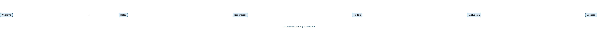

# Introducción a la Ciencia de Datos

## Problema, datos y workflow

**Semana 1 · Clase 1**

<!-- Notas docentes:
Presentar el curso desde una pregunta central: ¿cómo se transforma una necesidad real en evidencia útil para decidir? Aclarar que la clase no comienza por algoritmos ni herramientas.
-->

---

# Propósito de la clase

Comprender la Ciencia de Datos como un proceso interdisciplinario que transforma observaciones en evidencia para apoyar decisiones.

Al finalizar, podremos:

- distinguir problema, dato, modelo, evidencia y decisión;
- reconocer objetivos descriptivos, predictivos y prescriptivos;
- explicar las etapas generales de un proyecto de datos;
- caracterizar fuentes, tipos y limitaciones de los datos;
- formular un problema inicial de movilidad urbana.

---

# Pregunta de apertura

> Una empresa de movilidad quiere “mejorar el servicio”.

¿Qué necesitaríamos precisar antes de abrir un dataset?

- ¿Quién utilizará el resultado?
- ¿Qué decisión debe tomar?
- ¿Qué representa una observación?
- ¿Qué resultado se quiere modificar?
- ¿Cómo sabremos si la solución aporta valor?

<!-- Notas docentes:
Recoger respuestas sin corregirlas todavía. Conservar en la pizarra las expresiones asociadas con problema, usuario, datos, acción y evaluación para retomarlas al final.
-->

---

# ¿Qué es la Ciencia de Datos?

Campo interdisciplinario que desarrolla métodos para:

1. obtener conocimiento a partir de datos;
2. comunicar evidencia sobre un fenómeno;
3. apoyar decisiones bajo objetivos y restricciones.

No se reduce a:

- programar;
- entrenar modelos predictivos;
- producir gráficos;
- acumular grandes volúmenes de datos.

**La pregunta y la decisión determinan el producto apropiado.**

---

# Los datos representan, no reproducen

Un dato es un registro producido por un proceso de observación.

| Fenómeno | Registro posible | Lo que puede quedar fuera |
|---|---|---|
| Demora de un viaje | Hora programada y hora real | Tráfico, incidentes, criterio de registro |
| Ubicación de un vehículo | Coordenadas GPS | Precisión, pérdida de señal, contexto vial |
| Experiencia del pasajero | Reclamo o encuesta | Personas que no responden, lenguaje, expectativas |

Antes de analizar debemos preguntar:

> ¿Qué representa este campo, cómo se obtuvo y cuándo estuvo disponible?

---

# De los datos a la decisión

`problema → datos → representación → análisis → evidencia → decisión → evaluación`

- El ciclo es **iterativo**, no una línea de producción rígida.
- Un hallazgo puede obligar a revisar la pregunta inicial.
- Un modelo representa o estima; una decisión incorpora objetivos, costos y responsabilidades.

<!-- Notas docentes:
Destacar la retroalimentación del gráfico. Reformular no significa fracasar: puede ser el principal aprendizaje del análisis.
-->

---

# Preguntas que puede responder un proyecto

| Objetivo | Pregunta típica | Ejemplo de movilidad |
|---|---|---|
| Describir | ¿Qué ocurrió? | ¿Dónde se concentran las demoras? |
| Diagnosticar | ¿Qué factores se asocian? | ¿Qué variables acompañan demoras mayores? |
| Predecir | ¿Qué valor aún no conocemos? | ¿Cuánto demorará el próximo viaje? |
| Prescribir | ¿Qué acción conviene? | ¿A qué zona reasignar un vehículo? |
| Monitorear | ¿Qué está cambiando? | ¿Se degradó la puntualidad esta semana? |

Estas preguntas pueden conectarse, pero **no son equivalentes**.

---

# Describir no es predecir

## Descripción

Resume observaciones mediante frecuencias, medias, cuantiles, distribuciones o segmentos.

## Predicción

Estima un resultado desconocido o futuro y debe evaluarse sobre casos no utilizados para ajustar el modelo.

> Saber dónde ocurrieron demoras no implica poder anticipar la demora del próximo viaje.

---

# Predecir no es decidir

Una predicción estima un resultado:

`demora esperada = 18 minutos`

Una decisión compara acciones posibles:

`reasignar vehículo / mantener distribución / solicitar apoyo`

Para decidir también necesitamos:

- costos y beneficios;
- capacidad y restricciones;
- horizonte temporal;
- consecuencias de los errores;
- responsables de ejecutar y revisar.

**Una predicción precisa puede ser inútil si no modifica ninguna acción.**

---

# Una disciplina interdisciplinaria

| Perspectiva | Contribución |
|---|---|
| Estadística | Variabilidad, inferencia, incertidumbre y evaluación |
| Matemática y optimización | Relaciones, objetivos, restricciones y selección |
| Computación | Representación, algoritmos y eficiencia |
| Ingeniería de software | Reproducibilidad, pruebas, operación y monitoreo |
| Conocimiento del dominio | Significado, plausibilidad y restricciones reales |
| Comunicación | Evidencia comprensible para usuarios y responsables |

Un resultado sólido exige que estas perspectivas sean compatibles.

---

# Formular antes de modelar

Una especificación inicial debe declarar:

- **unidad de análisis:** ¿qué representa una fila?;
- **usuario:** ¿quién utilizará el resultado?;
- **objetivo:** ¿qué se quiere conocer o mejorar?;
- **acción:** ¿qué puede hacerse con la evidencia?;
- **horizonte:** ¿para qué momento se necesita?;
- **datos:** ¿qué estará disponible antes de decidir?;
- **restricciones:** ¿qué límites no pueden ignorarse?;
- **criterio de valor:** ¿cómo se evaluará la utilidad?

---

# La unidad cambia la pregunta

“Analizar demoras” puede significar estudiar:

| Unidad de análisis | Pregunta resultante |
|---|---|
| Viaje | ¿Este viaje llegará con demora? |
| Vehículo | ¿Qué vehículos acumulan más retrasos? |
| Zona y franja horaria | ¿Dónde y cuándo aumenta la demanda? |
| Día | ¿Cómo cambia la puntualidad a lo largo del tiempo? |

No existe una fila “natural”: la unidad se elige según el problema y la decisión.

---

# Workflow de un proyecto de datos

1. Comprender la necesidad y la decisión.
2. Establecer baseline y criterios de éxito.
3. Recolectar, comprender y auditar datos.
4. Preparar una representación analítica.
5. Analizar o modelar sin fuga de información.
6. Evaluar desempeño, utilidad y riesgos.
7. Comunicar o desplegar con monitoreo.
8. Iterar con nueva evidencia.

> Un proyecto de datos es un proceso de decisión con evidencia, no una sucesión de algoritmos.

---

# KDD y CRISP-DM

## KDD

`selección → limpieza → transformación → minería → interpretación`

Enfatiza el proceso de descubrimiento de conocimiento desde los datos.

## CRISP-DM

`negocio → datos → preparación → modelado → evaluación → despliegue`

Enfatiza la conexión entre necesidad, trabajo analítico y uso.

**Ambas metodologías se aplican como ciclos con retroalimentación.**

---

# Tipos de datos según su estructura

| Tipo | Característica | Ejemplo |
|---|---|---|
| Estructurados | Esquema tabular definido | Viajes en Parquet o base SQL |
| Semiestructurados | Claves y estructura flexible | Respuesta JSON de una API |
| No estructurados | Requieren representación adicional | Texto de reclamos, audio o imágenes |

La estructura condiciona:

- almacenamiento y procesamiento;
- controles de calidad;
- métodos de análisis;
- costo de integración.

---

# Fuentes y procedencia

Los datos pueden ser:

- **observacionales:** registran procesos sin intervención controlada;
- **experimentales:** provienen de intervenciones diseñadas;
- **simulados:** son generados por un modelo del fenómeno;
- **primarios:** se recolectan para el proyecto;
- **secundarios:** fueron creados con otro propósito.

Para cada fuente documentamos:

`origen · licencia · cobertura · frecuencia · formato · calidad · sesgos · responsable`

---

# Big Data: más que tamaño

| Dimensión | Pregunta de diagnóstico |
|---|---|
| Volumen | ¿Cuánto se almacena y procesa? |
| Velocidad | ¿Con qué rapidez llega y pierde vigencia? |
| Variedad | ¿Cuántos formatos y significados deben integrarse? |
| Veracidad | ¿Qué tan confiable es la medición? |
| Valor | ¿La información mejora una decisión? |

Un dataset pequeño y preciso puede tener más valor que uno masivo pero irrelevante.

---

# Herramientas: medios, no método

## Python

`pandas · NumPy · Matplotlib · scikit-learn`

## R

`tidyverse · ggplot2 · tidymodels`

La elección depende del equipo, el ecosistema, la integración y la tarea.

Un proyecto reproducible registra:

- versiones y dependencias;
- datos y transformaciones;
- parámetros y semillas;
- métricas, resultados y decisiones.

---

# Caso transversal: movilidad urbana

## Necesidad inicial

Una empresa que administra una flota quiere reducir demoras.

## Primera formulación

- **Unidad:** viaje.
- **Usuario:** responsable de operaciones.
- **Horizonte:** próxima franja horaria.
- **Resultado:** demora esperada por zona.
- **Acción:** reasignar vehículos entre zonas.
- **Restricciones:** capacidad, distancia, prioridad y disponibilidad.
- **Valor:** reducción de demoras sin aumentar viajes cancelados.

---

# Del caso amplio a tareas concretas

| Etapa | Tarea | Producto |
|---|---|---|
| Describir | Resumir viajes y demoras por zona y hora | Tabla o visualización |
| Predecir | Estimar demora del siguiente intervalo | Predicción y evaluación |
| Prescribir | Comparar reasignaciones factibles | Recomendación operativa |
| Monitorear | Detectar degradación del servicio | Indicadores y alertas |

Posibles campos:

`id_viaje · origen · destino · hora_programada · hora_real · zona · vehículo`

**Cuidado:** `hora_real` no está disponible antes de que termine el viaje.

---

# Actividad guiada: ficha del problema

En equipos, completar para el caso de movilidad:

1. problema observable y beneficio esperado;
2. usuario del resultado y personas afectadas;
3. unidad de análisis y periodo;
4. decisión y acciones posibles;
5. datos disponibles antes de decidir;
6. resultado de interés;
7. restricciones y supuestos;
8. baseline y métrica de valor.

**Tiempo sugerido:** 25 minutos de trabajo + 10 minutos de contraste.

---

# Criterios de revisión de la ficha

La evidencia es adecuada si:

- la unidad corresponde con la pregunta;
- el usuario puede ejecutar la acción declarada;
- las entradas existen antes de la decisión;
- la métrica representa valor y no solo desempeño técnico;
- el baseline permite comparar la propuesta;
- los supuestos y límites son observables;
- se reconocen personas o procesos afectados.

**Entregable de semana 1:** ficha de una página, versión inicial.

---

# Puesta en común

Cada equipo presenta en un minuto:

1. su decisión principal;
2. la unidad de análisis elegida;
3. la métrica de valor;
4. el supuesto más riesgoso.

Preguntas para contrastar:

- ¿Hay datos suficientes para representar el fenómeno?
- ¿La solución requiere descripción, predicción o prescripción?
- ¿Qué cambiaría si la unidad fuera zona en vez de viaje?

---

# Síntesis

- La Ciencia de Datos produce evidencia a partir de observaciones.
- Los datos son representaciones parciales y situadas.
- Describir, predecir y prescribir responden preguntas diferentes.
- Un modelo no es una decisión.
- El workflow conecta necesidad, datos, análisis, uso y evaluación.
- Formular unidad, usuario, acción y valor precede a elegir herramientas.

> Primero se diseña la pregunta; después se decide qué datos y métodos necesita.

---

# Autoevaluación

1. ¿Por qué los datos no equivalen al fenómeno observado?
2. ¿Qué diferencia existe entre una predicción y una decisión?
3. ¿Cómo cambia el problema al cambiar la unidad de análisis?
4. ¿Por qué CRISP-DM debe entenderse como un ciclo?
5. ¿Qué dimensión de Big Data se relaciona con la confiabilidad?
6. ¿Qué información de movilidad produciría fuga si se usa para anticipar una demora?

---

# Lecturas y recursos

## Lectura principal

- [Capítulo 1. Ciencia de Datos e Inteligencia Artificial](../../../Libro/Capitulo_01_Ciencia_de_Datos_e_IA.md): secciones 1.1.1, 1.1.4, 1.1.5 y 1.1.6.
- [Capítulo 2. Ciclo de vida de un proyecto basado en datos](../../../Libro/Capitulo_02_Ciclo_de_vida_de_un_proyecto_de_datos.md): secciones 2.1 a 2.4.

## Para continuar

- Revisar el glosario esencial y las preguntas de autoevaluación del capítulo 1.
- Completar y entregar la ficha inicial del problema de movilidad.
