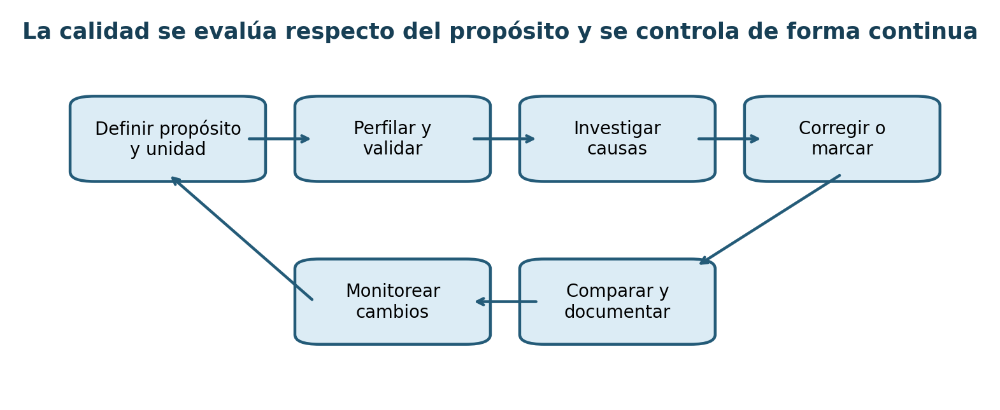
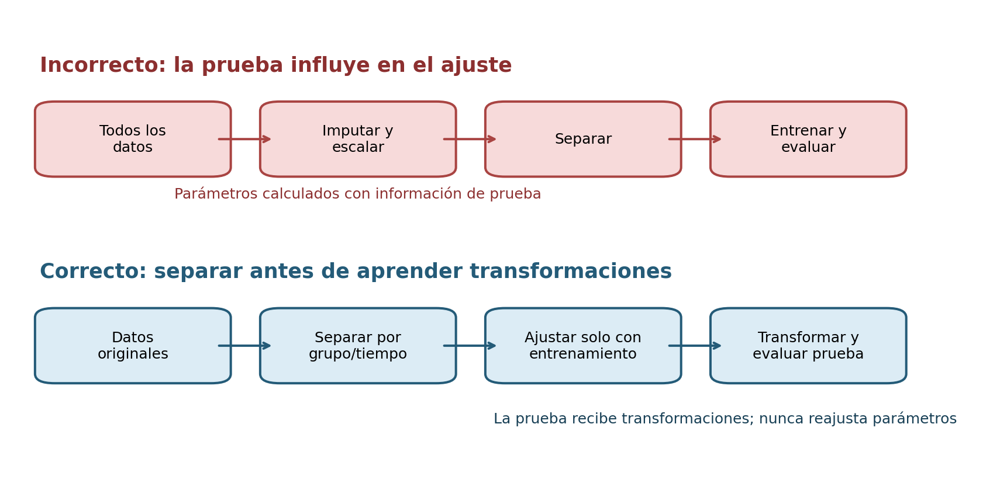

# Capítulo 3. Preparación, calidad y transformación de datos

## Propósito y objetivos de aprendizaje

En un proyecto real, los datos casi nunca llegan en una tabla ordenada, completa y lista para modelar. Llegan como archivos producidos por sistemas diferentes, lecturas de sensores que perdieron conexión, categorías que cambiaron de nombre, fechas almacenadas en distintas zonas horarias, formularios incompletos y registros que reflejan decisiones organizacionales previas. Preparar esos datos no es una tarea secundaria ni un trámite anterior al análisis: es el proceso mediante el cual se decide qué representa cada observación y qué evidencia puede obtenerse de ella.

La experiencia muestra que muchos errores atribuidos al modelo se originan antes del modelado. Una unión muchos-a-muchos puede multiplicar observaciones; una imputación global puede revelar información del conjunto de prueba; un cambio de unidad puede parecer una anomalía; una etiqueta creada después de resolver un caso puede anticipar artificialmente el resultado. Ningún algoritmo compensa una representación incoherente.

Este capítulo desarrolla una forma disciplinada de trabajar. El objetivo no es “limpiar todo”, sino construir datos **aptos para el propósito**, conservando procedencia, significado e incertidumbre. Al finalizar, el lector podrá:

- interpretar la estructura y granularidad de una tabla;
- distinguir tipos de variables y escalas de medición;
- evaluar dimensiones de calidad con reglas explícitas;
- analizar mecanismos de ausencia y elegir estrategias de tratamiento;
- distinguir duplicados, errores y eventos reales;
- integrar y transformar datos sin alterar inadvertidamente la unidad de análisis;
- construir pipelines reproducibles que eviten fugas de información.

## 3.1. Comprensión y evaluación de la calidad de los datos

La calidad de datos no puede evaluarse sin conocer el uso previsto. Una ubicación aproximada puede ser suficiente para un mapa regional e inaceptable para localizar una tubería. Una actualización semanal puede servir para un informe histórico y llegar demasiado tarde para una alerta operativa. Por eso, antes de contar faltantes o calcular rangos, se debe recuperar la relación entre el dataset y la formulación del Capítulo 2.

La pregunta central es: **¿estos datos representan, con suficiente fidelidad y oportunidad, las unidades y variables necesarias para la decisión?**



### 3.1.1. Estructura de una tabla de datos

Una tabla posee filas y columnas, pero esa descripción física es insuficiente. Para interpretarla se necesitan cuatro conceptos: unidad de observación, granularidad, claves y relaciones.

La **unidad de observación** indica qué representa una fila. En una tabla de movilidad puede ser un viaje; en una tabla de agua, una medición de sensor; en un corpus, un reclamo. La **granularidad** añade el nivel de detalle: una medición por sensor y minuto no equivale a un promedio por zona y día.

La **clave primaria** identifica de manera única una fila dentro de su unidad. Puede ser simple, como `id_reclamo`, o compuesta, como `(id_sensor, instante)`. Una **clave foránea** vincula una tabla con otra. La existencia de una columna llamada `id` no demuestra que sea una clave: debe comprobarse unicidad, estabilidad y significado.

#### La regla de una fila

Antes de cualquier transformación, el analista debería completar la frase:

> Cada fila representa __________, observada durante __________, en __________.

Si la frase no tiene una respuesta única, probablemente la tabla mezcle unidades. Es frecuente encontrar filas que a veces representan clientes y otras transacciones, o columnas que combinan mediciones instantáneas con resúmenes mensuales. Esa mezcla dificulta toda operación posterior.

#### Cardinalidad y dependencias

La cardinalidad expresa cuántas instancias de una entidad se relacionan con otra:

- uno a uno: un reclamo tiene una ficha principal;
- uno a muchos: una zona contiene muchos sensores;
- muchos a muchos: varios reclamos pueden referirse a varios productos.

La cardinalidad determina qué uniones son válidas y qué agregaciones se necesitan. También revela dependencias. Diez mediciones consecutivas del mismo sensor no equivalen a diez sensores independientes. Si se ignora esa estructura, una evaluación puede repartir observaciones relacionadas entre entrenamiento y prueba.

#### Datos ordenados y tablas relacionales

En una tabla analítica ordenada, cada variable ocupa una columna, cada observación una fila y cada tipo de unidad una tabla. Este principio simplifica análisis y visualización, pero no obliga a desnormalizar todo. Las bases operativas suelen separar entidades para preservar integridad. La tabla analítica es un producto derivado que debe conservar las claves y la procedencia de esas entidades.

Una buena práctica consiste en registrar, para cada tabla:

| Elemento | Pregunta |
|---|---|
| Unidad | ¿Qué representa una fila? |
| Clave | ¿Qué identifica una fila de manera única? |
| Granularidad | ¿Cuál es el nivel temporal, espacial o conceptual? |
| Cobertura | ¿Qué población y periodo están incluidos? |
| Relaciones | ¿Cómo se vincula con otras tablas? |
| Actualización | ¿Se agregan filas, se corrigen o se reemplazan? |

Este registro parece elemental, pero evita una parte considerable de los errores de integración.

### 3.1.2. Tipos de variables

El tipo de una variable describe qué clase de información representa y qué operaciones son legítimas. Debe distinguirse el **tipo de almacenamiento** del **tipo semántico**. Un código postal puede almacenarse como entero, pero no es una cantidad; una fecha puede almacenarse como texto, pero posee orden temporal; una etiqueta `1, 2, 3` puede ser nominal u ordinal.

#### Variables categóricas

Las variables **nominales** distinguen categorías sin orden intrínseco: zona, material, canal o especie. Solo tienen sentido igualdad, diferencia, frecuencias y proporciones. Asignarles números no crea una distancia.

Las variables **ordinales** poseen orden, como severidad baja, media y alta. Sin embargo, la distancia entre niveles no está necesariamente definida. No puede suponerse que la diferencia entre baja y media sea igual a la diferencia entre media y alta.

Una categoría puede ser binaria, pero no siempre representa presencia/ausencia. `sí/no`, `aprobado/rechazado` y `antes/después` contienen significados diferentes. También debe existir una política para categorías desconocidas, nuevas o poco frecuentes.

#### Variables numéricas

Las variables **discretas** toman valores contables, como cantidad de reclamos. Las **continuas** representan magnitudes que, en principio, pueden tomar cualquier valor en un intervalo, como presión o temperatura. En la práctica, toda medición tiene resolución finita.

El hecho de que una variable sea numérica no implica que una media sea siempre representativa. Conteos con muchos ceros, distribuciones fuertemente asimétricas o límites físicos requieren descripciones específicas.

#### Variables temporales y espaciales

Una fecha no es solo una cadena ordenable. Incluye calendario, zona horaria, resolución y, a veces, intervalo de validez. Una marca temporal puede referirse al momento del evento, al de registro o al de procesamiento. Confundirlos afecta secuencias y disponibilidad.

Una coordenada necesita un sistema de referencia. Latitud y longitud no deben tratarse como distancias euclídeas sin considerar geometría. Las zonas son polígonos con versiones; un mismo identificador puede cambiar de límites.

#### Variables de texto, imagen y relaciones

Texto e imagen son objetos complejos que requieren representaciones. Sus metadatos también son variables: idioma, dispositivo, resolución, origen o autor. Las relaciones entre entidades pueden representarse como grafos. Forzar esos datos a una tabla plana puede perder estructura.

#### Inferencia automática de tipos

Las herramientas intentan inferir tipos a partir de valores. Esa inferencia debe considerarse una hipótesis. Una columna numérica puede convertirse en texto porque una fila contiene `N/D`; una fecha ambigua puede interpretarse con día y mes invertidos; valores como `NA` pueden confundirse con abreviaturas legítimas.

El tipo esperado debe declararse y validarse. Permitir que cambie silenciosamente entre archivos convierte un problema de calidad en un cambio de comportamiento del pipeline.

### 3.1.3. Escalas de medición

La escala de medición indica qué transformaciones conservan significado y qué comparaciones son válidas.

#### Escala nominal

Permite afirmar igualdad o diferencia. Las categorías pueden renombrarse sin alterar información, siempre que la correspondencia sea uno a uno. Calcular una media de códigos nominales carece de interpretación.

#### Escala ordinal

Permite ordenar. Una transformación que preserve el orden conserva la escala. La mediana y los cuantiles pueden ser pertinentes, mientras que la media exige justificar distancias entre niveles.

#### Escala de intervalo

Las diferencias son interpretables, pero el cero es convencional. En grados Celsius, pasar de 10 a 20 representa un aumento de 10 grados, pero 20 no es “el doble de temperatura” que 10.

#### Escala de razón

Posee un cero que representa ausencia de magnitud y permite interpretar cocientes. Longitud, duración, masa y volumen suelen pertenecer a esta escala bajo condiciones adecuadas.

#### Por qué importa en el análisis

La escala condiciona estadísticas, visualizaciones y modelos. Una correlación lineal entre códigos nominales no tiene significado; una transformación logarítmica requiere una magnitud positiva; una diferencia temporal necesita unidades consistentes.

También condiciona la integración. Si una fuente mide caudal en litros por segundo y otra en metros cúbicos por hora, ambas representan la misma magnitud en escala de razón, pero deben convertirse antes de comparar. Si dos encuestas usan escalas ordinales distintas, la armonización no se resuelve con una conversión numérica automática.

Una pregunta útil es: **¿qué operaciones seguirían teniendo sentido si se cambiaran las etiquetas o unidades de manera válida?** La respuesta ayuda a identificar la escala y a evitar cálculos engañosos.

### 3.1.4. Exactitud, completitud, consistencia y actualidad

La calidad es multidimensional. Una tabla puede ser completa y, sin embargo, inexacta; consistente internamente y desactualizada; válida según su esquema y sesgada respecto de la población.

#### Exactitud

La exactitud describe proximidad entre el registro y el valor o estado real. Evaluarla requiere una referencia: calibración, inspección, fuente oficial o doble captura. Sin referencia, solo puede evaluarse plausibilidad, no exactitud estricta.

Para una variable numérica con referencia $r_i$, el error puede medirse como $e_i=x_i-r_i$. Sin embargo, una media de error cercana a cero puede ocultar errores positivos y negativos grandes. Deben revisarse magnitud, sesgo y distribución.

#### Completitud

La completitud mide presencia de datos esperados. Para una variable $j$:

$$
Completitud_j = \frac{n_j^{observado}}{n_j^{esperado}}.
$$

El denominador debe definirse. Si un campo solo aplica a cierto tipo de evento, su ausencia en otros no es un faltante. También existe completitud de filas, periodos y cobertura poblacional. Un archivo sin celdas vacías puede omitir por completo una zona.

#### Consistencia

La consistencia verifica relaciones internas y externas. Una fecha de cierre no debe preceder a la apertura; el código de zona debe existir en el catálogo; el total debe coincidir con sus componentes dentro de una tolerancia.

Dos fuentes pueden ser internamente consistentes y discrepar entre sí porque utilizan definiciones diferentes. Resolver la discrepancia requiere conocer autoridad, fecha y propósito, no elegir automáticamente el valor más frecuente.

#### Actualidad y oportunidad

La actualidad describe qué tan reciente es el dato. La oportunidad indica si llega antes de la decisión. Puede definirse latencia como:

$$
L_i=t_i^{disponible}-t_i^{evento}.
$$

Una medición exacta que llega después de asignar recursos no sirve como entrada predictiva, aunque pueda utilizarse para evaluación posterior.

#### Otras dimensiones

La unicidad evalúa duplicación; la validez, cumplimiento de dominios y formatos; la integridad, relaciones entre entidades; la trazabilidad, capacidad de reconstruir origen; la representatividad, cobertura de la población.

No conviene combinar todas las dimensiones en una puntuación sin contexto. Un promedio puede ocultar una falla crítica. Es preferible construir un tablero con métricas, umbrales y severidades vinculados al uso.

### 3.1.5. Perfiles y diccionarios de datos

Un **perfil de datos** resume lo observado en un dataset. Un **diccionario de datos** documenta lo que debería significar. Compararlos permite detectar discrepancias entre diseño y realidad.

#### Contenido de un perfil

Para cada variable suelen calcularse:

- tipo observado y tipo esperado;
- cantidad y proporción de faltantes;
- cardinalidad y valores únicos;
- frecuencias de categorías;
- mínimo, máximo, cuantiles y dispersión;
- patrones de formato;
- fechas mínima y máxima;
- ejemplos de valores;
- cambios por periodo o fuente.

A nivel de tabla se revisan filas, claves, duplicados, relaciones y cobertura. A nivel multivariado se buscan combinaciones imposibles y asociaciones inesperadas.

Un perfil no debe reducirse a una salida automática. El analista interpreta por qué una variable tiene 99 % de un único valor, por qué los faltantes aumentan después de una fecha o por qué aparece una categoría nueva. La herramienta encuentra síntomas; el conocimiento del sistema propone causas.

#### Diccionario de datos

Un diccionario robusto contiene:

| Campo | Descripción |
|---|---|
| Nombre | Identificador técnico estable |
| Definición | Significado operacional |
| Unidad y escala | Cómo se mide |
| Dominio | Valores permitidos |
| Fuente | Sistema y responsable |
| Disponibilidad | Momento en que puede usarse |
| Sensibilidad | Clasificación y acceso |
| Faltantes | Significados y códigos |
| Versión | Cambios de definición |

El diccionario es un contrato. Si el sistema cambia de metros a centímetros, no basta con modificar los datos: se actualiza la versión, se fija una fecha efectiva y se adapta la validación.

#### Perfilado continuo

El perfil inicial sirve como referencia para monitorear. Si la distribución, cardinalidad o tasa de faltantes cambia, puede haber deriva real o un problema de captura. Comparar perfiles entre entrenamiento y producción es una forma temprana de detectar degradación.

### 3.1.6. Reglas de validación

Una regla de validación convierte conocimiento del dominio en una comprobación ejecutable. Debe formularse de manera que dos personas obtengan el mismo resultado sobre la misma entrada.

Una especificación de regla incluye:

- identificador y descripción;
- columnas y unidad afectadas;
- condición de aceptación;
- severidad;
- tratamiento ante incumplimiento;
- responsable y fuente de autoridad;
- fecha de vigencia.

#### Tipos de reglas

Las reglas de **esquema** verifican columnas, tipos y nulabilidad. Las de **dominio** comprueban rangos y categorías. Las de **integridad** revisan claves y referencias. Las **temporales** verifican orden y frecuencia. Las **multivariadas** relacionan campos. Las **estadísticas** detectan cambios respecto de una referencia.

Una regla exacta, como `fecha_cierre >= fecha_apertura`, puede bloquear un registro. Una regla estadística, como “la media diaria se aparta tres desviaciones del histórico”, debería generar una advertencia y revisión, no una corrección automática.

#### Severidad y tratamiento

No todos los incumplimientos son iguales:

- **informativo:** se registra para análisis;
- **advertencia:** permite continuar, pero requiere revisión;
- **error:** excluye el registro del producto analítico;
- **crítico:** detiene el pipeline porque compromete todo el resultado.

La validación debe producir un informe, no solo un booleano. Debe indicar cantidad, proporción, ejemplos y evolución. Conservar el registro inválido en una zona de cuarentena permite investigar sin contaminar el producto final.

#### Validar antes y después

Las reglas se aplican al ingreso y después de las transformaciones. Una unión puede introducir duplicados; una conversión puede producir infinitos; un filtro puede eliminar una población completa. La salida también necesita contrato.

### 3.1.7. Ejemplo práctico guiado: auditoría inicial de un dataset abierto

Supóngase un archivo abierto de viajes urbanos. Antes de graficar o modelar, se realiza una auditoría reproducible.

#### Paso 1. Registrar la fuente

Se documentan URL, licencia, fecha de descarga, versión, tamaño y suma de comprobación. Se conserva el archivo original sin modificar. Si existe documentación oficial, se guarda su versión o enlace.

#### Paso 2. Definir la unidad esperada

Cada fila debería representar un viaje completado. Se identifican claves, periodo y cobertura de operadores. Se verifica si un viaje puede aparecer más de una vez por actualizaciones.

#### Paso 3. Contrastar esquema

Se comparan columnas y tipos con el diccionario. Una duración almacenada como texto, una zona inexistente o una columna faltante son desviaciones de esquema.

#### Paso 4. Construir el perfil

Se calculan faltantes, cardinalidades, rangos temporales, duración, distancia y frecuencias por zona. Los resultados se estratifican por mes para detectar cambios.

#### Paso 5. Aplicar reglas

Se comprueba que inicio preceda a fin, duración y distancia no sean negativas, zonas existan en el catálogo y claves respeten su cardinalidad. Los casos problemáticos se cuentan y aíslan.

#### Paso 6. Interpretar

Una duración de cero puede representar cancelación, error o viaje muy corto. La auditoría no decide sin evidencia. Registra hipótesis, consulta documentación y define si el caso pertenece al alcance.

#### Producto esperado

La auditoría entrega un informe con descripción de fuente, unidad, perfil, tabla de reglas, ejemplos, riesgos y recomendación. El resultado no es todavía “datos limpios”, sino conocimiento suficiente para diseñar la preparación.

## 3.2. Limpieza de datos

La limpieza es el conjunto de decisiones que transforma registros problemáticos en una representación apropiada para el análisis. La palabra puede sugerir que existe suciedad evidente y una versión correcta fácil de recuperar. En la práctica, muchos casos son ambiguos. El deber del analista es distinguir lo que puede corregirse de lo que solo puede marcarse o modelarse con incertidumbre.

Una limpieza profesional cumple cuatro principios:

1. conserva el original;
2. registra la regla aplicada;
3. evita utilizar información futura o de prueba;
4. evalúa cómo cambia la población y los resultados.

### 3.2.1. Datos faltantes y mecanismos de ausencia

Un valor faltante no es una categoría única. Puede significar que no se midió, que no aplica, que se perdió, que fue censurado, que el usuario no respondió o que la fuente todavía no actualizó. Los códigos `NA`, vacío, `-999`, `sin dato` y cero pueden representar ausencia, pero también valores legítimos según el campo.

Sea $R_j$ un indicador que vale 1 si $X_j$ se observa y 0 si falta. La relación entre $R$, los datos observados y los no observados define mecanismos clásicos.

#### MCAR: ausencia completamente aleatoria

La probabilidad de ausencia no depende de variables observadas ni del valor faltante:

$$
P(R\mid X_{obs},X_{mis})=P(R).
$$

Es una condición fuerte. Podría aproximarse si una pérdida de paquetes ocurre al azar y no se relaciona con la señal. Bajo MCAR, eliminar casos reduce precisión, pero no necesariamente introduce sesgo.

#### MAR: ausencia aleatoria condicionada

La ausencia depende de variables observadas:

$$
P(R\mid X_{obs},X_{mis})=P(R\mid X_{obs}).
$$

Por ejemplo, ciertos sensores pueden perder más datos durante tormentas registradas. Modelar la ausencia mediante variables observadas puede permitir imputación razonable.

#### MNAR: ausencia no aleatoria

La ausencia depende del propio valor faltante incluso después de considerar lo observado. Un sensor puede saturarse precisamente ante presiones extremas; una persona puede omitir una respuesta sensible por su contenido. La imputación convencional no elimina el sesgo sin supuestos adicionales.

#### Diagnóstico práctico

El mecanismo no puede demostrarse solo mirando el dataset, porque los valores faltantes no se observan. Se combinan conocimiento del proceso, comparación de tasas por grupos, patrones temporales y pruebas de sensibilidad.

Conviene construir una matriz de ausencia, agrupar patrones y preguntar si la falta anticipa el objetivo. Un indicador de ausencia puede ser predictivo, pero también representar una inequidad de acceso o un defecto que debería corregirse en origen.

### 3.2.2. Eliminación e imputación de observaciones

Eliminar o imputar no son respuestas automáticas. La decisión depende del mecanismo, proporción, variable, modelo y costo de distorsión.

#### Eliminación

La eliminación por caso completo conserva solo filas sin faltantes en las variables utilizadas. Es simple, pero puede reducir mucho la muestra y cambiar su composición. La eliminación por pares utiliza los datos disponibles para cada cálculo, lo que puede producir estadísticas basadas en poblaciones distintas.

Se justifica excluir una observación cuando está fuera del alcance, no puede identificarse su unidad o carece de información indispensable. Debe informarse cuántas filas se excluyen y cómo difieren de las conservadas.

#### Imputación simple

Media, mediana y moda son fáciles de aplicar. La mediana resiste extremos; la moda sirve para categorías; un valor constante puede distinguir ausencia. Sin embargo, repetir un único valor reduce variabilidad y altera relaciones.

Para una variable $j$, la mediana se estima únicamente en entrenamiento:

$$
m_j=mediana\{x_{ij}:i\in entrenamiento,\;x_{ij}\ observado\}.
$$

Luego se aplica el mismo $m_j$ a validación, prueba y producción hasta reentrenar el pipeline.

#### Imputación condicionada y múltiple

Métodos por vecinos, regresión o modelos iterativos utilizan otras variables. Pueden preservar mejor relaciones, pero introducen supuestos y riesgo de sobreajuste. La imputación múltiple genera varios datasets plausibles y combina resultados para reflejar incertidumbre. Es especialmente relevante para inferencia estadística.

#### Series temporales

Interpolar entre observaciones futuras y pasadas puede ser válido para reconstruir una serie histórica, pero no para una predicción en tiempo real si el futuro aún no existe. El propósito determina qué información está permitida.

#### Evaluación

Una estrategia se evalúa en tres niveles: plausibilidad de valores, preservación de distribuciones y efecto sobre el objetivo final. También se realiza sensibilidad: si conclusiones cambian radicalmente entre estrategias razonables, la incertidumbre debe reportarse.

### 3.2.3. Registros duplicados

Dos filas idénticas no son necesariamente un duplicado, y dos filas diferentes pueden representar el mismo evento. La deduplicación exige comprender identidad y versionado.

#### Duplicados exactos

Pueden surgir al concatenar archivos, repetir una carga o reintentar una API. Antes de eliminar se verifica si cada fila debía representar un evento único. En una tabla de lecturas, dos valores iguales en momentos distintos son observaciones legítimas.

#### Duplicados por clave

Si dos filas comparten clave primaria, puede existir una corrección, una actualización o una colisión. La regla de precedencia podría usar versión, fecha de actualización o fuente autorizada. Elegir “la última fila” solo es válido si el orden representa realmente vigencia.

#### Duplicados aproximados

Nombres, direcciones, textos e imágenes pueden corresponder a la misma entidad sin coincidir exactamente. La vinculación probabilística utiliza similitudes y reglas. Toda fusión tiene riesgo de unir entidades distintas o separar la misma entidad.

#### Consecuencias analíticas

Los duplicados alteran frecuencias y pesos. Si copias relacionadas se distribuyen entre entrenamiento y prueba, el modelo puede memorizar y aparentar generalización. La partición debe agrupar entidades, capturas o fuentes relacionadas.

Una tabla de deduplicación debe conservar identificador canónico, identificadores originales, regla, puntaje de similitud y decisión. Así puede auditarse y revertirse.

### 3.2.4. Errores de codificación y unidades

Los errores de codificación aparecen cuando el mismo concepto se representa de formas distintas o la misma representación se usa para conceptos diferentes.

#### Categorías y texto

Mayúsculas, espacios, acentos y abreviaturas producen categorías artificiales. Normalizar texto puede corregir diferencias superficiales, pero no resuelve equivalencia semántica. `Norte`, `N` y `Zona Norte` solo deben unificarse con un catálogo autorizado.

Los códigos pueden reutilizarse después de una reorganización. Una categoría `3` en 2022 puede no significar lo mismo en 2025. La armonización necesita fecha y versión.

#### Fechas y horas

`03/04/2026` es ambiguo sin convención. Los cambios de horario, zonas y formatos ISO deben manejarse explícitamente. Se recomienda conservar instante original, zona y versión normalizada. Convertir todo a UTC facilita cálculo, pero la hora local sigue siendo necesaria para interpretar patrones sociales.

#### Unidades

Una conversión tiene forma:

$$
x_{destino}=a\,x_{origen}+b.
$$

Las conversiones de escala de razón suelen tener $b=0$; temperatura puede requerir desplazamiento. El pipeline conserva valor y unidad originales, valor convertido y regla. Inferir la unidad solo por magnitud es riesgoso; debe apoyarse en metadatos o periodos documentados.

#### Codificación de caracteres

Problemas UTF-8, separadores decimales y miles pueden alterar texto y números. `1,234` puede significar decimal o millar. El formato debe fijarse al importar y validarse con ejemplos conocidos.

### 3.2.5. Valores imposibles e inconsistencias lógicas

Un valor imposible viola una regla necesaria del dominio. Una inconsistencia lógica surge de la combinación de valores, aunque cada uno sea válido por separado.

Ejemplos univariados incluyen porcentajes fuera de $[0,100]$, duraciones negativas o categorías inexistentes. Ejemplos multivariados incluyen fecha de resolución anterior a apertura, caudal positivo con estado “sensor apagado” o coordenada fuera de la zona declarada.

#### Imposible no significa corregible

Detectar un valor imposible no revela el valor correcto. Una presión negativa puede representar error de signo, calibración, código de falla o fenómeno definido respecto de una referencia. Reemplazarla por su valor absoluto sería una conjetura.

Las acciones posibles son:

- corregir desde una fuente autorizada;
- recodificar un valor especial documentado;
- marcar como inválido;
- excluir del producto analítico;
- conservar en cuarentena para investigar el sistema.

#### Reglas duras y tolerancias

Las mediciones físicas tienen precisión. Una igualdad teórica puede necesitar tolerancia. Si un total debe coincidir con componentes, se valida:

$$
|total-\sum_j componente_j|\leq\epsilon.
$$

El valor de $\epsilon$ depende de redondeo e instrumento, no de conveniencia analítica.

#### Inconsistencias como señal del proceso

Un aumento de valores imposibles puede indicar falla de software, cambio de formulario o capacitación insuficiente. Corregir filas sin informar la causa permite que el defecto continúe. La calidad de datos también es observabilidad del proceso que los genera.

### 3.2.6. Detección y tratamiento de valores atípicos

Un valor atípico se aparta de un patrón de referencia. Puede ser error, evento raro genuino, cambio de régimen o miembro de una subpoblación. En detección de fallas, los extremos suelen ser precisamente el objeto de interés.

#### Métodos univariados

El rango intercuartílico define límites:

$$
L_i=Q_1-1.5\,IQR,\qquad L_s=Q_3+1.5\,IQR.
$$

El puntaje estandarizado es:

$$
z_i=\frac{x_i-\mu}{\sigma}.
$$

El criterio $|z|>3$ supone una referencia aproximadamente simétrica y es sensible a los mismos extremos que intenta detectar. La mediana y la desviación absoluta mediana ofrecen alternativas robustas.

#### Atípicos contextuales y multivariados

Una demanda alta puede ser normal en hora pico y anómala de madrugada. Un par presión-caudal puede ser extraño aunque cada variable aislada parezca normal. Deben incorporarse grupo, tiempo, estación, espacio y relaciones físicas.

#### Tratamientos

Conservar es apropiado si el valor es plausible. Transformar puede reducir influencia sin eliminar. Winsorizar limita extremos a cuantiles, pero cambia la distribución. Usar modelos robustos puede ser preferible. Excluir exige evidencia de error y análisis de sensibilidad.

Cada tratamiento responde a una pregunta: ¿se busca estimar comportamiento típico, detectar eventos raros o predecir bajo todo el rango? No existe una regla universal.

#### Evitar el círculo de limpieza

Definir atípicos a partir de todo el dataset antes de separar puede introducir información de prueba. Los umbrales aprendidos se estiman en entrenamiento o se fijan desde el dominio. Además, no se debe eliminar un caso simplemente porque el modelo lo predice mal; eso adapta los datos al modelo y oculta fallos.

### 3.2.7. Ejemplo práctico guiado: limpieza de mediciones de temperatura y vibración

#### Contexto

Una línea de manufactura registra la temperatura de los rodamientos y la vibración de motores y husillos. El sistema anterior enviaba temperatura cada minuto y vibración eficaz cada diez segundos; tras el recambio gradual de sensores, algunos equipos comenzaron a transmitir ambas variables cada cinco segundos. Durante la transición también hubo cortes de comunicación. El objetivo es obtener características por turno para anticipar mantenimiento sin confundir fallas de adquisición con señales de deterioro.

#### Inventario, procedencia y reglas

Primero se construye un inventario por `sensor_id` y activo: modelo, número de serie, variable medida, unidad, frecuencia nominal, resolución, rango certificado, fecha de calibración y periodo de instalación. La orden de recambio permite determinar qué dispositivo debía estar activo en cada instante. Así se evita interpretar como duplicado el breve solapamiento de dos sensores durante una prueba de aceptación.

Las fuentes se conservan separadas en una capa cruda e inmutable. Cada lectura mantiene archivo o mensaje de origen, instante de recepción, identificador del dispositivo y versión del firmware. Sobre esa base se definen reglas con distinto efecto:

- el esquema y los tipos incorrectos impiden procesar el registro;
- los límites instrumentales y físicos marcan valores inválidos;
- la frecuencia, la continuidad y los cambios abruptos generan alertas que requieren contexto;
- la correspondencia entre sensor, activo y periodo de instalación determina si la lectura pertenece al proceso analizado.

#### Armonización de frecuencias y unidades

La temperatura se lleva a grados Celsius y la vibración a milímetros por segundo, pero se preservan `valor_original` y `unidad_original`. Por ejemplo, las lecturas térmicas recibidas en grados Fahrenheit se convierten mediante

$$
T_{\mathrm{C}}=(T_{\mathrm{F}}-32)\frac{5}{9},
$$

y la vibración recibida en pulgadas por segundo se transforma con el factor documentado por el fabricante. No se infiere una unidad solo por la magnitud: si el metadato falta o contradice la configuración vigente, el registro queda en cuarentena.

Para combinar frecuencias se define una rejilla de un minuto. La temperatura se resume con mediana, mínimo y máximo; para vibración se calculan mediana, percentil 95 y máximo a partir de las muestras disponibles. No se replica una lectura lenta para simular observaciones más frecuentes. Cada ventana conserva cantidad esperada, cantidad observada y cobertura, calculadas según el sensor que estaba instalado en ese periodo.

#### Duplicados y valores imposibles

Los reintentos de transmisión pueden producir mensajes idénticos. Se eliminan duplicados exactos por identificador de mensaje, conservando el primero recibido. Si coinciden sensor e instante pero difieren los valores, no se promedian automáticamente: se selecciona la versión válida según la secuencia de adquisición y las demás quedan registradas como conflicto.

Se marcan como inválidas las temperaturas por debajo del mínimo físicamente alcanzable en la planta, las que exceden el rango certificado y las vibraciones negativas. Una serie clavada exactamente en el máximo digital se identifica como saturación, no como una medición extrema confiable. El valor cero de vibración solo es admisible cuando el estado de máquina indica detención; durante producción se trata como posible desconexión o fallo instrumental.

#### Anomalías contextuales

Un aumento de vibración puede ser anómalo durante operación estable y esperable en el arranque, al cambiar de producto o después de una intervención. Del mismo modo, una temperatura alta puede ser coherente con una carga elevada, pero sospechosa con la máquina detenida. Por ello se unen, respetando su disponibilidad temporal, las señales de estado, velocidad, carga, producto, turno y registro de mantenimiento.

Las reglas contextuales conservan el evento y agregan una etiqueta en lugar de borrarlo. Un salto que coincide con el recambio de sensor se marca como posible cambio de nivel instrumental; un incremento gradual presente en sensores asociados al mismo activo se conserva como señal operativa plausible. Los umbrales estadísticos se estiman por modelo de sensor y régimen de operación usando solo el conjunto de entrenamiento.

#### Faltantes e imputación

La ausencia se clasifica antes de imputar. Se distinguen cortes de comunicación, mantenimiento programado, equipo detenido, sensor todavía no instalado y pérdida aislada de mensajes. Los intervalos esperados se derivan del historial de instalación y de la frecuencia nominal; de este modo, una máquina apagada o un dispositivo retirado no genera falsos faltantes.

Una brecha breve de temperatura durante operación estable puede interpolarse si no atraviesa un cambio de turno, estado o producto. La vibración no se interpola a través de arranques, paradas o intervenciones, porque se suavizaría precisamente el evento relevante. Las ventanas con cobertura inferior al umbral acordado no reciben un resumen imputado: mantienen el faltante, su causa y la cobertura observada. Todo valor imputado incluye método, parámetros y distancia respecto de la última observación real.

#### Trazabilidad y validación

La tabla analítica contiene:

- activo, sensor y periodo de instalación;
- instante original, instante normalizado y ventana de agregación;
- valor y unidad originales;
- valor armonizado y estadísticos de la ventana;
- frecuencia nominal, observaciones esperadas y cobertura;
- estado de validación e identificadores de reglas incumplidas;
- causa del faltante e indicador de imputación;
- referencias al mensaje de origen, calibración y orden de recambio;
- versión del diccionario, de las reglas y del pipeline.

La validación se ejecuta antes y después de limpiar. Se comprueba que las conversiones conserven valores conocidos, que no queden unidades mezcladas, que la clave definida sea única y que cada sensor se asocie únicamente con el activo y periodo autorizados. También se reconcilian conteos: registros de entrada, duplicados descartados, conflictos, inválidos, agregados e imputados deben explicar la salida sin pérdidas silenciosas.

Finalmente se comparan distribuciones, faltantes y cobertura por activo, turno, modelo de sensor y periodos anterior y posterior al recambio. Se revisan manualmente ejemplos de cada regla y se contrastan arranques e intervenciones conocidas con las etiquetas obtenidas. Si la limpieza elimina de forma desproporcionada un modelo o un turno, o borra los eventos que mantenimiento considera reales, el producto no se aprueba aunque supere las validaciones de esquema.

### Actividad EMO [AGUA-02]: auditar y limpiar mediciones de agua

**Capacidad mínima:** distinguir datos ausentes, errores de registro, limitaciones instrumentales y posibles eventos físicos reales.

**Consigna:** seleccionar un subconjunto de mediciones; definir unidad y diccionario; construir un perfil; identificar faltantes, duplicados, cambios de unidad, imposibles e indicios atípicos; aplicar una estrategia de limpieza e imputación justificada.

**Modalidad:** el equipo puede acordar límites y documentación comunes. Cada estudiante implementa, evalúa y defiende sus decisiones sobre una zona o periodo diferente.

**Evidencia individual:** notebook reproducible, tabla de reglas, reporte de calidad antes/después, listado de transformaciones y análisis de al menos tres casos ambiguos.

**Criterios de aprobación:**

- las reglas provienen del diccionario, documentación instrumental o evidencia explícita;
- se diferencia detección de corrección;
- la imputación se ajusta sin futuro ni datos de prueba;
- se conserva indicador de cambios relevantes;
- los posibles eventos reales no se eliminan automáticamente;
- se analiza si la limpieza cambia la cobertura de la población.

**Preguntas para la defensa:** ¿qué supuesto permite imputar?, ¿qué extremo se conservó y por qué?, ¿qué error no pudo corregirse?, ¿cómo afectaría otra estrategia a la decisión operativa?

## 3.3. Integración y transformación

Después de comprender y limpiar las fuentes, el proyecto debe convertirlas en una representación analítica. Esta etapa parece mecánica —filtrar, unir, agrupar, codificar—, pero cada operación modifica la población, la granularidad o la geometría de los datos. La pregunta profesional no es solo “¿cómo ejecutar la operación?”, sino “¿qué significado tendrá la tabla resultante?”.

La integración debe conservar una cadena de procedencia. Cada columna derivada necesita fuente, regla, parámetros y momento de disponibilidad. Cada cambio de cantidad de filas necesita explicación. Una tabla final sin esa información puede ser cómoda para modelar e imposible de auditar.

### 3.3.1. Selección y filtrado de observaciones

La **selección** elige variables; el **filtrado** elige observaciones. Ambas operaciones definen qué información y población estarán disponibles para el análisis.

#### Filtrado por alcance

Es válido excluir periodos, zonas o tipos de evento que están fuera del alcance formulado. Por ejemplo, si se estudian viajes completados, las cancelaciones pueden quedar fuera, pero deben contabilizarse porque su exclusión modifica la interpretación del servicio.

El criterio debe definirse antes de observar resultados. Excluir casos difíciles porque empeoran la métrica crea una población artificial. Si una regla se modifica, se registra su versión y se compara la composición antes/después.

#### Sesgo de selección

Una muestra filtrada puede depender del resultado. Si solo se conservan pacientes con prueba confirmatoria, se estudia la política de prueba además de la enfermedad. Si solo se analizan reclamos cerrados, se excluyen los casos que permanecen abiertos y quizá son los más complejos.

Sea $S=1$ el evento de inclusión. Las conclusiones describen $P(Y\mid X,S=1)$, que no necesariamente coincide con $P(Y\mid X)$. Esa diferencia debe considerarse al generalizar.

#### Selección de columnas

Una variable puede excluirse por indisponibilidad, sensibilidad, redundancia o fuga. El criterio no debe basarse únicamente en correlación con el objetivo. Identificadores, campos administrativos posteriores y textos con la respuesta explícita pueden tener alto poder predictivo y ser inválidos.

#### Auditoría del filtro

Cada filtro debe producir un reporte con filas antes, filas después, proporción eliminada y distribución por grupos relevantes. Si una regla elimina 2 % global, pero 40 % de una zona, existe un impacto de cobertura que no puede ocultarse en el promedio.

### 3.3.2. Combinación de tablas y tipos de unión

Una unión relaciona filas mediante claves. Antes de ejecutarla se debe declarar cardinalidad esperada y decidir qué población debe conservarse.

#### Tipos de unión

- **Interna:** conserva claves presentes en ambas tablas.
- **Izquierda:** conserva todas las filas de la tabla principal y agrega coincidencias.
- **Derecha:** operación simétrica respecto de la anterior.
- **Completa:** conserva claves de ambas fuentes.
- **Semiunión:** conserva filas de una tabla que tienen coincidencia.
- **Antiunión:** conserva filas sin coincidencia, útil para diagnosticar cobertura.

La elección expresa una decisión de población. Una unión interna entre viajes y clima elimina viajes sin estación asignada. Si esas ausencias se concentran en zonas periféricas, el dataset resultante cambia de alcance.

#### Cardinalidad

Para claves $k$, conviene calcular conteos $n_A(k)$ y $n_B(k)$. La cantidad de filas producida por una unión para esa clave es:

$$
n_{A\Join B}(k)=n_A(k)\,n_B(k).
$$

Si ambas tablas tienen varias filas por clave, aparece una relación muchos-a-muchos que multiplica registros. A veces es correcta; con frecuencia indica que falta una clave o una agregación previa.

#### Uniones temporales y espaciales

No todas las relaciones usan igualdad exacta. Una medición puede vincularse con la calibración vigente en ese instante; un viaje, con la zona que contiene su coordenada; un reclamo, con el contrato activo durante su fecha.

Una unión temporal necesita intervalos de validez y una regla para superposiciones. Una unión espacial necesita sistema de coordenadas y política para puntos en límites. Aproximar por fecha o nombre sin documentar puede producir correspondencias silenciosamente erróneas.

#### Controles posteriores

Después de unir se revisan cantidad de filas, unicidad de clave, tasa de coincidencia, campos faltantes y distribución de casos no emparejados. También se inspeccionan ejemplos. Una tasa de coincidencia alta no descarta emparejamientos incorrectos.

### 3.3.3. Agregación y cambio de granularidad

Agregar combina observaciones para representar una unidad más amplia. Un conjunto de lecturas por minuto puede convertirse en sensor-hora; varios sensores, en zona-día. La operación debe declarar función, ventana, denominador y cobertura.

#### Estadísticos de agregación

La suma es apropiada para cantidades aditivas; la media para magnitudes comparables; mediana y cuantiles para distribuciones robustas; máximo y mínimo para extremos; conteo para frecuencia. Promediar promedios sin ponderar puede ser incorrecto si los grupos tienen tamaños distintos:

$$
\bar{x}=\frac{\sum_g n_g\bar{x}_g}{\sum_g n_g}.
$$

#### Tasas y denominadores

Una tasa necesita numerador y población en riesgo. “Reclamos por zona” no permite comparar zonas con distinta cantidad de usuarios. Una tasa por mil contratos puede ser más pertinente, pero depende de que contratos y reclamos correspondan al mismo periodo y cobertura.

#### Ventanas temporales

Las ventanas pueden ser fijas, móviles o basadas en eventos. Deben definirse extremos inclusivos, zona horaria y tratamiento de eventos tardíos. Para predecir en $t$, una característica histórica solo puede usar información anterior a $t$:

$$
f_t=g(X_{t-h},\ldots,X_{t-1}).
$$

Incluir $X_t$ es válido únicamente si ya está disponible cuando se decide.

#### Pérdida de información y falacia ecológica

La agregación reduce ruido y volumen, pero oculta heterogeneidad. Una relación observada entre zonas no implica la misma relación entre individuos. Comparar resultados a varias granularidades ayuda a detectar conclusiones dependientes de la agregación.

#### Cobertura

Un promedio horario calculado con una lectura no equivale a otro calculado con doce. Junto al estadístico se conserva cantidad esperada, observada y proporción de cobertura. El modelo puede entonces distinguir valor normal de información insuficiente.

### 3.3.4. Reformateo entre estructuras anchas y largas

En formato **ancho**, varias mediciones ocupan columnas; en formato **largo**, una columna identifica la variable y otra contiene el valor. Por ejemplo, `presion_enero`, `presion_febrero` y `presion_marzo` pueden convertirse en filas con columnas `mes` y `presion`.

El formato largo facilita agrupar, visualizar y aplicar operaciones uniformes. El ancho puede ser conveniente para ciertos modelos y reportes. Reformatear no debería cambiar información si los identificadores son completos.

#### Riesgos

Si varias filas comparten el mismo identificador y nombre de variable, pivotar a ancho exige una agregación. Aplicar la primera observación oculta duplicados. Antes de reformatear se comprueba unicidad de la clave resultante.

Los nombres de columnas pueden contener varias dimensiones, como `presion_zonaA_2025`. Separarlas requiere una convención confiable. Si el separador también aparece en nombres, el análisis puede romperse.

#### Reversibilidad

Una prueba útil consiste en transformar de ancho a largo y volver. Si el resultado no coincide, hubo pérdida, agregación o ambigüedad. La reversibilidad es una propiedad verificable del pipeline.

### 3.3.5. Codificación de variables categóricas

Los modelos numéricos necesitan representar categorías. La codificación elegida introduce una noción de similitud y puede afectar dimensionalidad, interpretación y fuga.

#### Codificación ordinal

Asigna números respetando un orden. Es apropiada para niveles realmente ordenados, pero puede imponer distancias artificiales. Si bajo=1, medio=2 y alto=3, un modelo lineal interpreta incrementos constantes salvo que se diseñe otra representación.

#### One-hot

Crea un indicador por categoría. No impone orden y es interpretable, pero aumenta dimensionalidad. Debe existir tratamiento para categorías desconocidas. Agrupar las raras puede mejorar estabilidad, siempre que el umbral se aprenda en entrenamiento.

#### Codificaciones basadas en frecuencia u objetivo

La frecuencia reemplaza categoría por prevalencia. La codificación por objetivo utiliza relación con $Y$ y puede ser potente, pero tiene alto riesgo de fuga y sobreajuste. Debe calcularse dentro de cada partición de entrenamiento, con regularización y estrategia para categorías nuevas.

#### Alta cardinalidad

Identificadores, direcciones y productos pueden tener miles de valores. One-hot puede ser impracticable; hashing o embeddings reducen dimensión, pero dificultan interpretación. Antes de codificar se pregunta si la variable representa señal generalizable o memoriza entidades.

#### Equidad y categorías

Eliminar una variable sensible no elimina necesariamente su información, porque otras variables pueden actuar como proxies. La decisión de incluir o excluir debe responder al propósito, legalidad y evaluación de impacto, no a una regla automática.

### 3.3.6. Normalización y estandarización

El escalado modifica la magnitud numérica sin cambiar el orden de los valores.

#### Estandarización

Transforma mediante:

$$
z_i=\frac{x_i-\mu_{train}}{\sigma_{train}}.
$$

Produce media aproximada cero y desviación uno en entrenamiento. Es útil para modelos regularizados, métodos basados en distancia y optimización por gradiente. La media y desviación son sensibles a extremos.

#### Escalado min-max

Transforma a un intervalo:

$$
x_i'=\frac{x_i-x_{min}}{x_{max}-x_{min}}.
$$

Los nuevos valores pueden quedar fuera de $[0,1]$ si producción excede los límites de entrenamiento. Eso no es necesariamente un error; es una señal de cambio que debe monitorearse.

#### Escalado robusto y normalización por fila

Mediana e IQR reducen sensibilidad a extremos. La normalización por norma convierte cada vector en dirección comparable y es útil para similitud coseno. No debe confundirse con normalización de una variable.

#### Cuándo no escalar

Los árboles suelen ser invariantes a transformaciones monótonas. Escalar puede ser innecesario y dificultar interpretación. Tampoco debe aplicarse automáticamente a variables binarias. El pipeline debe justificar cada operación según modelo y objetivo.

### 3.3.7. Transformaciones matemáticas

Las transformaciones buscan estabilizar varianza, reducir asimetría, linealizar relaciones o representar mejor el fenómeno. No son cosméticas: cambian la escala de interpretación.

#### Logaritmos

Para $x>0$, $z=\log(x)$ comprime valores grandes. Una diferencia en escala logarítmica representa una razón en la escala original. Usar $\log(1+x)$ permite ceros, pero debe justificarse y no admite valores menores que -1.

#### Potencias y raíces

Raíz cuadrada puede estabilizar conteos; Box-Cox y Yeo-Johnson estiman familias de potencias. Sus parámetros deben aprenderse en entrenamiento. Una transformación que hace la distribución más simétrica no garantiza mejor predicción ni validez del modelo.

#### Interacciones

Una interacción representa que el efecto de una variable depende de otra. Si $x_1$ es presión y $x_2$ tipo de tubería, el producto $x_1x_2$ puede permitir pendientes diferentes. La interacción debe responder a una hipótesis o evaluarse dentro del protocolo.

#### Transformaciones temporales y cíclicas

Hora y día de semana son cíclicos. Codificar hora como 0 a 23 hace que 23 y 0 parezcan distantes. Una representación usa:

$$
sin(2\pi h/24),\qquad cos(2\pi h/24).
$$

Estas variables conservan proximidad circular, pero no sustituyen patrones específicos de calendario.

#### Interpretación inversa

Si se predice en escala transformada, la vuelta a escala original puede introducir sesgo. En particular, $E[\exp(Z)]\neq\exp(E[Z])$. La comunicación debe aclarar en qué escala se optimiza y se informa.

### 3.3.8. Discretización y binarización

La discretización convierte una variable continua en intervalos. La binarización crea un indicador a partir de una condición.

#### Cortes por dominio

Umbrales físicos, clínicos o normativos tienen interpretación directa. Debe conservarse también el valor continuo si es legítimo, porque dos mediciones cercanas a lados distintos del corte son muy similares aunque reciban categorías distintas.

#### Cortes por distribución

Intervalos de igual amplitud o cuantiles se adaptan a los datos. Los cuantiles producen grupos de tamaño parecido en entrenamiento, pero sus límites pueden cambiar entre versiones y no tener significado de dominio. Se estiman solo con entrenamiento.

#### Pérdida de información

Discretizar simplifica reglas y puede capturar no linealidad, pero pierde orden fino y crea discontinuidades. Un cambio mínimo alrededor del umbral puede cambiar la categoría. Se debe evaluar estabilidad y sensibilidad.

#### Binarización de resultados

Convertir un resultado continuo en “normal/anormal” cambia la tarea y los costos. El umbral debe corresponder a una decisión, no elegirse para equilibrar clases o mejorar métricas sin fundamento.

### 3.3.9. Ejemplo práctico guiado: integración de reclamos y datos contextuales

#### Objetivo y unidad

Se desea construir un corpus para clasificar la temática de cada reclamo. La unidad es un reclamo inicial, no cada interacción posterior. La etiqueta proviene de una revisión validada, y la predicción se realizará al momento de recepción.

#### Fuentes

La tabla principal contiene texto, fecha y canal. Un catálogo define productos y categorías. Una tabla de interacciones contiene respuestas posteriores. Otra fuente contiene contexto regional agregado.

#### Decisiones de integración

Se conserva un único registro por reclamo inicial. Las interacciones posteriores no se incluyen como entradas porque contienen pistas sobre la resolución. El catálogo se une por código y periodo de vigencia. El contexto regional se agrega al mes anterior para asegurar disponibilidad.

#### Controles

Antes de unir se verifica cardinalidad. Después se mide tasa de coincidencia y se inspeccionan códigos sin catálogo. Se armonizan categorías sin modificar el texto original. Se marca texto ausente y se excluyen plantillas automáticas identificadas mediante reglas documentadas.

#### Procedencia

Cada columna del corpus registra fuente, regla, momento de disponibilidad y condición de uso. La etiqueta se mantiene separada de los atributos hasta la partición. El producto contiene identificador, texto inicial, etiqueta, contexto permitido y grupo para evitar que reclamos relacionados se repartan entre particiones.

### Actividad EMO [REC-01]: construir el corpus analítico de reclamos

**Capacidad mínima:** transformar registros heterogéneos en un corpus reproducible sin contaminar la variable objetivo.

**Consigna:** definir unidad, seleccionar texto, armonizar categorías, resolver duplicados, documentar faltantes e integrar variables contextuales disponibles al recibir el reclamo.

**Evidencia individual:** notebook de preparación, diccionario, reporte de cardinalidades, diagrama de procedencia, lista de campos excluidos y prueba de reconstrucción.

**Criterios de aprobación:**

- cada fila y etiqueta tienen interpretación inequívoca;
- las uniones conservan la unidad y verifican cardinalidad;
- se identifican campos que revelan directa o indirectamente la respuesta;
- las reglas de deduplicación y exclusión son auditables;
- el mismo corpus puede regenerarse desde datos originales versionados.

**Preguntas para la defensa:** ¿qué información posterior fue excluida?, ¿qué unión podía multiplicar filas?, ¿cómo se tratará una categoría nueva?, ¿qué población queda fuera del corpus?

## 3.4. Pipelines y prevención de fugas de información

Un pipeline convierte decisiones de preparación en un procedimiento repetible. Su función no es solo ahorrar código: establece el límite entre lo que se aprende del entrenamiento y lo que se aplica a datos nuevos.

La fuga de información es una de las causas más comunes de evaluaciones engañosas. Ocurre cuando el procedimiento utiliza información que no estaría disponible en el momento real de predicción. Puede aparecer en una columna obvia, en una estadística global, en una partición incorrecta o en una decisión humana tomada después de ver la prueba.



### 3.4.1. Concepto de pipeline

Un pipeline es una composición ordenada de transformaciones $T_1,\ldots,T_k$ y un estimador $M$:

$$
\hat{y}=M(T_k(\cdots T_2(T_1(x))\cdots)).
$$

Cada paso declara entrada, salida, parámetros, validaciones y errores. Algunos pasos son deterministas y fijos, como convertir unidades mediante una regla conocida. Otros aprenden parámetros: media de imputación, categorías, vocabulario, escalas, componentes o selección de variables.

#### Propiedades deseables

Un pipeline debe ser reproducible, idempotente cuando corresponda, observable y consistente entre entrenamiento e inferencia. **Idempotencia** significa que repetir una operación sobre la misma entrada no cambia de nuevo el resultado. Convertir unidades sin marcar el estado puede aplicar el factor dos veces y violar esta propiedad.

La observabilidad exige registrar cantidad de filas, esquema, advertencias, tiempos y distribuciones. Un pipeline que termina sin error pero produce una tabla vacía no es exitoso.

### 3.4.2. Ajuste y aplicación de transformaciones

Se debe distinguir `ajustar` de `transformar`.

- **Ajustar:** estimar parámetros usando un conjunto de datos.
- **Transformar:** aplicar parámetros ya estimados.

Un escalador ajusta $\mu$ y $\sigma$ en entrenamiento; luego transforma todos los conjuntos con esos valores. Un codificador ajusta el vocabulario de categorías; una PCA ajusta componentes; un selector ajusta qué variables conservar.

El procedimiento correcto es:

```text
separar datos según el protocolo
ajustar el pipeline solo con entrenamiento
transformar entrenamiento con parámetros aprendidos
transformar validación y prueba sin reajustar
ajustar el modelo con entrenamiento transformado
evaluar sobre datos no utilizados para ajustar
```

En validación cruzada, este proceso se repite dentro de cada fold. Preprocesar una vez antes de la validación ya expone información entre particiones.

#### Estado del pipeline

Los parámetros aprendidos forman parte del modelo. Persistir solo el estimador final produce incompatibilidad en producción. Deben guardarse orden de columnas, categorías, estadísticas, versión y política para entradas desconocidas.

### 3.4.3. Fuga de información o data leakage

La fuga puede clasificarse por origen.

#### Fuga de objetivo

Una variable contiene el resultado o un proxy creado después. Fecha de cierre para predecir resolución, tratamiento administrado para predecir diagnóstico o texto de respuesta para clasificar reclamo son ejemplos.

#### Fuga entre particiones

Duplicados, entidades o periodos relacionados aparecen en entrenamiento y prueba. Un modelo reconoce la entidad en lugar de generalizar. La solución es particionar por grupo, origen o tiempo según la unidad real.

#### Fuga de preprocesamiento

Imputación, escalado, selección o vocabulario se ajustan con toda la tabla. Aunque no usen explícitamente $Y$, incorporan la distribución de evaluación.

#### Fuga temporal

Se usan datos futuros, revisiones posteriores o agregados que no respetan el corte. Una media “del día” puede incluir horas posteriores a la predicción de la mañana.

#### Fuga por selección humana

El equipo consulta repetidamente la prueba y adapta decisiones. La prueba deja de ser independiente aunque el código sea correcto. Debe reservarse y utilizarse solo al final.

#### Señales de advertencia

Desempeño sorprendentemente alto, caída extrema en producción, variables administrativas muy importantes o gran diferencia al eliminar duplicados sugieren fuga. La mejor defensa es reconstruir cronológicamente qué información existe para cada caso.

### 3.4.4. Transformaciones dependientes del conjunto de entrenamiento

Toda transformación cuyos parámetros dependen de los datos debe tratarse como parte del ajuste. Esto incluye operaciones que suelen parecer “exploratorias”:

- decidir umbrales por cuantiles;
- agrupar categorías raras;
- elegir variables por correlación;
- eliminar columnas con demasiados faltantes;
- detectar atípicos mediante distribución;
- construir vocabulario;
- estimar componentes principales.

Incluso el perfilado puede influir en decisiones. Durante desarrollo se puede explorar entrenamiento. La prueba se limita a controles de esquema y evaluación final, no a decisiones sobre representación.

#### Validación anidada

Si se seleccionan hiperparámetros y se estima desempeño con validación cruzada, puede requerirse un ciclo interno para selección y otro externo para estimación. La lógica es separar toda decisión adaptativa de los datos usados para evaluar esa decisión.

#### Transformaciones fijas

Una conversión física documentada no necesita aprenderse y puede aplicarse a todos los conjuntos. Sin embargo, si la unidad se infiere por distribución, esa inferencia sí depende de datos y debe incorporarse al ajuste o, preferiblemente, resolverse mediante metadatos.

### 3.4.5. Tratamiento conjunto del preprocesamiento y el modelo

La unidad que se compara no es solo el algoritmo, sino el pipeline completo. Un modelo lineal con codificación y escalado es un sistema distinto de un árbol con imputación y categorías nativas.

#### Comparación justa

Todos los candidatos deben usar las mismas particiones y objetivo. Las transformaciones específicas pueden variar, pero se ajustan dentro del mismo protocolo. Si una representación fue elegida observando validación, esa elección forma parte de la búsqueda.

#### Búsqueda de hiperparámetros

Los parámetros de imputación, cantidad de componentes, umbrales y complejidad del modelo pueden buscarse conjuntamente. Cada configuración se evalúa sin tocar prueba. El costo computacional también es una métrica: una mejora marginal puede no justificar un pipeline mucho más lento.

#### Inferencia y entrenamiento

Debe existir paridad: la misma lógica se utiliza al entrenar y al predecir. Reimplementar transformaciones en otro sistema puede introducir diferencias. Los contratos de características especifican nombre, tipo, orden, unidad y política de faltantes.

#### Persistencia y versión

El artefacto desplegable incluye transformaciones, estimador y metadatos. Cambiar una categoría o una media de imputación sin cambiar versión equivale a modificar el modelo.

### 3.4.6. Pruebas y documentación del proceso

Los pipelines de datos necesitan pruebas igual que cualquier software, pero además deben comprobar propiedades estadísticas y semánticas.

#### Pruebas de esquema

Verifican columnas, tipos, rangos, categorías y nulabilidad. Detectan cambios de contrato antes de producir resultados.

#### Pruebas de unidad

Comprueban una transformación con ejemplos conocidos: conversiones, reglas de fechas, agregaciones y tratamiento de desconocidos. Incluyen casos límite.

#### Pruebas de integración

Ejecutan varias etapas y verifican cardinalidad, claves, filas y artefactos. Una unión debe demostrar que no multiplica la unidad inesperadamente.

#### Pruebas de invariantes

Una transformación puede conservar suma, orden o número de entidades. Estas propiedades se expresan como invariantes. Por ejemplo, reformatear de ancho a largo y volver debería recuperar la tabla cuando la clave es única.

#### Pruebas contra fuga

Se comprueba que ninguna fecha de entrada sea posterior al corte, que grupos no se solapen y que los parámetros del pipeline procedan del entrenamiento. También pueden introducirse datos de prueba artificialmente extremos y verificar que no cambien parámetros ajustados.

#### Documentación

El documento del pipeline incluye propósito, diagrama, entradas, salidas, reglas, parámetros aprendidos, orden de ejecución, errores, versión y responsables. Debe explicar por qué se tomó cada decisión importante, no solo qué función se llamó.

### 3.4.7. Ejemplo práctico guiado: construcción de un pipeline sin fuga de información

#### Procedimiento incorrecto

Se carga toda la tabla, se imputan faltantes con la media global, se estandariza, se seleccionan variables correlacionadas con $Y$ y recién entonces se divide en entrenamiento y prueba. La prueba influyó en todas las decisiones.

#### Procedimiento correcto

Primero se separan entidades y periodos según el uso. Dentro de entrenamiento se ajustan imputación, escalado y selección. Validación recibe solamente `transform`. Tras fijar el pipeline, la prueba se evalúa una vez.

```text
definir grupos, tiempo y conjunto de prueba
separar antes de toda transformación aprendida
para cada partición de validación:
    ajustar imputación con entrenamiento interno
    ajustar codificación y escalado con entrenamiento interno
    ajustar selección y modelo con entrenamiento interno
    evaluar en validación interna
seleccionar configuración
reajustar pipeline con todo el entrenamiento permitido
evaluar una vez en prueba
persistir pipeline completo y metadatos
```

#### Demostración conceptual

Si la prueba contiene valores muy altos, la media global aumenta y modifica también los valores transformados de entrenamiento. El modelo ha recibido información sobre la distribución futura. Puede parecer un efecto pequeño, pero la lógica de independencia ya se rompió.

#### Lista de revisión

- ¿La división ocurrió antes de calcular estadísticas?
- ¿Las entidades relacionadas permanecen juntas?
- ¿Las características respetan el tiempo de decisión?
- ¿La selección de variables ocurre dentro de validación?
- ¿El conjunto de prueba se consultó una sola vez?
- ¿Se guardó el mismo pipeline que se desplegará?

## Síntesis del capítulo

Preparar datos es construir una representación defendible del fenómeno. La estructura de una tabla define unidad y relaciones; los tipos y escalas delimitan operaciones; las dimensiones de calidad relacionan registros con su propósito. Limpiar requiere comprender mecanismos de ausencia, identidad, unidades y contexto, no aplicar recetas universales.

La integración puede cambiar población y granularidad. Las transformaciones incorporan supuestos y parámetros. Por eso, el preprocesamiento y el modelo forman una unidad experimental. Separar datos antes de ajustar, conservar procedencia y probar invariantes son condiciones para una evaluación honesta.

La principal lección práctica es que toda modificación debe responder cuatro preguntas: ¿qué problema corrige?, ¿qué evidencia autoriza la corrección?, ¿qué información puede perder?, ¿cómo se reproducirá y auditará? Si no pueden responderse, la transformación necesita revisión.

## Glosario esencial

- **Ajuste:** estimación de parámetros a partir de un conjunto de datos.
- **Cardinalidad:** cantidad de instancias relacionadas entre claves o entidades.
- **Completitud:** proporción de datos esperados que están presentes.
- **Dato faltante:** valor no observado cuyo significado depende del mecanismo de ausencia.
- **Diccionario de datos:** contrato que documenta significado, tipo, unidad, dominio y procedencia.
- **Fuga de información:** uso durante desarrollo de información no disponible en el uso real.
- **Granularidad:** nivel temporal, espacial o conceptual de una observación.
- **Imputación:** sustitución de un valor ausente por una estimación.
- **Pipeline:** composición reproducible de transformaciones y estimación.
- **Procedencia:** historia del origen y transformaciones de un dato.
- **Transformación:** aplicación de parámetros o reglas a observaciones.
- **Valor atípico:** observación que se aparta de un patrón de referencia y requiere interpretación.

## Preguntas de autoevaluación

1. ¿Por qué una fila no puede interpretarse sin conocer granularidad y clave?
2. ¿Qué diferencia existe entre tipo de almacenamiento y tipo semántico?
3. ¿Cómo condiciona la escala las operaciones válidas?
4. ¿Por qué completitud no equivale a cobertura poblacional?
5. ¿Qué diferencia existe entre un perfil y un diccionario?
6. ¿Cuándo una regla debe advertir y cuándo debe detener el pipeline?
7. ¿Qué supuestos distinguen MCAR, MAR y MNAR?
8. ¿Por qué la imputación simple reduce variabilidad?
9. ¿Cómo pueden los duplicados contaminar una evaluación?
10. ¿Por qué un valor imposible no revela automáticamente su corrección?
11. ¿Qué diferencia existe entre un atípico global y uno contextual?
12. ¿Cómo cambia una unión interna la población?
13. ¿Por qué una unión muchos-a-muchos multiplica filas?
14. ¿Qué información debe acompañar una agregación?
15. ¿Cuándo es apropiada una codificación ordinal?
16. ¿Por qué el escalado se ajusta solo con entrenamiento?
17. ¿Qué tipos de fuga pueden aparecer sin utilizar explícitamente la etiqueta?
18. ¿Qué significa tratar preprocesamiento y modelo como una unidad?

## Actividad integradora de cierre

Seleccione una fuente de uno de los casos transversales. Produzca una especificación de preparación que incluya:

1. unidad, granularidad, claves y población;
2. diccionario de diez variables relevantes;
3. perfil inicial y seis reglas de validación;
4. análisis de faltantes y mecanismo plausible;
5. estrategia para duplicados, unidades, imposibles y atípicos;
6. diseño de integración con otra fuente y control de cardinalidad;
7. transformaciones con distinción entre fijas y aprendidas;
8. protocolo de partición anterior al ajuste;
9. diagrama del pipeline y pruebas de invariantes;
10. comparación antes/después y riesgos residuales.

La calidad de la entrega se evalúa por la coherencia entre problema, datos y reglas. No se premia eliminar más filas ni producir una tabla sin faltantes. Se premia conservar significado, justificar incertidumbre y hacer reproducible cada decisión.
