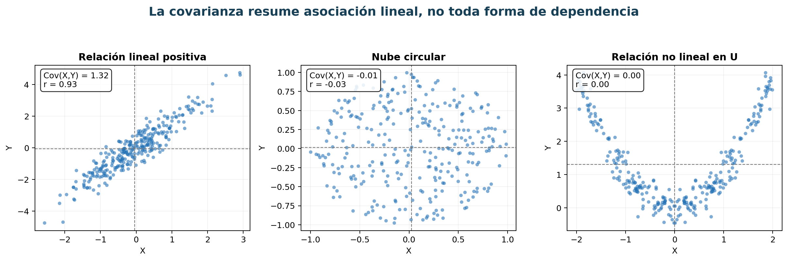
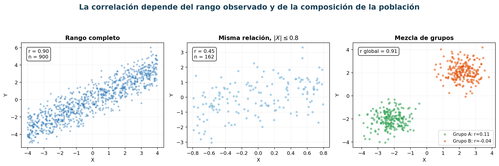
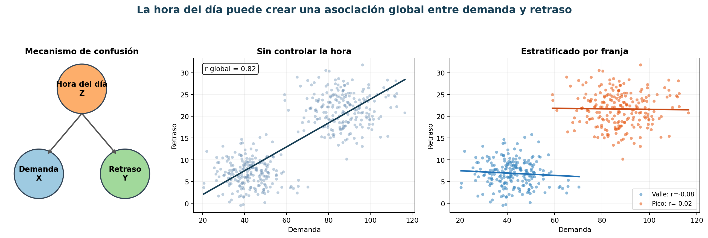
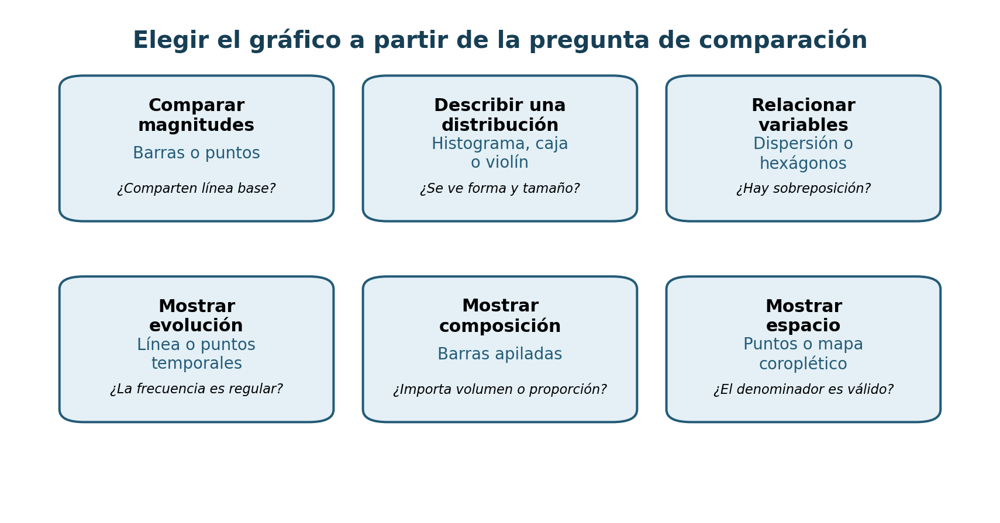
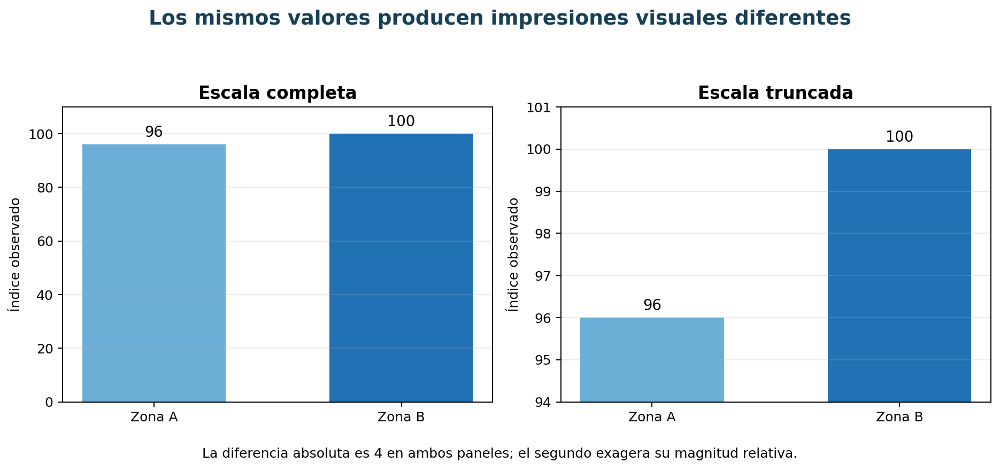

# Capítulo 4. Estadística descriptiva, exploración y visualización

## Propósito y objetivos de aprendizaje

Explorar datos no consiste en producir una colección de gráficos hasta encontrar algo llamativo. Consiste en construir una descripción disciplinada del fenómeno, comprobar si los datos representan la unidad formulada, identificar patrones que merecen explicación y comunicar qué evidencia existe sin atribuirle más alcance del que posee.

La estadística descriptiva proporciona un lenguaje para hablar de posición, dispersión, forma y asociación. La visualización permite percibir estructuras que una tabla de números puede ocultar. Ambas se necesitan mutuamente: una medida sin distribución puede ser engañosa y un gráfico sin cuantificación puede depender demasiado de la impresión visual.

Este capítulo sigue una secuencia deliberada. Primero se aprende a describir una variable. Después se estudian relaciones entre variables y los límites de su interpretación. Luego se presentan recursos visuales adecuados para diferentes preguntas. Finalmente se transforma la exploración en comunicación para públicos y decisiones concretas.

Al finalizar, el lector podrá:

- distinguir población, muestra, parámetro, estimando y estadístico;
- construir e interpretar distribuciones de frecuencias;
- elegir medidas de posición y dispersión apropiadas;
- analizar tablas de contingencia, covarianzas y correlaciones;
- separar asociación, predicción y causalidad;
- seleccionar gráficos según variable, pregunta y audiencia;
- reconocer escalas engañosas, sobrecarga y otras manipulaciones;
- comunicar hallazgos con incertidumbre, contexto y trazabilidad.

## 4.1. Descripción de una variable

La exploración comienza con una variable porque toda relación multivariada hereda los problemas de sus componentes. Antes de correlacionar presión y caudal, se debe saber si comparten unidad temporal, si tienen faltantes, qué rango ocupan y si contienen cambios de escala. Una correlación calculada sobre variables mal comprendidas solo resume un error con precisión numérica.

Describir una variable requiere al menos cuatro preguntas: ¿qué representa?, ¿sobre qué población se observa?, ¿cómo se distribuye? y ¿qué medida resume el aspecto relevante sin ocultar su forma?

### 4.1.1. Población, muestra, parámetro y estadístico

La **población** es el conjunto de unidades sobre el cual se desea afirmar algo. Puede ser finita —todos los viajes registrados durante un mes— o conceptual —todos los viajes que podrían ocurrir bajo determinadas condiciones—. La población debe definirse mediante unidades, espacio, periodo y criterios de inclusión.

Una **muestra** es el subconjunto observado. Puede provenir de un diseño probabilístico, de una selección por conveniencia o de un proceso administrativo. Disponer de muchos registros no convierte una muestra de conveniencia en representativa. Un sistema puede registrar todos los viajes de un operador y ninguno de los restantes.

Un **parámetro** es una característica de la población: media $\mu$, varianza $\sigma^2$, proporción $p$ o cuantil. Un **estadístico** es una función de la muestra: media $\bar{x}$, varianza $s^2$ o proporción $\hat{p}$. El estadístico se observa; el parámetro suele estimarse.

Para una muestra $X_1,\ldots,X_n$, la media muestral es:

$$
\bar{X}=\frac{1}{n}\sum_{i=1}^{n}X_i.
$$

Si el muestreo es aleatorio e independiente bajo condiciones apropiadas, $\bar{X}$ estima $\mu$. Esa frase contiene supuestos. Si las unidades con valores altos tienen menor probabilidad de inclusión, el promedio muestral puede ser sistemáticamente bajo.

#### Estimando y unidad de análisis

El **estimando** expresa con precisión qué cantidad se pretende conocer. “Consumo promedio” es ambiguo: puede ser promedio por conexión, por hogar, por día o por zona. También puede ponderar cada unidad de manera distinta.

Supóngase que una zona tiene diez conexiones y otra mil. El promedio de los dos promedios zonales otorga igual peso a ambas zonas; el promedio de todas las conexiones otorga igual peso a cada conexión. Ninguno es universalmente correcto. Responden preguntas diferentes.

#### Variabilidad muestral

Si se tomaran muestras distintas, el estadístico cambiaría. Esa variabilidad no es un error de programación, sino una propiedad del muestreo. La estadística inferencial, que se desarrollará más adelante, cuantifica esa incertidumbre. En este capítulo, incluso una descripción debe declarar si resume toda la población registrada o una muestra.

#### Ponderaciones

Cuando las unidades tienen probabilidades de inclusión diferentes, puede utilizarse una media ponderada:

$$
\bar{x}_w=\frac{\sum_i w_i x_i}{\sum_i w_i}.
$$

Los pesos deben tener significado: expansión poblacional, duración, importancia o confiabilidad. Elegirlos modifica el estimando. Una media ponderada sin explicación es menos interpretable que una media simple explícitamente limitada.

#### Práctica profesional

Antes de calcular, redacte: “Este estadístico describe ___ para ___ durante ___, dando a cada ___ un peso de ___”. Si la frase resulta difícil, la unidad o el estimando no están definidos.

### 4.1.2. Distribuciones de frecuencias

Una distribución de frecuencias muestra cuántas observaciones adoptan cada valor o intervalo. Es la descripción más directa de una variable categórica y una aproximación fundamental para variables numéricas.

Para categorías $c_1,\ldots,c_k$, la frecuencia absoluta es:

$$
n_j=\sum_{i=1}^{n}\mathbb{I}(x_i=c_j),
$$

donde $\mathbb{I}$ vale 1 cuando se cumple la condición. La frecuencia relativa es $f_j=n_j/n$ y la porcentual es $100f_j$.

Las frecuencias deben sumar $n$ solo si cada observación pertenece exactamente a una categoría. En preguntas de selección múltiple, una unidad puede aportar a varias categorías y los porcentajes pueden superar 100 %. El denominador debe explicarse.

#### Variables ordinales y acumulación

En variables ordinales, la frecuencia acumulada:

$$
F_j=\sum_{h\leq j}f_h
$$

permite responder qué proporción está en o por debajo de un nivel. Acumular categorías nominales no tiene significado salvo que se imponga un orden externo.

#### Agrupación de variables numéricas

Para una variable continua se construyen intervalos. La anchura y los límites modifican la percepción. Intervalos demasiado amplios ocultan multimodalidad; demasiado estrechos muestran ruido. Reglas como Sturges o Freedman-Diaconis ofrecen puntos de partida, no decisiones definitivas.

La regla de Freedman-Diaconis propone anchura:

$$
h=2\,IQR(x)\,n^{-1/3}.
$$

Es robusta frente a extremos, pero puede fallar con muestras pequeñas o distribuciones discretas. Conviene observar varias resoluciones y mantener límites comparables entre grupos.

#### Ceros y faltantes

Un cero puede ser valor real, ausencia de evento o código de faltante. Las celdas faltantes no deben desaparecer del denominador sin explicación. Una tabla profesional informa frecuencias válidas y cantidad excluida.

#### Comparación entre grupos

Los conteos absolutos reflejan tamaño del grupo. Para comparar zonas con distinta población se utilizan proporciones o tasas con denominador relevante. Aun así, una proporción basada en diez observaciones es más inestable que otra basada en diez mil; el tamaño debe acompañar al porcentaje.

### 4.1.3. Media, mediana y moda

Las medidas de tendencia central resumen dónde se concentra una distribución. No existe una medida “correcta” independientemente de la forma, la escala y la pregunta.

#### Media

La media es el punto de equilibrio aritmético. Utiliza todos los valores y posee propiedades algebraicas útiles. También minimiza la suma de errores cuadrados:

$$
\bar{x}=\arg\min_a\sum_i(x_i-a)^2.
$$

Esta propiedad explica su relación con regresión y MSE. Sin embargo, un valor extremo influye proporcionalmente a su distancia. En consumos muy asimétricos, la media puede describir carga total por unidad, pero no una experiencia típica.

#### Mediana

La mediana divide las observaciones ordenadas de modo que al menos la mitad queda a cada lado. Minimiza la suma de desviaciones absolutas:

$$
\tilde{x}=\arg\min_a\sum_i|x_i-a|.
$$

Es robusta a extremos y adecuada para distribuciones asimétricas. No utiliza la magnitud completa de las colas: dos distribuciones con la misma mediana pueden tener riesgos extremos muy diferentes.

#### Moda

La moda es el valor o categoría más frecuente. Es la única medida de tendencia central directamente aplicable a variables nominales. Puede haber varias modas o ninguna claramente dominante. En variables continuas, depende de la resolución o del método de estimación de densidad.

#### Elegir según la pregunta

Si se planifica volumen total, la media multiplicada por cantidad puede ser relevante. Si se describe un usuario típico ante una cola larga, la mediana suele ser más estable. Si se decide qué categoría abastecer, la moda puede ser útil. A menudo deben reportarse juntas.

#### Media recortada y estimadores robustos

La media recortada elimina una proporción simétrica de extremos antes de promediar. Ofrece un compromiso entre eficiencia de la media y robustez de la mediana. Su uso debe declarar porcentaje y propósito; no es una licencia para eliminar observaciones incómodas.

#### Error frecuente

Decir “el promedio es 40” sin especificar cuál convierte una decisión estadística en ambigüedad lingüística. En este libro, *media*, *mediana* y *moda* se nombran explícitamente.

### 4.1.4. Cuantiles y medidas de posición

El cuantil de orden $p$ es un valor $q_p$ tal que una proporción $p$ de la distribución se encuentra, aproximadamente, por debajo. Los percentiles son cuantiles expresados en cien partes; los cuartiles corresponden a 25 %, 50 % y 75 %.

Los cuantiles describen posiciones sin suponer simetría. El percentil 90 del tiempo de viaje indica que 90 % de los viajes observados tiene duración no mayor que ese valor, bajo la población y periodo definidos.

#### Definiciones muestrales

En una muestra finita, $pn$ puede no coincidir con una posición entera. Existen varios métodos de interpolación. Las herramientas pueden devolver resultados ligeramente distintos. En informes reproducibles se registra el método cuando las diferencias importan, especialmente con muestras pequeñas o datos discretos.

#### Cuantiles frente a máximos

El máximo es muy sensible a tamaño de muestra y errores. Un percentil alto, como 95 o 99, suele describir mejor servicio extremo recurrente. Sin embargo, para seguridad el máximo real puede ser importante. La elección depende del uso.

#### Percentil no es porcentaje

Estar en percentil 80 no significa obtener 80 % de una escala. Significa superar aproximadamente a 80 % de las observaciones de referencia. Si cambia la población de referencia, cambia la posición aunque el valor permanezca igual.

#### Comparación de distribuciones

Una tabla de cuantiles permite comparar centro y colas. Si dos zonas tienen mediana similar, pero el percentil 95 difiere mucho, la diferencia operativa está en episodios extremos. Esta observación puede quedar oculta al comparar solo medias.

#### Cuantiles ponderados

Con pesos, el cuantil se define mediante frecuencia acumulada ponderada. Es pertinente cuando la muestra representa unidades con probabilidades distintas. Como siempre, el peso cambia la población implícita.

### 4.1.5. Rango, varianza y desviación estándar

La tendencia central no describe cuánto varían los datos. Dos variables pueden tener igual media y comportamientos completamente diferentes.

#### Rango

El rango es $max(x)-min(x)$. Es intuitivo y muestra extensión observada, pero depende de dos valores y del tamaño muestral. También confunde variabilidad típica con extremos o errores.

#### Varianza poblacional y muestral

La varianza poblacional es:

$$
\sigma^2=\frac{1}{N}\sum_{i=1}^{N}(x_i-\mu)^2.
$$

Cuando una muestra estima la varianza de una población, se utiliza frecuentemente:

$$
s^2=\frac{1}{n-1}\sum_{i=1}^{n}(x_i-\bar{x})^2.
$$

El denominador $n-1$ corrige el sesgo asociado con estimar la media usando la misma muestra bajo supuestos habituales. Si los datos son toda la población de interés, dividir por $N$ puede ser apropiado. La fórmula depende del estimando, no de una preferencia de software.

#### Desviación estándar

La desviación estándar $s=\sqrt{s^2}$ vuelve a la unidad original. En una distribución aproximadamente normal, cerca de 68 % de las observaciones cae dentro de una desviación de la media y cerca de 95 % dentro de dos. Estas reglas no deben aplicarse mecánicamente a distribuciones asimétricas o multimodales.

#### Sensibilidad y unidades

La elevación al cuadrado hace que extremos tengan gran influencia. Cambiar unidades multiplica la desviación por el factor y la varianza por su cuadrado. Comparar desviaciones de variables en escalas distintas no tiene sentido directo.

#### Coeficiente de variación

El coeficiente $CV=s/\bar{x}$ expresa dispersión relativa para escalas de razón con media positiva. No es apropiado cuando la media está cerca de cero o el cero es convencional, como en Celsius.

#### Interpretación operativa

La variabilidad puede ser el fenómeno, no ruido. Un servicio con tiempo medio aceptable y desviación alta es impredecible para el usuario. Reportar solo media puede ocultar esa inestabilidad.

### 4.1.6. Rango intercuartílico

El rango intercuartílico es:

$$
IQR=Q_3-Q_1.
$$

Describe la amplitud del 50 % central. Como depende de cuantiles, es robusto frente a extremos. Se utiliza junto con la mediana para resumir distribuciones asimétricas.

#### Regla de los bigotes

Una convención identifica valores fuera de:

$$
Q_1-1.5\,IQR \quad\text{y}\quad Q_3+1.5\,IQR.
$$

Estos límites definen observaciones potencialmente atípicas para un diagrama de caja; no demuestran error ni rareza sustantiva. En una distribución muy asimétrica puede haber muchos puntos legítimos fuera.

#### Comparación entre grupos

Mediana e IQR permiten comparar posición y dispersión robustas. Pero grupos pequeños producen cuantiles inestables. Debe mostrarse tamaño y, cuando sea posible, datos individuales o intervalos.

#### IQR y cobertura

Si faltan sistemáticamente los valores extremos, el IQR puede parecer pequeño. La robustez estadística no corrige sesgo de observación. Toda interpretación necesita volver al mecanismo de captura.

#### Desviación absoluta mediana

Otra medida robusta es:

$$
MAD=mediana(|x_i-\tilde{x}|).
$$

Puede escalarse para comparar con desviación estándar bajo normalidad. IQR y MAD responden de manera diferente a la forma; ninguna reemplaza observar la distribución.

### 4.1.7. Asimetría y curtosis

La **asimetría** describe falta de simetría alrededor del centro. Una cola larga hacia valores altos produce asimetría positiva; hacia valores bajos, negativa. En una distribución simétrica, media y mediana suelen estar próximas, aunque esa coincidencia no demuestra simetría.

El coeficiente momental poblacional es:

$$
\gamma_1=\frac{E[(X-\mu)^3]}{\sigma^3}.
$$

El tercer momento conserva signo y da gran peso a extremos. Las versiones muestrales varían en correcciones. Por eso conviene acompañar el número con histograma, cuantiles y conocimiento del dominio.

La **curtosis** estandarizada utiliza el cuarto momento:

$$
\gamma_2=\frac{E[(X-\mu)^4]}{\sigma^4}.
$$

Con frecuencia se reporta exceso de curtosis $\gamma_2-3$, que vale cero para una normal. La curtosis se interpreta mejor como sensibilidad a colas y extremos que como simple “altura” del pico.

#### Fuentes de asimetría

La asimetría puede ser natural, como ingresos o duraciones; surgir de límites, como variables no negativas; o resultar de mezcla de poblaciones. Una cola larga puede sugerir transformación logarítmica, métricas robustas o análisis separado, pero la decisión depende de la tarea.

#### Multimodalidad

Una distribución con dos grupos puede tener asimetría cercana a cero y aun ser mal resumida por media y desviación. La forma no se reduce a dos coeficientes. Deben buscarse modos, huecos, truncamientos y acumulaciones en límites.

#### Efectos de redondeo y censura

Valores acumulados en números redondos pueden indicar resolución o declaración aproximada. Un pico en el máximo del sensor puede indicar saturación. Estas formas son información sobre captura, no características puramente matemáticas.

### 4.1.8. Ejemplo práctico guiado: perfil estadístico del consumo eléctrico

#### Contexto y pregunta descriptiva

Una empresa dispone de lecturas diarias de medidores residenciales durante 2025. Se desea caracterizar el consumo eléctrico observado, su variación estacional y las diferencias entre grupos de hogares. El estudio es descriptivo: permite reconocer patrones y priorizar verificaciones, pero no atribuir conductas, fraude ni efectos causales.

#### Paso 1. Definir población, unidad y variable

La población objetivo son los 1 200 hogares residenciales activos en el área de estudio durante todo 2025. La unidad analítica es el **hogar-día** y la variable principal es la energía diaria registrada, expresada en kWh. Por tanto, un hogar con 365 días potenciales aporta hasta 365 unidades; esas observaciones repetidas no son independientes y no deben interpretarse como 438 000 hogares distintos.

Se excluyen locales comerciales, medidores de áreas comunes y fechas anteriores al alta o posteriores a la baja del servicio. Los resultados describen hogares con medición disponible en el periodo y no se generalizan automáticamente a viviendas no instrumentadas, desocupadas o fuera del área.

#### Paso 2. Auditar cobertura y calidad

El marco contiene $1\,200\times365=438\,000$ hogares-día potenciales. Se reciben 426 840 registros, una cobertura global de 97,45 %. De ellos, 1 280 están duplicados y se resuelven conservando la versión validada más reciente; 2 190 tienen lectura ausente y 370 presentan unidad o sello temporal inconsistente. El conjunto analítico queda en 423 000 hogares-día, equivalente al 96,58 % del marco.

La cobertura se calcula también por hogar, mes y grupo, porque un porcentaje global alto puede ocultar vacíos concentrados. El mínimo mensual es 92,1 % en julio, frente a valores superiores a 96 % en los demás meses. Cuarenta y dos hogares tienen menos de 80 % de días válidos: se mantienen en el inventario de cobertura, pero se excluyen de comparaciones de consumo anual por hogar. Los ceros válidos se conservan y se distinguen de ausencias; ni unos ni otras se imputan para este perfil inicial.

#### Paso 3. Resumir centro, posición y dispersión

Para los 423 000 hogares-día válidos se obtiene el siguiente perfil:

| Medida | Resultado |
|---|---:|
| Media | 10,8 kWh/día |
| Desviación estándar | 7,9 kWh/día |
| Mediana | 8,7 kWh/día |
| $Q_1$; $Q_3$ | 5,1; 13,9 kWh/día |
| IQR | 8,8 kWh/día |
| MAD | 4,1 kWh/día |
| $P_{90}$; $P_{95}$; $P_{99}$ | 20,6; 25,8; 39,7 kWh/día |

La media y la desviación estándar ofrecen el resumen clásico y permiten comparaciones con informes que usan momentos. La mediana, el IQR y el MAD proporcionan el resumen robusto, menos sensible a días excepcionalmente altos. Como la media supera a la mediana y los percentiles superiores se separan progresivamente, un único promedio no representa bien toda la forma observada.

#### Paso 4. Examinar forma, estacionalidad y grupos

El histograma, representado en escala original y en escala logarítmica para valores positivos, muestra asimetría a la derecha y no justifica asumir normalidad. El 1,8 % de los registros válidos corresponde a cero kWh; estos casos se presentan por separado porque pueden reflejar ausencia de consumo, vivienda temporalmente vacía o una incidencia de medición, alternativas que este conjunto no permite distinguir.

Las medianas mensuales son 7,4 kWh/día en abril, 8,5 en octubre y 12,6 en enero. Un gráfico de líneas de medianas mensuales, acompañado por bandas entre $Q_1$ y $Q_3$ y por la cobertura de cada mes, permite observar la estacionalidad sin ocultar dispersión ni calidad de registro. La coincidencia temporal con meses cálidos es una descripción; demostrar qué factor produjo el cambio requeriría temperatura, ocupación, equipamiento y un diseño analítico adecuado.

Para comparar grupos se emplean el mismo periodo, reglas de validez y unidad. En hogares clasificados por número declarado de residentes, la mediana es 6,3 kWh/día para 1-2 residentes, 9,1 para 3-4 y 13,0 para 5 o más. Se reportan además tamaño, IQR y cobertura de cada grupo. Estas diferencias son asociaciones descriptivas: los grupos también pueden diferir en superficie, artefactos eléctricos, hábitos, ingresos o frecuencia de ocupación.

#### Paso 5. Revisar extremos sin confundirlos con errores

La regla de Tukey fija como umbral superior $Q_3+1,5\,IQR=27,1$ kWh/día y marca 17 965 registros (4,25 %). La cantidad relativamente alta es compatible con una cola derecha y muestra que la regla sirve para señalar observaciones, no para diagnosticar errores. No se eliminan ni se reemplazan automáticamente los extremos.

La revisión separa tres situaciones: valores físicamente plausibles y persistentes en un hogar; saltos aislados que requieren contraste con lecturas vecinas; y registros incompatibles con la unidad o capacidad documentada. Se conserva una bitácora de cada decisión. También se analizan rachas de ceros y cambios abruptos, pero se describen como casos por verificar, sin inferir fraude, intención ni causa.

#### Paso 6. Integrar visualizaciones y hallazgos defendibles

El informe combina: histograma con mediana y percentiles; diagrama de caja por mes; serie mensual con IQR y cobertura; cajas o violines por número de residentes; y gráfico de cada hogar frente a su mediana e IQR para priorizar revisiones. Los ejes indican kWh/día, periodo, denominador y tratamiento de ausencias; cada figura muestra conteos para evitar comparar grupos de tamaño desconocido.

Son hallazgos defendibles que la distribución hogar-día presenta cola derecha, que enero tiene una mediana 5,2 kWh/día mayor que abril y que el grupo de 5 o más residentes posee mediana e IQR superiores al de 1-2 residentes dentro de los registros válidos. También es defendible señalar que julio tiene menor cobertura y, por ello, su comparación exige especial cautela.

No es defendible concluir que los hogares con valores altos cometen fraude, que el número de residentes causa por sí solo mayor consumo o que el patrón mensual se debe exclusivamente al clima. El perfil está limitado por faltantes no necesariamente aleatorios, mediciones repetidas por hogar, posibles cambios de ocupación, calidad de la clasificación y ausencia de variables contextuales. La entrega final incluye tabla descriptiva, auditoría de cobertura, figuras reproducibles, listado trazable de casos por verificar y una declaración explícita del alcance poblacional y de estas limitaciones.

### Actividad EMO [AGUA-03]: explorar patrones y anomalías en datos de agua

**Capacidad mínima:** describir distribuciones y separar hallazgos estadísticos de conclusiones operativas no demostradas.

**Consigna:** seleccionar variables de consumo, presión, caudal o calidad; definir población y unidad; calcular medidas clásicas y robustas; comparar grupos o periodos; representar distribuciones; proponer tres hallazgos que orienten una hipótesis o muestreo posterior.

**Modalidad:** exploración en parejas para contrastar decisiones; interpretación y entrega individuales sobre una zona o periodo asignado.

**Evidencia individual:** notebook o informe reproducible con tabla descriptiva, al menos tres visualizaciones, interpretación de cada una y advertencia sobre causalidad, cobertura o sesgo.

**Criterios de aprobación:**

- denominadores, unidades, población y faltantes están explícitos;
- medidas y gráficos corresponden a escala y forma;
- cada hallazgo posee evidencia visible o cuantificada;
- se distinguen extremo estadístico, error y evento que requiere investigación;
- se propone qué dato o análisis permitiría avanzar.

**Preguntas para la defensa:** ¿por qué eligió media o mediana?, ¿qué cambia al usar otro periodo?, ¿qué extremo no eliminaría?, ¿qué conclusión causal sería inválida?

## 4.2. Relaciones entre variables

Después de comprender cada variable se estudia cómo cambian juntas. Una relación puede ser útil para descripción o predicción sin representar causalidad. También puede desaparecer al controlar un grupo, cambiar de signo al agregar o estar producida por el propio mecanismo de observación.

La práctica responsable combina tablas, medidas y gráficos, y formula siempre una explicación alternativa. La pregunta no es solo “¿hay relación?”, sino “¿en qué población, forma, dirección, intensidad y condiciones aparece?”.

### 4.2.1. Tablas de contingencia

Una tabla de contingencia cruza categorías de dos variables. Si $n_{ij}$ es el conteo en fila $i$ y columna $j$, los marginales son $n_{i+}=\sum_jn_{ij}$ y $n_{+j}=\sum_in_{ij}$.

Los conteos muestran volumen, pero la asociación se interpreta con proporciones condicionadas. La proporción por fila es:

$$
p_{j\mid i}=\frac{n_{ij}}{n_{i+}}.
$$

Indica distribución de columnas dentro de cada fila. Invertir el condicionamiento responde otra pregunta. “Proporción de incidentes entre viajes nocturnos” no es igual a “proporción de viajes nocturnos entre incidentes”.

#### Independencia

Si dos variables fueran independientes, la frecuencia esperada sería:

$$
e_{ij}=\frac{n_{i+}n_{+j}}{n}.
$$

Comparar observados y esperados ayuda a localizar celdas responsables de asociación. Una prueba chi-cuadrado resume discrepancias, pero con muestras grandes puede detectar diferencias pequeñas sin importancia práctica. Deben reportarse magnitud y contexto.

#### Categorías raras y ceros

Celdas pequeñas vuelven inestables las proporciones. Agrupar categorías requiere criterio sustantivo y no debe ocultar grupos relevantes. Un cero puede ser ausencia real o falta de cobertura. La tabla debe mostrar denominadores.

#### Estratificación

Una asociación global puede diferir por zona, periodo o grupo. Construir tablas estratificadas permite observar heterogeneidad y detectar confusión. No se deben crear tantos estratos que todas las celdas queden vacías.

#### Medidas de asociación

Para tablas $2\times2$ pueden calcularse diferencia de riesgos, razón de riesgos u odds ratio. Cada una responde una escala distinta. No debe confundirse odds ratio con riesgo relativo cuando el evento es frecuente.

### 4.2.2. Covarianza

La covarianza mide variación lineal conjunta. Para población:

$$
Cov(X,Y)=E[(X-E[X])(Y-E[Y])].
$$

En muestra:

$$
s_{xy}=\frac{1}{n-1}\sum_i(x_i-\bar{x})(y_i-\bar{y}).
$$

Si ambas variables tienden a estar por encima de sus medias al mismo tiempo, la covarianza es positiva; si una sube cuando otra baja, negativa. Una covarianza cercana a cero indica ausencia de relación lineal promedio, no independencia.

#### Dependencia de unidades

La covarianza se expresa en producto de unidades. Cambiar metros a centímetros la multiplica por cien. Por eso su magnitud no permite comparar directamente pares de variables con escalas distintas.

#### Matriz de covarianzas

Para un vector $X\in\mathbb{R}^p$, la matriz $\Sigma$ contiene varianzas en diagonal y covarianzas fuera. Es fundamental en PCA, modelos multivariados y distribuciones conjuntas. Debe ser simétrica y semidefinida positiva.

#### Interpretación geométrica

Una nube alargada con pendiente positiva produce covarianza positiva. Si la nube forma un círculo, puede ser cercana a cero. Si forma una U, también puede ser cero a pesar de una relación fuerte no lineal. El diagrama de dispersión es indispensable.



En el panel izquierdo, las desviaciones respecto de las medias tienden a compartir signo y sus productos son positivos. En la nube circular, los productos positivos y negativos se compensan sin una dirección dominante. En la relación en U también se compensan, pero existe una dependencia determinista aproximada entre $X$ y $Y$. Los dos últimos casos muestran por qué un valor cercano a cero solo descarta una asociación lineal promedio, no toda dependencia.

#### Sensibilidad

Como utiliza productos de desviaciones, es sensible a extremos. Un único caso puede cambiar signo. Se deben revisar valores influyentes y considerar medidas robustas o transformaciones cuando corresponda.

### 4.2.3. Correlación lineal

La correlación de Pearson estandariza la covarianza:

$$
r=\frac{s_{xy}}{s_xs_y},\qquad -1\leq r\leq1.
$$

Es invariante a cambios lineales positivos de escala. $r=1$ indica que los puntos se encuentran sobre una recta creciente; $r=-1$, sobre una decreciente. $r=0$ indica ausencia de asociación lineal muestral.

#### Magnitud y contexto

No existen umbrales universales para “débil” o “fuerte”. Una correlación pequeña puede ser importante en fenómenos complejos; una alta puede ser trivial o espuria. Debe interpretarse junto con rango, ruido, costo y propósito.

#### Restricción de rango

Si se observa solo una parte estrecha de $X$, la correlación puede disminuir. Comparar correlaciones entre poblaciones con rangos distintos puede ser engañoso. También mezclar grupos puede crear una relación que no existe dentro de ninguno.



Los dos primeros paneles proceden de la misma relación subyacente. Al conservar únicamente una franja estrecha de $X$, la variación de la señal se reduce mientras el ruido conserva una magnitud semejante; como consecuencia, la correlación observada disminuye. En el tercer panel, cada grupo presenta una correlación interna cercana a cero, pero sus centros ocupan regiones diferentes y la mezcla produce una correlación global alta. El coeficiente siempre describe la población efectivamente observada, no una propiedad invariable de las variables.

#### Correlación y pendiente

La correlación no es pendiente. La pendiente de regresión de $Y$ sobre $X$ es $r(s_y/s_x)$ y depende de unidades. Una correlación alta no significa que un cambio unitario tenga efecto grande.

#### Incertidumbre

La correlación muestral varía entre muestras. Con pocos casos puede ser inestable. Deben informarse tamaño, gráfico e intervalo cuando se hace inferencia. Reportar varios decimales no agrega certeza.

#### Matrices de correlación

Una matriz facilita explorar muchas variables, pero genera numerosas comparaciones y oculta formas no lineales. Debe utilizarse como mapa para investigar, no como conclusión final. Las variables derivadas unas de otras producen correlaciones mecánicas.

### 4.2.4. Correlaciones no paramétricas

Las correlaciones de rango estudian relaciones monotónicas y reducen sensibilidad a escala y algunos extremos.

#### Spearman

La correlación de Spearman es la correlación de Pearson aplicada a rangos. Sin empates, puede expresarse como:

$$
\rho_s=1-\frac{6\sum_i d_i^2}{n(n^2-1)},
$$

donde $d_i$ es diferencia entre rangos. Detecta si al aumentar una variable la otra tiende a aumentar o disminuir, aunque la forma no sea lineal.

#### Kendall

La correlación de Kendall compara el orden relativo de todos los pares de observaciones. Sean dos observaciones $(x_i,y_i)$ y $(x_j,y_j)$, con $i<j$. El par es **concordante** cuando ambas variables cambian en la misma dirección:

$$
(x_i-x_j)(y_i-y_j)>0.
$$

Es **discordante** cuando cambian en direcciones opuestas:

$$
(x_i-x_j)(y_i-y_j)<0.
$$

Si alguna diferencia es cero, existe un empate en la variable correspondiente. Cuando no hay empates, existen $n_0=n(n-1)/2$ pares posibles. El coeficiente conocido como $\tau_a$ se define como:

$$
\tau_a=\frac{C-D}{n_0}
=\frac{C-D}{n(n-1)/2},
$$

donde $C$ es la cantidad de pares concordantes y $D$ la cantidad de discordantes. El coeficiente está acotado entre $-1$ y $1$. Un valor de $1$ significa que todos los pares conservan el orden; $-1$, que todos lo invierten; y un valor cercano a cero, que concordancias y discordancias se compensan.

Una interpretación especialmente útil es:

$$
\tau=P(\text{par concordante})-P(\text{par discordante}).
$$

Por tanto, Kendall mide la diferencia entre la probabilidad de que dos observaciones elegidas al azar aparezcan en el mismo orden en ambas variables y la probabilidad de que aparezcan en orden opuesto.

#### Corrección por empates: $\tau_b$

En datos reales son frecuentes los empates, especialmente en escalas ordinales. La versión $\tau_a$ los incluye en el número total de pares y puede reducir artificialmente la magnitud. Kendall $\tau_b$ corrige el denominador:

$$
\tau_b=
\frac{C-D}
{\sqrt{(n_0-n_1)(n_0-n_2)}},
$$

donde:

$$
n_1=\sum_g\frac{t_g(t_g-1)}{2},
\qquad
n_2=\sum_h\frac{u_h(u_h-1)}{2}.
$$

$t_g$ es el tamaño del grupo de observaciones empatadas en $X$ y $u_h$ el tamaño del grupo empatado en $Y$. Cuando no existen empates, $n_1=n_2=0$ y $\tau_b=\tau_a$.

#### Ejemplo mínimo

Considérense cuatro observaciones cuyos rangos en $X$ son $(1,2,3,4)$ y en $Y$ son $(1,3,2,4)$. Hay seis pares posibles. Cinco son concordantes y uno —el formado por los rangos segundo y tercero— es discordante. Por tanto:

$$
\tau_a=\frac{5-1}{6}=\frac{2}{3}\approx0.67.
$$

La asociación ordinal es positiva: 83,3 % de los pares conserva el orden y 16,7 % lo invierte. El valor $0.67$ es la diferencia entre esas proporciones, no la proporción de pares concordantes por sí sola.

Kendall suele producir valores absolutos menores que Spearman porque ambos coeficientes usan escalas e interpretaciones distintas. No debe concluirse por ello que detecta una relación “más débil”. Resulta especialmente interpretable cuando interesa la concordancia entre rankings, hay muestras pequeñas o abundan empates, usando la variante adecuada.

#### Qué no resuelven

“No paramétrica” no significa sin supuestos. Las medidas requieren observaciones comparables y una relación monotónica para resumir bien. Una U puede producir correlación de rango cercana a cero. Tampoco corrigen confusión o causalidad.

#### Elección

Pearson responde por linealidad y es sensible a magnitudes; Spearman y Kendall responden por orden monotónico. La decisión debe basarse en pregunta, escala, forma y extremos, no en elegir el coeficiente que resulte más alto.

### 4.2.5. Asociación frente a causalidad

Una asociación describe cómo se distribuyen variables juntas. Una afirmación causal sostiene que intervenir sobre $X$ modificaría $Y$, manteniendo un marco de comparación. La diferencia no es terminológica; determina qué decisión puede justificarse.

En lenguaje de resultados potenciales, el efecto para una unidad compara $Y(1)$ y $Y(0)$, resultados bajo dos acciones. Nunca se observan ambos simultáneamente para la misma unidad. La inferencia causal necesita construir un contrafactual mediante diseño o supuestos.

#### Causas de asociación no causal

- una tercera variable influye en ambas;
- $Y$ causa $X$;
- la selección depende de ambas;
- existe tendencia temporal común;
- se probaron muchas relaciones y se eligió una;
- las variables comparten parte de su definición.

#### Temporalidad

Que $X$ ocurra antes de $Y$ es necesario para una causa, pero no suficiente. La lluvia puede preceder reclamos y fugas sin que los reclamos causen fugas. El tiempo ayuda a descartar hipótesis, no a confirmar por sí solo.

#### Experimentos y evidencia observacional

La asignación aleatoria facilita interpretar diferencias como efectos bajo cumplimiento y medición adecuados. Cuando no es posible, se utilizan diseños observacionales con ajuste, emparejamiento, discontinuidades o series interrumpidas, cada uno con supuestos. Una visualización exploratoria puede motivar esos diseños, no reemplazarlos.

#### Lenguaje responsable

“Se asocia”, “coincide” o “predice” describen evidencia distinta de “produce”, “reduce” o “causa”. El verbo debe corresponder al diseño, no a la fuerza visual del gráfico.

### 4.2.6. Variables de confusión

Una variable de confusión $Z$ se relaciona con exposición $X$ y resultado $Y$ y puede crear o distorsionar su asociación. En movilidad, hora del día puede afectar demanda y retraso; comparar ambas sin controlar hora mezcla efectos.



El panel central ignora la franja horaria y muestra una correlación positiva: los periodos con mayor demanda también parecen tener mayor retraso. El panel derecho revela el mecanismo oculto. Dentro de hora valle y hora pico, la demanda varía sin una asociación lineal apreciable con el retraso; la correlación global surge porque ambos grupos tienen centros diferentes. La hora del día actúa como causa común de la demanda observada y de las condiciones de circulación. Estratificar permite describir la relación dentro de niveles comparables, aunque no garantiza por sí solo una estimación causal si quedan otros confusores o si la franja fue definida de manera inadecuada.

#### Ejemplo de inversión

Dos rutas pueden mostrar dentro de cada franja que más demanda se asocia con menor retraso, pero globalmente lo contrario si las franjas de mayor demanda son también las más congestionadas. Esta inversión se relaciona con la paradoja de Simpson.

#### Identificar confusores

No se eligen solo por correlación estadística. Se utiliza conocimiento temporal y causal: el confusor precede a exposición y resultado y no debe ser consecuencia de la exposición. Ajustar indiscriminadamente puede introducir sesgo, por ejemplo al controlar un mediador o un colisionador.

#### Estratificación y ajuste

La exploración puede comparar relaciones dentro de niveles de $Z$, estandarizar o usar modelos multivariados. Si las estimaciones cambian sustancialmente, la asociación cruda no era estable. Aun así, ajustar variables observadas no elimina confusión no medida.

#### Confusión frente a modificación de efecto

Si la relación cambia entre grupos porque el efecto realmente difiere, existe heterogeneidad o modificación de efecto, no solo confusión. Debe reportarse en lugar de forzar un único promedio.

#### Datos de observación

La intensidad de medición puede ser confusora. Zonas con más sensores producen más alertas y reciben más mantenimiento. Cobertura y política de observación deben incluirse en el razonamiento.

### 4.2.7. Análisis multivariado exploratorio

El análisis multivariado estudia varias variables conjuntamente para detectar estructura, redundancia, grupos, gradientes y casos atípicos. No consiste en calcular todas las correlaciones posibles, sino en formular vistas complementarias.

#### Matrices y pares

Una matriz de gráficos de dispersión combina distribuciones marginales y relaciones por pares. El color puede representar grupo, pero demasiadas variables producen sobrecarga. Se seleccionan variables según hipótesis y procedencia.

#### Estandarización

Cuando se comparan distancias o componentes, variables con mayor escala dominan. Estandarizar puede equilibrar, pero otorga igual importancia matemática, no necesariamente sustantiva. Variables redundantes pueden seguir pesando doble.

#### Componentes y representaciones

PCA proyecta combinaciones de máxima varianza y se desarrollará en el Capítulo 10. En exploración permite visualizar alta dimensión, pero los componentes son construcciones lineales y pueden estar dominados por calidad o escala.

#### Anomalías multivariadas

Una observación puede ser normal en cada variable y extraña en combinación. Presión y caudal individualmente plausibles pueden violar su relación física. Los casos deben investigarse en el espacio relevante y con contexto.

#### Estrategia de trabajo

Una secuencia eficaz es:

```text
comprender cada variable y su calidad
seleccionar relaciones vinculadas con preguntas
visualizar pares y estratos
cuantificar asociaciones apropiadas
buscar estructura multivariada y casos influyentes
formular explicaciones alternativas
registrar hipótesis para análisis confirmatorio
```

La exploración genera candidatos. Para conservar honestidad, las hipótesis descubiertas deben evaluarse después en datos independientes cuando se pretenda confirmarlas.

### 4.2.8. Ejemplo práctico guiado: análisis de factores asociados con retrasos de transporte

#### Pregunta y datos

Se estudia la relación entre retraso, franja, clima, ruta y demanda. La unidad es viaje completado. Los datos no incluyen todos los operadores y el retraso se define respecto del horario planificado.

#### Análisis univariado previo

Se revisan distribuciones y faltantes. El retraso tiene cola derecha; demanda varía por hora; clima falta en zonas alejadas. Estas características condicionan medidas y comparaciones.

#### Relaciones categóricas

Una tabla cruza retraso crítico con franja. Se comparan proporciones dentro de cada franja, no solo conteos. Luego se estratifica por ruta para comprobar si la asociación persiste.

#### Relaciones numéricas

Se grafican demanda y retraso con transparencia y curvas descriptivas. Se calculan Pearson y Spearman. La diferencia entre ambos sugiere relación monotónica no lineal o influencia de extremos.

#### Confusión

Hora afecta demanda y tráfico. Clima afecta tiempo y puede cambiar demanda. Ruta determina distancia e infraestructura. Se construye un diagrama conceptual y se evita interpretar la correlación demanda-retraso como efecto causal directo.

#### Hallazgo

Una conclusión adecuada podría ser: “Dentro de la franja pico y en las rutas observadas, los viajes con mayor demanda presentan una mediana de retraso superior, aunque la magnitud varía por ruta y la cobertura climática es desigual”. Esto justifica modelado o muestreo adicional, no una política causal inmediata.

## 4.3. Visualización exploratoria

Una visualización codifica datos mediante posición, longitud, área, color, forma o movimiento. Cada elección favorece ciertas comparaciones y dificulta otras. El objetivo de una gráfica exploratoria es permitir que el analista interrogue la distribución, detecte errores, compare grupos y formule hipótesis. Su objetivo no es impresionar ni confirmar una historia elegida de antemano.

La visualización forma parte del método. Cambiar escala, agregación o denominador puede cambiar el patrón visible. Por ello, un gráfico debe ser reproducible y conservar las mismas definiciones que las estadísticas que acompaña.



### 4.3.1. Principios de percepción visual

La percepción humana compara algunas codificaciones con mayor precisión que otras. La posición sobre una escala común suele ser más precisa que longitud, ángulo, área o intensidad de color. Esta jerarquía explica por qué las barras alineadas facilitan comparar magnitudes y los gráficos de torta dificultan distinguir sectores similares.

#### Atención preatentiva

Ciertos rasgos —color distinto, orientación, tamaño— se detectan rápidamente. Deben utilizarse para destacar la evidencia principal, no para decorar cada elemento. Si todo está resaltado, nada guía la atención.

#### Agrupamiento

Proximidad, semejanza y conexión hacen que elementos se perciban como grupo. Un espacio mayor puede sugerir separación conceptual; líneas pueden sugerir continuidad. La estructura visual debe corresponder con la estructura de datos.

#### Posición y escalas

Comparar posiciones requiere escalas comunes. Paneles con ejes distintos pueden hacer que cambios pequeños parezcan iguales a grandes. A veces las escalas libres revelan forma interna; otras veces impiden comparación. La decisión debe declararse.

#### Color

Paletas secuenciales representan magnitud ordenada; divergentes, distancia a un centro significativo; cualitativas, categorías. El arcoíris crea fronteras perceptivas artificiales y no posee orden uniforme. Debe considerarse daltonismo y reproducción en escala de grises.

#### Carga cognitiva

Cada eje, símbolo, leyenda y anotación exige interpretación. Eliminar elementos innecesarios mejora claridad, pero eliminar contexto puede engañar. La simplicidad efectiva conserva todo lo necesario para responder la pregunta.

#### Diseño para comparación

La visualización funciona cuando el lector puede realizar la comparación relevante sin cálculos mentales excesivos. Si interesa diferencia entre periodos, deben alinearse; si interesa composición, debe verse denominador; si interesa incertidumbre, no debe ocultarse detrás de una línea única.

### 4.3.2. Histogramas y gráficos de densidad

El histograma divide el eje en intervalos y representa frecuencia o densidad. Revela centro, dispersión, asimetría, modos, huecos y acumulaciones.

#### Elección de intervalos

Los límites cambian la apariencia. Para comparar grupos se utilizan los mismos cortes. Probar varias anchuras ayuda a separar estructura estable de artefactos. Los intervalos deben respetar resolución: no tiene sentido crear cientos de bins para una variable registrada en enteros pequeños.

Si las alturas son conteos, el área depende de anchura. Con intervalos desiguales se utiliza densidad para que el área represente proporción. Etiquetar correctamente evita interpretar altura como frecuencia absoluta.

#### Gráficos de densidad

Una estimación kernel suaviza observaciones:

$$
\hat{f}_h(x)=\frac{1}{nh}\sum_{i=1}^{n}K\left(\frac{x-x_i}{h}\right).
$$

El ancho de banda $h$ controla suavizado. Un valor pequeño produce muchos picos; uno grande puede ocultar modos. La curva no son datos observados y puede asignar densidad fuera de límites naturales, como valores negativos de consumo.

#### Comparar grupos

Superponer demasiadas densidades produce confusión. Paneles pequeños, histogramas alineados o ridgelines pueden ser mejores. Además de forma, se reportan tamaños. Una densidad normalizada hace que un grupo de cien observaciones parezca tan prominente como otro de diez mil.

#### Faltantes y truncamiento

El histograma solo muestra valores observados. Debe acompañarse con cantidad de faltantes y explicar filtros. Los máximos administrativos o del sensor pueden generar picos que merecen anotación.

#### Lectura profesional

Antes de interpretar una “segunda moda”, cambie bins, revise grupos y confirme que no sea cambio de unidad o combinación de poblaciones. La forma visual genera una hipótesis, no una explicación automática.

### 4.3.3. Diagramas de caja y violín

El diagrama de caja resume mediana, cuartiles, IQR y observaciones fuera de bigotes. Es compacto y facilita comparar muchos grupos. Su principal fortaleza es también su límite: reduce la distribución a pocos elementos.

#### Qué muestra una caja

La caja se extiende de $Q_1$ a $Q_3$; una línea marca mediana; los bigotes suelen llegar hasta el valor más extremo dentro de $1.5IQR$. Los puntos restantes no son “errores”, sino observaciones fuera de esa convención.

Distintas herramientas pueden usar bigotes diferentes. El informe debe aclararlo si importa. El ancho de la caja puede representar tamaño, pero no debe suponerse sin leyenda.

#### Lo que puede ocultar

Distribuciones muy distintas pueden compartir caja. La multimodalidad desaparece. Con muestras pequeñas, los cuantiles son inestables y la caja da una apariencia de precisión excesiva. Añadir puntos individuales o un gráfico de violín ayuda.

#### Violines

El violín refleja densidad suavizada a ambos lados. Muestra modos y forma, pero depende del ancho de banda y puede parecer preciso donde hay pocos datos. Debe combinarse con mediana, cuantiles y tamaño.

#### Comparación ordenada

Ordenar grupos por mediana o criterio sustantivo facilita lectura. El orden alfabético rara vez responde la pregunta. Si se comparan periodos, se conserva orden temporal.

#### Interpretación

Una caja más alta indica mayor IQR, no necesariamente mayor varianza. Bigotes superpuestos no constituyen una prueba estadística. El gráfico orienta preguntas; la comparación inferencial necesita métodos apropiados.

### 4.3.4. Gráficos de barras y proporciones

Las barras codifican magnitud mediante longitud desde una línea base. Son adecuadas para conteos, tasas y valores agregados por categoría.

#### Eje en cero

Como se compara longitud, el eje cuantitativo debe comenzar en cero en la mayoría de los gráficos de barras. Truncarlo exagera diferencias. Si se necesita mostrar pequeñas variaciones, un punto con intervalo puede ser más honesto.

#### Conteos, proporciones y tasas

El título y eje deben indicar qué se representa. Conteos responden volumen; proporciones, composición; tasas, ocurrencia respecto de exposición. Una zona grande tendrá más reclamos aunque su tasa sea menor.

#### Barras agrupadas y apiladas

Las agrupadas facilitan comparar categorías dentro de grupos, pero muchas barras saturan. Las apiladas muestran composición total; solo el primer segmento comparte línea base. Las apiladas al 100 % comparan proporciones y ocultan volumen. A menudo conviene mostrar volumen y proporción en paneles separados.

#### Orden y categorías

Ordenar por valor facilita ranking; ordenar por nivel conserva ordinalidad; usar orden fijo permite comparar periodos. La categoría “otros” debe explicar qué agrupa. Excluir categorías pequeñas puede distorsionar total.

#### Intervalos

Si las barras representan estimaciones muestrales, deben incluir incertidumbre o tamaño. Las barras de error pueden representar desviación, error estándar o intervalo; la leyenda debe aclararlo.

### 4.3.5. Diagramas de dispersión

El diagrama de dispersión representa pares $(x_i,y_i)$ y permite observar forma, dirección, fuerza, heterogeneidad y casos influyentes.

#### Forma antes que coeficiente

Se debe observar linealidad, curvatura, grupos y límites antes de calcular correlación o ajustar recta. Un coeficiente resume una forma asumida; el gráfico muestra si esa forma es plausible.

#### Sobreposición

Con muchos puntos, la sobreposición oculta densidad. Transparencia, puntos pequeños, muestreo, hexágonos o contornos ayudan. Muestrear debe conservar estructura y declararse; puede perder eventos raros.

#### Terceras variables

Color, forma o panel pueden representar un grupo. El tamaño de punto es menos preciso y puede dominar visualmente; debe usarse para magnitudes positivas con leyenda clara. Agregar demasiadas dimensiones dificulta comparar.

#### Curvas descriptivas

Una línea suavizada ayuda a observar tendencia no lineal, pero depende de parámetros y puede sugerir certeza. Debe acompañarse con datos e intervalo cuando corresponda. Una recta no demuestra causalidad.

#### Escalas logarítmicas

Son útiles para órdenes de magnitud y relaciones multiplicativas. El eje debe indicarlo y no admitir ceros sin tratamiento explícito. Una distancia visual igual representa razón, no diferencia absoluta.

#### Residuos y subgrupos

Los puntos alejados de una tendencia pueden revelar error o casos importantes. También se debe comprobar si la relación global está producida por grupos. Paneles por ruta o periodo pueden cambiar la interpretación.

### 4.3.6. Mapas de calor

Un mapa de calor codifica una matriz mediante color. Puede representar correlaciones, frecuencias, intensidad temporal o valores por combinación de categorías.

#### Orden de filas y columnas

El orden determina patrones visibles. Para tiempo se usa orden cronológico; para categorías, orden sustantivo o agrupamiento. Reordenar por clustering puede revelar bloques, pero debe indicarse porque altera la disposición original.

#### Escala de color

Una matriz de correlación necesita paleta divergente centrada en cero y límites simétricos. Una frecuencia usa paleta secuencial. Cambiar límites entre paneles impide comparar. Los faltantes deben tener color distinto, no confundirse con cero.

#### Anotaciones

Mostrar números en todas las celdas puede saturar. Se anotan valores relevantes o se ofrece interacción. El color sirve para patrones; la cifra, para precisión.

#### Matrices de correlación

La simetría duplica información. Se puede mostrar un triángulo. Debe revisarse tamaño muestral por par si hay faltantes y no interpretar color intenso como causalidad.

#### Calendarios y espacio-tiempo

Filas por día y columnas por hora revelan ciclos. La agregación debe ser comparable; una celda con poca cobertura necesita marca. Un patrón visual puede surgir de diferente cantidad de observaciones.

### 4.3.7. Visualización temporal y geográfica

El tiempo y el espacio introducen orden y dependencia. No son categorías ordinarias.

#### Series temporales

Una línea conecta observaciones en orden temporal y sugiere continuidad. Es adecuada cuando existe secuencia comparable. Los puntos irregulares no deben conectarse como si tuvieran intervalos iguales sin indicación.

La gráfica debe mostrar frecuencia, huecos y cambios de definición. Agregar bandas de variabilidad, eventos y referencias ayuda a interpretar. Suavizar revela tendencia, pero puede desplazar picos y ocultar cambios abruptos.

Comparar periodos requiere alinear calendario, días hábiles y estacionalidad. Un cambio respecto del mes anterior puede ser normal si ese mes es estacionalmente bajo.

#### Mapas geográficos

Un mapa coroplético colorea áreas por tasa o proporción, no habitualmente por conteo bruto. Las áreas grandes dominan visualmente aunque tengan poca población. El denominador debe corresponder a la población expuesta.

Los mapas de puntos muestran ubicaciones; densidad espacial resume concentración; flujos representan conexiones. La proyección cartográfica distorsiona distancia o área de distintas maneras y debe ser apropiada para la región.

#### Clasificación de colores

Intervalos iguales, cuantiles y cortes de dominio producen mapas diferentes. Cuantiles reparten zonas entre colores aunque diferencias sean pequeñas; cortes fijos permiten comparar fechas. La leyenda debe mostrar límites y casos sin datos.

#### Privacidad

Mapear ubicaciones exactas puede reidentificar personas o infraestructura sensible. Agregación, desplazamiento o acceso restringido deben evaluarse. La utilidad visual no justifica exposición innecesaria.

#### Dependencia espacial

Zonas vecinas suelen parecerse. Un patrón puede reflejar tamaño, cobertura o frontera administrativa. El mapa genera hipótesis; el análisis espacial formal necesita modelos y pruebas adicionales.

### 4.3.8. Errores y manipulaciones frecuentes

Una gráfica puede ser técnicamente correcta y retóricamente engañosa. La intención no siempre es manipular; muchos errores provienen de plantillas o desconocimiento. La responsabilidad consiste en revisar cómo podría interpretarla un lector razonable.



#### Ejes truncados y escalas inconsistentes

En barras, truncar el eje exagera. En líneas puede ser útil para variación pequeña si se señala claramente y se ofrece contexto. Cambiar escalas entre paneles puede hacer iguales tendencias de magnitud distinta.

#### Área y volumen

Si el valor controla radio, el área crece con el cuadrado y exagera diferencias. Los pictogramas tridimensionales son aún peores. Cuando se usa área, debe escalarse proporcionalmente al dato.

#### Selección de periodo

Elegir un inicio excepcional puede fabricar una tendencia. Se debe justificar ventana y, cuando sea pertinente, mostrar contexto histórico. Cambiar fecha de corte después de ver resultados es selección oportunista.

#### Doble eje

Dos ejes verticales permiten ajustar escalas para hacer coincidir curvas. Si se usan, deben tener relación justificable y señalización fuerte. Paneles alineados suelen ser más seguros.

#### Promedios sin distribución

Una barra de media oculta forma, extremos y tamaño. Debe complementarse con puntos, intervalos o distribuciones. El gráfico no debe sugerir que todos los casos se parecen al promedio.

#### Color y categorías

Colores intensos pueden atribuir gravedad sin criterio. Paletas divergentes necesitan centro significativo. Reordenar categorías entre gráficos obliga a reaprender la leyenda y facilita comparaciones erróneas.

#### Omisión de datos

Excluir faltantes, grupos o periodos sin indicarlo produce una narrativa incompleta. Toda figura debe poder responder cuántas observaciones representa y qué quedó fuera.

### 4.3.9. Ejemplo práctico guiado: panel exploratorio de movilidad

#### Pregunta y unidad

El panel busca identificar cuándo y dónde se concentra demanda y qué patrones requieren análisis. La unidad es zona-hora. No se presenta como tablero operativo hasta validar actualización y cobertura.

#### Vista temporal

Una línea muestra viajes por hora con bandas por día de semana. Se anotan feriados y faltantes. Un mapa de calor día-hora permite detectar ciclos. Ambas vistas usan el mismo denominador y zona horaria.

#### Vista espacial

Un mapa representa viajes por kilómetro cuadrado o por población, según pregunta, y muestra por separado el conteo. Las zonas sin cobertura tienen color propio. Los cortes se mantienen fijos entre periodos.

#### Distribución por zona

Diagramas de caja comparan demanda horaria y revelan heterogeneidad. Los puntos extremos se vinculan con eventos conocidos o se marcan para investigar.

#### Coordinación

Filtros de fecha y zona actualizan todas las vistas. El panel conserva título dinámico, unidad y fecha de actualización. Una tabla de calidad muestra cobertura y operadores incluidos.

#### Interpretación

El panel permite afirmar dónde hay registros y cómo varían; no demuestra demanda total si faltan operadores ni explica causalmente los picos. Cada hallazgo incluye limitación y próximo análisis.

### Actividad EMO [MOV-01]: construir un diagnóstico geotemporal de movilidad

**Capacidad mínima:** preparar y representar correctamente datos con componentes espacial y temporal.

**Consigna:** construir unidades geotemporales comparables, mapear intensidad de viajes o demanda, elaborar una vista temporal y detectar al menos dos patrones y una observación atípica.

**Modalidad:** preparación de datos en equipo; visualizaciones, interpretación y defensa individuales sobre zonas o periodos distintos.

**Evidencia individual:** notebook con mapa, gráfico temporal, distribución complementaria, definición de granularidad, cobertura y tres conclusiones justificadas.

**Criterios de aprobación:**

- la agregación conserva una unidad clara;
- denominadores y escalas permiten comparar;
- faltantes y zonas sin cobertura son visibles;
- los gráficos responden preguntas específicas;
- las conclusiones reconocen estacionalidad, selección y sesgos de registro.

**Preguntas para la defensa:** ¿por qué eligió esa granularidad?, ¿qué cambia con otra clasificación del mapa?, ¿el atípico es error o evento?, ¿qué operador o población falta?

## 4.4. Comunicación de resultados

La exploración sirve al analista; la comunicación sirve a una audiencia. Transformar una en otra requiere seleccionar evidencia, ordenar argumentos y adaptar detalle sin alterar significado. Comunicar no es simplificar hasta eliminar incertidumbre, sino hacerla comprensible y relevante.

Una comunicación responsable distingue dato, interpretación y recomendación. El lector debe poder reconocer qué se observó, qué inferencia se propone y qué decisión se sugiere.

### 4.4.1. Pregunta, evidencia y mensaje principal

Una pieza eficaz responde una pregunta. El mensaje principal es una oración que expresa el hallazgo más importante para esa pregunta, con población, magnitud y contexto.

“Consumo de agua” es un tema, no un mensaje. “Durante verano, el percentil 95 de consumo en la zona B fue 30 % mayor que en invierno, con cobertura superior a 90 %” es una afirmación verificable.

#### Estructura de evidencia

Una comunicación puede organizarse como:

1. pregunta y por qué importa;
2. evidencia principal;
3. interpretación limitada;
4. incertidumbre y alternativas;
5. acción o siguiente paso.

La recomendación no debe aparecer antes de establecer evidencia. Tampoco debe presentarse como inevitable si depende de costos y preferencias no discutidos.

#### Título informativo

Un título descriptivo dice qué muestra; uno informativo resume el hallazgo. El segundo ayuda a orientar, pero debe evitar causalidad no demostrada. “Mayor demora coincide con hora pico en rutas observadas” es más prudente que “La demanda causa las demoras”.

#### Trazabilidad

Toda cifra importante debe poder rastrearse a fuente, definición y transformación. En un informe breve puede incluirse una nota metodológica o enlace. La concisión no justifica resultados imposibles de auditar.

### 4.4.2. Selección del gráfico según el objetivo

La variable no determina por sí sola el gráfico; también importa la tarea perceptiva.

| Objetivo | Opciones frecuentes | Pregunta de control |
|---|---|---|
| Comparar magnitudes | Barras, puntos | ¿Comparten línea base? |
| Mostrar distribución | Histograma, caja, violín | ¿Se ve forma y tamaño? |
| Relacionar variables | Dispersión, hexágonos | ¿Se observa sobreposición? |
| Mostrar evolución | Línea, puntos temporales | ¿La frecuencia es regular? |
| Mostrar composición | Barras apiladas | ¿Importa volumen o proporción? |
| Mostrar espacio | Mapa de puntos o coroplético | ¿Existe denominador adecuado? |

Una tabla puede ser mejor cuando el lector necesita valores exactos. Un gráfico es mejor para patrones y comparaciones. Combinarlos puede ofrecer visión y precisión.

#### Pregunta de lectura

Antes de diseñar, formule qué comparación debe hacer el lector: “comparar cada zona con la referencia”, “encontrar el máximo”, “observar tendencia” o “detectar dispersión”. Luego elija la codificación más directa.

#### Consistencia

Una serie de figuras debe conservar colores, categorías, unidades y escalas cuando representan lo mismo. La consistencia reduce carga cognitiva y evita asociaciones accidentales.

### 4.4.3. Storytelling con datos

El relato organiza atención mediante contexto, tensión y resolución. En datos, la tensión puede ser una brecha entre objetivo y observado; la resolución, una acción o una pregunta siguiente. La narrativa no autoriza seleccionar solo evidencia favorable.

#### Secuencia

Una secuencia útil va de panorama a detalle: situación general, patrón, segmento afectado, explicación posible y decisión. Otra va de expectativa a evidencia: se esperaba estabilidad, se observó cambio, se investigaron fuentes y se identificó una ruptura de medición.

#### Anotaciones

Las anotaciones señalan eventos, umbrales y valores relevantes. Deben explicar por qué mirar, no repetir el eje. Una línea de referencia puede mostrar objetivo o baseline.

#### Integridad narrativa

Una historia honesta incluye evidencia que limita su mensaje. Si el patrón desaparece en una zona, se informa. La comunicación no necesita enumerar cada análisis, pero sí aquellos que cambiarían la interpretación.

#### Evitar dramatización

Colores alarmistas, metáforas y ejes exagerados pueden producir emoción desproporcionada. En decisiones sensibles, claridad y proporcionalidad son más importantes que impacto visual.

### 4.4.4. Visualizaciones interactivas

La interacción permite filtrar, ampliar, consultar detalles y cambiar vistas. Es útil cuando distintas personas necesitan explorar subconjuntos o cuando la densidad impide mostrar todo a la vez.

#### Interacción con propósito

Cada control debe responder una necesidad. Agregar filtros por disponibilidad tecnológica produce complejidad. Los valores iniciales deben mostrar una vista válida y no seleccionar accidentalmente el caso más favorable.

#### Estado y reproducibilidad

Una vista interactiva necesita URL, parámetros o mecanismo para guardar estado. De otro modo, dos usuarios pueden discutir “el gráfico” viendo filtros distintos. Exportaciones deben incluir fecha y selección.

#### Detalle bajo demanda

Tooltips permiten precisión sin saturar. No deben contener información indispensable que usuarios de teclado o lectores de pantalla no puedan acceder. Una tabla alternativa mejora accesibilidad.

#### Rendimiento y agregación

Enviar millones de puntos al navegador no mejora evidencia. Se agregan datos o se muestrea con reglas visibles. La interacción debe mantener definiciones y no cambiar silenciosamente denominadores.

#### Riesgo exploratorio

Muchos filtros permiten encontrar patrones casuales. La herramienta debe distinguir exploración de resultados confirmados y evitar que una captura aislada se presente como conclusión general.

### 4.4.5. Dashboards y aplicaciones web

Un dashboard monitorea indicadores para una tarea recurrente. Una aplicación puede permitir análisis o acción. Ambos son productos operativos y requieren más que gráficos.

#### Diseño desde decisiones

Se comienza con usuarios y frecuencia: ¿qué revisan cada mañana?, ¿qué umbral exige acción?, ¿qué detalle necesitan para verificar? Cada componente debe apoyar una decisión o contexto necesario.

#### Jerarquía

La primera vista muestra estado, cambio y excepciones. Los detalles se ofrecen en niveles posteriores. Llenar la pantalla con KPI sin relación obliga al usuario a construir la historia mentalmente.

#### Definiciones y actualización

Cada indicador necesita definición, fuente, última actualización, periodo y comparación. Una cifra sin fecha puede parecer actual. Si una fuente falla, el tablero debe mostrar degradación en lugar de reutilizar silenciosamente el último valor.

#### Alertas

Un umbral visual no es una política completa. Debe existir responsable, canal, prioridad, posibilidad de reconocer y cierre. Demasiadas alertas producen fatiga. Se monitorea su utilidad y tasa de falsos positivos.

#### Pruebas

Además de exactitud de cálculos, se prueban permisos, filtros, dispositivos, accesibilidad, carga y fallos de fuente. Una aplicación analítica también necesita observabilidad y retirada.

### 4.4.6. Comunicación para públicos técnicos y no técnicos

Adaptar no significa ocultar. Significa elegir nivel de detalle, vocabulario y evidencia según las decisiones de la audiencia.

#### Público técnico

Necesita definiciones, método, supuestos, particiones, incertidumbre, sensibilidad y acceso a artefactos. Debe poder reproducir o desafiar el resultado. Una conclusión sin detalles metodológicos no es suficiente.

#### Público ejecutivo u operativo

Necesita implicación, magnitud, alternativas, costo, riesgo y próximo paso. Las métricas técnicas se traducen sin deformar: en lugar de solo sensibilidad, se informa cuántos eventos se detectarían y cuántas alertas innecesarias produciría el volumen real.

#### Público afectado

Necesita comprender propósito, datos utilizados, impacto, límites y mecanismo de consulta o apelación. Una explicación centrada en la organización puede omitir lo que importa a la persona.

#### Capas de comunicación

Un mismo resultado puede ofrecer resumen de una página, informe técnico y anexo reproducible. Las capas deben ser consistentes; el resumen no puede afirmar más de lo respaldado por el anexo.

#### Metáforas y probabilidades

Las analogías ayudan, pero pueden crear intuiciones incorrectas. Las probabilidades se acompañan con frecuencias naturales y periodo: “12 de cada 100 zonas similares durante una semana”, no “riesgo 12 %” sin referencia.

### 4.4.7. Accesibilidad y documentación

Una visualización accesible puede ser percibida, comprendida y operada por personas con capacidades y dispositivos diversos.

#### Color y contraste

El color no debe ser el único canal. Se agregan formas, etiquetas o patrones. El contraste debe permitir leer texto y distinguir elementos. Las paletas se prueban para deficiencias comunes de visión cromática.

#### Texto alternativo

El texto alternativo describe propósito, tendencia y dato relevante, no cada elemento visual. Por ejemplo: “La demanda aumenta entre 7 y 9, con máximo en zona centro; faltan datos de dos zonas periféricas”.

#### Estructura y navegación

Títulos, subtítulos y orden lógico ayudan a lectores de pantalla. Las interacciones deben operarse con teclado. Las tablas necesitan encabezados. Las animaciones deben poder detenerse.

#### Documentación mínima de una figura

Cada figura debe indicar:

- pregunta o mensaje;
- variables, unidades y denominador;
- población, periodo y tamaño;
- fuente y fecha;
- transformación o agregación;
- significado de color y símbolos;
- faltantes, exclusiones y limitaciones.

No todo debe ocupar el área gráfica; una nota o pie puede contener detalle. Lo importante es que viaje con la figura cuando se comparte.

#### Reproducibilidad

La figura se genera desde código o procedimiento versionado. El archivo exportado tiene nombre estable y metadatos. Editar manualmente una cifra después de generar rompe trazabilidad.

### 4.4.8. Ejemplo práctico guiado: presentación ejecutiva de un hallazgo

#### Hallazgo de partida

El análisis del consumo eléctrico encontró que el distrito B tiene una mediana semejante a la referencia, pero un percentil 95 y un IQR elevados durante las olas de calor. La cobertura supera el 90 %, aunque una parte de los hogares carece de medición horaria completa.

#### Mensaje

“Los episodios de consumo eléctrico alto aumentan durante las olas de calor en el distrito B, aunque el consumo típico permanece estable”. El título distingue la cola del comportamiento central y evita atribuir el patrón a una causa no observada.

#### Figura

Se utiliza un gráfico de cuantiles por periodo térmico, acompañado por el número de hogares observados y una distribución complementaria. Una línea muestra la referencia histórica y la escala se mantiene común entre distritos.

#### Contexto

El texto explica la unidad hogar-hora, el periodo, la cobertura y las exclusiones. Señala que los datos agregados no permiten distinguir entre climatización, equipamiento doméstico y cambios de ocupación.

#### Recomendación

En lugar de concluir una causa, se propone revisar la estabilidad de los medidores y obtener una muestra voluntaria con información de uso durante episodios de temperatura extrema. La recomendación es proporcional a la evidencia y respeta la privacidad de los hogares.

#### Versión técnica

El anexo incluye definiciones, cuantiles, sensibilidad a filtros, código y casos extremos. La presentación ejecutiva y el anexo comunican el mismo hallazgo a distintas profundidades.

## Síntesis del capítulo

La estadística descriptiva convierte observaciones en una representación comprensible de posición, dispersión, forma y asociación. Cada medida responde a un estimando y posee sensibilidad específica. Media y desviación son informativas bajo ciertas formas; mediana, cuantiles e IQR ofrecen robustez; ninguna reemplaza la distribución.

Las relaciones entre variables requieren examinar condicionamiento, forma, grupos y mecanismo de generación. Covarianza y correlación resumen asociación, no causalidad. Confusión, selección, temporalidad y agregación pueden producir patrones convincentes y falsos para una decisión causal.

La visualización es una codificación con supuestos perceptivos. Elegir gráfico significa elegir qué comparación facilitar. La comunicación agrega audiencia, narrativa, accesibilidad y responsabilidad. Un hallazgo bien comunicado conserva población, denominador, incertidumbre, fuente y límites.

## Glosario esencial

- **Asimetría:** falta de simetría de una distribución y orientación de sus colas.
- **Correlación:** medida estandarizada de asociación, lineal o por rangos según el coeficiente.
- **Covarianza:** medida de variación lineal conjunta dependiente de las unidades.
- **Cuantil:** valor de posición asociado con una proporción acumulada.
- **Curtosis:** medida basada en el cuarto momento, relacionada con colas y extremos.
- **Estimando:** cantidad de población definida como objetivo de estimación.
- **IQR:** diferencia entre tercer y primer cuartil.
- **Muestra:** subconjunto observado de una población.
- **Parámetro:** característica de una población.
- **Variable de confusión:** variable que distorsiona una asociación de interés.
- **Visualización exploratoria:** representación diseñada para investigar patrones y calidad.

## Preguntas de autoevaluación

1. ¿Por qué un estadístico necesita declarar población y unidad?
2. ¿Qué diferencia existe entre conteo, proporción y tasa?
3. ¿Cuándo la media es preferible a la mediana?
4. ¿Qué información aporta un percentil que no aporta el máximo?
5. ¿Por qué la varianza muestral suele dividir por $n-1$?
6. ¿Qué significa que un valor quede fuera de $1.5IQR$?
7. ¿Por qué asimetría y curtosis no reemplazan un gráfico?
8. ¿Qué condicionamiento representa una proporción por fila?
9. ¿Cómo puede existir relación fuerte con correlación cero?
10. ¿Qué diferencia hay entre Pearson, Spearman y Kendall?
11. ¿Por qué precedencia temporal no demuestra causalidad?
12. ¿Cómo puede una variable de confusión invertir una asociación?
13. ¿Qué codificaciones visuales permiten comparaciones más precisas?
14. ¿Cómo afectan bins y ancho de banda a una distribución?
15. ¿Por qué un mapa de conteos puede confundir tamaño con riesgo?
16. ¿Cuándo es engañoso truncar un eje?
17. ¿Qué diferencia existe entre gráfico exploratorio y comunicación final?
18. ¿Qué información mínima debe acompañar una figura?

## Actividad integradora de cierre

Seleccione un conjunto de datos de agua o movilidad y produzca un informe exploratorio con:

1. población, muestra, unidad, periodo y cobertura;
2. distribución de tres variables con medidas clásicas y robustas;
3. tabla de contingencia y proporciones condicionadas;
4. dos relaciones numéricas con gráfico y coeficiente justificado;
5. análisis de un posible confusor;
6. visualización temporal o geográfica con denominador explícito;
7. revisión de escalas, color, faltantes y accesibilidad;
8. tres hallazgos redactados con magnitud y límites;
9. una presentación ejecutiva de un hallazgo;
10. anexo reproducible con definiciones y decisiones gráficas.

La evaluación prioriza correspondencia entre pregunta, medida, gráfico e interpretación. Una figura visualmente atractiva que oculta población, escala o incertidumbre no se considera una buena comunicación estadística.
