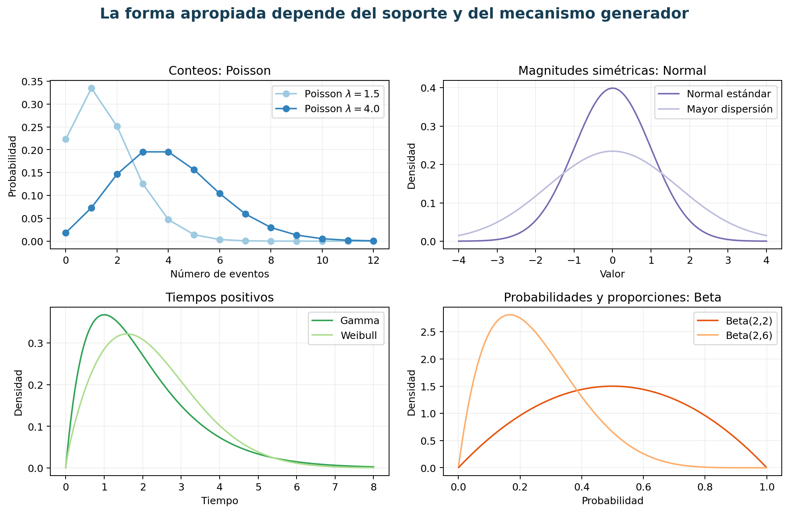
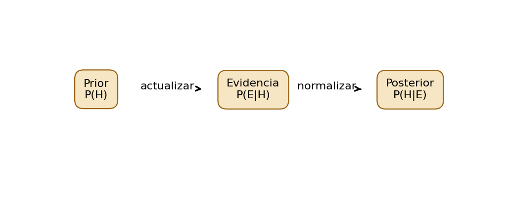
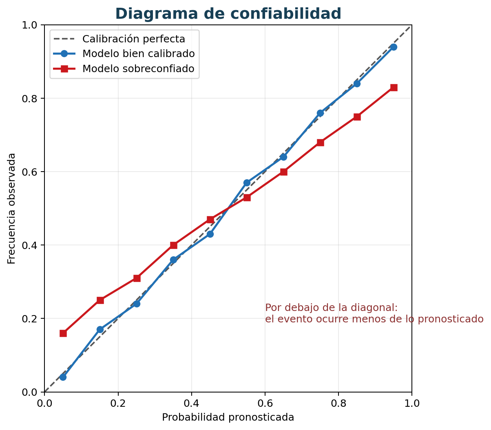

# Capítulo 5. Probabilidad, incertidumbre e inferencia bayesiana

## Propósito y objetivos de aprendizaje

Los datos no eliminan la incertidumbre. Una medición puede contener ruido, un evento futuro puede depender de factores no observados y una muestra puede diferir de la población. La probabilidad proporciona un lenguaje para representar esa incertidumbre, combinar evidencia y tomar decisiones sin fingir certeza.

Este capítulo comienza con experimentos y eventos porque toda probabilidad necesita especificar qué resultados son posibles. Luego introduce variables aleatorias y distribuciones, que permiten modelar cantidades como número de fallas o tiempo de espera. La inferencia bayesiana añade una regla coherente para actualizar creencias a medida que aparece evidencia. Finalmente se estudia cómo distinguir fuentes de incertidumbre y comunicarlas de manera útil para una decisión.

La probabilidad no debe tratarse como una colección de fórmulas. Cada cálculo expresa un modelo: qué se considera repetible, qué información condiciona, qué independencia se supone y qué población se representa. La experiencia técnica consiste tanto en realizar el cálculo como en reconocer cuándo sus supuestos no corresponden al problema.

Al finalizar, el lector podrá:

- definir experimentos, espacios muestrales y eventos;
- aplicar reglas de suma, producto y condicionamiento;
- distinguir independencia de exclusión mutua;
- interpretar funciones de masa, densidad y distribución;
- calcular esperanza, varianza y covarianza;
- seleccionar distribuciones frecuentes a partir de su mecanismo generador;
- diferenciar previa, verosimilitud, evidencia y posterior;
- actualizar probabilidades y vincularlas con costos de decisión;
- separar incertidumbre aleatoria y epistémica;
- evaluar calibración y comunicar riesgo sin crear falsa precisión.

## 5.1. Fundamentos de probabilidad

La probabilidad formaliza afirmaciones sobre resultados inciertos. Puede interpretarse como frecuencia de largo plazo, grado racional de creencia o medida matemática sobre conjuntos. En la práctica de Ciencia de Datos, estas interpretaciones conviven: se estiman frecuencias observadas, se construyen modelos y se expresan creencias condicionadas por información.

Antes de asignar un número se deben identificar resultado, población, horizonte y condiciones. “La probabilidad de una fuga es 10 %” está incompleta: ¿para qué zona, durante qué periodo, bajo qué definición de fuga y con qué información disponible?

### 5.1.1. Experimento aleatorio y espacio muestral

Un **experimento aleatorio** es un procedimiento cuyo resultado no se conoce con certeza antes de observarlo, aunque se conozcan resultados posibles. Lanzar un dado es el ejemplo clásico, pero en aplicaciones el experimento puede ser observar si una tubería falla durante una semana, registrar cantidad de reclamos en una hora o medir tiempo hasta que llegue un vehículo.

El **espacio muestral** $\Omega$ contiene todos los resultados elementales considerados por el modelo. Para una inspección binaria:

$$
\Omega=\{fuga,\ no\ fuga\}.
$$

Para dos sensores binarios, el espacio puede contener cuatro combinaciones. Para un tiempo de espera no negativo, $\Omega=[0,\infty)$.

#### El espacio es una decisión de modelado

El mundo real admite más estados que cualquier modelo. Una inspección puede ser inconclusa, detectar una falla distinta o no realizarse. Si se utiliza un espacio binario, se debe decidir dónde se ubican esos casos. Omitirlos no los elimina; los convierte en ambigüedad.

Un espacio debe ser **exhaustivo** respecto del alcance: incluir todos los resultados posibles. Sus resultados elementales deben ser mutuamente excluyentes: solo uno ocurre por realización. Estas condiciones dependen de la granularidad. “Lluvia” y “tráfico” no son resultados excluyentes; pueden coexistir.

#### Experimento, observación y repetición

La idea de repetición no siempre implica reproducir condiciones idénticas. Los viajes ocurren en rutas y horarios diferentes; las tuberías tienen edades distintas. La probabilidad suele condicionarse por esas características para construir unidades comparables.

En un modelo frecuentista, una probabilidad puede entenderse como frecuencia límite bajo repeticiones idealizadas. En una interpretación bayesiana, también puede representar incertidumbre sobre un evento único, dada la información disponible.

#### Resultados simples y trayectorias

En procesos temporales, un resultado puede ser una trayectoria completa $(X_1,\ldots,X_T)$, no una sola medición. Definir el espacio como trayectorias permite formular secuencias, pero aumenta complejidad. El nivel debe responder a la pregunta.

#### Práctica profesional

Antes de calcular, redacte el experimento: unidad, instante de inicio, horizonte, resultado observable y casos inconclusos. Muchos desacuerdos probabilísticos son en realidad desacuerdos sobre esta definición.

### 5.1.2. Eventos y operaciones entre eventos

Un **evento** es un subconjunto de $\Omega$. Ocurre si el resultado elemental pertenece a ese conjunto. En un dado, “obtener par” corresponde a $A=\{2,4,6\}$. En transporte, “incidente durante hora pico” reúne múltiples resultados con esa propiedad.

Las operaciones de conjuntos traducen expresiones del dominio.

- **Unión** $A\cup B$: ocurre $A$, ocurre $B$ o ambos.
- **Intersección** $A\cap B$: ocurren ambos.
- **Complemento** $A^c$: no ocurre $A$.
- **Diferencia** $A\setminus B$: ocurre $A$ y no $B$.

#### “O” inclusivo y exclusivo

En probabilidad, la unión suele ser inclusiva. “Lluvia o congestión” incluye días con ambas. Si se desea exactamente una, el evento es $(A\setminus B)\cup(B\setminus A)$.

#### Particiones

Una colección $B_1,\ldots,B_k$ forma una partición si los eventos son mutuamente excluyentes y su unión es $\Omega$. Las particiones permiten descomponer probabilidades por zona, turno o estado.

Por ejemplo, turnos mañana, tarde y noche pueden formar una partición si cada incidente pertenece exactamente a uno. Los límites horarios deben ser inequívocos.

#### Diagramas y tablas

Los diagramas de Venn ayudan con pocos eventos. Para muchas variables, tablas de contingencia y árboles resultan más claros. La representación debe impedir doble conteo.

#### Eventos compuestos en datos

Un evento se implementa mediante una regla. “Demora crítica” puede ser tiempo mayor a 20 minutos; “condición anómala”, combinación de presión y caudal. Cambiar umbral cambia el evento y su probabilidad. La definición debe versionarse.

### 5.1.3. Axiomas de probabilidad

Una función de probabilidad $P$ asigna números a eventos y satisface los axiomas de Kolmogórov.

1. **No negatividad:** $P(A)\geq0$.
2. **Normalización:** $P(\Omega)=1$.
3. **Aditividad numerable:** para eventos disjuntos $A_i$,

$$
P\left(\bigcup_i A_i\right)=\sum_iP(A_i).
$$

Los axiomas son pocos, pero de ellos se derivan reglas fundamentales.

#### Consecuencias

La probabilidad del evento imposible es $P(\varnothing)=0$. El complemento cumple:

$$
P(A^c)=1-P(A).
$$

Si $A\subseteq B$, entonces $P(A)\leq P(B)$. Toda probabilidad está entre cero y uno.

#### Probabilidad cero no siempre significa imposibilidad

En una distribución continua, la probabilidad de un valor exacto puede ser cero aunque ese valor sea posible. La probabilidad se asigna a intervalos. Este punto evita interpretar densidad como probabilidad puntual.

#### Coherencia

Los axiomas impiden asignaciones contradictorias. Si una persona afirma $P(A)=0.7$ y $P(A^c)=0.5$, sus valores no forman una probabilidad coherente. En sistemas que combinan expertos o modelos se debe normalizar y revisar consistencia.

#### Probabilidad y datos

Una frecuencia relativa $n_A/n$ estima una probabilidad bajo un mecanismo de muestreo. El axioma no garantiza que esa frecuencia represente otra población o periodo. La validez empírica depende del diseño estudiado en capítulos anteriores.

### 5.1.4. Reglas de suma y producto

La regla general de suma evita doble conteo:

$$
P(A\cup B)=P(A)+P(B)-P(A\cap B).
$$

Si $A$ y $B$ son mutuamente excluyentes, la intersección es vacía y las probabilidades se suman directamente.

Para múltiples eventos, el principio de inclusión-exclusión añade y resta intersecciones de distintos órdenes. En aplicaciones, una tabla bien definida suele ser menos propensa a errores que memorizar una fórmula extensa.

#### Regla del producto

La probabilidad conjunta se descompone mediante condicionamiento:

$$
P(A\cap B)=P(A\mid B)P(B)=P(B\mid A)P(A).
$$

Para una secuencia:

$$
P(A_1,\ldots,A_n)=P(A_1)\prod_{i=2}^{n}P(A_i\mid A_1,\ldots,A_{i-1}).
$$

Esta regla de cadena es siempre válida cuando los condicionamientos están definidos. Las simplificaciones aparecen al asumir independencia.

#### Árboles de probabilidad

Un árbol representa decisiones o secuencias. Cada rama lleva una probabilidad condicional; la probabilidad de un camino se obtiene multiplicando; caminos alternativos se suman. Es especialmente útil para pruebas diagnósticas y actualizaciones bayesianas.

#### Error frecuente: sumar intersecciones

Si se pregunta por “incidente o lluvia”, sumar probabilidades sin restar días con ambos sobrecuenta. Si se pregunta por “incidente y lluvia”, sumar no corresponde. Traducir primero la frase a conjuntos evita el error.

### 5.1.5. Probabilidad condicional

La probabilidad de $A$ dada la información de que ocurrió $B$ es:

$$
P(A\mid B)=\frac{P(A\cap B)}{P(B)},\qquad P(B)>0.
$$

Condicionar restringe el universo a $B$ y renormaliza. El denominador ya no es toda la población, sino las unidades que cumplen $B$.

#### El denominador como pregunta

“¿Qué proporción de incidentes ocurrió de noche?” estima $P(Noche\mid Incidente)$. “¿Qué proporción de noches tuvo incidentes?” estima $P(Incidente\mid Noche)$. Pueden diferir enormemente.

Una buena práctica es escribir numerador y denominador en palabras antes de calcular. Las tablas de contingencia deben presentar totales para que el lector pueda reconstruirlos.

#### Información y actualización

La probabilidad condicional representa cómo cambia una creencia al conocer $B$. Si $P(A\mid B)>P(A)$, $B$ aumenta la probabilidad de $A$; eso no demuestra que $B$ cause $A$.

#### Ley de probabilidad total

Si $B_1,\ldots,B_k$ forman una partición:

$$
P(A)=\sum_{j=1}^{k}P(A\mid B_j)P(B_j).
$$

La ley combina probabilidades condicionadas ponderadas por prevalencia de cada grupo. Es la base del denominador en Bayes y muestra por qué cambiar composición poblacional cambia la probabilidad global.

#### Condicionar en variables continuas

Para variables continuas se trabaja con densidades condicionales. El evento $X=x$ puede tener probabilidad cero, pero existe una densidad regular bajo condiciones matemáticas. La notación se conserva, aunque la interpretación requiere cuidado.

### 5.1.6. Independencia

Dos eventos son independientes si:

$$
P(A\cap B)=P(A)P(B).
$$

Cuando las probabilidades son positivas, equivale a $P(A\mid B)=P(A)$. Saber que ocurrió $B$ no cambia la probabilidad de $A$ dentro del modelo.

#### Independencia no es exclusión mutua

Eventos mutuamente excluyentes con probabilidad positiva no pueden ser independientes: si ocurre uno, el otro es imposible. Esta confusión es frecuente porque ambos conceptos suenan a “no relación”. Exclusión habla de coexistencia; independencia, de información.

#### Independencia por pares y conjunta

Varias variables pueden ser independientes por pares sin ser conjuntamente independientes. Para factorizar una distribución completa se necesita una condición más fuerte. Los modelos deben declarar qué tipo se supone.

#### Independencia condicional

$A$ y $B$ pueden ser dependientes globalmente e independientes dado $C$:

$$
P(A,B\mid C)=P(A\mid C)P(B\mid C).
$$

Por ejemplo, demanda y retraso pueden asociarse globalmente por hora; dentro de una franja y ruta, la relación puede reducirse. La independencia condicional es central en redes bayesianas.

#### No se demuestra con una muestra

Una asociación no significativa no prueba independencia. Puede faltar potencia o existir relación no medida. La independencia es un supuesto estructural que se contrasta con datos y conocimiento.

#### Consecuencias de asumirla

La independencia simplifica cálculos. Si se asume incorrectamente, se multiplican evidencias redundantes y se obtiene confianza excesiva. Dos sensores del mismo tipo pueden fallar juntos por una causa común.

### 5.1.7. Ejemplo práctico guiado: probabilidad de incidentes en una red de transporte

#### Datos

Durante 1.000 turnos se registraron 120 con incidente. Hubo 300 turnos nocturnos; 60 tuvieron incidente. En 200 turnos llovió; 50 tuvieron incidente. De los turnos con lluvia, 80 fueron nocturnos y 30 combinaron noche e incidente.

#### Probabilidad simple

La frecuencia de incidentes estima:

$$
\hat{P}(I)=120/1000=0.12.
$$

Esta estimación describe turnos registrados, bajo la definición y cobertura disponibles.

#### Probabilidad condicional

Entre turnos nocturnos:

$$
\hat{P}(I\mid N)=60/300=0.20.
$$

Entre turnos con incidente, la proporción nocturna es $P(N\mid I)=60/120=0.50$. Los números responden preguntas distintas.

#### Intersección y producto

$P(I\cap N)=60/1000=0.06$. Se comprueba:

$$
P(I\mid N)P(N)=0.20\times0.30=0.06.
$$

#### Independencia

Si incidente y noche fueran independientes, $P(I\cap N)$ sería $0.12\times0.30=0.036$, diferente de 0.06 observado. Esto sugiere asociación en la muestra; no identifica causa.

#### Interpretación

La mayor frecuencia nocturna puede relacionarse con iluminación, dotación, rutas o clima. El análisis probabilístico cuantifica el patrón y orienta estratificación. No autoriza afirmar que la noche produce incidentes.

#### Sensibilidad

Se revisa si la definición cambió y si los turnos nocturnos tienen igual cobertura. Si los incidentes leves se registran menos durante el día, la diferencia refleja medición además de fenómeno.

## 5.2. Variables aleatorias y distribuciones

Una variable aleatoria convierte resultados de un experimento en números. Esta representación permite pasar de eventos aislados a modelos de cantidades: número de fallas, tiempo de espera, consumo o pérdida económica.

Una distribución no es una curva elegida por apariencia. Resume probabilidades bajo un mecanismo y parámetros. Seleccionarla requiere preguntar qué valores son posibles, cómo se generan y qué dependencias existen.

### 5.2.1. Variables aleatorias discretas y continuas

Una variable aleatoria es una función $X:\Omega\rightarrow\mathbb{R}$. A cada resultado elemental le asigna un número.

Una variable **discreta** toma un conjunto finito o numerable de valores: indicador de fuga, número de incidentes, cantidad de reclamos. Una variable **continua** se modela sobre intervalos: tiempo, presión o temperatura.

#### Discreto y continuo son modelos

Una medición digital de presión tiene resolución finita, pero suele modelarse continua porque los saltos son pequeños respecto de la pregunta. Un tiempo registrado en minutos puede modelarse discreto o continuo. La elección depende de resolución y uso.

#### Indicadores

Para un evento $A$, la variable indicadora $I_A$ vale 1 si ocurre y 0 si no. Su esperanza es:

$$
E[I_A]=P(A).
$$

Esta identidad conecta proporciones, conteos y probabilidades y es útil para derivar resultados.

#### Soporte

El soporte es el conjunto de valores posibles con probabilidad o densidad positiva. Debe respetar el fenómeno. Una normal asigna probabilidad a negativos; puede ser inadecuada para tiempos cuando la masa negativa no es despreciable.

#### Transformaciones

Si $Y=g(X)$, su distribución se deriva de la de $X$. Transformar logaritmos, tasas o máximos cambia soporte y forma. No basta con transformar valores; la interpretación probabilística también cambia.

### 5.2.2. Función de probabilidad y función de densidad

Para una variable discreta, la función de masa es:

$$
p_X(x)=P(X=x),
$$

con $p_X(x)\geq0$ y $\sum_xp_X(x)=1$.

Para una variable continua, la densidad $f_X(x)$ satisface:

$$
P(a\leq X\leq b)=\int_a^b f_X(x)\,dx,
$$

y $\int_{-\infty}^{\infty}f_X(x)dx=1$.

#### Densidad no es probabilidad

$f_X(x)$ puede ser mayor que uno; lo que debe estar entre cero y uno es el área sobre un intervalo. En una variable continua, $P(X=x)=0$. La altura depende de unidades: cambiar segundos a minutos modifica densidad, no probabilidades de intervalos equivalentes.

#### Parámetros

Una familia $f(x\mid\theta)$ describe distribuciones posibles. $\theta$ puede ser tasa, media, varianza o forma. Estimar parámetros no demuestra que la familia sea correcta; se deben revisar mecanismo y ajuste.

#### Empírico frente a teórico

La distribución empírica asigna probabilidad según frecuencias observadas. Una distribución teórica suaviza y permite extrapolar bajo supuestos. El modelo debe compararse con datos mediante gráficos, cuantiles y residuos, no solo una prueba automática.

### 5.2.3. Función de distribución acumulada

La función acumulada es:

$$
F_X(x)=P(X\leq x).
$$

Existe para variables discretas y continuas, es no decreciente, tiende a cero en $-\infty$ y a uno en $\infty$.

#### Interpretación

$F(10)=0.8$ significa que 80 % de la probabilidad está en valores menores o iguales a 10. La probabilidad de intervalo es:

$$
P(a<X\leq b)=F(b)-F(a).
$$

Los detalles de inclusión importan en discretas; en continuas, los puntos tienen probabilidad cero.

#### Supervivencia

La función de supervivencia $S(x)=P(X>x)=1-F(x)$ resulta natural para tiempos hasta evento y probabilidades de excedencia. En riesgo operativo suele interesar más “superar un umbral” que “quedar por debajo”.

#### Cuantiles

El cuantil puede definirse como:

$$
q_p=\inf\{x:F(x)\geq p\}.
$$

Esta definición funciona con saltos y conecta el Capítulo 4 con modelos probabilísticos.

#### Función empírica

$\hat{F}_n(x)=n^{-1}\sum_i\mathbb{I}(X_i\leq x)$ estima la acumulada. Compararla con una CDF teórica revela discrepancias en centro y colas.

### 5.2.4. Esperanza, varianza y covarianza

La esperanza de una variable discreta es:

$$
E[X]=\sum_xx\,p(x),
$$

y para una continua:

$$
E[X]=\int x f(x)\,dx,
$$

si existe. Representa promedio de largo plazo o centro probabilístico, no necesariamente un valor posible ni típico.

#### Linealidad

Para constantes $a,b$:

$$
E[aX+bY]=aE[X]+bE[Y],
$$

sin requerir independencia. Esta propiedad permite calcular costos esperados sumando componentes.

#### Varianza

$$
Var(X)=E[(X-E[X])^2]=E[X^2]-E[X]^2.
$$

Para transformación lineal, $Var(aX+b)=a^2Var(X)$. La varianza mide dispersión cuadrática y puede no existir en distribuciones de colas muy pesadas.

#### Covarianza

$$
Cov(X,Y)=E[(X-E[X])(Y-E[Y])].
$$

Si son independientes y tienen momentos, la covarianza es cero; la inversa no es general. La varianza de una suma es:

$$
Var(X+Y)=Var(X)+Var(Y)+2Cov(X,Y).
$$

Ignorar dependencia puede subestimar o sobreestimar riesgo agregado.

#### Esperanza de utilidad

Una decisión utiliza $E[U(A,S)]$, no necesariamente $U(E[S])$. Para funciones no lineales, $E[g(X)]\neq g(E[X])$. Sustituir incertidumbre por un promedio puede conducir a decisiones equivocadas.

### 5.2.5. Distribuciones discretas frecuentes

#### Bernoulli

$X\sim Bernoulli(p)$ toma 1 con probabilidad $p$ y 0 con $1-p$. $E[X]=p$ y $Var(X)=p(1-p)$. Modela un resultado binario bajo definición clara.

#### Binomial

$X\sim Binomial(n,p)$ cuenta éxitos en $n$ ensayos Bernoulli independientes con igual $p$:

$$
P(X=k)=\binom{n}{k}p^k(1-p)^{n-k}.
$$

Tiene media $np$ y varianza $np(1-p)$. Si la probabilidad cambia entre unidades o existe dependencia, puede aparecer sobredispersión respecto del modelo.

#### Geométrica y binomial negativa

La geométrica modela ensayos hasta el primer éxito y posee propiedad sin memoria. La binomial negativa puede modelar ensayos hasta cierta cantidad de éxitos o conteos sobredispersos según parametrización. Siempre debe indicarse convención.

#### Poisson

$X\sim Poisson(\lambda)$ modela conteos en un intervalo:

$$
P(X=k)=e^{-\lambda}\frac{\lambda^k}{k!},
$$

con media y varianza $\lambda$. Surge bajo eventos aproximadamente independientes, tasa estable y probabilidad pequeña en intervalos breves.

En datos reales, varianza mayor que media sugiere heterogeneidad, dependencia o exceso de ceros. No obliga automáticamente a usar otro modelo, pero exige investigar mecanismo.

#### Multinomial

Extiende binomial a varias categorías mutuamente excluyentes con probabilidades que suman uno. Modela conteos por clase bajo ensayos independientes y probabilidades comunes.

#### Elegir por mecanismo

No se elige Poisson porque el histograma “parece conteo”. Se pregunta si la exposición es comparable, la tasa estable y los eventos aproximadamente independientes. Para zonas con distinta duración o población se incorpora exposición.

### 5.2.6. Distribuciones continuas frecuentes

#### Uniforme

Asigna densidad constante en $[a,b]$. Representa desconocimiento simétrico acotado o mecanismos uniformes, no una opción por defecto para cualquier rango.

#### Normal

$X\sim N(\mu,\sigma^2)$ tiene densidad:

$$
f(x)=\frac{1}{\sqrt{2\pi\sigma^2}}
\exp\left[-\frac{(x-\mu)^2}{2\sigma^2}\right].
$$

Es simétrica, no acotada y aparece como aproximación de sumas por el teorema central del límite. Que un promedio sea aproximadamente normal no implica que las observaciones lo sean.

#### Exponencial

Modela tiempos entre eventos de Poisson con tasa $\lambda$:

$$
f(t)=\lambda e^{-\lambda t},\qquad t\geq0.
$$

Posee falta de memoria: la probabilidad futura no depende del tiempo ya transcurrido. Esta propiedad es fuerte e inadecuada para componentes que envejecen.

#### Gamma y Weibull

Gamma modela tiempos positivos y sumas de exponenciales. Weibull permite tasas de falla crecientes, constantes o decrecientes según parámetro de forma, por lo que es útil en confiabilidad.

#### Beta

Se define en $[0,1]$ y adopta formas diversas. Es útil para proporciones y como previa de una probabilidad Bernoulli. Sus parámetros pueden interpretarse como evidencia previa en una parametrización común.

#### Lognormal

Si $\log X$ es normal, $X$ es lognormal. Modela magnitudes positivas generadas por efectos multiplicativos y produce cola derecha. Media y mediana difieren.

#### Modelos y colas

En riesgo, el ajuste central puede ser bueno y las colas incorrectas. Comparar cuantiles extremos y consecuencias es más importante que una apariencia global. La distribución elegida debe respetar soporte y mecanismo.

### 5.2.7. Distribuciones conjuntas, marginales y condicionales

Una distribución conjunta describe probabilidades de varias variables. Para discretas, $p(x,y)=P(X=x,Y=y)$; para continuas, una densidad $f(x,y)$ integra sobre regiones.

#### Marginalización

La distribución marginal elimina una variable:

$$
p_X(x)=\sum_y p(x,y)
$$

o, en continuo,

$$
f_X(x)=\int f(x,y)dy.
$$

La marginal combina todos los estados de $Y$ ponderados por su probabilidad.

#### Condicionamiento

Para discretas:

$$
p(x\mid y)=\frac{p(x,y)}{p_Y(y)}.
$$

La distribución condicional restringe a unidades con $Y=y$. Las marginales pueden ocultar relaciones heterogéneas entre grupos.

#### Independencia

Si $X$ e $Y$ son independientes:

$$
p(x,y)=p_X(x)p_Y(y).
$$

En una densidad conjunta, contornos elípticos inclinados sugieren dependencia lineal; formas complejas pueden tener covarianza cero.

#### Más de dos variables

La regla de cadena factoriza:

$$
p(x_1,\ldots,x_n)=\prod_i p(x_i\mid x_1,\ldots,x_{i-1}).
$$

Las independencias condicionales permiten simplificar y se representan mediante grafos probabilísticos.

#### Mezclas

Una marginal puede ser mezcla de distribuciones condicionadas:

$$
p(x)=\sum_z p(x\mid z)p(z).
$$

La multimodalidad puede surgir de subpoblaciones. Ajustar una distribución única sin reconocerlas produce parámetros difíciles de interpretar.

### 5.2.8. Ejemplo práctico guiado: modelado probabilístico de fallas y tiempos de espera

#### Unidad de análisis y exposición

Un centro de cómputo registra interrupciones no planificadas en 60 servidores durante 12 semanas. Los equipos pertenecen a tres clústeres: procesamiento general, bases de datos y cómputo intensivo. Para cada servidor-semana se registra el número de fallas y, mientras el equipo está bajo observación, el tiempo desde su recuperación hasta la siguiente falla. El conteo bruto no es comparable si un servidor estuvo activo menos horas; por ello se usa como exposición el tiempo efectivamente operativo.

Sea $N_{cs}$ el número de fallas del clúster $c$ durante la semana $s$ y $E_{cs}$ sus miles de horas-servidor operativas. Un punto de partida es:

$$
N_{cs}\mid E_{cs}\sim Poisson(\lambda_c E_{cs}),
$$

donde $\lambda_c$ es la tasa de fallas por mil horas-servidor. Este modelo supone una tasa constante dentro de cada clúster y semana, incrementos independientes y eventos individuales. No basta observar que la variable es un conteo: reinicios masivos, versiones de software compartidas o picos térmicos pueden producir fallas simultáneas y violar esos supuestos.

#### Diagnóstico del modelo de conteos

En el clúster de procesamiento general, para semanas de exposición semejante, la media es 2,3 fallas y la varianza 2,5; Poisson resulta una aproximación inicial razonable. En bases de datos, la media es 1,8 y la varianza 6,1. Esta sobredispersión indica más variabilidad de la permitida por la igualdad $E(N)=Var(N)$ de Poisson. Además, se observan demasiadas semanas sin fallas y varias con cinco o más.

Antes de cambiar de familia se investiga el mecanismo. Al incorporar versión de sistema, antigüedad y temperatura de sala, parte de la heterogeneidad desaparece. La variación restante puede representarse con un modelo binomial negativo, equivalente a permitir que la tasa latente cambie entre semanas. Si persisten eventos agrupados por incidentes comunes, se añade un efecto aleatorio de semana o se modela cada incidente de infraestructura, pues tratar todas las fallas como independientes produciría intervalos demasiado estrechos.

El contraste incluye residuos por clúster, cociente varianza-media, frecuencia de ceros y probabilidades predictivas de semanas extremas. La elección final depende del uso: para dimensionar guardias importa reproducir $P(N_{cs}\geq 5)$, no solo la media.

#### Tiempos de espera por clúster

Si las fallas siguieran un proceso de Poisson homogéneo, el tiempo $T_c$ hasta la siguiente falla tendría modelo exponencial:

$$
P(T_c>t)=\exp(-\lambda_c t),
$$

con tasa instantánea constante y propiedad de falta de memoria. Las curvas de supervivencia por clúster muestran, sin embargo, comportamientos distintos. En cómputo intensivo el riesgo aumenta con las horas continuas de carga, mientras que en bases de datos es elevado inmediatamente después de una actualización y luego disminuye. Una única exponencial mezclaría mecanismos y ocultaría estas diferencias. Se comparan entonces tasas por clúster y modelos Weibull o por tramos temporales; una forma Weibull menor que uno representa riesgo decreciente y una mayor que uno, riesgo creciente.

#### Censura y observación incompleta

Al cerrar el estudio, 41 servidores aún no habían presentado una nueva falla. Sus tiempos no son ceros ni deben eliminarse: están censurados a la derecha y solo se sabe que exceden el tiempo observado. También hay servidores incorporados después del inicio, con entrada tardía. La función de verosimilitud aporta una densidad para cada falla observada y una probabilidad de supervivencia para cada caso censurado, respetando el tiempo durante el cual cada equipo estuvo en riesgo.

Este tratamiento supone censura no informativa condicionada a las variables incluidas. Si los equipos más inestables se retiran antes o dejan de reportar telemetría, la censura depende del riesgo y debe modelarse o analizarse mediante escenarios de sensibilidad.

#### Resultado para la decisión

El reporte presenta tasas por mil horas-servidor, intervalos, probabilidades de conteos extremos y tiempos medianos hasta una nueva falla por clúster. Poisson y exponencial se conservan como referencias simples, no como propiedades automáticas de los datos. La recomendación operativa se basa en el modelo que reproduce heterogeneidad, agrupamiento y censura, y declara que sus predicciones solo son válidas para cargas, versiones y políticas de monitoreo comparables con las del estudio.

## 5.3. Teorema de Bayes e inferencia probabilística

El teorema de Bayes reorganiza probabilidades condicionadas. Su importancia práctica es que separa lo que se creía antes, cómo se comportaría la evidencia bajo cada hipótesis y qué debe creerse después de observarla.

Para hipótesis $H$ y evidencia $E$:

$$
P(H\mid E)=\frac{P(E\mid H)P(H)}{P(E)}.
$$

La fórmula es sencilla; construir sus componentes es el verdadero trabajo. La previa debe representar una población pertinente, la verosimilitud debe modelar el mecanismo de observación y la evidencia debe integrar alternativas. Si alguno está mal definido, la posterior será coherente con un modelo equivocado.

### 5.3.1. Probabilidad previa

La **probabilidad previa** $P(H)$ representa incertidumbre sobre la hipótesis antes de incorporar la evidencia actual. No significa necesariamente ignorar datos: puede resumir prevalencia histórica, estudios anteriores, conocimiento experto o restricciones físicas.

#### La población de referencia

Una previa de fuga de 2 % puede ser adecuada para todas las zonas en un día normal e inadecuada para tuberías antiguas después de una tormenta. La previa debe corresponder a unidad, horizonte y condiciones del caso.

Usar una tasa global para grupos heterogéneos puede ocultar riesgo. Una previa jerárquica permite compartir información entre grupos sin tratarlos como idénticos.

#### Previas informativas y débiles

Una previa informativa concentra probabilidad según conocimiento sustantivo. Una previa débil distribuye más ampliamente. “No informativa” es un término problemático: una distribución uniforme en un parámetro deja de ser uniforme bajo transformación. Toda previa incorpora estructura.

#### Previas conjugadas

Para probabilidad Bernoulli $p$, una previa Beta:

$$
p\sim Beta(\alpha,\beta)
$$

se actualiza de forma simple. $\alpha$ y $\beta$ pueden interpretarse como evidencia previa equivalente bajo una parametrización. La conjugación facilita cálculo, pero no debe imponerse si produce una forma inadecuada.

#### Elicitación experta

En lugar de pedir “una probabilidad”, se pueden preguntar cuantiles: valor más plausible, rango que contiene 90 % de creencia y escenarios extremos. Varios expertos deben aportar razonamiento y desacuerdos. Promediar números sin entender supuestos puede ocultar diferencias de definición.

#### Análisis de sensibilidad

Cuando la previa es discutible, se calculan posteriores bajo alternativas plausibles. Si la decisión cambia, se necesita más evidencia o una política robusta. Si no cambia, la conclusión es menos dependiente de la previa.

### 5.3.2. Verosimilitud

La **verosimilitud** describe cuán compatibles son los datos observados con distintos valores del parámetro o hipótesis:

$$
L(\theta;y)=p(y\mid\theta).
$$

Como función de $y$ para $\theta$ fijo es una probabilidad o densidad. Como función de $\theta$ para datos fijos es verosimilitud y no necesita integrar uno sobre $\theta$.

#### No es la probabilidad del parámetro

$L(\theta;y)$ no es $P(\theta\mid y)$. Para obtener una distribución posterior se combina con previa y se normaliza. Confundirlas lleva a interpretar un ajuste relativo como probabilidad.

#### Modelo de observación

La verosimilitud debe incluir ruido, censura, selección y dependencia. Si solo se inspeccionan zonas con alertas, las confirmaciones observadas no son una muestra aleatoria. El modelo necesita representar política de inspección o limitar el estimando.

#### Independencia condicional

Para datos condicionalmente independientes:

$$
L(\theta;y_1,\ldots,y_n)=\prod_i p(y_i\mid\theta).
$$

Si mediciones comparten sensor o evento, multiplicarlas como independientes exagera evidencia. Puede utilizarse un modelo jerárquico o una estructura de correlación.

#### Log-verosimilitud

Los productos de probabilidades pequeñas causan problemas numéricos. Se utiliza:

$$
\ell(\theta)=\sum_i\log p(y_i\mid\theta).
$$

Maximizar log-verosimilitud equivale a maximizar verosimilitud. En Bayes, se suma log-previa y luego se normaliza o muestrea.

#### Verosimilitud de una prueba

Sensibilidad $P(+\mid H)$ y tasa de falso positivo $P(+\mid H^c)$ describen cómo se comporta una señal bajo estados. Su razón:

$$
LR^+=\frac{P(+\mid H)}{P(+\mid H^c)}
$$

indica cuánto favorece un resultado positivo a $H$. No depende directamente de prevalencia; la posterior sí.

### 5.3.3. Probabilidad posterior

La posterior combina previa y verosimilitud:

$$
p(\theta\mid y)\propto p(y\mid\theta)p(\theta).
$$

Representa incertidumbre sobre $\theta$ después de observar $y$, condicionada al modelo completo.

#### Ejemplo Beta-Binomial

Si $p\sim Beta(\alpha,\beta)$ y se observan $s$ éxitos y $f$ fracasos Bernoulli, entonces:

$$
p\mid y\sim Beta(\alpha+s,\beta+f).
$$

La actualización suma evidencia. Con pocos datos, la previa influye; con muchos, la verosimilitud suele dominar si el modelo es identificable.

#### Resúmenes posteriores

Se puede informar media, mediana, moda, intervalo creíble o probabilidad de superar un umbral. El resumen se elige según decisión. La media posterior minimiza pérdida cuadrática; la mediana, pérdida absoluta; otras pérdidas producen otras decisiones.

#### Distribución predictiva posterior

Para una nueva observación $\tilde{y}$:

$$
p(\tilde{y}\mid y)=\int p(\tilde{y}\mid\theta)p(\theta\mid y)d\theta.
$$

Integra incertidumbre del parámetro y variabilidad de observación. Es más pertinente para pronóstico que sustituir $\theta$ por una estimación puntual.

#### Posterior no equivale a verdad

Es condicional a familia, previa, datos y supuestos. Un modelo puede producir posterior estrecha y estar mal especificado. Se requieren comprobaciones predictivas y sensibilidad.

### 5.3.4. Evidencia y normalización

El denominador de Bayes es la **evidencia** o verosimilitud marginal:

$$
p(y)=\int p(y\mid\theta)p(\theta)d\theta
$$

o una suma en hipótesis discretas. Garantiza que la posterior integre uno.

#### Interpretación

La evidencia es la probabilidad de observar los datos bajo el modelo completo, promediada sobre la previa. En clasificación binaria:

$$
P(E)=P(E\mid H)P(H)+P(E\mid H^c)P(H^c).
$$

#### Comparación de modelos

La razón de evidencias entre modelos es un factor de Bayes. Integra ajuste y complejidad según previas. Es sensible a previas y puede ser difícil de calcular; no debe presentarse como criterio automático.

#### Normalización numérica

Con muchas hipótesis se trabaja en logaritmos y se usa la técnica log-sum-exp para evitar subdesbordamiento. En modelos complejos, la constante puede ser intratable y se utilizan aproximaciones o muestreo.

#### Clases múltiples

Para hipótesis $H_1,\ldots,H_k$ mutuamente excluyentes y exhaustivas:

$$
P(H_j\mid E)=\frac{P(E\mid H_j)P(H_j)}{\sum_hP(E\mid H_h)P(H_h)}.
$$

Si falta una hipótesis plausible, las probabilidades se redistribuyen entre opciones incompletas y pueden crear falsa certeza. Un estado “otro” o “desconocido” puede ser necesario.

### 5.3.5. Actualización secuencial de creencias

La posterior de hoy puede ser previa de mañana. Para evidencias $E_1,E_2$:

$$
P(H\mid E_1,E_2)\propto P(E_2\mid H,E_1)P(H\mid E_1).
$$

El orden no cambia el resultado si se usa correctamente la distribución conjunta. Cambia la representación intermedia.

#### Evidencias condicionalmente independientes

Si $E_1$ y $E_2$ son independientes dado $H$:

$$
P(E_1,E_2\mid H)=P(E_1\mid H)P(E_2\mid H).
$$

La simplificación permite multiplicar razones de verosimilitud. Si ambas provienen del mismo sensor o causa, asumir independencia cuenta dos veces la información.

#### Odds y razones de verosimilitud

Bayes puede expresarse:

$$
Odds(H\mid E)=Odds(H)\times LR(E).
$$

En una secuencia condicionalmente independiente, se multiplican $LR$. Esta forma muestra cómo cada evidencia aumenta o disminuye odds.

#### Olvido y cambio de régimen

En sistemas dinámicos, datos antiguos pueden no representar el presente. Una actualización acumulativa que nunca olvida se vuelve confiada en un régimen pasado. Se necesitan modelos temporales, ventanas o parámetros cambiantes.

#### Detener la observación

Obtener evidencia tiene costo. Puede detenerse cuando una acción es claramente preferible o continuar si el valor esperado de información supera el costo. Esto conecta Bayes con teoría de decisión.

### 5.3.6. Inferencia mediante distribuciones conjuntas

Una distribución conjunta contiene toda la información probabilística del conjunto de variables. La inferencia consiste en condicionar y marginalizar.

Supóngase $F$ fuga, $P$ baja presión y $R$ reclamo. Para calcular:

$$
P(F\mid P,R)=\frac{P(F,P,R)}{\sum_fP(f,P,R)}.
$$

El numerador selecciona el estado; el denominador suma hipótesis compatibles.

#### Enumeración

Con pocas variables discretas se construye tabla completa y se suma. Es transparente, pero crece exponencialmente. Cuatro variables binarias tienen 16 estados; veinte, más de un millón.

#### Factorización

Las independencias condicionales permiten factorizar. Una red bayesiana representa un grafo dirigido y escribe:

$$
P(X_1,\ldots,X_n)=\prod_iP(X_i\mid Pa(X_i)),
$$

donde $Pa$ son padres. La estructura debe basarse en conocimiento y evidencia; no es solo compresión.

#### Inferencia exacta y aproximada

Eliminación de variables y propagación de mensajes pueden ser exactas en ciertas estructuras. En modelos grandes se utilizan Monte Carlo, MCMC o métodos variacionales. La aproximación añade error computacional a la incertidumbre del modelo.

#### Evidencia faltante

La marginalización permite inferir sin observar todas las variables, siempre que el mecanismo esté modelado. No equivale a imputar un único valor; integra posibilidades.

#### Comprobación

Se revisa que distribuciones sumen uno, probabilidades estén en rango y marginales coincidan. También se realizan comprobaciones predictivas: simular desde el modelo y comparar patrones con datos.

### 5.3.7. Ejemplo práctico guiado: diagnóstico probabilístico de una transacción fraudulenta

#### Hipótesis, población y tasa base

Sea $F$ el evento “la transacción es fraudulenta”. Para compras digitales del mismo país, comercio y franja horaria, el histórico auditado estima $P(F)=0.004$: alrededor de 4 fraudes por cada 1000 transacciones. Esta población de referencia importa; emplear la tasa de un segmento ya alertado inflaría la previa.

Las probabilidades previas pueden expresarse como *odds*:

$$
O(F)=\frac{P(F)}{1-P(F)}=\frac{0.004}{0.996}\approx0.004016.
$$

La transacción analizada tiene importe superior a 1200 unidades monetarias ($A$), procede de un dispositivo no registrado para la cuenta ($D$) y se origina lejos del patrón geográfico habitual ($L$).

#### Actualización por importe

En datos de validación representativos se estima $P(A\mid F)=0.48$ y $P(A\mid F^c)=0.08$. La razón de verosimilitud es:

$$
LR_A=\frac{0.48}{0.08}=6.
$$

Por tanto, $O(F\mid A)=0.004016(6)=0.02410$ y:

$$
P(F\mid A)=\frac{0.02410}{1+0.02410}\approx0.0235.
$$

Aunque el importe multiplica por seis los *odds*, la probabilidad queda cerca de 2,4 % por la baja tasa base. Confundir $P(A\mid F)=0.48$ con $P(F\mid A)$ produciría una alarma desproporcionada.

#### Dispositivo y localización

El dispositivo nuevo y la localización atípica no se tratan como señales independientes del importe. A partir de casos con el mismo criterio de importe se estima:

$$
LR_{D\mid A}=\frac{P(D\mid F,A)}{P(D\mid F^c,A)}=\frac{0.50}{0.10}=5.
$$

La actualización da $O(F\mid A,D)=0.02410(5)=0.12048$, equivalente a $P(F\mid A,D)\approx0.1075$. Para la localización, condicionando ahora por las dos señales anteriores:

$$
LR_{L\mid A,D}=\frac{P(L\mid F,A,D)}{P(L\mid F^c,A,D)}=\frac{0.50}{0.20}=2.5.
$$

Así,

$$
O(F\mid A,D,L)=0.12048(2.5)=0.30120,
$$

$$
P(F\mid A,D,L)=\frac{0.30120}{1+0.30120}\approx0.2315.
$$

La transacción tiene una probabilidad estimada de fraude de 23,2 %, no la suma de tres porcentajes. Las razones condicionadas reconocen parte de la dependencia: viajeros legítimos, por ejemplo, pueden usar simultáneamente un dispositivo nuevo y una localización inusual. Si esas probabilidades condicionadas se estimaron con pocos casos, conviene usar un modelo conjunto regularizado y validar calibración fuera de muestra. Multiplicar razones marginales como si fueran independientes sobrestimaría la evidencia.

#### Sensibilidad del diagnóstico

La tasa base puede variar entre 0,2 % y 0,8 % por retrasos de etiquetado y cambios estacionales. Además, el producto efectivo de las razones de verosimilitud puede estar entre 45 y 100, frente al valor central $6(5)(2.5)=75$. Combinando los extremos relevantes:

$$
P_{min}=\frac{(0.002/0.998)45}{1+(0.002/0.998)45}\approx0.083,
$$

$$
P_{max}=\frac{(0.008/0.992)100}{1+(0.008/0.992)100}\approx0.446.
$$

El rango de 8,3 % a 44,6 % no es un intervalo formal si los extremos fueron elegidos como escenarios; comunica sensibilidad a entradas plausibles. La amplitud advierte que el valor central no debe presentarse con precisión excesiva.

#### Umbral de revisión basado en costos

Supóngase que una revisión manual cuesta $C_R=12$ unidades entre tiempo del analista y fricción para el cliente, y que dejar pasar un fraude genera una pérdida esperada $C_F=80$. En una simplificación donde la revisión evita esa pérdida y no hay restricción de capacidad, se revisa cuando:

$$
C_R<pC_F \quad\Longleftrightarrow\quad p>\frac{12}{80}=0.15.
$$

La estimación central de 23,2 % supera el umbral y recomienda revisión, pero el análisis de sensibilidad lo cruza: con los supuestos más conservadores no se revisaría. Por ello el reporte califica la decisión como sensible y propone obtener una autenticación adicional de bajo costo. En producción también deben incorporarse la eficacia imperfecta de la revisión, el costo de demoras, el presupuesto diario y los impactos desiguales sobre grupos de clientes; Bayes cuantifica el diagnóstico, mientras la política de decisión explicita sus consecuencias.

### Actividad EMO [AGUA-04]: estimar riesgo y priorizar una acción

**Capacidad mínima:** actualizar una probabilidad con evidencia y convertirla en una decisión explícita.

**Consigna:** definir una condición anómala; estimar o justificar una previa; incorporar al menos dos evidencias mediante verosimilitudes; calcular posteriores; definir una regla con costos de falso positivo y falso negativo; analizar sensibilidad.

**Modalidad:** discusión grupal de supuestos y fuentes; cálculos, sensibilidad y decisión individuales para una zona o escenario.

**Evidencia individual:** notebook o planilla reproducible con árbol o tabla de probabilidades, previa, verosimilitudes, posteriores, matriz de costos, regla y análisis de escenarios.

**Criterios de aprobación:**

- hipótesis, eventos y población están definidos;
- previa, verosimilitud, evidencia y posterior se diferencian;
- no se confunden probabilidades inversas;
- las dependencias entre evidencias se discuten;
- la acción deriva de probabilidades, costos y restricciones;
- se muestra cómo cambian riesgo y decisión ante supuestos alternativos.

**Preguntas para la defensa:** ¿qué población sustenta la previa?, ¿qué evidencia podría estar duplicada?, ¿por qué la sensibilidad no es la posterior?, ¿qué medición tendría mayor valor?

## 5.4. Incertidumbre y comunicación probabilística

Una probabilidad no elimina incertidumbre: la representa dentro de un modelo. Además de la variabilidad del fenómeno, existe incertidumbre sobre parámetros, datos, estructura y condiciones futuras. Comunicar un único número sin esas capas puede producir una confianza que el análisis no respalda.

### 5.4.1. Incertidumbre aleatoria

La incertidumbre **aleatoria** o irreducible representa variabilidad inherente al fenómeno bajo el modelo. Incluso con parámetros conocidos, un resultado Bernoulli sigue siendo incierto y un tiempo de espera varía.

#### Variabilidad individual y promedio

El promedio de muchas observaciones suele ser más estable que una observación individual. Si $X_i$ son independientes con varianza $\sigma^2$:

$$
Var(\bar{X})=\frac{\sigma^2}{n}.
$$

Esto reduce incertidumbre sobre el promedio, no variabilidad de un nuevo individuo. Confundirlas produce intervalos predictivos demasiado estrechos.

#### Heterogeneidad

Parte de lo que parece aleatorio puede explicarse al incorporar variables. La demanda impredecible globalmente puede ser más estable por franja y zona. Después de condicionar persiste variabilidad residual.

#### Dependencia

La fórmula anterior falla con correlación. Eventos comunes hacen que aumentar cantidad no reduzca incertidumbre al ritmo esperado. En riesgo, muchas unidades pueden fallar juntas durante una tormenta.

#### Decisiones

La incertidumbre aleatoria no siempre puede reducirse con más datos históricos. Puede requerir reservas, redundancia, límites de seguridad o políticas robustas.

### 5.4.2. Incertidumbre epistémica

La incertidumbre **epistémica** proviene de conocimiento limitado: pocos datos, parámetros imprecisos, variables omitidas, etiquetas dudosas, cambio de distribución o modelos alternativos.

#### Parámetros y estructura

Una posterior amplia refleja incertidumbre paramétrica. Pero elegir una familia única puede ocultar incertidumbre estructural. Comparar modelos y supuestos revela cuánto depende la conclusión de esa elección.

#### Datos y medición

Errores de sensor, cobertura y selección agregan incertidumbre que no siempre aparece en la fórmula. Si se tratan datos como exactos, el intervalo será demasiado optimista.

#### Reducibilidad

La incertidumbre epistémica puede reducirse con mejores mediciones, más datos pertinentes, experimentos o conocimiento. La pregunta práctica es qué fuente conviene reducir. El valor de información prioriza mediciones capaces de cambiar la acción.

#### Frontera difusa

Aleatoria y epistémica dependen del modelo. Variación entre zonas puede parecer aleatoria hasta incluir material de tubería. La clasificación sirve para diseñar respuesta, no para afirmar una división metafísica absoluta.

#### Fuera de distribución

Un modelo puede ser confiado en casos alejados de entrenamiento. Detectar novedad, limitar extrapolación y abstenerse son controles de incertidumbre epistémica.

### 5.4.3. Estimaciones puntuales e intervalos

Una estimación puntual resume una distribución o muestra en un valor: media, mediana, máxima verosimilitud o media posterior. Es útil para decidir, pero oculta precisión.

#### Intervalo de confianza

En interpretación frecuentista, un procedimiento de 95 % produce intervalos que cubrirían el parámetro verdadero en 95 % de repeticiones bajo supuestos. Después de observar un intervalo concreto, el parámetro fijo no tiene una probabilidad frecuentista de 95 % de estar dentro.

#### Intervalo creíble

Un intervalo bayesiano de 95 % contiene 95 % de probabilidad posterior del parámetro, condicionado al modelo y previa. Puede ser central o de mayor densidad.

#### Intervalo predictivo

Describe una observación futura e incorpora variabilidad aleatoria y de parámetros. Suele ser más ancho que el intervalo para la media. Para operación, a menudo es el relevante.

#### Cobertura y calibración

Un intervalo nominal no garantiza cobertura si el modelo está mal especificado. Se evalúa en datos nuevos: aproximadamente 90 % de resultados debería caer en intervalos predictivos de 90 %, considerando dependencia.

#### Precisión numérica

Reportar 0.137426 no es más honesto si entradas son inciertas. Las cifras significativas deben reflejar precisión y uso. El redondeo no elimina la necesidad de intervalo.

### 5.4.4. Calibración de probabilidades

Un modelo está calibrado si, entre casos con probabilidad pronosticada cercana a $p$, el evento ocurre aproximadamente en proporción $p$.

#### Diagrama de confiabilidad

Se agrupan pronósticos y se compara media predicha con frecuencia observada. Los bins deben tener tamaño suficiente y pueden ocultar variación. También se utilizan métodos continuos o bandas.

#### Brier score

Para resultados binarios:

$$
BS=\frac{1}{n}\sum_i(p_i-y_i)^2.
$$

Evalúa exactitud probabilística y es una regla de puntuación propia. Depende de prevalencia y combina calibración con resolución; debe compararse con baseline.

#### Calibración y discriminación

Un modelo puede ordenar bien riesgos y estar mal calibrado. AUC mide ranking, no correspondencia de probabilidades. Si la decisión usa costos y umbrales, calibración es crucial.

#### Cambio de prevalencia

Una probabilidad calibrada en una población puede dejar de estarlo si cambia prevalencia o mecanismo. Se monitorea por periodo y grupo. Recalibrar no corrige ausencia de representatividad profunda.

#### Calibración por subgrupos

La calibración global puede ocultar desvíos por zona. Evaluarla en grupos pequeños es ruidoso, por lo que se combinan evidencia, intervalos y modelos jerárquicos.

### 5.4.5. Riesgos de interpretación

#### Inversión del condicional

Confundir $P(E\mid H)$ con $P(H\mid E)$ es el error diagnóstico clásico. Una prueba sensible no implica que un positivo tenga alta probabilidad de enfermedad si la prevalencia es baja.

#### Negligencia de tasa base

Ignorar la previa sobrevalora evidencia llamativa. Presentar frecuencias naturales ayuda: de 1.000 zonas, 20 tienen fuga; la señal detecta 16 y produce 98 falsos positivos; entre 114 alertas, solo 16 son fugas.

#### Riesgo relativo y absoluto

Duplicar riesgo de 0,01 % a 0,02 % es 100 % relativo y 0,01 puntos absoluto. Ambos son correctos, pero producen impresiones diferentes. Deben comunicarse juntos cuando sea pertinente.

#### Probabilidad y causalidad

Una posterior alta de evento no demuestra qué intervención lo evitará. Diagnóstico y tratamiento son preguntas diferentes.

#### Falsa precisión y certeza

Una salida de 87,3 % no incorpora automáticamente incertidumbre de modelo. Las etiquetas “bajo/alto” pueden ocultar gradación y umbrales arbitrarios. Se documentan supuestos y rango.

#### Riesgo individual y grupal

Una frecuencia de grupo aplicada a un individuo expresa incertidumbre condicionada, no destino. La comunicación debe evitar determinismo y estigmatización.

#### Colas

Eventos improbables con impacto enorme requieren atención. “Solo 1 %” no decide por sí solo; debe combinarse con consecuencia y reversibilidad.

### 5.4.6. Comunicación de resultados inciertos

Una comunicación probabilística debe permitir al receptor comprender magnitud, horizonte, referencia, incertidumbre y acción.

#### Frecuencias naturales

“15 de cada 100 zonas similares durante una semana” suele ser más comprensible que “0,15”. El denominador y periodo deben coincidir con la decisión.

#### Comparaciones

Se presenta baseline: riesgo habitual, con evidencia y después de acción. Sin referencia, “alto” es subjetivo. Riesgos relativos se acompañan con absolutos.

#### Rangos y escenarios

Un intervalo puede comunicarse como rango compatible con datos y supuestos. Si existen modelos alternativos, se presentan escenarios, no un promedio que oculte desacuerdo.

#### Lenguaje verbal

Palabras como “probable” tienen interpretaciones variadas. Si se usan, se vinculan con rangos definidos y se muestra número. No deben reemplazar probabilidades en decisiones críticas.

#### Decisión y sensibilidad

El informe indica si la acción cambia dentro del rango. “La probabilidad está entre 25 % y 40 %; inspeccionar sigue siendo preferible para costos considerados” es más útil que solo el intervalo.

#### Transparencia

Se explican fuente, población, fecha, actualización, supuestos y limitaciones. También qué evidencia podría cambiar la conclusión. Una comunicación madura reconoce lo desconocido sin paralizar la decisión.

### 5.4.7. Ejemplo práctico guiado: elaboración de un reporte de riesgo

#### Resumen ejecutivo

“La máquina M-17 tiene una probabilidad estimada de falla funcional de 12 % durante los próximos 30 días, con un rango plausible de 7 % a 20 %. En maquinaria comparable, el riesgo es 4 %. Bajo los costos y la eficacia de mantenimiento acordados, se recomienda intervenir; la recomendación es sensible al extremo inferior del rango.”

La frase define evento, unidad y horizonte. No afirma que 12 % de la máquina esté deteriorada ni que la falla sea inevitable.

#### Riesgo absoluto y relativo

Por cada 100 máquinas con señales semejantes a M-17 se esperarían aproximadamente 12 fallas en 30 días si el modelo permanece calibrado. La referencia histórica equivale a 4 por cada 100. La diferencia absoluta es:

$$
RD=0.12-0.04=0.08,
$$

es decir, 8 fallas adicionales por cada 100 máquinas. El riesgo relativo es:

$$
RR=\frac{0.12}{0.04}=3.
$$

M-17 presenta tres veces el riesgo de referencia, pero el aumento absoluto es de 8 puntos porcentuales. Informar ambas medidas evita que el cociente, más llamativo, oculte la magnitud operativa.

#### Evidencia e incertidumbre

La estimación integra antigüedad del rodamiento, horas desde el último mantenimiento, vibración espectral y temperatura del alojamiento. El rango de 7 % a 20 % combina incertidumbre de parámetros con escenarios sobre calibración del sensor y elección del modelo. No representa toda incertidumbre posible: un régimen de carga nuevo o una causa de falla ausente del histórico podría invalidarlo.

Como sensibilidad, al excluir temperatura por posible deriva del sensor el riesgo baja a 7 %; con una tendencia de vibración más pronunciada sube a 20 %. Frente a la referencia fija de 4 %, esos escenarios corresponden a diferencias absolutas de 3 a 16 puntos porcentuales y riesgos relativos de 1,75 a 5. Si también se estima la referencia, los intervalos de $RD$ y $RR$ deben obtenerse conjuntamente, no combinando extremos independientes.

#### Umbral de intervención

Una falla cuesta en promedio $C_F=50$ unidades por reparación urgente y detención. El mantenimiento preventivo cuesta $C_M=3$ y reduce el riesgo residual a $p_M=0.02$. Bajo neutralidad al riesgo se interviene cuando:

$$
C_M+p_MC_F<pC_F,
$$

o, de forma equivalente,

$$
p>p_M+\frac{C_M}{C_F}=0.02+\frac{3}{50}=0.08.
$$

El riesgo central de 12 % supera el umbral de 8 %. El costo esperado sin intervención es $0.12(50)=6$ unidades y con mantenimiento es $3+0.02(50)=4$. Sin embargo, el escenario de 7 % queda por debajo del umbral. La recomendación es, por tanto, favorable pero no robusta a todos los supuestos. Consecuencias de seguridad, paradas compartidas o aversión a pérdidas extremas justificarían una función de utilidad más rica que este cálculo esperado.

#### Valor de una medición adicional

Antes de detener M-17 puede realizarse una medición independiente de vibración durante un ciclo controlado. Según la validación disponible, hay 35 % de probabilidad de obtener una alarma que llevaría el riesgo a 25 %, y 65 % de obtener un resultado normal que lo reduciría a 5 %. El promedio $0.35(0.25)+0.65(0.05)=0.12$ es coherente con el riesgo actual.

Con la medición se intervendría ante alarma, con costo esperado de 4 unidades, y se continuaría operando ante resultado normal, con costo esperado $0.05(50)=2.5$. El costo esperado de la estrategia informada, antes de pagar la medición, sería:

$$
0.35(4)+0.65(2.5)=3.025.
$$

Sin nueva información, la mejor acción cuesta 4 unidades en esperanza. El valor esperado de la información muestral es entonces $4-3.025=0.975$ unidades. La medición conviene si su costo total, incluida la demora y el riesgo de ejecutarla, es menor que ese valor. Este cálculo depende de que el ensayo esté calibrado, sea verdaderamente adicional y llegue antes de la decisión; si repite la misma señal del sensor actual, su valor sería menor.

#### Recomendación comunicada

El reporte recomienda realizar la medición controlada si cuesta menos de 0,975 unidades y, en caso contrario, ejecutar el mantenimiento preventivo con la evidencia actual. También solicita revisar el resultado si cambian la carga prevista, el costo de detención o la calibración. Así se separan con claridad la probabilidad estimada, su incertidumbre, las consecuencias y la regla que convierte el riesgo en acción.

## Síntesis del capítulo

La probabilidad comienza por definir experimento, espacio y eventos. Sus reglas aseguran coherencia y obligan a controlar denominadores. El condicionamiento describe cómo cambia la incertidumbre con información; la independencia permite simplificar solo cuando el mecanismo la justifica.

Las variables aleatorias y distribuciones convierten resultados en modelos de conteos, magnitudes y tiempos. La elección de una familia depende de soporte, exposición, dependencia y proceso generador. El ajuste central no basta cuando la decisión depende de colas.

Bayes combina previa y verosimilitud para producir una posterior. La actualización es coherente, pero condicional al modelo. Convertir probabilidad en acción requiere utilidad, costos y capacidad. Comunicar exige separar variabilidad, conocimiento limitado, calibración y supuestos.

## Glosario esencial

- **Calibración:** correspondencia entre probabilidades pronosticadas y frecuencias observadas.
- **Densidad:** función cuya integral sobre un intervalo produce probabilidad.
- **Distribución conjunta:** modelo probabilístico de varias variables simultáneas.
- **Evidencia:** probabilidad marginal de los datos que normaliza Bayes.
- **Esperanza:** promedio probabilístico de una variable aleatoria.
- **Evento:** subconjunto del espacio muestral.
- **Independencia:** condición en que conocer un evento no cambia la probabilidad del otro.
- **Posterior:** distribución después de incorporar evidencia.
- **Previa:** distribución antes de la evidencia actual.
- **Verosimilitud:** compatibilidad de datos observados con hipótesis o parámetros.

## Preguntas de autoevaluación

1. ¿Por qué el espacio muestral depende del nivel de modelado?
2. ¿Qué diferencia hay entre unión, intersección y exclusión mutua?
3. ¿Por qué probabilidad cero no implica siempre imposibilidad?
4. ¿Cómo evita la regla de suma el doble conteo?
5. ¿Qué cambia al condicionar una probabilidad?
6. ¿Por qué independencia y exclusión mutua no son sinónimos?
7. ¿Qué diferencia existe entre masa y densidad?
8. ¿Cómo se relacionan CDF, supervivencia y cuantiles?
9. ¿Por qué $E[g(X)]$ no suele ser $g(E[X])$?
10. ¿Qué supuestos justifican una distribución binomial o Poisson?
11. ¿Qué propiedad de la exponencial puede ser inadecuada para fallas?
12. ¿Cómo se obtienen marginales desde una conjunta?
13. ¿Qué representa una previa y cómo se evalúa su influencia?
14. ¿Por qué una verosimilitud no es una posterior?
15. ¿Qué función cumple la evidencia en Bayes?
16. ¿Cuándo no deben multiplicarse dos evidencias?
17. ¿Qué diferencia hay entre incertidumbre aleatoria y epistémica?
18. ¿Cómo difieren intervalo de confianza, creíble y predictivo?
19. ¿Por qué discriminación no garantiza calibración?
20. ¿Cómo ayuda una frecuencia natural a evitar negligencia de tasa base?

## Actividad integradora de cierre

Construya un análisis probabilístico para un caso de agua o movilidad:

1. defina experimento, espacio, eventos y horizonte;
2. estime probabilidades simples, conjuntas y condicionales;
3. evalúe una independencia plausible;
4. seleccione una variable aleatoria y distribución justificando mecanismo;
5. compare propiedades teóricas con datos;
6. proponga previa y verosimilitudes para una hipótesis;
7. calcule una actualización secuencial;
8. convierta la posterior en decisión mediante costos;
9. analice sensibilidad y calibración;
10. redacte un reporte con frecuencia natural, rango y limitaciones.

La evaluación prioriza coherencia entre definición, modelo, evidencia y decisión. Un cálculo correcto sobre eventos ambiguos o supuestos no defendidos no constituye un análisis probabilístico sólido.
