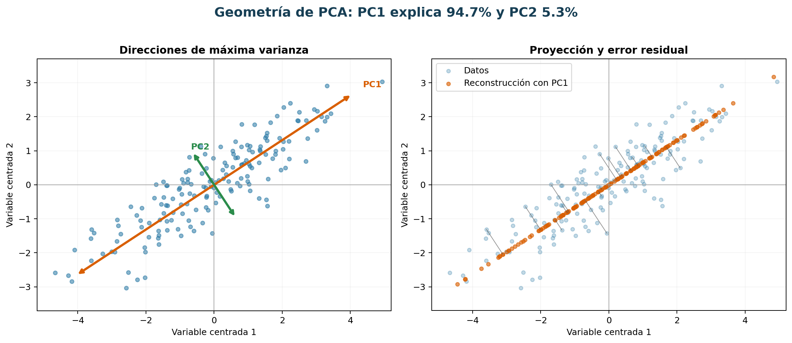

# Capítulo 10. Ingeniería, selección y reducción de atributos

Los algoritmos de aprendizaje no reciben «la realidad», sino una representación de ella. Una persona, una estación meteorológica o un viaje se convierten en filas; sus propiedades se convierten en columnas; y decisiones como expresar una fecha mediante mes, día o tiempo transcurrido alteran el problema que el modelo puede resolver. Por eso, la representación no es una tarea cosmética anterior al modelado: incorpora supuestos sobre semejanza, escala, invariancias y mecanismos del dominio.

Este capítulo estudia tres operaciones relacionadas, pero distintas. La **ingeniería de características** construye representaciones potencialmente útiles; la **selección de atributos** conserva un subconjunto de las variables disponibles; y la **reducción de dimensionalidad** crea un número menor de variables, generalmente combinando las originales. En los tres casos, cualquier cantidad aprendida de los datos —medias, categorías, cargas, umbrales o subconjuntos— debe estimarse solo con el conjunto de entrenamiento correspondiente. De lo contrario, una representación aparentemente sofisticada puede producir una evaluación optimista por fuga de información.

Al terminar el capítulo, el lector podrá justificar una representación según el fenómeno y el momento de predicción, comparar familias de métodos de selección, derivar y leer un análisis de componentes principales (PCA), y diseñar un pipeline heterogéneo que se ajuste, evalúe y persista como una sola unidad.

## 10.1. Ingeniería de características

Una característica o *feature* es una magnitud utilizada como entrada de un modelo. Puede proceder directamente de una medición —temperatura—, de una codificación —tipo de vehículo— o de una construcción —demanda media de las cuatro semanas anteriores—. Una buena característica cumple, al menos, cuatro condiciones: tiene significado para la unidad de análisis, está disponible en el instante de decisión, se calcula del mismo modo durante entrenamiento e inferencia y conserva suficiente estabilidad ante cambios operativos.

La ingeniería de características expresa conocimiento previo. No garantiza que una variable sea predictiva, ni convierte una asociación en causalidad. Su utilidad debe contrastarse fuera de muestra y frente a un baseline. Asimismo, más columnas no implican más información: una expansión indiscriminada puede aumentar varianza, costo, redundancia y superficie de fuga.

El proceso es necesariamente iterativo. Primero se formula qué información debería distinguir casos con resultados diferentes; después se comprueba si esa información existe con calidad y latencia suficientes; finalmente se mide si la representación mejora una decisión fuera de muestra. El análisis de errores vuelve a abrir el ciclo: un fallo concentrado en días festivos puede sugerir una variable de calendario ausente, mientras que un fallo aleatorio no se corrige fabricando transformaciones. Esta disciplina evita confundir creatividad en la construcción de columnas con progreso estadístico.

### 10.1.1. Representación numérica de observaciones

Supóngase una colección de objetos $o_1,\ldots,o_n$. Una representación vectorial es una aplicación $\phi:o_i\mapsto \mathbf{x}_i\in\mathbb{R}^p$. Al apilar los vectores se obtiene la matriz de diseño $X\in\mathbb{R}^{n\times p}$. Elegir $\phi$ define qué diferencias puede percibir el algoritmo. Dos viajes con vectores próximos serán parecidos para un método basado en distancia, aunque operativamente pertenezcan a contextos distintos.

Antes de construir $X$ deben fijarse:

- **Unidad de observación:** viaje, persona, sensor-hora o zona-día. Mezclar granularidades sin agregación explícita produce filas sin interpretación.
- **Índice y claves:** identifican entidades, pero rara vez representan magnitudes. Un código postal o un identificador de cliente no debe tratarse como número continuo por el mero hecho de contener dígitos.
- **Momento de corte:** instante hasta el cual se permite usar información. Para predecir a las 07:00, una variable publicada a las 07:15 no está disponible.
- **Escala de medición:** nominal, ordinal, de intervalo o de razón. La operación «doble» tiene sentido para una distancia, no para una categoría nominal.
- **Semántica del faltante:** desconocido, no aplicable, no medido o ausencia real pueden requerir representaciones diferentes.

Las unidades afectan a muchos modelos. En una distancia euclídea,

$$
d(\mathbf{x},\mathbf{x}')=\sqrt{\sum_{j=1}^{p}(x_j-x'_j)^2},
$$

una variable expresada en metros puede dominar otra expresada en kilómetros aunque representen escalas físicas comparables. La estandarización $z_{ij}=(x_{ij}-\mu_j)/s_j$ fija media cero y desviación uno; el escalado mínimo-máximo lleva un intervalo observado a otro intervalo; y los escaladores robustos usan mediana y rango intercuartílico. Ninguno es universal: estandarizar una variable indicadora altera su lectura, y un mínimo-máximo es sensible a extremos y a valores futuros fuera del rango.

También importa la precisión. Redondear edad a décadas puede reducir ruido y favorecer privacidad, pero elimina diferencias potencialmente útiles. Una razón como «consumo por habitante» puede ser más comparable que el consumo total, aunque se vuelve inestable cuando el denominador es pequeño. Toda razón debe documentar unidades, denominador y tratamiento de ceros.

La representación debe ser compatible con las invariancias razonables del problema. Si trasladar todo un recorrido cien metros no cambia su dificultad, quizá interesen distancias relativas y no coordenadas absolutas. Si duplicar población y consumo conserva el mismo consumo individual, una razón puede imponer esa invariancia. Imponerla reduce grados de libertad, pero también impide que el modelo aprenda excepciones. Por eso se contrasta la versión absoluta, la normalizada y, cuando tiene sentido, ambas juntas.

**Ejemplo de construcción.** Para predecir la energía consumida por un lote de producción, una fila bruta contiene hora de inicio, hora de fin, cantidad de piezas, familia de producto y energía acumulada hasta el comienzo. La duración planificada puede representarse en minutos y la familia mediante indicadores; restar directamente las dos horas sin fecha sería incorrecto si el turno cruza medianoche. La razón energía histórica/pieza facilita comparar lotes de tamaños distintos, pero no se calcula cuando la cantidad es cero: ese caso corresponde a preparación o mantenimiento y merece un indicador propio. Vectorizar no consiste en «volver numérico» un archivo, sino en preservar estados operativos que de otro modo quedarían confundidos.

Un diagnóstico útil consiste en recorrer varias filas desde el dato bruto hasta el vector final. Se comprueba que dos objetos conceptualmente iguales reciban representaciones iguales, que una pequeña perturbación válida no provoque un salto injustificado y que casos sustantivamente distintos no colapsen al mismo vector. Esta inspección detecta errores que ninguna medida de escala revela: agregaciones en la entidad equivocada, unidades mezcladas o un cero que unas fuentes usan como ausencia y otras como medición real.

**Advertencia de fuga.** Medias, desviaciones, cuantiles, límites de recorte e imputaciones se estiman exclusivamente con el entrenamiento. Aplicar primero la normalización a todo el conjunto comunica a las particiones de entrenamiento información sobre la distribución de validación.

### 10.1.2. Transformaciones lineales y no lineales

Una transformación lineal de un vector tiene la forma $T(\mathbf{x})=A\mathbf{x}$; una transformación afín añade un desplazamiento, $T(\mathbf{x})=A\mathbf{x}+\mathbf{b}$. Cambios de unidad, centrado, rotaciones y proyecciones pertenecen a esta familia. Conservan combinaciones lineales: si el modelo posterior también es lineal, encadenar transformaciones lineales no aumenta por sí mismo la clase de fronteras que puede representar, aunque sí mejora condicionamiento, regularización e interpretación.

Las transformaciones no lineales alteran la geometría. Algunas finalidades habituales son:

| Finalidad | Transformación conceptual | Precaución |
|---|---|---|
| Reducir asimetría positiva | $\log(x)$ o $\log(1+x)$ | El dominio debe ser positivo; sumar una constante cambia la interpretación. |
| Estabilizar varianza | familia de potencias | El parámetro debe ajustarse dentro del entrenamiento. |
| Modelar curvatura | $x^2,x^3$ o bases polinómicas | Las potencias elevadas extrapolan mal y pueden ser colineales. |
| Capturar umbrales | indicadores $I(x>c)$ o intervalos | Discretizar pierde orden fino; $c$ no debe elegirse mirando prueba. |
| Respetar periodicidad | seno y coseno | Es preciso conocer el período y la convención de fase. |
| Acotar extremos | recorte o función saturante | Puede ocultar eventos reales; conservar una bandera de recorte. |

Considérese una respuesta cuya relación con concentración sea multiplicativa: un aumento de 1% en $x$ se asocia con un cambio aproximadamente constante en $y$. Usar $\log x$ permite que un modelo lineal represente esa relación. En cambio, aplicar logaritmo solo porque el histograma es asimétrico no constituye una justificación suficiente: el objetivo es facilitar una relación útil y estable con la salida, no hacer que toda entrada parezca normal.

Las bases por tramos ofrecen mayor control que un polinomio global. Pueden expresar pendientes diferentes antes y después de nudos predefinidos, manteniendo continuidad. Sin embargo, cada grado de libertad aumenta capacidad. Nudos, grados y parámetros de transformación son hiperparámetros y se eligen mediante validación, no por desempeño sobre prueba.

La elección también afecta a la extrapolación. Un término cuadrático domina rápidamente fuera del rango observado; una discretización mantiene el último nivel y oculta cuánto se excedió el extremo; una función logarítmica continúa creciendo, pero cada incremento absoluto produce menos cambio. Antes de desplegar conviene preguntar qué hará la transformación con un valor apenas fuera del entrenamiento y con otro físicamente extremo. El comportamiento matemático debe coincidir con una hipótesis operacional, no solo con el ajuste dentro de la muestra.

Las transformaciones monotónicas preservan el orden, pero no las distancias. Esto puede ser suficiente para modelos basados en rangos y decisivo para modelos lineales o métricos. Además, transformar la entrada cambia la escala de interpretación del efecto: si se usa $\log x$, un incremento unitario representa multiplicar $x$ por aproximadamente $e$, no sumarle una unidad. Una buena especificación declara esa lectura y revisa residuos o errores por intervalos del valor original para comprobar que la transformación no mejora el promedio a costa de los extremos.

**Comparación conceptual.** Supóngase que el tiempo de mecanizado crece de 10 a 20 minutos y luego de 100 a 110. En escala original ambos cambios valen 10; en escala logarítmica valen $\log(20/10)\approx0{,}693$ y $\log(110/100)\approx0{,}095$. El logaritmo expresa cambios relativos, de modo que el primer salto pesa mucho más. Si el costo depende de minutos absolutos, esa geometría es desacertada; si depende de multiplicar el tiempo habitual, puede ser apropiada. Se comparan entonces residuos, calibración y extrapolación de ambas formulaciones, no solo la simetría de sus histogramas.

Una transformación debe ser invertible cuando la interpretación o reconstrucción lo exija, pero no siempre. Una bandera «temperatura sobre umbral de seguridad» sacrifica información para representar una regla operativa. La pregunta correcta es qué distinciones necesita la tarea y qué invariancias conviene imponer.

### 10.1.3. Interacciones entre variables

Un efecto es aditivo si la contribución de $x_1$ no depende de $x_2$. El modelo

$$
f(\mathbf{x})=\beta_0+\beta_1x_1+\beta_2x_2+\beta_{12}x_1x_2
$$

incluye una interacción: el efecto marginal de $x_1$ es $\partial f/\partial x_1=\beta_1+\beta_{12}x_2$. Así, la asociación entre temperatura y demanda puede ser mayor en una zona comercial que en una residencial. Las interacciones no se limitan a productos; pueden ser categoría por categoría, variable por intervalo o funciones suaves conjuntas.

El principio de jerarquía recomienda conservar los efectos principales cuando se incluye una interacción, incluso si alguno parece débil de forma aislada. Sin ellos, el coeficiente del producto absorbe cambios de nivel y su interpretación depende de un origen quizá arbitrario. Centrar variables continuas antes de multiplicarlas hace que los efectos principales se interpreten alrededor de valores típicos y suele reducir colinealidad numérica.

La cantidad de interacciones por pares crece como $p(p-1)/2$. Con 100 variables ya existen 4950 productos posibles. Generarlos todos sin hipótesis aumenta dimensionalidad y facilita hallazgos espurios. Conviene priorizar interacciones sustentadas por mecanismo, costo o conocimiento operativo y compararlas mediante validación.

Una interacción puede detectarse en los errores de un modelo aditivo. Si los residuos son sistemáticamente positivos solo cuando coinciden alta humedad y temperatura, no basta con afirmar que ambas variables son importantes: hay evidencia de que su combinación contiene estructura no representada. El diagnóstico debe repetirse fuera de la muestra usada para formular la hipótesis, porque buscar patrones entre muchos pares también selecciona por azar. Las curvas de efecto estratificadas ayudan a distinguir una interacción real de una extrapolación sostenida por pocas observaciones.

**Ejemplo calculado.** Si un modelo de demanda usa temperatura centrada $t$, indicador de fin de semana $w$ y $t\,w$, con coeficientes $2$, $-20$ y $-1{,}5$, cada grado adicional se asocia con dos viajes más en días hábiles y con $2-1{,}5=0{,}5$ en fin de semana. El coeficiente $-20$ compara ambos tipos de día cuando $t=0$, es decir, a la temperatura media usada para centrar, no necesariamente a 0 °C.

Modelos de árboles y redes pueden aprender interacciones sin columnas explícitas, pero no de forma gratuita: necesitan datos, regularización y profundidad suficientes. Una interacción construida con sentido físico puede reducir la complejidad necesaria. A la inversa, imponer una interacción equivocada puede empeorar generalización.

También importa el soporte conjunto. El producto «lluvia × hora pico» no puede estimarse de modo fiable si casi nunca llueve en los períodos observados de mayor demanda. En esa situación, un coeficiente existe algebraicamente, pero compara regiones del espacio con pocos datos y será inestable. Antes de conservar una interacción se inspeccionan conteos o densidades de las combinaciones, incertidumbre y desempeño en los estratos relevantes. Si la combinación es rara pero crítica, puede requerir datos adicionales o una restricción basada en dominio, no una estimación libre.

### 10.1.4. Variables categóricas

Una categoría nominal no posee distancia ni orden intrínsecos. Codificar «norte, centro, sur» como 1, 2, 3 induce que centro está entre norte y sur y que ambas separaciones son iguales. La codificación indicadora crea una columna binaria por nivel. Para un modelo lineal con intercepto se elimina una categoría de referencia o se impone una restricción para evitar dependencia exacta; la elección de referencia cambia coeficientes, no predicciones.

Las variables ordinales, como «bajo, medio, alto», admiten orden, pero no necesariamente intervalos iguales. Una codificación 1, 2, 3 es una hipótesis fuerte. Puede contrastarse con indicadores o con modelos que impongan monotonicidad.

La alta cardinalidad plantea problemas de memoria, rareza y categorías nuevas. Entre las estrategias conceptuales figuran agrupar niveles escasos con criterio previo, representar jerarquías —barrio, distrito, ciudad—, aplicar funciones de dispersión o aprender representaciones densas. La codificación por frecuencia usa cuán común es una categoría, pero pierde su identidad: dos niveles con igual frecuencia se vuelven indistinguibles.

La codificación por objetivo reemplaza una categoría $c$ por una estimación regularizada de $E(Y\mid C=c)$. Puede ser poderosa, pero también es una fuente clásica de fuga. Si la media de una categoría se calcula incluyendo la etiqueta de la propia fila, los niveles raros casi revelan $y$. Durante entrenamiento debe obtenerse con predicciones fuera de pliegue; para validación o inferencia se usa el mapeo aprendido sin esas observaciones. El suavizado hacia la media global reduce varianza:

$$
\widetilde{\mu}_c=\frac{n_c\bar y_c+\alpha\bar y}{n_c+\alpha},
$$

donde $n_c$ es el número de casos de $c$ y $\alpha$ controla la contracción.

Debe existir una política para niveles desconocidos: columna «otro», vector nulo con indicador de desconocido o representación jerárquica. Convertir automáticamente una categoría nueva en la más frecuente oculta un cambio de población. También se debe diferenciar «faltante» de una categoría válida cuyo texto sea «desconocido».

Agrupar niveles no es una operación inocua. Un umbral de frecuencia mejora estabilidad, pero puede reunir categorías de comportamientos opuestos; agrupar por similitud de objetivo es supervisado y exige el mismo aislamiento que una codificación por objetivo. Las jerarquías ofrecen una salida más defendible: un barrio nuevo puede retroceder al efecto del distrito y luego al de la ciudad. Esa estrategia comparte información sin fingir que todos los niveles raros son iguales.

El diagnóstico debe separar cobertura de desempeño. Se registran proporción de niveles vistos, masa asignada a «otro», niveles que dominan cada columna y error por frecuencia de categoría. Una métrica global puede ocultar que categorías comunes funcionan bien y las nuevas fallan sistemáticamente. Además, las categorías cambian por decisiones administrativas: una recodificación de proveedores puede alterar nombres sin cambiar entidades. Normalización, tablas de correspondencia y versionado son parte de la semántica, no mera limpieza de texto.

La codificación también determina qué puede compartir el modelo. Con indicadores, dos proveedores nuevos no comparten señal salvo mediante el intercepto; con una jerarquía sector-país-proveedor pueden heredar información de niveles superiores. Esa ganancia introduce el supuesto de que la jerarquía es estable y pertinente. Para auditarlo se compara contra indicadores simples, se inspecciona error en niveles frecuentes, raros y desconocidos, y se simula el alta de categorías. Una representación que mejora el promedio pero asigna sistemáticamente el riesgo medio a todos los niveles nuevos puede ser inadecuada para una expansión comercial.

### 10.1.5. Características temporales

Una marca temporal contiene calendario, posición cíclica, tendencia y relación con eventos. Extraer año, mes, día de semana, hora, feriado o temporada puede hacer visibles regularidades. Sin embargo, mes=12 y mes=1 quedan lejos bajo una codificación lineal aunque sean vecinos en el ciclo anual. Para un período $P$ y posición $t$ se usa el par

$$
x_{\sin}=\sin(2\pi t/P),\qquad x_{\cos}=\cos(2\pi t/P),
$$

que preserva circularidad y evita que puntos opuestos del ciclo colapsen. Se necesitan ambas coordenadas: una sola función seno asigna el mismo valor a fases distintas.

Los rezagos $y_{t-k}$ y ventanas móviles resumen historia. Una media causal de amplitud $w$ para predecir $y_t$ es

$$
m_t=\frac{1}{w}\sum_{r=1}^{w} y_{t-r},
$$

que excluye $y_t$ y cualquier futuro. Debe aclararse si la ventana contiene períodos de calendario u observaciones. En datos irregulares, «últimas siete filas» no equivale a «últimos siete días». Variables como tiempo desde el último evento, cantidad de eventos recientes y tendencia local también son útiles.

El calendario depende de zona horaria, horario de verano y ámbito geográfico. Una hora UTC puede corresponder a distinto día local; un feriado nacional no representa cierres municipales. El sistema de inferencia debe disponer del mismo calendario futuro y de revisiones versionadas.

**Fugas frecuentes:** calcular una media móvil centrada; completar un faltante con interpolación que usa el punto posterior; normalizar con estadísticas de todo el horizonte; y construir «demanda diaria final» cuando la decisión ocurre a mitad del día. La partición aleatoria tampoco repara estas fugas. En problemas temporales, tanto las características como la validación deben respetar el orden.

Los rezagos exigen definir dos tiempos: cuándo ocurrió el fenómeno y cuándo quedó disponible su registro. Una medición de ayer corregida tres días después no era conocida hoy en una simulación histórica, aunque su fecha de evento sea anterior. Una reconstrucción honesta requiere datos con versión temporal o una aproximación conservadora de la latencia. De lo contrario aparece una fuga sutil denominada retrospectiva: se entrena con la versión final de un pasado que el sistema real nunca observó así.

La elección de ventanas codifica una escala del proceso. Una ventana corta responde rápido, pero es ruidosa; una larga estabiliza, pero retrasa cambios de régimen. Comparar media, desviación, mínimo, máximo y pendiente de una misma ventana multiplica atributos correlacionados, por lo que conviene justificar qué aspecto de la historia representa cada resumen. Los diagnósticos incluyen disponibilidad por horizonte, error alrededor de transiciones y sensibilidad a ventanas cercanas. Una mejora que desaparece al pasar de 28 a 27 días suele ser menos confiable que otra estable en un rango razonable.

### 10.1.6. Características espaciales

Latitud y longitud son coordenadas sobre una superficie, no un plano cartesiano global. Para distancias cortas puede bastar una proyección local apropiada; para puntos sobre la Tierra, la distancia de gran círculo evita errores importantes. Aun así, distancia geométrica y accesibilidad no son equivalentes: dos sitios cercanos pueden estar separados por un río o una red vial deficiente.

Las representaciones espaciales habituales incluyen:

- coordenadas proyectadas y elevación;
- distancia y tiempo de viaje a puntos de interés;
- pertenencia a polígonos administrativos u operativos;
- densidad y conteos en vecindarios;
- conectividad en una red y centralidad de nodos;
- celdas multirresolución o funciones de base espaciales.

La granularidad expresa un compromiso. Una zona grande reduce ruido y protege ubicación, pero mezcla contextos; una celda pequeña genera niveles raros y riesgo de reidentificación. Los límites administrativos también introducen discontinuidades artificiales: viviendas a ambos lados de una calle pueden recibir categorías distintas.

Los agregados vecinales requieren un momento de corte. Para predecir incidentes de mañana, la densidad de incidentes debe calcularse solo con historia disponible. Si se excluye la fila objetivo pero se incluyen incidentes futuros cercanos, sigue existiendo fuga. Además, las observaciones próximas suelen estar correlacionadas; una partición aleatoria puede poner ubicaciones casi idénticas en entrenamiento y prueba. La evaluación espacial por bloques o regiones estima mejor la capacidad de transferir.

La autocorrelación espacial no implica que la ubicación sea una causa. Coordenadas pueden actuar como sustitutos de ingreso, infraestructura o prácticas de medición y reproducir inequidades. Antes de desplegar una característica geográfica deben evaluarse necesidad, privacidad, estabilidad ante expansión territorial y desempeño por región.

La escala espacial adecuada depende del mecanismo. La contaminación atmosférica puede variar con vientos regionales, mientras el acceso a transporte cambia a escala de calles y barreras. Elegir un único radio supone que todo proceso opera en esa escala. Una alternativa es construir resúmenes multiescala y regularizarlos, pero cada radio adicional aumenta capacidad y correlación. La validación por bloques debe tener un tamaño comparable con la distancia de dependencia; bloques demasiado pequeños siguen compartiendo señal local y ofrecen una falsa impresión de transferencia.

Un control práctico compara tres nociones de cercanía: geométrica, de red y administrativa. Si producen vecinos distintos, debe explicarse cuál puede transportar el fenómeno. También se revisan efectos de borde: una celda periférica tiene menos vecinos observables y una densidad menor puede reflejar falta de cobertura. Normalizar por área accesible o exposición puede corregirlo, siempre que ese denominador sea estable. En aplicaciones sensibles, la resolución mínima necesaria se decide antes de incorporar coordenadas precisas y se verifica el riesgo de reconstruir ubicaciones individuales.

### 10.1.7. Conocimiento del dominio

El conocimiento del dominio convierte mecanismos plausibles en representaciones comprobables. En energía, el consumo por unidad producida puede ser más informativo que cada magnitud aislada; en movilidad, capacidad disponible por franja contextualiza la demanda; en agricultura, los grados-día acumulados representan desarrollo térmico mejor que una temperatura instantánea. Estas construcciones aportan invariancias y pueden disminuir la cantidad de datos necesaria.

Una ficha de característica debería registrar:

| Campo | Pregunta de control |
|---|---|
| Definición | ¿Qué magnitud representa y en qué unidad? |
| Linaje | ¿De qué fuentes y campos se obtiene? |
| Granularidad | ¿A qué entidad y período corresponde? |
| Disponibilidad | ¿Existe realmente en el momento de predicción? |
| Cálculo | ¿Qué ventana, agregación y tratamiento de faltantes usa? |
| Estabilidad | ¿Puede cambiar por una política o sistema de captura? |
| Riesgo | ¿Es un proxy sensible, una variable postresultado o una fuente de fuga? |
| Validación | ¿Qué evidencia fuera de muestra sostiene su utilidad? |

Las variables posteriores al resultado suelen parecer extraordinariamente predictivas. «Tratamiento recibido» puede ocurrir después del diagnóstico; «duración final del viaje» no sirve para predecir su retraso al inicio; «estado de factura: cobrada» revela morosidad futura. Un diagrama temporal del proceso ayuda a separar antecedentes, decisiones intermedias y consecuencias.

El conocimiento experto tampoco es infalible. Puede codificar prácticas históricas sesgadas o reglas que ya cambiaron. Por eso conviene formular cada atributo como hipótesis: «esta razón estabiliza diferencias de escala», «esta interacción representa congestión bajo lluvia». Se compara mediante ablación y validación en períodos, grupos o lugares relevantes. El dominio orienta; la evidencia decide.

Una sesión productiva con especialistas no comienza preguntando qué columnas desean, sino reconstruyendo el proceso: qué ocurre antes del resultado, qué recursos limitan el sistema, qué mediciones responden a una decisión previa y qué excepciones conocen. De ese relato surgen atributos con mecanismo y, a la vez, pruebas de falsación. Si «carga del motor respecto de su potencia nominal» debería anticipar desgaste solo durante producción y no durante calibración, se examina esa interacción y se espera poca utilidad fuera de ese régimen.

Las restricciones físicas ofrecen diagnósticos especialmente valiosos. Una razón negativa imposible, un balance que no cierra o una velocidad incompatible con distancia y tiempo puede señalar error de datos antes que oportunidad predictiva. Puede conservarse una bandera de incoherencia si estará disponible en producción, pero no debe normalizarse silenciosamente un fallo sistemático. La decisión entre corregir, excluir o representar la anomalía depende de si se modela el fenómeno físico, la operación del sistema de medición o ambos.

El paso final es someter la característica experta a una prueba adversarial. Se pregunta qué cambio de política, dispositivo o población rompería su significado; si un operador puede manipularla; y si sigue disponible con la misma latencia. Por ejemplo, «porcentaje de capacidad ocupada» deja de ser comparable si cambia la definición administrativa de capacidad. El diccionario de atributos debe versionar tanto la fórmula como esas dependencias. Así, el conocimiento del dominio no queda congelado como autoridad: se convierte en una hipótesis mantenible, con condiciones explícitas de validez.

### 10.1.8. Ejemplo práctico guiado: atributos para predecir demanda de transporte

**Problema.** Una operadora desea predecir a las 05:00 la cantidad de viajes que comenzarán en cada zona y cada franja de 30 minutos del día siguiente. La unidad es zona-franja; la salida $y_{z,t}$ es un conteo; el horizonte varía entre 24 y 48 horas. El momento de corte excluye datos publicados después de las 05:00.

**Paso 1: inventario y disponibilidad.** Se dispone de validaciones históricas, calendario, pronóstico meteorológico emitido antes del corte, capacidad programada y geometría de zonas. La lluvia observada mañana no puede emplearse, aunque sí el pronóstico disponible hoy. La demanda real de franjas previas del mismo día tampoco existe al preparar todas las predicciones.

**Paso 2: representación temporal.** Se construyen seno y coseno para hora y día de semana, indicadores de feriado y víspera, días desde inicio del servicio y una etiqueta de período lectivo. Se incluyen rezagos de demanda de 1 y 7 días, siempre alineados con la misma zona y franja. Una media de cuatro semanas usa únicamente los cuatro valores equivalentes anteriores al corte.

**Paso 3: representación espacial y operacional.** Para cada zona se incluyen área, densidad residencial histórica, distancia de red a centros de actividad, conectividad y capacidad programada. La razón demanda histórica/capacidad puede representar presión, con tratamiento explícito cuando capacidad es cero. Zona no se convierte en un entero ordinal: se codifica nominalmente o mediante una representación espacial regularizada.

**Paso 4: contexto e interacciones.** El pronóstico aporta temperatura, probabilidad de precipitación y viento. Se proponen interacciones entre lluvia y hora pico, feriado y zona comercial, y temperatura y franja. Solo se conservan si mejoran validación temporal de manera estable.

Una fila conceptual sería:

| zona | franja | sen_hora | cos_hora | feriado | rezago_7d | media_4s | capacidad | prob_lluvia | lluvia×pico | objetivo |
|---|---:|---:|---:|---:|---:|---:|---:|---:|---:|---:|
| Z17 | 08:00 | 0,866 | -0,500 | 0 | 124 | 119,5 | 150 | 0,70 | 0,70 | 131 |

**Paso 5: evaluación.** Se simulan cortes históricos: en cada pliegue se entrena con pasado y se valida en semanas posteriores. Los agregados, codificaciones y escalas se recalculan dentro de cada pliegue. Se compara contra dos baselines: demanda de la semana anterior y media de cuatro semanas. Además del error global, se examinan zonas periféricas, horas pico y días con lluvia.

**Ablación razonada.** El conjunto calendario mejora 6% el error respecto del baseline; añadir historia aporta 12% adicional; contexto meteorológico, 2%; e interacciones, 0,5% con alta variación. En vez de declarar que «la lluvia causa demanda», se informa que el pronóstico aporta señal predictiva condicionada a la representación. Si la interacción inestable aumenta costo, puede rechazarse aunque su media sea levemente favorable.

La ablación debe mantener fija la oportunidad experimental: mismas semanas, semillas, métrica y política de faltantes. Retirar historia puede cambiar qué filas son utilizables si algunos rezagos no existen; comparar entonces sobre muestras distintas confunde atributo y población. Se evalúan todas las variantes sobre la intersección pertinente o se informa explícitamente el compromiso de cobertura. También se distingue error del pronóstico meteorológico de error del predictor: entrenar con clima observado y desplegar con pronóstico mediría un problema artificialmente fácil.

**Prueba de estrés.** Se simulan un feriado no visto, una zona nueva y una interrupción de validaciones durante dos días. El calendario puede calcular el primer caso; la zona debe retroceder a una representación espacial o nivel desconocido; los rezagos del tercero requieren una política de faltantes. Esta prueba muestra que una característica útil no es solo una fórmula: incluye condiciones de disponibilidad y comportamiento degradado. Si el sistema no puede producir una fila válida ante un retraso frecuente, el diseño es operacionalmente frágil aunque su validación media sea buena.

**Lista de control del ejemplo:** disponibilidad real del pronóstico; zona horaria coherente; ausencia de ventanas centradas; categorías desconocidas; datos revisados después del corte; y diferencias entre demanda registrada y demanda no satisfecha. Esta última distinción es sustantiva: viajes observados pueden estar limitados por capacidad y no medir toda la necesidad de transporte.

## 10.2. Selección de atributos

Seleccionar atributos consiste en elegir $S\subseteq\{1,\ldots,p\}$ y entrenar con $X_S$. Puede reducir costo de medición, tiempo de inferencia y varianza, y facilitar interpretación. No garantiza mejor desempeño: un método regularizado puede aprovechar muchas señales débiles, y eliminar variables puede borrar interacciones útiles. La selección debe responder a un objetivo explícito y formar parte del procedimiento evaluado.

### 10.2.1. Relevancia y redundancia

Una variable es relevante para una tarea si aporta información sobre $Y$ bajo la distribución y el conjunto de variables considerados. La relevancia **marginal** estudia $X_j$ frente a $Y$ por separado; la relevancia **condicional** pregunta si $X_j$ agrega información dado $X_{-j}$. Ambas pueden diferir. Dos variables XOR tienen asociación marginal nula con la clase, pero juntas determinan perfectamente la respuesta. A la inversa, una variable puede correlacionarse con $Y$ solo porque duplica otra.

La información mutua formaliza dependencia:

$$
I(X;Y)=\int\!\!\int p(x,y)\log\frac{p(x,y)}{p(x)p(y)}\,dx\,dy,
$$

y vale cero bajo independencia en condiciones regulares. No especifica causalidad, dirección ni utilidad para un modelo particular; además, estimarla en continuas de alta dimensión es difícil.

La redundancia aparece cuando variables contienen señal repetida. Correlación alta es una forma, no la única: $X_2=X_1^2$ puede ser redundante para cierto modelo con correlación lineal cercana a cero. También existe redundancia operativa: dos sensores distintos pueden medir el mismo fenómeno, pero conservar ambos aporta tolerancia a fallos. Por ello, eliminar uno solo por semejanza estadística puede perjudicar robustez.

Pueden distinguirse tres categorías prácticas: variables fuertemente relevantes, cuya ausencia degrada el mejor predictor; débilmente relevantes, útiles solo en ciertos subconjuntos; e irrelevantes para la tarea. Esta clasificación depende de muestra, modelo, métrica y horizonte. En datos correlacionados, múltiples subconjuntos pueden rendir igual. Reportar una única «lista verdadera» oculta esa incertidumbre; conviene estudiar frecuencia de selección y desempeño al perturbar los datos.

La relevancia debe formularse respecto de una información disponible. Una variable puede agregar señal al conjunto bruto y dejar de hacerlo después de introducir un resumen de dominio que la contiene. Del mismo modo, «irrelevante para este modelo» no equivale a «irrelevante para cualquier predictor»: un método lineal no aprovecha una relación simétrica en U sin una transformación. Por ello, los descartes definitivos requieren distinguir limitación de la variable, de la representación y de la clase de modelo.

Una auditoría comienza con mapas de dependencia por bloques, no con un ranking único. Se agrupan mediciones del mismo sensor, derivados de una misma fuente y variables disponibles al mismo costo. Luego se pregunta qué ocurre al retirar cada bloque y al reemplazarlo por otro. Si diez columnas meteorológicas desaparecen juntas en producción, su redundancia estadística interna no aporta tolerancia. En cambio, dos fuentes independientes con señal parecida pueden ser valiosas precisamente porque una cubre los fallos de la otra.

### 10.2.2. Métodos de filtro

Los filtros puntúan variables sin entrenar repetidamente el estimador final. Son rápidos y útiles como descarte inicial. Entre sus criterios se encuentran varianza, tasa de faltantes, correlación, pruebas de asociación, información mutua y medidas específicas para clasificación o regresión.

Un filtro por varianza elimina columnas constantes o casi constantes. No debe confundirse variación con utilidad: una alerta rara puede ser decisiva. Los filtros univariados ordenan cada $X_j$ por asociación con $Y$. Para una entrada continua y salida continua puede usarse una medida lineal o de rangos; para categoría y clase, una tabla de contingencia; para relaciones generales, información mutua estimada. Cada prueba tiene supuestos y sensibilidad al tamaño muestral.

Cuando se examinan miles de variables, algunas parecerán asociadas por azar. Los valores $p$ no son puntuaciones predictivas y requieren control de multiplicidad si se pretende inferencia. Para predicción, el umbral o número $k$ de variables se trata como hiperparámetro y se valida. El objetivo sigue siendo rendimiento fuera de muestra, no significación aislada.

Filtros multivariados simples buscan alta relevancia y baja redundancia. Una regla conceptual puede maximizar

$$
\operatorname{puntaje}(S)=\frac{1}{|S|}\sum_{j\in S}I(X_j;Y)
-\frac{1}{|S|^2}\sum_{j,k\in S}I(X_j;X_k).
$$

El equilibrio evita llenar el conjunto con copias de la misma señal, pero depende de estimaciones imperfectas.

**Ventajas:** velocidad, independencia del estimador y capacidad para reducir dimensiones extremas. **Limitaciones:** suelen ignorar interacciones y no optimizan la métrica final. Todo filtro supervisado usa $Y$ y, por tanto, debe ajustarse dentro de la validación. Calcular asociaciones una vez con todos los datos antes de particionar es fuga.

Los filtros deben respetar el tipo de variable y la forma de asociación buscada. La correlación lineal responde a cambios proporcionales y es sensible a extremos; una medida de rangos captura relaciones monotónicas, pero no una forma en U; una prueba de contingencia depende de conteos esperados suficientes. Discretizar una continua para aplicar una prueba categórica introduce umbrales y puede crear o borrar asociación. No existe una puntuación que ordene justamente todas las escalas sin supuestos.

**Ejemplo diagnóstico.** Supónganse 10 000 términos textuales y 400 documentos. Un filtro conserva los 200 términos más asociados con la clase. Variar ligeramente los documentos cambia 80 de ellos, aunque la métrica permanece estable. Esto sugiere señal distribuida y términos sustituibles, no 200 descubrimientos robustos. Se reportan desempeño y estabilidad del conjunto; se aumenta la frecuencia mínima para eliminar accidentes léxicos, o se prefiere regularización si no hay necesidad operativa de una lista pequeña.

### 10.2.3. Métodos envolventes

Los métodos envolventes o *wrappers* evalúan subconjuntos entrenando el modelo que finalmente se utilizará. Definen una búsqueda sobre $2^p$ posibilidades y una función objetivo de validación. La búsqueda exhaustiva solo es viable para $p$ pequeño; en general se usan heurísticas.

La selección hacia adelante comienza sin variables y agrega en cada paso la que más mejora el criterio. La eliminación hacia atrás parte de todas y retira la menos útil. La eliminación recursiva ajusta un modelo, ordena atributos según algún criterio interno, elimina uno o un grupo y repite. También existen búsquedas estocásticas. Ninguna garantiza el óptimo global: una variable débil por sí sola puede ser esencial junto con otra, y una decisión codiciosa temprana puede impedir encontrar esa combinación.

El objetivo puede combinar error y tamaño:

$$
J(S)=\widehat R_{CV}(S)+\gamma |S|,
$$

donde $\widehat R_{CV}$ es riesgo de validación y $\gamma$ representa costo o preferencia por parsimonia. Si dos subconjuntos tienen desempeño indistinguible, la regla de un error estándar favorece el más pequeño dentro de la incertidumbre del mejor.

El costo computacional es elevado y el propio proceso puede sobreajustar la validación: después de probar muchos subconjuntos, el ganador se beneficia del azar. Se necesita evaluación externa —validación anidada o prueba intacta—. También conviene registrar trayectorias y estabilidad. Si pequeñas perturbaciones cambian por completo el conjunto sin cambiar el error, la conclusión correcta es que existen representaciones sustituibles, no que cada variable elegida sea indispensable.

La función objetivo debe reflejar el uso. Penalizar cada columna por igual es inadecuado cuando varias columnas se obtienen de una sola prueba de laboratorio o cuando un atributo categórico se expande en cien indicadores. El costo relevante puede estar asociado a adquirir una fuente, mantener una rama o añadir latencia, por lo que la búsqueda debe operar con grupos indivisibles o costos $c_j$: $J(S)=\widehat R_{CV}(S)+\gamma\sum_{j\in S}c_j$. Esta formulación evita premiar una solución que parece pequeña después de contar columnas transformadas, pero exige el mismo número de sistemas de origen.

Las trayectorias codiciosas también permiten diagnóstico. Si la primera variable reduce mucho el riesgo y las siguientes apenas lo cambian, existe una solución parsimoniosa clara. Si varias candidatas intercambian posiciones entre pliegues, se estudian como un grupo equivalente. Si el riesgo baja en entrenamiento pero no en validación a partir de cierto tamaño, la búsqueda está incorporando ruido. Detenerse por una regla predefinida es más defendible que inspeccionar toda la trayectoria y escoger retrospectivamente el punto visualmente atractivo.

### 10.2.4. Métodos embebidos

Los métodos embebidos realizan selección durante el ajuste. La penalización L1 puede llevar coeficientes exactamente a cero; ciertos árboles eligen variables al construir divisiones; y otros modelos incluyen mecanismos de compuerta o restricciones estructurales. Al acoplar selección y pérdida, suelen ser más eficientes que los envolventes y más específicos que los filtros.

En un árbol, una variable puede no aparecer porque otra correlacionada fue elegida primero, no porque carezca de señal. Árboles profundos pueden seleccionar identificadores o niveles raros y sobreajustar. Parámetros como profundidad mínima, número mínimo de casos por hoja o fuerza de penalización controlan simultáneamente capacidad y selección; deben validarse.

En modelos lineales, el resultado depende de escala: si dos columnas se miden en unidades muy diferentes, una misma penalización sobre coeficientes no implica la misma penalización sobre efectos. El escalado debe formar parte del pipeline. Las variables sin penalizar, como un intercepto o covariables obligatorias definidas por protocolo, deben declararse.

La selección embebida no elimina la necesidad de una evaluación honesta. Elegir el hiperparámetro con todos los datos y luego informar validación cruzada del modelo ya fijado omite la incertidumbre de esa elección. El procedimiento evaluado incluye tanto el estimador como su regla de selección.

Que un modelo «use» una variable tampoco implica que la haya seleccionado de forma estable. Un árbol puede dividir por ella en una rama que cubre tres observaciones; un coeficiente puede ser no nulo, pero despreciable en la escala de predicción. Conviene definir selección operacional mediante un umbral, una frecuencia o la pertenencia a cualquier estructura del modelo, y mantener esa definición durante la comparación. Cambiarla después de ver resultados transforma una propiedad descriptiva en otra búsqueda no contabilizada.

Existen restricciones estructurales útiles cuando el dominio las justifica: seleccionar o excluir un grupo completo de indicadores, respetar jerarquía entre efecto principal e interacción, o exigir que ciertas covariables de control permanezcan. Estas reglas reducen soluciones incoherentes y pueden mejorar estabilidad. Sin embargo, una variable obligatoria no debe aparecer como «descubierta» por el algoritmo; se informa por separado su inclusión protocolaria y se evalúa el aporte incremental del resto.

### 10.2.5. Importancia de variables

«Importancia» no es una propiedad única. Puede significar magnitud de coeficiente, reducción de impureza, pérdida de desempeño al perturbar una columna, contribución local a una predicción o frecuencia de selección. Cada definición responde a una pregunta diferente.

Los coeficientes comparan cambios condicionados al resto bajo la forma funcional del modelo. Su magnitud solo es comparable si escalas y codificaciones son coherentes. Para una categoría con varios indicadores, leer cada columna por separado fragmenta el efecto del atributo original.

La importancia por permutación calcula el aumento de pérdida al romper la relación entre $X_j$ y la salida en datos no usados para ajustar:

$$
\operatorname{PI}_j=\mathcal{L}(f,X^{\pi_j},y)-\mathcal{L}(f,X,y),
$$

donde $X^{\pi_j}$ permuta la columna $j$. Una importancia grande indica que el predictor depende de esa información bajo esa perturbación. Si dos variables son sustitutas, permutar una puede producir poco daño porque la otra conserva la señal; permutar ambas como grupo revela dependencia conjunta. Además, una permutación independiente puede crear combinaciones imposibles —por ejemplo, ciudad y código postal incompatibles—. Las permutaciones condicionales o por grupos respetan mejor la estructura, aunque son más difíciles.

La reducción de impureza en árboles tiende a favorecer variables continuas o de alta cardinalidad por ofrecer más puntos de corte. Debe complementarse con mediciones fuera de muestra. Las explicaciones locales, por su parte, describen una predicción, no relevancia poblacional ni causalidad.

Toda importancia requiere contexto: modelo, datos de referencia, métrica, incertidumbre y tratamiento de variables correlacionadas. Es recomendable informar intervalos obtenidos por repeticiones o remuestreo y analizar estabilidad por tiempo y subgrupo.

La población de referencia cambia la pregunta. Permutar temperatura durante todo el año mide dependencia promedio; hacerlo solo en invierno mide dependencia dentro de ese régimen. Una variable puede resultar importante porque identifica un subgrupo grande, aunque no diferencie casos dentro de él. Por eso el informe debe declarar sobre qué observaciones y con qué distribución se calcula la pérdida. Reponderar hacia la población de despliegue puede alterar el orden de importancias sin cambiar el modelo.

Un control de plausibilidad compara importancia con ablación y con disponibilidad. Si permutar una variable produce gran daño, pero retirar y reajustar el modelo apenas afecta, otras variables pueden recuperar su función tras el entrenamiento: la primera medida describe dependencia del predictor fijado; la segunda, sustituibilidad para el procedimiento. Ambas son válidas y responden preguntas distintas. Ninguna autoriza afirmar que cambiar físicamente la variable alterará la salida real, porque la perturbación estadística no representa necesariamente una intervención posible.

### 10.2.6. Regularización L1 y L2

Para un modelo lineal con pérdida cuadrática, ridge o L2 resuelve

$$
\widehat{\boldsymbol\beta}^{L2}
=\arg\min_{\boldsymbol\beta}\left\{
\frac{1}{n}\|\mathbf y-X\boldsymbol\beta\|_2^2
+\lambda\sum_{j=1}^{p}\beta_j^2\right\}.
$$

La penalización contrae coeficientes, reduce varianza y estabiliza problemas colineales, pero en general no produce ceros exactos. Con columnas centradas y sin penalizar el intercepto, la solución es $(X^TX+n\lambda I)^{-1}X^T\mathbf y$. El término diagonal vuelve invertible la matriz incluso cuando $p>n$ o existe multicolinealidad.

Lasso o L1 sustituye cuadrados por valores absolutos:

$$
\widehat{\boldsymbol\beta}^{L1}
=\arg\min_{\boldsymbol\beta}\left\{
\frac{1}{n}\|\mathbf y-X\boldsymbol\beta\|_2^2
+\lambda\sum_{j=1}^{p}|\beta_j|\right\}.
$$

La geometría con esquinas de la restricción L1 favorece soluciones sobre ejes, es decir, coeficientes nulos. Por ello realiza contracción y selección. Con predictores fuertemente correlacionados puede elegir uno de forma inestable; L2 tiende a repartir peso. Elastic Net combina $\lambda[\alpha\|\beta\|_1+(1-\alpha)\|\beta\|_2^2]$ y puede conservar grupos correlacionados.

**Ejemplo conceptual.** Dos acelerómetros casi idénticos miden vibración en una máquina. Sin regularización, sus coeficientes pueden ser grandes y de signo opuesto ante pequeñas perturbaciones. Ridge los estabiliza y distribuye señal. Lasso puede dejar uno en cero, útil si se desea retirar un sensor, pero la identidad elegida puede cambiar entre muestras. Si el costo de medición difiere, una penalización ponderada puede reflejarlo.

$\lambda=0$ recupera el ajuste no penalizado; al aumentar $\lambda$, crece el sesgo y suele caer la varianza. El valor se elige dentro de validación. La estandarización previa es esencial y también se estima en cada pliegue. Un coeficiente cero no prueba ausencia causal, y uno no nulo no prueba causalidad.

La contracción puede verse con un predictor estandarizado y ortogonal a los demás. Si $\widehat\beta_j^{OLS}$ es su coeficiente no penalizado, ridge lo multiplica por un factor menor que uno; lasso aplica un umbral suave: reduce su magnitud y la hace cero cuando la señal no supera un nivel ligado a $\lambda$. Con predictores correlacionados esta lectura componente a componente deja de ser exacta, que es precisamente donde la geometría conjunta explica la inestabilidad de L1.

La trayectoria de coeficientes frente a $\lambda$ es un diagnóstico, no un método alternativo de selección. Entradas muy tempranas y estables sugieren señal fuerte bajo esa especificación; cruces de signo o sustituciones repetidas revelan colinealidad. El error de validación suele presentar una región plana, por lo que escoger el mínimo numérico exagera precisión. Puede elegirse una penalización mayor dentro de un error estándar si reduce variables y mejora estabilidad, siempre que la regla se haya fijado antes de consultar prueba.

### 10.2.7. Selección dentro de la validación cruzada

La selección aprende de los datos y debe repetirse en cada pliegue. El protocolo correcto para cada partición es: ajustar preprocesamiento con entrenamiento interno, puntuar o seleccionar usando solo ese entrenamiento, ajustar el modelo sobre las columnas seleccionadas y evaluar en la validación intacta.

```text
ENTRADA: datos D, generador de particiones y conjunto de configuraciones H
PARA cada configuración h en H:
    PARA cada partición (entrenamiento, validación):
        ajustar imputación, codificación y escala con entrenamiento
        ajustar selector de h con entrenamiento transformado y sus etiquetas
        transformar entrenamiento y validación con los objetos ajustados
        ajustar el estimador de h con el entrenamiento seleccionado
        evaluar una vez sobre validación seleccionada
    agregar las métricas de los pliegues
elegir h según la regla predefinida
reajustar el pipeline completo con todos los datos de desarrollo
evaluar una vez en prueba o desplegar
```

El error típico consiste en seleccionar las 20 variables más asociadas con $Y$ usando todo el conjunto y ejecutar validación cruzada solo después. Aunque el estimador nunca vea las etiquetas de validación directamente, la lista de columnas ya las resume. En dimensiones altas, el optimismo puede ser enorme incluso con etiquetas aleatorias.

Si además se quieren estimar sin sesgo el desempeño y la elección de hiperparámetros, se usa validación anidada. El bucle interno elige número de variables, penalización y otros parámetros; el externo evalúa el procedimiento completo. Los subconjuntos pueden cambiar entre pliegues. Para obtener el modelo final se vuelve a ajustar con todos los datos de desarrollo, y su conjunto no tiene por qué coincidir con ninguno de los anteriores.

La frecuencia $\widehat\pi_j=B^{-1}\sum_{b=1}^{B}I(j\in S_b)$ resume estabilidad sobre pliegues o remuestras. No es una probabilidad causal, pero revela selecciones frágiles. Deben preservarse grupos, orden temporal y estructura espacial también en estos bucles.

Hay dos niveles de incertidumbre que no deben mezclarse. El bucle interno elige la configuración para cada entrenamiento externo; las métricas externas estiman la generalización del procedimiento. Reutilizar los pliegues internos para reportar desempeño ignora el sesgo de haber escogido al ganador. A su vez, seleccionar una configuración distinta en cada pliegue externo es normal: lo que se evalúa es la regla de elección, no un conjunto fijo decidido con información futura.

El registro por pliegue debería incluir variables candidatas y seleccionadas, umbral, hiperparámetros, número de filas efectivas y fallos de transformación. Así se puede explicar si una frecuencia baja proviene de sustitución estadística o de que una categoría desapareció en ciertos entrenamientos. Cuando existe estructura agrupada, la estabilidad se informa también a nivel de fuente o concepto. Un conjunto de indicadores individuales puede ser inestable mientras el atributo categórico original se conserva siempre.

### 10.2.8. Ejemplo práctico guiado: selección de variables de calidad del agua

**Escenario.** Se estudia ahora un problema de mantenimiento industrial: anticipar, al inicio de cada turno, si una máquina requerirá intervención en las 24 horas siguientes. Hay 2400 turnos de 80 máquinas y 46 variables: vibración por bandas, temperatura, potencia, velocidad, antigüedad, familia de producto y resúmenes causales. El costo de no detectar una avería es alto. Todos los turnos de una misma máquina se mantienen juntos en la evaluación externa cuando interesa transferir a equipos no vistos; una segunda evaluación temporal mide generalización a meses futuros en la flota conocida.

**Diagnóstico inicial.** Se retiran dos columnas constantes mediante una regla no supervisada ajustada en cada entrenamiento. Los indicadores derivados del mismo acelerómetro se tratan como familia y se identifican duplicados expresados en unidades distintas. «Código final de reparación» se excluye porque aparece después de la decisión. La tasa de faltantes puede conservarse como señal del proceso de captura, pero se comprueba si aumenta después de que el personal sospecha una avería: en ese caso sería un proxy de una decisión humana ya tomada, no un antecedente estable.

**Comparación.** Se definen cuatro pipelines bajo las mismas particiones y métrica principal:

| Estrategia | Hiperparámetro | Resultado ilustrativo PR-AUC | Variables | Estabilidad |
|---|---|---:|---:|---:|
| Sin selección, L2 | fuerza L2 | 0,71 | 44 | no aplica |
| Filtro univariado | $k\in\{8,16,24,32\}$ | 0,69 | 24 | 0,74 |
| Eliminación recursiva | tamaño del subconjunto | 0,72 | 16 | 0,58 |
| Elastic Net embebido | L1/L2 y fuerza | 0,73 | 19 | 0,81 |

Los números son didácticos: no bastan las medias. Se inspeccionan intervalos, sensibilidad al umbral operativo, calibración, costo de medición y desempeño por familia de máquina. La diferencia 0,01 entre envolvente y Elastic Net puede estar dentro de la variación entre pliegues. El filtro pierde una interacción entre temperatura del cojinete y carga; la envolvente es costosa e inestable; Elastic Net ofrece un compromiso. Como todos los métodos reciben exactamente los mismos pliegues, también se comparan diferencias de PR-AUC por pliegue, no intervalos de cada media como si fueran experimentos independientes.

**Redundancia y costo.** Dos acelerómetros están muy correlacionados. El objetivo no es necesariamente eliminar uno: si proceden de posiciones distintas, su concordancia permite detectar fallos de captura y su desacuerdo puede ser una característica de diagnóstico. En cambio, si ambos dependen del mismo controlador y fallan juntos, la redundancia estadística no aporta resiliencia. Se compara el costo por fuente, no solo el número de columnas, porque retirar diez bandas calculadas por un dispositivo puede ahorrar una adquisición mientras retirar nueve y conservar una no reduce ningún costo.

**Interpretación.** La importancia por permutación agrupada muestra dependencia de vibración, temperatura y carga, pero no demuestra que reducir una lectura cambie el riesgo: podría ser un síntoma. Se reportan frecuencias de selección por variable y por dispositivo; ninguna lista se presenta como verdad única. La envolvente elige alternativamente dos bandas vecinas en distintos pliegues, mientras el bloque de vibración aparece siempre. La conclusión correcta es estabilidad del concepto e inestabilidad de su representante, no que una frecuencia individual de 0,55 vuelva prescindible toda la fuente.

**Decisión de umbral.** Como los falsos negativos son costosos, la selección no se resuelve maximizando exactitud. Para cada pipeline se elige en el bucle interno un umbral que alcance una sensibilidad mínima y luego se comparan precisión, carga de inspecciones y calibración en el bucle externo. Una estrategia con PR-AUC algo mayor puede ser inviable si concentra falsas alarmas en una línea crítica o si supera la cantidad diaria de revisiones. El umbral no se reutiliza automáticamente al cambiar el subconjunto: contracción, selección y calibración alteran la distribución de puntuaciones.

**Prueba de estabilidad operativa.** Se repite el análisis ocultando, por turno, familias de sensores y máquinas completas. Si el modelo de 19 variables pierde casi toda capacidad al faltar vibración, esa dependencia se documenta y se diseña una ruta degradada; no se oculta bajo el promedio. Se examina además si «inspección extraordinaria solicitada» anticipa la etiqueta porque activa el registro posterior de averías. Se la excluye: a la hora de predicción representa una sospecha de especialistas que no estará siempre disponible y mezcla el modelo con el proceso de etiquetado.

**Elección final.** Elastic Net queda dentro de un error estándar del mejor resultado, conserva familias técnicamente plausibles y presenta mayor estabilidad; se elige sobre la eliminación recursiva. Antes de cerrar, se reajusta el pipeline con desarrollo completo y se evalúa una sola vez en el período reservado. El informe entrega dos configuraciones: una normal con 19 variables y otra degradada sin el acelerómetro principal. Esta decisión evidencia que seleccionar atributos no termina en un ranking: termina en un contrato de medición, un régimen de operación y una estimación honesta de lo que se pierde cuando una fuente deja de estar disponible.

## 10.3. Reducción de dimensionalidad

La reducción crea una representación $Z=g(X)$ con $q<p$. Puede comprimir, eliminar ruido, facilitar visualización o construir variables latentes. A diferencia de la selección, una coordenada de $Z$ puede combinar muchas columnas originales. El precio es una interpretación menos directa y, si la transformación no se ajusta correctamente, otra oportunidad de fuga.

### 10.3.1. Maldición de la dimensionalidad

El término «maldición de la dimensionalidad» reúne varios fenómenos que aparecen al crecer $p$. Si cada eje se divide en $m$ intervalos, una cuadrícula contiene $m^p$ celdas. Con diez intervalos y veinte variables habría $10^{20}$ regiones: los datos disponibles ocupan una fracción insignificante. Mantener densidad local exige un número de observaciones que crece exponencialmente bajo supuestos generales.

En un hipercubo unitario, el volumen de un vecindario que cubre una fracción $r$ por eje es $r^p$. Para abarcar 10% del rango en cada una de 20 dimensiones, el volumen es $10^{-20}$. Por eso «local» deja de significar cercano con muestras moderadas.

Las distancias también se concentran. Si componentes independientes aportan cantidades similares, la suma de $p$ diferencias cuadráticas tiene variación relativa decreciente: la distancia al vecino más próximo y al más lejano se vuelven comparativamente parecidas. Variables irrelevantes añaden ruido a la noción de similitud. Métodos de vecinos, densidad y agrupamiento son especialmente sensibles, aunque ningún modelo queda inmune al aumento de capacidad.

Puede verse en un caso idealizado. Si $X_j-X'_j$ son diferencias independientes, centradas y con segundo momento $m_2$, entonces $E[d^2]=pm_2$. Si además $\operatorname{Var}((X_j-X'_j)^2)=v$, resulta $\operatorname{Var}(d^2)=pv$ y el coeficiente de variación de $d^2$ es $\sqrt{v}/(m_2\sqrt p)$. La escala absoluta aumenta, pero la dispersión relativa cae como $p^{-1/2}$. Esta derivación no prueba que toda distancia real se concentre: correlación, dispersión y estructura intrínseca cambian el resultado. Sí explica por qué añadir coordenadas ruidosas puede borrar el contraste que hacía útil a un vecino.

Alta dimensionalidad no siempre significa muchos campos de origen. Una variable categórica de miles de niveles, una expansión polinómica o un vocabulario textual pueden generar $p\gg n$. El rango de $X$ no supera $\min(n,p)$ y la matriz de covarianza es singular cuando faltan observaciones suficientes. Existen infinitas soluciones lineales que interpolan el entrenamiento sin restricciones.

No obstante, los datos pueden concentrarse cerca de una estructura de dimensión intrínseca menor: imágenes con millones de píxeles están condicionadas por objetos, iluminación y pose. Regularización, selección y representaciones latentes explotan estructura; no «derrotan» la maldición sin supuestos.

### 10.3.2. Proyecciones y representaciones latentes

Una proyección lineal transforma $X\in\mathbb{R}^{n\times p}$ en $Z=XW$, con $W\in\mathbb{R}^{p\times q}$. Cada columna de $W$ define una dirección y cada coordenada latente es combinación de entradas. Si $W^TW=I_q$, las direcciones son ortonormales. La reconstrucción lineal $\widehat X=ZW^T$ aproxima los datos en el subespacio.

Las variables latentes no son directamente observadas. Pueden representar factores como «intensidad general de vibración» o «perfil de hora pico», pero ese nombre es una interpretación humana apoyada en cargas y contexto, no una identidad matemática garantizada.

Los objetivos de una representación varían:

- **Reconstrucción:** conservar suficiente información para aproximar $X$.
- **Separación:** preservar estructura relevante para grupos o clases.
- **Predicción:** conservar información sobre $Y$.
- **Geometría:** mantener distancias o vecindarios.
- **Compresión:** reducir memoria y costo.

PCA optimiza reconstrucción lineal y varianza, no predicción. Una dirección de baja varianza puede separar perfectamente una clase rara y ser descartada. Los métodos supervisados incorporan $Y$, pero deben ajustarse dentro de validación y pueden sobreajustar más.

La reducción también puede ser aleatoria. Bajo ciertas condiciones, proyecciones aleatorias a dimensión del orden de $\log n/\varepsilon^2$ preservan aproximadamente distancias entre $n$ puntos. Son rápidas y no aprenden orientaciones, aunque sus coordenadas rara vez son interpretables. Esto muestra que comprimir no siempre requiere descubrir factores semánticos.

Antes de elegir técnica se declara qué pérdida es aceptable. Una proyección puede reconstruir bien señales comunes y borrar eventos raros; otra puede preservar vecinos, pero distorsionar escalas globales. También se distingue **compresión inductiva**, que proporciona una regla para transformar casos nuevos, de una disposición **transductiva**, definida solo para los puntos analizados. La segunda puede servir para una figura exploratoria y resultar inútil en inferencia. Esta distinción prepara la elección de PCA: su regla lineal es inductiva y su objetivo está matemáticamente especificado, aunque no siempre coincida con la tarea final.

### 10.3.3. Análisis de componentes principales

Sea $X$ una matriz cuyas columnas han sido centradas: $\sum_i x_{ij}=0$. Se busca una dirección unitaria $\mathbf w_1$ tal que las proyecciones $z_i=\mathbf x_i^T\mathbf w_1$ tengan máxima varianza. Con covarianza muestral $S=X^TX/(n-1)$,

$$
\mathbf w_1=\arg\max_{\|\mathbf w\|_2=1}\mathbf w^TS\mathbf w.
$$

Introduciendo el multiplicador de Lagrange,

$$
\mathcal{J}(\mathbf w,\lambda)=\mathbf w^TS\mathbf w-\lambda(\mathbf w^T\mathbf w-1).
$$

Al derivar e igualar a cero se obtiene $S\mathbf w=\lambda\mathbf w$. Por tanto, la primera carga es el autovector asociado al mayor autovalor; la varianza de sus puntuaciones es $\lambda_1$. Las direcciones siguientes maximizan varianza sujetas a ortogonalidad con las anteriores y corresponden a autovectores ordenados $\lambda_1\ge\cdots\ge\lambda_p\ge0$.

Si $W_q=[\mathbf w_1,\ldots,\mathbf w_q]$, las puntuaciones son $Z=XW_q$ y la reconstrucción centrada es $\widehat X=ZW_q^T$. Entre todas las aproximaciones lineales de rango $q$, esta minimiza el error cuadrático

$$
\|X-\widehat X\|_F^2=\sum_{j=q+1}^{r}(n-1)\lambda_j,
$$

donde $r$ es el rango. La descomposición en valores singulares $X=U\Sigma V^T$ calcula lo mismo de forma estable: las cargas son columnas de $V$, las puntuaciones son $U\Sigma$ y $\lambda_j=\sigma_j^2/(n-1)$.

El centrado es indispensable: sin él, la primera dirección puede apuntar hacia la media respecto del origen. Estandarizar además es una decisión sustantiva. PCA sobre covarianzas da mayor peso a variables con gran varianza y unidad; PCA sobre correlaciones equivale a estandarizar y trata cada columna con varianza uno. Si todas miden lo mismo y la magnitud es significativa, estandarizar puede ser inadecuado; si se mezclan vibración, temperatura y potencia, suele ser necesario.

**Ejemplo bidimensional.** Para una covarianza $S=\begin{pmatrix}4&3\\3&4\end{pmatrix}$, el polinomio característico es $(4-\lambda)^2-9=0$, con autovalores 7 y 1. Las direcciones normalizadas son $(1,1)/\sqrt2$ y $(1,-1)/\sqrt2$. PC1 resume el movimiento conjunto de ambas variables y explica $7/(7+1)=87{,}5\%$; PC2 representa su contraste. Conservar solo PC1 aproxima bien puntos cercanos a la diagonal, pero elimina precisamente las discrepancias entre sensores. Si esas discrepancias anuncian una descalibración, el componente de menor varianza puede ser operacionalmente decisivo.



### 10.3.4. Varianza explicada

La varianza total de las columnas centradas es $\operatorname{tr}(S)=\sum_j\lambda_j$. La proporción explicada por el componente $j$ es

$$
\operatorname{PVE}_j=\frac{\lambda_j}{\sum_{k=1}^{p}\lambda_k},
$$

y la proporción acumulada de $q$ componentes es $\sum_{j=1}^{q}\operatorname{PVE}_j$. Un gráfico de sedimentación muestra autovalores o proporciones frente al índice y permite buscar un «codo», aunque este criterio puede ser ambiguo.

**Ejemplo calculado.** Para autovalores $(4{,}2; 2{,}1; 0{,}5; 0{,}2)$, la varianza total es 7. Los dos primeros componentes explican $4{,}2/7=60\%$ y $2{,}1/7=30\%$; juntos, 90%. Conservarlos produce error medio de reconstrucción asociado al 10% restante. No significa conservar 90% de capacidad predictiva, significado o información en sentido general.

Elegir $q$ depende del objetivo. Para compresión puede fijarse un umbral de varianza y presupuesto. Para predicción, $q$ es un hiperparámetro evaluado con el modelo y métrica final. Para visualización se usan dos o tres dimensiones, reconociendo la pérdida. Para detección de anomalías puede importar tanto una puntuación extrema en componentes retenidos como un gran residuo en el subespacio descartado.

El criterio de autovalores mayores que uno solo tiene una lectura específica cuando se parte de variables estandarizadas, y tampoco es una ley. Comparar con datos nulos o usar validación de reconstrucción aporta referencias más defendibles. La selección debe considerar estabilidad: componentes con autovalores casi iguales pueden rotar mucho entre muestras aunque el subespacio conjunto sea estable.

### 10.3.5. Interpretación de componentes

Las **cargas** $w_{jk}$ expresan cuánto participa la variable $j$ en el componente $k$; las **puntuaciones** $z_{ik}$ ubican la observación $i$. Confundir ambas conduce a interpretaciones erróneas. Una carga positiva grande y otra negativa grande indican que el componente contrasta esas variables. Su signo global es arbitrario: $(\mathbf w,-\mathbf z)$ representa exactamente la misma solución que $(-\mathbf w,\mathbf z)$.

En datos estandarizados, si el primer componente tiene cargas similares y positivas sobre vibración axial, radial y tangencial, podría describirse como intensidad vibratoria general, siempre que el dominio lo respalde. Si el segundo carga positivamente en temperatura y negativamente en eficiencia energética, puede expresar un contraste térmico-operativo. Estos nombres son resúmenes, no variables observadas.

Un *biplot* representa puntuaciones y vectores de carga en un mismo plano con una convención de escala. Ángulos pequeños entre vectores sugieren asociación positiva, opuestos asociación negativa y cercanos a 90° baja asociación lineal en la proyección. Las longitudes y distancias solo se interpretan según el escalado elegido.

Debe comprobarse:

- contribución de cada variable y observación;
- calidad de representación en los componentes mostrados;
- sensibilidad a extremos y a escalado;
- estabilidad mediante remuestreo o períodos;
- coherencia con unidades y mecanismos.

PCA es sensible a valores extremos porque usa cuadrados y covarianzas. Un único punto puede rotar los ejes. También una mezcla de grupos puede generar un componente que separa centros sin describir variación interna. Las versiones robustas o análisis estratificados pueden ser necesarios. Una rotación posterior puede facilitar estructura simple, pero modifica el criterio y debe documentarse.

### 10.3.6. Introducción a métodos no lineales

Si los datos viven cerca de una curva o variedad, una proyección lineal puede necesitar muchas dimensiones. Los métodos no lineales intentan preservar vecindarios, distancias geodésicas, probabilidades de proximidad o reconstrucciones flexibles. Sus objetivos y garantías difieren; «no lineal» no designa un método intercambiable.

Los métodos espectrales construyen un grafo de vecindad y usan autovectores de matrices asociadas. Pueden desplegar estructuras curvas, pero dependen de número de vecinos, métrica y conectividad. Los métodos basados en probabilidades de vecindad producen visualizaciones donde puntos similares quedan próximos; suelen preservar estructura local mejor que distancias globales. Otros optimizan una representación con redes codificador-decodificador, capaces de reconstrucciones complejas a costa de datos, ajuste y menor transparencia.

Una extensión por funciones núcleo aplica implícitamente PCA en un espacio transformado. La elección de núcleo y escala determina qué no linealidad se considera semejante. Como otros hiperparámetros, se eligen sin consultar prueba.

Precauciones esenciales:

- los ejes no suelen tener una interpretación directa;
- distancias entre grupos visuales pueden no reflejar distancia original;
- la forma puede cambiar con semilla e hiperparámetros;
- algunos métodos no definen fácilmente cómo proyectar una observación nueva;
- ajustar sobre todo el conjunto antes de evaluar un modelo supervisado produce fuga.

Una visualización atractiva no demuestra la existencia de grupos. Debe acompañarse con sensibilidad, métricas en el espacio original y conocimiento del muestreo. Para producción es imprescindible disponer de una transformación de nuevas observaciones o de una política explícita de reajuste.

La elección puede organizarse por pregunta. Si se necesita reconstrucción lineal, una transformación estable de nuevos casos y una referencia interpretable, PCA es un punto de partida. Si interesa preservar vecindarios para exploración, un método no lineal puede revelar curvatura, pero se evalúan continuidad y confianza de vecinos. Si se requiere compresión para predecir, se compara la representación dentro del pipeline supervisado contra selección y regularización sin reducción. Un fallo común es escalar el método hasta producir la figura esperada; la sensibilidad debe mostrar qué conclusiones sobreviven, no qué hiperparámetro dibuja grupos más nítidos.

### 10.3.7. Visualización de datos de alta dimensión

Visualizar alta dimensión exige varias vistas complementarias. Una proyección 2D siempre omite información. PCA permite mostrar la mayor varianza lineal; pares de componentes revelan estructura adicional; coordenadas paralelas muestran perfiles, aunque se saturan con muchas filas; mapas de calor ordenados revelan bloques; matrices de dispersión sirven para subconjuntos; y pequeñas múltiples comparan grupos o tiempo.

Una práctica responsable informa la varianza representada por cada eje. Si PC1 y PC2 explican 32%, la distancia visible resume menos de un tercio de la variación lineal. Los puntos cercanos en el plano podrían estar lejos en componentes omitidos. Colorear por etiqueta ayuda a explorar, pero también puede inducir a ver separación donde hubo selección o ajuste supervisado.

Las observaciones deben representarse con transparencia, muestreo o agregación cuando existe solapamiento. Conviene marcar centroides e incertidumbre, no solo nubes. En proyecciones no lineales se repite el análisis con varias semillas y valores de vecindad, y se contrasta la preservación de vecinos. Las etiquetas se añaden después de ajustar una proyección no supervisada si se pretende una exploración descriptiva limpia.

La visualización también puede detectar calidad: lotes, dispositivos o períodos separados podrían revelar cambio de captura en lugar de fenómeno. Antes de interpretar un grupo como segmento natural, se colorea por fuente, faltantes y fecha. La pregunta no es solo «¿qué forma tiene?», sino «¿qué proceso pudo producir esa forma?».

Un protocolo de lectura separa observación y explicación. Primero se describen densidad, solapamiento y puntos extremos; después se cuantifica cuánto preserva la vista; por último se contrastan hipótesis con variables que no participaron en la proyección. Si un grupo coincide exactamente con un lote de carga, se revisa el instrumento antes de atribuirle significado sustantivo. Si desaparece al cambiar la semilla o al retirar cinco observaciones influyentes, se informa como artefacto inestable. El gráfico funciona así como instrumento diagnóstico, no como resultado autosuficiente.

### 10.3.8. Ejemplo práctico guiado: proyección de un dataset multivariado

**Datos.** Se analizan 300 lotes de una línea de fabricación con ocho variables continuas: temperatura media y máxima, potencia activa, energía específica, vibración axial y radial, velocidad y duración del ciclo. Las unidades difieren y algunas distribuciones tienen extremos plausibles. El objetivo inicial es compresión exploratoria, no clasificación.

**Preparación.** Se separa un período posterior para comprobar estabilidad. La imputación robusta y el escalado se ajustan solo con desarrollo. Se examinan extremos antes de decidir transformaciones; energía específica se transforma por su rango multiplicativo, y todas las columnas se estandarizan para que la unidad no determine PCA. Un lote detenido por seguridad no se imputa como un ciclo ordinario: se excluye de este análisis descriptivo y se registra como población distinta.

**Cálculo ilustrativo.** Los primeros autovalores sobre la matriz de correlación son 3,10; 1,72; 1,05; 0,74; 0,55; 0,40; 0,28 y 0,16. Al sumar ocho, PC1 explica 38,8%, PC2 21,5% y PC3 13,1%; tres componentes acumulan 73,4%. El codo sugiere entre dos y tres. En vez de adoptar automáticamente 80%, se comparan reconstrucción, estabilidad y utilidad de la vista.

**Lectura.** PC1 carga positivamente sobre potencia, temperatura y energía específica: se propone «intensidad operativa». PC2 contrasta velocidad con duración del ciclo, coherente con distintos regímenes de producción. PC3 está dominado por vibración radial. Se conserva el lenguaje tentativo y se revisan correlaciones originales. Dos lotes extremos en PC3 corresponden a desalineaciones confirmadas; eliminarlos sin análisis borraría un fenómeno real, aunque mantenerlos puede rotar la solución. Se repite PCA con y sin esos lotes y se informa la sensibilidad.

**Validación.** Las cargas aprendidas en desarrollo transforman el período posterior sin recalcular medias ni ejes. Para cada lote se calcula $Q_i=\|\mathbf x_i-\widehat{\mathbf x}_i\|_2^2$, el residuo de reconstrucción, y se comparan su distribución y las puntuaciones con las referencias de desarrollo. Un aumento de $Q_i$ indica comportamiento fuera del subespacio histórico; una puntuación extrema con $Q_i$ bajo describe un caso lejano, pero alineado con un patrón conocido. Ninguna señal diagnostica por sí sola la causa. Si PCA fuera parte de un predictor, $q$ se elegiría dentro de validación según la métrica final, no con el conjunto completo.

**Conclusión.** Tres componentes ofrecen un resumen razonable, pero no sustituyen las variables originales en informes de mantenimiento que exigen unidades físicas. Se conservan ambos: representación latente para exploración y mediciones trazables para interpretación. El período posterior mantiene el subespacio general, aunque PC3 cambia de signo, lo cual no constituye deriva porque el signo es arbitrario. Para comparar componentes se alinean signos y se estudian ángulos entre subespacios, evitando confundir una convención algebraica con un cambio del proceso.

## 10.4. Pipelines de representación y modelado

Un pipeline define una función compuesta que va desde el esquema de entrada hasta la predicción. Su propósito no es solo comodidad: establece qué aprende cada etapa, impide aplicar transformaciones inconsistentes y permite evaluar el procedimiento real. Un pipeline correcto conserva linaje, orden, parámetros y contrato de inferencia.

### 10.4.1. Transformaciones encadenadas

Sean transformaciones $T_1,\ldots,T_m$ y estimador $f$. El predictor completo es

$$
\widehat y=f_{\widehat\theta_f}\circ T_{m,\widehat\theta_m}\circ\cdots\circ T_{1,\widehat\theta_1}(x),
$$

donde cada $\widehat\theta$ se aprende con entrenamiento. Imputar, escalar, expandir, seleccionar y reducir no son operaciones independientes: cambiar una altera la entrada de la siguiente.

El orden importa. Imputar antes de estandarizar evita operar sobre faltantes; generar razones puede requerir valores originales y reglas para denominadores; seleccionar antes de una expansión reduce costo, pero puede eliminar variables que solo son útiles por interacción; PCA suele requerir centrado y, según unidades, escalado. No existe un orden universal, pero debe ser explícito y validado.

Cada etapa implementa dos operaciones conceptuales: **ajustar**, que estima parámetros, y **transformar**, que aplica esos parámetros. En inferencia nunca se vuelve a ajustar. Incluso una transformación «simple» puede aprender: lista de categorías, vocabulario textual, mediana, nudos, umbral de selección y componentes principales.

Un pipeline también debe preservar nombres y correspondencia entre columnas. Después de una codificación indicadora o una proyección, el número y significado cambian. Registrar el mapa permite auditar importancias, detectar columnas inesperadas y reproducir una predicción.

El pipeline se prueba como composición, no solo etapa por etapa. Una mediana válida seguida de un logaritmo puede fallar si la imputación produce cero; agrupar niveles antes de dividir por entidad puede convertir identificadores raros en una señal compartida; una selección por nombre puede tomar columnas equivocadas después de reordenarlas. Las pruebas de contrato incluyen una fila nominal, faltantes permitidos, categorías nuevas, extremos físicos y un lote con orden distinto. Para cada caso se verifica dimensión, finitud, nombres y resultado esperado. Esta perspectiva detecta fallos en las interfaces, donde suelen aparecer errores aunque cada transformación aislada parezca correcta.

### 10.4.2. Columnas numéricas, categóricas y textuales

Los datos heterogéneos requieren ramas por tipo semántico, no solo por tipo de almacenamiento. Un código numérico puede ser categórico; una fecha almacenada como texto es temporal; un comentario libre no debe tratarse como categoría con un nivel por frase.

| Rama | Operaciones posibles | Salida | Riesgo principal |
|---|---|---|---|
| Numérica | imputación, banderas, transformación, escala | columnas densas | unidades, extremos y faltantes informativos |
| Categórica | normalización, niveles raros, indicadores | matriz a menudo dispersa | categorías nuevas y cardinalidad |
| Textual | segmentación conceptual, conteos o ponderación | muy alta dimensión dispersa | vocabulario aprendido con datos externos al pliegue |
| Temporal | calendario, ciclos, rezagos causales | columnas densas | futuro y zona horaria |
| Espacial | proyección, distancias, vecindarios | densas o categóricas | autocorrelación, privacidad y referencia geográfica |

Tras transformar ramas, sus salidas se concatenan. El escalado conjunto requiere cuidado: centrar una matriz dispersa de indicadores puede volverla densa y agotar memoria. Algunas familias de modelos admiten escalas mixtas mejor que otras. Las características textuales pueden dominar por cantidad aunque cada una sea débil; regularización por grupos o pesos de rama pueden equilibrar el problema.

El esquema forma parte del modelo. Debe definir columnas obligatorias, tipos, unidades, valores permitidos y política para extras o ausencias. Una columna que cambia de metros a kilómetros sin cambiar nombre produce predicciones válidas en formato y erróneas en contenido.

Los faltantes merecen una decisión por rama y no una receta uniforme. En una entrada numérica, mediana más indicador puede separar ausencia de valor típico; en texto, una cadena vacía debe distinguirse de un comentario que realmente dice «sin observaciones»; en categorías, un nivel ausente no equivale a uno desconocido. También se controla la densidad resultante. Concatenar miles de términos dispersos con unas pocas columnas densas puede exigir una representación que preserve dispersión; centrarla accidentalmente multiplica memoria. Antes del ajuste se estima dimensión máxima, porcentaje esperado de no ceros y conducta ante vocabularios o cardinalidades crecientes.

### 10.4.3. Ajuste conjunto con el modelo

«Ajuste conjunto» significa que representación y estimador se consideran un único objeto estadístico en validación. No necesariamente que todos sus parámetros se optimicen por gradiente. En cada pliegue se ajustan imputación, codificación, selección o PCA y luego el modelo usando únicamente el entrenamiento del pliegue.

Esta unidad permite comparar preguntas completas: «imputación robusta + indicadores + PCA de 12 componentes + regresor regularizado» frente a «imputación por mediana + indicadores + selección + otro estimador». Comparar solo estimadores sobre una matriz preprocesada globalmente evalúa algo distinto y puede filtrar información.

Las transformaciones supervisadas requieren atención adicional. Un codificador por objetivo o selector usa $Y$; para generar entradas del propio entrenamiento sin sobreajuste puede necesitar codificación fuera de pliegue interna. En validación recibe únicamente el mapeo ajustado con entrenamiento. Es posible que haya niveles sin estadísticas, resueltos mediante suavizado y regla de desconocidos.

El pipeline final se reajusta sobre todos los datos de desarrollo después de fijar la configuración. La prueba se transforma una vez y no participa de decisiones. En producción, una observación atraviesa exactamente las mismas etapas con parámetros congelados. Si una etapa necesita información de lote —por ejemplo, normalizar respecto de otros casos recibidos juntos—, el contrato debe especificarlo porque una predicción individual podría no ser equivalente.

Existe una distinción útil entre parámetros de representación y estado operacional. Las medias, cargas y vocabulario se congelan con el ajuste; los rezagos de una entidad se consultan en un almacén que evoluciona con el tiempo. Ese estado no puede reconstruirse usando eventos posteriores ni actualizarse dos veces por reintentos. Una simulación histórica debe reproducir el orden «leer estado, predecir, incorporar evento cuando esté disponible». De lo contrario, un pipeline formalmente correcto puede obtener ventaja del futuro a través de su infraestructura de características.

### 10.4.4. Búsqueda de hiperparámetros

La representación introduce hiperparámetros: estrategia de imputación, frecuencia mínima de categorías, grado de expansión, número de variables, $q$ de PCA, fuerza L1/L2 y parámetros del modelo. Deben buscarse de manera coordinada porque interactúan. Un modelo lineal puede necesitar interacciones explícitas; un árbol quizá no. El mejor número de componentes depende de regularización y métrica.

Una grilla enumera combinaciones; búsqueda aleatoria explora con mayor eficiencia cuando pocas dimensiones importan; métodos adaptativos asignan más evaluaciones a regiones prometedoras. Cualquiera puede sobreajustar la validación si se prueban suficientes configuraciones. Se predefine presupuesto, espacio y regla de selección, y se reserva una evaluación externa.

```text
definir particiones externas respetando tiempo, grupos o espacio
PARA cada partición externa:
    reservar su bloque como evaluación
    sobre el resto, comparar pipelines completos mediante particiones internas
    elegir una configuración con métrica y regla predefinidas
    reajustar esa configuración sobre todo el bloque interno
    evaluar una vez en el bloque externo
agregar resultados externos e incertidumbre
elegir configuración final y ajustarla con todos los datos de desarrollo
```

Es incorrecto elegir PCA por varianza usando todo el conjunto, optimizar el modelo por validación y llamar «anidado» al resultado. También lo es revisar prueba repetidamente mientras se cambia el espacio. El conjunto de prueba se consume: después de orientar decisiones deja de ser una estimación independiente.

Además del promedio, se consideran dispersión, costo, latencia y complejidad. Una configuración levemente inferior pero estable y simple puede ser preferible. La regla de un error estándar formaliza parte de este criterio.

El espacio de búsqueda expresa supuestos y debe ser coherente. Probar $q$ de PCA mayor que el rango disponible en ciertos pliegues, combinar centrado denso con una rama textual dispersa o pedir más atributos de los que sobreviven a un filtro produce configuraciones inválidas, no resultados malos. Se definen dependencias condicionales y una política para fallos antes de ejecutar la búsqueda. También se guarda la trayectoria completa: si el ganador está en el borde del intervalo de $\lambda$, quizá el espacio quedó truncado; si muchas configuraciones empatan, la incertidumbre favorece la más simple y no justifica una exploración retrospectiva ilimitada.

### 10.4.5. Interpretabilidad frente a capacidad predictiva

La ingeniería de atributos puede aumentar simultáneamente capacidad e interpretabilidad cuando expresa una magnitud de dominio. Pero expansiones masivas, interacciones automáticas y representaciones latentes suelen dificultar explicar el modelo. No existe un eje único: un modelo complejo puede tener explicaciones locales, mientras un modelo lineal sobre variables filtradas puede ser engañoso si hay sesgo, colinealidad o transformaciones opacas.

La interpretabilidad debe definirse por usuario y decisión. Un operador puede necesitar razones accionables; una persona auditora, linaje y estabilidad; una científica, efectos con incertidumbre; una persona afectada, factores comprensibles y vías de impugnación. Una puntuación PCA puede ser útil para compresión pero insuficiente si una regulación exige reportar magnitudes físicas.

La capacidad se controla mediante número de variables, grados de libertad, regularización y cantidad de configuraciones probadas. Añadir una transformación no lineal permite relaciones nuevas, pero también aumenta el espacio de hipótesis. La comparación justa usa las mismas particiones y considera incertidumbre.

Una estrategia pragmática consiste en comenzar con representación defendible y baseline regularizado; añadir complejidad por bloques; medir mejora por ablación; y conservarla solo si el beneficio es estable y operativo. Si una representación compleja gana, se documenta su comportamiento por subgrupo, sensibilidad y casos de fallo. La explicación nunca debe convertir importancia predictiva en efecto causal.

La decisión puede formalizarse como una frontera de Pareto entre error, costo e interpretabilidad: una alternativa queda dominada si otra es al menos igual en todos esos criterios y mejor en alguno. Entre las no dominadas no existe una elección puramente estadística. Por ejemplo, una representación textual puede reducir dos puntos el error y duplicar latencia, dificultar impugnación y depender de datos sensibles. El informe debe presentar ese intercambio y un nivel mínimo aceptable de desempeño, no esconder una decisión de gobernanza dentro de una única métrica agregada.

### 10.4.6. Persistencia de transformaciones

Persistir un modelo sin sus transformaciones hace imposible reproducir la predicción. El artefacto desplegable debe incluir o referenciar de forma inmutable:

- esquema, nombres, tipos, unidades y orden de columnas;
- estadísticas de imputación y escalado;
- categorías y política de niveles desconocidos;
- vocabulario o mapas de codificación;
- selección, orden final, cargas y medias de PCA;
- parámetros del estimador y umbral de decisión;
- versiones de código, dependencias y datos de entrenamiento;
- fecha, zona horaria, sistema de coordenadas y fuentes externas;
- métricas, población de validación y limitaciones conocidas.

Serializar objetos arbitrarios puede implicar riesgos de seguridad y compatibilidad. El formato elegido debe validarse, controlarse por versión y cargarse solo desde fuentes confiables. Una prueba de ida y vuelta verifica que una entrada de referencia produce la misma salida antes y después de persistir. Otra prueba compara procesamiento por lotes e individual.

La reproducibilidad no significa congelar para siempre. Cambios de categorías, unidades o población pueden requerir reajuste. Se monitorizan calidad de esquema, tasa de desconocidos, distribución de variables y puntuaciones latentes, error cuando llegan etiquetas, y desempeño por grupo. El plan de actualización especifica disparadores, ventana, aprobación y posibilidad de volver a una versión anterior.

Persistir también exige gobernanza: quién autorizó el artefacto, qué datos sensibles contiene y cuánto tiempo se conserva. Medias o vocabularios pueden revelar información; un almacén de características debe aplicar acceso, linaje y caducidad.

La compatibilidad se valida en ambos sentidos. Un productor nuevo no debe enviar campos que una versión antigua interprete con otro significado, y un artefacto nuevo no debe asumir categorías o unidades ausentes en registros históricos. Por eso el identificador de versión acompaña cada predicción y cada conjunto de características. Una migración se ensaya en modo sombra: ambas versiones procesan las mismas entradas, se explican diferencias de cobertura y puntuación, y solo después se cambia el tráfico. Poder volver a una versión previa exige conservar también su esquema y dependencias, no únicamente el archivo del estimador.

### 10.4.7. Ejemplo práctico guiado: pipeline completo para datos heterogéneos

**Objetivo.** Predecir si una incidencia de transporte excederá 30 minutos, usando al momento de registro: distancia estimada, temperatura, tipo de vehículo, zona, hora, descripción breve y antecedentes del corredor. La etiqueta llega al cierre. Los datos se dividen por semana y corredor para evitar compartir eventos casi duplicados.

**Contrato de entrada.** Distancia está en kilómetros y temperatura en °C; tipo y zona son nominales; fecha incluye zona horaria; texto puede faltar. No se admite duración final, código de resolución ni notas agregadas después del cierre.

**Ramas de representación.** La rama numérica imputa con estadísticas del entrenamiento, agrega indicadores de faltante y escala. La categórica agrupa niveles infrecuentes según umbral validado, codifica indicadores y reserva desconocido. La temporal crea ciclo horario, día de semana y feriado disponible. La textual aprende su vocabulario únicamente con entrenamiento y produce una matriz dispersa. Los antecedentes del corredor usan ventanas cerradas antes del registro.

Las salidas se concatenan. Un filtro elimina términos extremadamente raros y un selector supervisado limita dimensión dentro de cada pliegue. El estimador regularizado produce una probabilidad; el umbral se define según capacidad de intervención y costo de falsos negativos, sin usar prueba.

**Búsqueda conjunta.** Se comparan frecuencia mínima de categoría, tamaño del vocabulario, número de atributos seleccionados, fuerza de regularización y dos representaciones temporales. El bucle interno selecciona; semanas externas evalúan. También se compara contra un baseline sin texto para cuantificar si el costo de esa rama se justifica.

**Auditoría de fuga.** Se descubre que «cantidad histórica de incidentes» fue calculada al final de cada semana, incluyendo días posteriores. Se reemplaza por una ventana causal por evento. La métrica baja de 0,84 a 0,76: la caída no es un empeoramiento del sistema, sino la eliminación de una ventaja imposible en producción.

**Persistencia y operación.** Se guarda el pipeline completo con esquema y umbral. Casos de referencia prueban equivalencia. Se monitorizan niveles nuevos, proporción de texto vacío, deriva de puntuación, latencia y sensibilidad por zona. Una nueva categoría no desencadena reajuste silencioso; se procesa según el contrato y se registra para revisión.

**Fallo y degradación.** Si no llega el texto, el sistema puede usar una configuración validada sin esa rama en lugar de imputar silenciosamente miles de ceros y fingir equivalencia. Si faltan antecedentes del corredor, devuelve una predicción con indicador de baja cobertura o se abstiene según el riesgo. Las dos rutas se evalúan antes del despliegue. Además, una prueba retrospectiva reproduce eventos en su orden de llegada para comprobar que una corrección tardía no reescribe características ya utilizadas. El registro conserva versión, valores derivados y motivo de cualquier abstención.

El ejemplo ilustra la regla central del capítulo: no se despliega una matriz, sino un proceso versionado que convierte datos disponibles en decisiones reproducibles.

## Errores frecuentes y cómo evitarlos

| Error | Consecuencia | Prevención |
|---|---|---|
| Tratar identificadores numéricos como cantidades | distancias y tendencias artificiales | declarar semántica y excluir o codificar apropiadamente |
| Estandarizar antes de particionar | fuga de distribución | ajustar transformaciones dentro de cada pliegue |
| Construir rezagos con ventanas centradas | uso del futuro | fijar momento de corte y probar alineación temporal |
| Crear todas las interacciones posibles | explosión dimensional y sobreajuste | priorizar hipótesis y validar bloques |
| Codificar objetivo con la propia etiqueta | desempeño ficticio | codificación fuera de pliegue y suavizado |
| Seleccionar variables una vez antes de CV | estimación optimista | incluir selector en el pipeline |
| Interpretar L1 como verdad causal | conclusiones no identificadas e inestables | reportar objetivo predictivo y estabilidad |
| Elegir PCA solo por «80% de varianza» | criterio arbitrario para la tarea | validar $q$ según reconstrucción, predicción y uso |
| Leer grupos en una proyección como clases reales | sobreinterpretación visual | revisar sensibilidad y espacio original |
| Reajustar transformaciones en producción por lote | predicciones inconsistentes | cargar parámetros persistidos y monitorizar |
| Persistir solo el estimador | imposibilidad de reproducir entradas | versionar pipeline, esquema y dependencias |
| Confundir faltante con cero | cambia el fenómeno representado | documentar semántica e indicadores pertinentes |

## Glosario

**Ablación:** comparación que retira una variable o bloque para medir su contribución al procedimiento completo.

**Atributo o característica:** representación medible usada como entrada de un modelo.

**Carga:** coeficiente que relaciona una variable original con una dirección de PCA.

**Codificación fuera de pliegue:** construcción de una característica supervisada para cada fila sin usar su propia etiqueta ni las de su pliegue.

**Componente principal:** dirección ortonormal de máxima varianza residual en datos centrados.

**Dimensión intrínseca:** número efectivo de grados de libertad de la estructura que genera los datos.

**Fuga de información:** uso, durante ajuste o diseño, de información no disponible en el momento real de predicción o perteneciente a evaluación.

**Importancia por permutación:** aumento de pérdida al romper la información de una variable en datos de evaluación.

**Ingeniería de características:** diseño de representaciones a partir de datos y conocimiento del dominio.

**Método embebido:** selección realizada como parte del ajuste del estimador.

**Método envolvente:** búsqueda de subconjuntos evaluándolos con un modelo.

**Método de filtro:** selección mediante propiedades estadísticas previas al estimador final.

**Pipeline:** composición ordenada y persistible de transformaciones y estimación.

**Puntuación:** coordenada de una observación en un componente o dimensión latente.

**Redundancia:** información repetida o sustituible entre atributos respecto de una tarea.

**Regularización:** restricción o penalización que controla complejidad del ajuste.

**Representación latente:** coordenadas no observadas directamente, construidas para resumir estructura.

**Varianza explicada:** fracción de varianza total asociada a uno o varios componentes principales.

## Preguntas de revisión

1. ¿Por qué definir la unidad de observación y el momento de corte precede a toda ingeniería de características?
2. ¿En qué situación estandarizar podría empeorar la interpretación de PCA?
3. Explique por qué una variable sin asociación marginal puede ser relevante en presencia de otra.
4. ¿Qué hipótesis introduce codificar una variable ordinal como 1, 2 y 3?
5. Construya conceptualmente una codificación cíclica para los siete días y explique por qué necesita dos coordenadas.
6. Distinga relevancia, redundancia e importancia para un modelo concreto.
7. Compare filtros, envolventes y embebidos en costo, dependencia del modelo e interacciones.
8. ¿Por qué L1 puede seleccionar una variable arbitraria entre sensores correlacionados mientras L2 reparte peso?
9. Describa la fuga que aparece al seleccionar atributos antes de validación cruzada.
10. Derive la ecuación de autovectores a partir del problema de máxima varianza de PCA.
11. ¿Por qué 90% de varianza explicada no equivale a 90% de información predictiva?
12. ¿Qué diferencia existe entre cargas y puntuaciones de PCA?
13. Mencione tres razones por las que un gráfico no lineal 2D puede inducir conclusiones falsas sobre grupos.
14. ¿Qué objetos aprendidos, además del estimador, deben persistirse para reproducir una predicción?
15. Diseñe una prueba que detecte discrepancias entre el pipeline de entrenamiento y el de inferencia.

## Actividad integradora: representación auditable para demanda urbana

Una administración dispone de dos años de registros de viajes, estaciones, clima, calendario, texto de incidencias y capacidad. Debe predecir demanda por estación-hora con 24 horas de anticipación y justificar el proceso ante personal técnico y operativo.

**Consigna.** Diseñar, sin implementar código, un pipeline completo que compare: a) representación de dominio con selección; b) representación con PCA; y c) baseline mínimo. El diseño debe especificar unidad, horizonte, momento de corte, ramas por tipo, particiones, espacio de hiperparámetros, métrica, criterios de interpretación y persistencia.

**Entregables:**

1. Diccionario de al menos doce características con fórmula conceptual, unidad, disponibilidad y riesgo de fuga.
2. Diagrama del pipeline que diferencie qué se ajusta y qué solo se transforma.
3. Protocolo de validación temporal, con bucles interno y externo si hay búsqueda.
4. Tabla comparativa de filtro, método embebido y PCA, incluyendo estabilidad, costo y desempeño.
5. Interpretación de dos componentes a partir de cargas hipotéticas y advertencias sobre signo y varianza.
6. Lista de artefactos persistidos, controles de esquema y señales de deriva.
7. Recomendación final que separe evidencia predictiva, conocimiento de dominio y afirmaciones causales.

**Criterios de evaluación:** coherencia temporal; ausencia de fuga; justificación matemática de selección y reducción; tratamiento adecuado de datos heterogéneos; comparación bajo particiones idénticas; reconocimiento de incertidumbre y redundancia; y capacidad para reproducir la transformación en inferencia.

## Síntesis

La representación determina qué regularidades puede aprender un modelo. Construir características exige respetar unidad, escala, disponibilidad y mecanismo; seleccionar atributos exige distinguir asociación marginal, aporte condicional, redundancia e importancia dependiente del modelo; reducir dimensionalidad exige declarar qué propiedad se conserva y qué interpretación se pierde.

PCA proyecta datos centrados sobre autovectores de su covarianza, ordenados por varianza. Ofrece la mejor reconstrucción lineal de rango dado, pero no garantiza relevancia predictiva ni causal. Los métodos no lineales amplían la capacidad para representar geometrías curvas, a cambio de sensibilidad y menor transparencia.

La garantía transversal es procedimental: toda media, categoría, selección, carga y configuración se aprende dentro del entrenamiento correspondiente. El pipeline completo —incluidos esquema, transformaciones, modelo y umbral— es la unidad que se valida, persiste, monitoriza y gobierna. Una representación valiosa no es la que produce más columnas, sino la que convierte información disponible en una decisión útil, estable y auditable.
