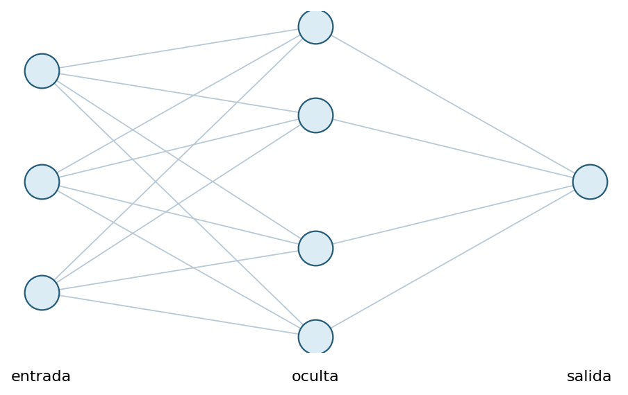

# Capítulo 15. Redes neuronales, aprendizaje profundo y visión artificial

Las redes neuronales son modelos paramétricos que aprenden representaciones mediante la composición de transformaciones simples. Su importancia no proviene de imitar con fidelidad un cerebro, sino de ofrecer una familia flexible de funciones diferenciables que puede ajustarse con datos. Cuando la composición contiene numerosas capas se habla de **aprendizaje profundo**. En visión artificial, esa profundidad permite pasar de valores de píxeles a bordes, texturas, partes y configuraciones útiles para una tarea.

La flexibilidad tiene un costo. Una red puede memorizar ejemplos, explotar señales espurias, asignar confianza excesiva o fallar ante imágenes distintas de las observadas. Por eso el capítulo estudia conjuntamente representación, optimización, evaluación y condiciones de uso. Las fórmulas se expresan sin depender de una biblioteca. Los ejemplos prácticos se conectan con un clasificador educativo de imágenes vegetales y respetan el protocolo del Apéndice D: PlantVillage, configuración `color`, un cultivo seleccionado, particiones agrupadas por `leaf_id`, prueba oficial reservada y abstención cuando la evidencia no permite clasificar responsablemente.

## 15.1. Fundamentos de redes neuronales

### 15.1.1. Neurona artificial

Una neurona artificial recibe un vector de características $\mathbf{x}=(x_1,\ldots,x_d)^\top$, calcula una combinación afín y aplica una función de activación:

$$
z=\mathbf{w}^\top\mathbf{x}+b=\sum_{j=1}^{d}w_jx_j+b, \qquad a=\phi(z).
$$

Los pesos $\mathbf{w}$ determinan cuánto y en qué dirección contribuye cada entrada; el sesgo $b$ desplaza la respuesta, y $a$ es la salida. La palabra “neurona” es una metáfora histórica: el objeto matemático es una unidad de cálculo parametrizada. No debe inferirse de ella equivalencia biológica.

La combinación $z$ recibe el nombre de **preactivación**. Si dos entradas tienen escalas muy diferentes, el peso numéricamente menor no es necesariamente menos importante: peso y escala actúan juntos. Por ello las entradas suelen normalizarse. En una imagen, una unidad no suele recibir inicialmente conceptos como “mancha” o “borde”; recibe números. Durante el aprendizaje, los pesos se organizan para producir respuestas útiles según el objetivo y los datos.

Geométricamente, $\mathbf{w}^\top\mathbf{x}+b=0$ define un hiperplano. El vector $\mathbf{w}$ es normal a ese hiperplano y $b$ controla su posición. La distancia con signo de un punto al plano es proporcional a $z/\|\mathbf{w}\|_2$. La activación transforma esa cantidad: puede introducir un umbral, comprimirla en un intervalo o conservar únicamente su parte positiva.

Una neurona aislada tiene capacidad limitada. Su utilidad aparece al disponer muchas unidades en paralelo y componer capas. Tampoco “descubre” por sí sola causalidad. Ajusta asociaciones que reducen una función de pérdida; si un fondo, una marca o un artefacto correlaciona con la etiqueta, puede aprenderlo aunque carezca de significado para la tarea real.

### 15.1.2. Perceptrón

El perceptrón clásico es un clasificador binario lineal. Con etiquetas $y\in\{-1,+1\}$ predice

$$
\widehat y=\operatorname{sign}(\mathbf{w}^\top\mathbf{x}+b).
$$

Ante un ejemplo mal clasificado, actualiza $\mathbf{w}\leftarrow\mathbf{w}+\eta y\mathbf{x}$ y $b\leftarrow b+\eta y$, donde $\eta>0$ es la tasa de aprendizaje. La corrección mueve el plano hacia una orientación que favorece la clase verdadera. Si los datos son linealmente separables, el teorema de convergencia del perceptrón garantiza que el procedimiento encuentra una separación en un número finito de errores, aunque no necesariamente la de mayor margen.

La condición de error puede escribirse $y(\mathbf{w}^\top\mathbf{x}+b)\leq 0$. Este producto es el margen con signo: positivo indica clasificación correcta y negativo, incorrecta. Una versión con margen deseado también actualiza ejemplos correctos pero demasiado próximos a la frontera.

El límite esencial es representacional. Problemas como XOR no pueden separarse con una sola recta en dos dimensiones. Añadir iteraciones no resuelve una incapacidad de la familia de funciones. Una capa oculta no lineal sí puede construir regiones intermedias y combinarlas. Esta distinción entre **optimización** y **capacidad** será recurrente: un modelo puede fallar porque no expresa la solución, porque no se optimiza adecuadamente o porque los datos no permiten identificarla.

El perceptrón usa una decisión discontinua y no genera por sí mismo probabilidades calibradas. Las redes modernas reemplazan el escalón durante el entrenamiento por activaciones diferenciables casi en todas partes y pérdidas que proporcionan gradientes informativos. Aun así, el perceptrón conserva valor pedagógico: muestra que aprender consiste en modificar parámetros a partir del desacuerdo entre predicción y etiqueta.

### 15.1.3. Capas de entrada, ocultas y de salida

Una **capa** agrupa unidades que procesan una misma representación. Para una capa densa $l$:

$$
\mathbf{z}^{(l)}=\mathbf{W}^{(l)}\mathbf{a}^{(l-1)}+\mathbf{b}^{(l)},
\qquad
\mathbf{a}^{(l)}=\phi^{(l)}(\mathbf{z}^{(l)}),
$$

con $\mathbf{a}^{(0)}=\mathbf{x}$. Si la capa anterior tiene $n_{l-1}$ unidades y la actual $n_l$, entonces $\mathbf{W}^{(l)}\in\mathbb{R}^{n_l\times n_{l-1}}$ y $\mathbf{b}^{(l)}\in\mathbb{R}^{n_l}$. Esta comprobación dimensional detecta muchos errores conceptuales y de implementación.

La **capa de entrada** no suele ejecutar aprendizaje: especifica la forma de los datos. Las **capas ocultas** producen representaciones intermedias. La **capa de salida** debe corresponder con la tarea. Una salida lineal es habitual en regresión; una sigmoide, en clasificación binaria o multietiqueta; y una distribución softmax de $K$ componentes, en clasificación multiclase mutuamente excluyente.



Profundidad y anchura describen aspectos distintos. La anchura es la cantidad de unidades o canales; la profundidad, la cantidad de transformaciones sucesivas. Una red profunda puede reutilizar cálculos y representar ciertas funciones de manera más eficiente que una red superficial extremadamente ancha. Sin embargo, más capas no garantizan mejor generalización: aumentan costo, dificultad de optimización y oportunidades de explotar ruido.

La representación aprendida es distribuida: un concepto no tiene por qué residir en una sola unidad. Distintos patrones de activación pueden codificar propiedades complementarias. Tampoco es correcto asignar automáticamente significado semántico a cada unidad. El significado operativo se evalúa por su efecto, estabilidad y relación con los datos, no mediante una etiqueta intuitiva elegida después de observar unos pocos casos.

### 15.1.4. Pesos y sesgos

Los parámetros entrenables de una capa densa son sus pesos y sesgos. Una red con tamaños $n_0,n_1,\ldots,n_L$ contiene, solo en capas densas,

$$
\sum_{l=1}^{L}(n_ln_{l-1}+n_l)
$$

parámetros. Contarlos permite anticipar memoria, tiempo y riesgo de sobreajuste. Aplanar una imagen de $224\times224\times3$ y conectarla con 512 unidades exigiría más de 77 millones de pesos en la primera capa; una convolución evita esa explosión mediante conectividad local y pesos compartidos.

Un peso positivo favorece una activación cuando aumenta la entrada, uno negativo la inhibe y uno nulo elimina una conexión, pero esta interpretación local depende de las activaciones y capas posteriores. Reescalar una capa y compensar la siguiente puede conservar la misma función. Por tanto, magnitud de un peso aislado no equivale siempre a importancia global.

El sesgo permite responder aunque las entradas sean cero y desplazar umbrales. Omitirlo obliga a que todas las fronteras lineales pasen por el origen. En capas seguidas de ciertas operaciones de normalización puede resultar redundante, pero esa es una decisión arquitectónica, no una regla universal.

Los parámetros se distinguen de los **hiperparámetros**. Los primeros se estiman por gradiente: matrices, sesgos y, según la arquitectura, escalas de normalización. Los segundos se eligen mediante diseño y validación: profundidad, anchura, tasa de aprendizaje, regularización o tamaño de lote. Ajustar hiperparámetros mirando la prueba transforma de hecho esa prueba en validación y produce una estimación optimista.

### 15.1.5. Funciones de activación

Sin activaciones no lineales, la composición de capas afines sigue siendo afín:

$$
\mathbf{W}^{(2)}(\mathbf{W}^{(1)}\mathbf{x}+\mathbf{b}^{(1)})+\mathbf{b}^{(2)}
=\widetilde{\mathbf{W}}\mathbf{x}+\widetilde{\mathbf{b}}.
$$

La profundidad no añadiría entonces fronteras curvas. La activación aporta no linealidad y determina propiedades del gradiente.

La sigmoide $\sigma(z)=1/(1+e^{-z})$ devuelve valores entre 0 y 1. Su derivada es $\sigma(z)(1-\sigma(z))$. Es apropiada para una probabilidad binaria de salida, pero en capas ocultas satura cuando $|z|$ es grande y su gradiente se aproxima a cero. La tangente hiperbólica, $\tanh(z)$, está centrada en cero pero también satura.

La unidad lineal rectificada, $\operatorname{ReLU}(z)=\max(0,z)$, es simple y mantiene derivada uno para $z>0$. Para $z<0$ su derivada es cero; una unidad que recibe siempre preactivaciones negativas puede quedar “muerta”. Variantes con pendiente negativa pequeña mitigan ese riesgo. Otras activaciones suaves combinan comportamiento lineal y compuertas; su conveniencia es empírica y arquitectónica.

Para clases excluyentes, softmax transforma logits $z_k$ en

$$
p_k=\frac{e^{z_k}}{\sum_{j=1}^{K}e^{z_j}}, \qquad \sum_kp_k=1.
$$

Por estabilidad numérica se resta $\max_j z_j$ antes de exponenciar, operación que no cambia el resultado. Los $p_k$ son puntuaciones normalizadas y solo deben llamarse probabilidades confiables si el protocolo y la calibración lo sustentan. Un softmax siempre reparte masa entre clases conocidas, incluso ante una entrada ajena al dominio; de ahí la necesidad de controles de semejanza y abstención.

### 15.1.6. Propagación hacia adelante

La **propagación hacia adelante** (*forward pass*) evalúa la red desde la entrada hasta la salida. Para $L$ capas, cada salida alimenta la siguiente. Al entrenar se conservan preactivaciones y activaciones necesarias para calcular derivadas; al inferir solo se requiere producir la salida, aunque algunas técnicas interpretativas guardan estados intermedios.

**Pseudocódigo de propagación**

```text
ENTRADA: lote X, parámetros {(W[l], b[l]) para l = 1,...,L}
A[0] <- X
PARA l <- 1 HASTA L:
    Z[l] <- W[l] A[l-1] + b[l]
    A[l] <- activación_l(Z[l])
DEVOLVER A[L] y, durante entrenamiento, la memoria {Z[l], A[l]}
```

La dimensión de lote suele añadirse como primer eje. Las mismas operaciones se aplican simultáneamente a varios ejemplos; no significa que unos deban influir en la predicción de otros, salvo operaciones explícitas dependientes del lote. El vector final antes de softmax se denomina **logits**. La clase predicha es normalmente $\arg\max_k z_k$, equivalente a maximizar softmax, pero el vector completo contiene información sobre competencia entre clases.

Entrenamiento e inferencia no siempre ejecutan exactamente lo mismo. Dropout se desactiva en inferencia y las capas de normalización dependientes del lote usan estadísticas acumuladas. Olvidar este cambio causa resultados variables o degradados. También debe aplicarse la misma normalización determinista de entradas definida con entrenamiento.

El costo del forward depende de arquitectura, resolución y tamaño de lote. Medir solo cantidad de parámetros no basta: una operación con pocos filtros aplicada sobre mapas grandes puede requerir muchas multiplicaciones. Latencia, memoria y rendimiento por lote son criterios distintos y deben evaluarse en el entorno de uso previsto.

### 15.1.7. Capacidad de representación

Los teoremas de aproximación universal establecen, bajo ciertas condiciones, que una red con una capa oculta suficientemente ancha puede aproximar funciones continuas en dominios compactos. No indican cuántas unidades se requieren, que el entrenamiento encuentre esa función, ni que generalice con datos finitos. Son resultados de existencia, no garantías prácticas.

La profundidad introduce una preferencia por composiciones jerárquicas. En visión, operaciones locales pueden formar bordes; los bordes, motivos; y los motivos, estructuras de mayor escala. Esa descripción es útil, aunque no todas las redes siguen una jerarquía semántica limpia. Las representaciones dependen del objetivo, la arquitectura y los sesgos del conjunto.

Capacidad insuficiente produce **subajuste**: pérdidas altas tanto en entrenamiento como en validación. Capacidad excesiva facilita reducir mucho el error de entrenamiento y puede producir **sobreajuste**. Sin embargo, el número de parámetros no determina por sí solo la generalización de redes modernas. Optimización, regularización implícita, aumento y estructura de datos también importan.

Debe distinguirse memorizar de aprender invariancias pertinentes. Si todas las imágenes de una clase comparten un fondo particular, una red de alta capacidad puede lograr excelentes métricas internas usando el fondo. Una prueba construida con la misma procedencia no revelará el problema. Auditorías, particiones por unidad independiente, galerías de errores y validación externa son complementos indispensables.

Un buen diseño introduce **sesgos inductivos** compatibles con el problema. Las convoluciones presuponen localidad y reutilización espacial; el aumento expresa transformaciones que deberían conservar etiqueta; la transferencia aporta representaciones aprendidas en otra colección. Ningún sesgo es universalmente correcto. Por ejemplo, un cambio fuerte de color no es inocuo si la coloración forma parte de la señal visual.

### 15.1.8. Ejemplo práctico guiado: construcción de una red neuronal mínima

Considérese un problema didáctico bidimensional con dos clases y una frontera no lineal. El propósito no es obtener un producto, sino relacionar geometría, activaciones y entrenamiento. Se generan puntos con semilla registrada, se reservan conjuntos antes de ajustar y se estandarizan ambas coordenadas usando solo entrenamiento. Una red mínima puede tener dos entradas, una capa oculta pequeña con ReLU y dos logits de salida.

Antes de entrenar se visualizan datos y se prueba una frontera lineal. Si el patrón exige combinar varias regiones, el error persistente del modelo lineal ilustra su sesgo, no un fallo de iteraciones. Luego se inicializa la red y se evalúa una cuadrícula. Cada punto de la cuadrícula atraviesa el forward; el color representa la clase o probabilidad resultante.

El experimento debe variar un único factor por vez: número de unidades, activación o tasa. Una red demasiado estrecha puede generar una frontera rígida; otra muy ancha puede crear contornos que persiguen observaciones aisladas. Con activación lineal, varias capas colapsan a una transformación lineal. Con una no lineal aparecen regiones por tramos.

**Procedimiento práctico**

```text
fijar semilla y generar datos
separar entrenamiento y validación
ajustar normalización solo con entrenamiento
inicializar una red 2 -> H -> 2
REPETIR por época:
    ejecutar forward sobre mini-lotes
    calcular entropía cruzada
    retropropagar y actualizar parámetros
    registrar pérdidas de entrenamiento y validación
seleccionar la época según validación
dibujar frontera y marcar errores
```

El informe debe incluir frontera antes y después, curvas y tres ejemplos cercanos a la decisión. No basta afirmar que “la red aprendió”: hay que explicar qué cambió y si el patrón se sostiene fuera de entrenamiento. Este ejemplo autoriza implementación por su finalidad práctica; la teoría precedente permanece independiente del lenguaje.

### Actividad EMO [VEG-01]: preparar un dataset de imágenes vegetales

**Capacidad mínima:** organizar imágenes, clases y particiones reproducibles sin contaminación.

La actividad inicia la cadena del Apéndice D. Se usa PlantVillage en configuración obligatoria `color`, con versión o fecha de descarga registrada. Cada equipo selecciona un cultivo con al menos tres clases, por ejemplo papa, manzana, maíz, uva o tomate, y mantiene ese alcance durante las actividades `VEG-01` a `VEG-04`. No se mezclan `color`, `grayscale` y `segmented`: representan derivaciones de las mismas hojas y no observaciones independientes.

La unidad física relevante es la hoja, identificada por `leaf_id`. Se conserva intacta la prueba oficial. A partir del entrenamiento oficial se crean entrenamiento y validación agrupando por `leaf_id` y estratificando por clase en la medida compatible con ese agrupamiento. Si la versión no expone el identificador, se recupera del mapa oficial `leaf_grouping/leaf-map.json`; dividir aleatoriamente por imagen no es aceptable. Deben verificarse intersecciones vacías de identificadores entre conjuntos.

La auditoría incluye dimensiones, canales, formatos, archivos corruptos, distribución por `label`, `crop` y `disease`, número de imágenes por hoja, hashes exactos y perceptuales, y galerías por clase. `image_path` se conserva para trazabilidad, pero no entra al modelo porque su texto puede revelar carpetas o clases. Las decisiones sobre exclusión se documentan sin alterar silenciosamente la prueba.

**Evidencia individual:** notebook práctico, manifiesto de particiones con semilla y listas de `leaf_id`, tabla de imágenes y hojas por clase, galería de control y reglas de inclusión. El notebook puede contener el código necesario para realizar la actividad.

**Criterios de aprobación:** prueba oficial sin uso durante desarrollo; ausencia demostrada de fuga por hoja; transformaciones que preservan la señal; desbalance y procedencia documentados. Debe constar desde ahora que el objetivo es clasificar clases PlantVillage bajo imágenes semejantes a sus condiciones controladas. No es diagnóstico de campo, no estima severidad y no recomienda tratamiento.

## 15.2. Entrenamiento de redes profundas

### 15.2.1. Funciones de pérdida

La pérdida convierte la discrepancia entre objetivo y predicción en un escalar optimizable. Para $n$ ejemplos, el riesgo empírico regularizado suele escribirse

$$
J(\theta)=\frac{1}{n}\sum_{i=1}^{n}\ell(f_\theta(\mathbf{x}_i),y_i)+\lambda\Omega(\theta).
$$

$\ell$ mide error por ejemplo, $\Omega$ penaliza ciertas soluciones y $\theta$ reúne parámetros. Minimizar $J$ no equivale a minimizar cualquier costo real; la pérdida es una aproximación y debe corresponder al tipo de salida.

En regresión, el error cuadrático medio $\ell=(y-\widehat y)^2$ penaliza intensamente errores grandes y corresponde a una hipótesis gaussiana con varianza constante. El error absoluto es más robusto pero no diferenciable en cero, donde se usa un subgradiente. En clasificación binaria, con $p=\sigma(z)$,

$$
\ell=-[y\log p+(1-y)\log(1-p)].
$$

Para $K$ clases excluyentes, la entropía cruzada es $\ell=-\sum_k y_k\log p_k=-\log p_y$. Conviene calcularla directamente desde logits mediante una operación log-sum-exp estable, no tomar logaritmos de probabilidades redondeadas.

Una pérdida decreciente no asegura una métrica de decisión creciente. Accuracy ignora confianza y puede ocultar clases minoritarias; macro-F1 pondera clases por igual pero no es una pérdida suave habitual. Se entrena con una función diferenciable y se selecciona con métricas alineadas al uso. Los pesos de clase pueden compensar representación desigual, aunque alteran el objetivo y no crean información ausente.

Las etiquetas también pueden ser inciertas o erróneas. Una red de gran capacidad puede terminar memorizándolas. Pérdidas robustas, suavizado de etiquetas y auditoría ayudan, pero no sustituyen revisar el proceso de anotación. En el caso vegetal, una etiqueta PlantVillage define una clase del dataset, no una confirmación clínica individual.

### 15.2.2. Descenso del gradiente

El gradiente $\nabla_\theta J$ apunta hacia el crecimiento local más rápido. El descenso actualiza en dirección opuesta:

$$
\theta_{t+1}=\theta_t-\eta_t\nabla_\theta J(\theta_t),
$$

donde $\eta_t$ es la tasa de aprendizaje. La aproximación de Taylor $J(\theta+\Delta)\approx J(\theta)+\nabla J^\top\Delta$ explica por qué $\Delta=-\eta\nabla J$ reduce localmente la función para pasos pequeños.

En redes, el paisaje no es convexo. Hay puntos silla, regiones planas, simetrías y curvaturas muy distintas. No se espera hallar un mínimo global único; se busca una solución con buen desempeño de validación. Además, permutar unidades ocultas puede representar exactamente la misma función, de modo que parámetros diferentes no implican modelos funcionalmente distintos.

Una tasa demasiado alta causa oscilación o divergencia; una demasiado baja hace lento el avance y puede quedar en mesetas. Métodos con momento acumulan una media de gradientes para amortiguar ruido y avanzar por direcciones persistentes. Optimizadores adaptativos reescalan coordenadas según momentos recientes. Son herramientas de optimización, no garantías de generalización, y sus hiperparámetros deben registrarse.

Diagnósticos útiles incluyen pérdida no finita, norma del gradiente, norma de parámetros, porcentaje de activaciones nulas y sensibilidad a varias semillas. Si la pérdida aumenta de inmediato, se revisan tasa, escala de entradas, fórmula y etiquetas. Si no cambia, se comprueba que parámetros reciban gradiente y sean actualizados. Recortar gradientes puede controlar explosiones, pero si se activa constantemente quizá oculte una causa estructural.

### 15.2.3. Retropropagación

La retropropagación calcula eficientemente derivadas aplicando la regla de la cadena desde la pérdida hacia capas anteriores. No es el optimizador: produce gradientes; el optimizador decide la actualización.

Para una red densa, definamos $\boldsymbol\delta^{(l)}=\partial\ell/\partial\mathbf{z}^{(l)}$. En la última capa softmax con entropía cruzada se obtiene una simplificación central. Como

$$
\frac{\partial p_j}{\partial z_k}=p_j(\mathbb{1}[j=k]-p_k),
$$

y $\ell=-\sum_j y_j\log p_j$, entonces

$$
\frac{\partial\ell}{\partial z_k}=p_k-y_k,
\qquad \boldsymbol\delta^{(L)}=\mathbf{p}-\mathbf{y}.
$$

Para una capa oculta:

$$
\boldsymbol\delta^{(l)}=
(\mathbf{W}^{(l+1)})^\top\boldsymbol\delta^{(l+1)}
\odot \phi'(\mathbf{z}^{(l)}),
$$

donde $\odot$ es producto elemento a elemento. Por la derivada de la transformación afín,

$$
\frac{\partial\ell}{\partial\mathbf{W}^{(l)}}=
\boldsymbol\delta^{(l)}(\mathbf{a}^{(l-1)})^\top,
\quad
\frac{\partial\ell}{\partial\mathbf{b}^{(l)}}=\boldsymbol\delta^{(l)},
\quad
\frac{\partial\ell}{\partial\mathbf{a}^{(l-1)}}=(\mathbf{W}^{(l)})^\top\boldsymbol\delta^{(l)}.
$$

En un lote se suman o promedian contribuciones. Si la pérdida usa media, cambiar tamaño de lote no debería multiplicar mecánicamente la escala del gradiente.

**Pseudocódigo de retropropagación**

```text
delta[L] <- derivada de la pérdida respecto de Z[L]
PARA l <- L HASTA 1:
    grad_W[l] <- promedio_lote(delta[l] por A[l-1]^T)
    grad_b[l] <- promedio_lote(delta[l])
    SI l > 1:
        delta[l-1] <- W[l]^T delta[l] * activación'_(l-1)(Z[l-1])
DEVOLVER todos los gradientes
```

Productos repetidos por pesos y derivadas pueden desvanecer o explotar gradientes. Inicialización, activaciones, normalización y conexiones residuales buscan mejorar ese flujo. Una verificación por diferencias finitas, $(J(\theta+\epsilon)-J(\theta-\epsilon))/(2\epsilon)$, es útil en componentes pequeños, aunque costosa y sensible al valor de $\epsilon$.

### 15.2.4. Mini-batches, épocas y tasa de aprendizaje

El gradiente completo usa todos los ejemplos; el estocástico usa uno; un **mini-batch** usa un subconjunto. Si $B$ es el lote,

$$
\widehat{\nabla J}_B=\frac{1}{|B|}\sum_{i\in B}\nabla\ell_i
$$

estima el gradiente empírico. Su ruido puede ayudar a salir de regiones desfavorables y actúa como regularización implícita, mientras el cálculo vectorizado aprovecha el hardware.

Una **época** es un recorrido por el conjunto de entrenamiento, no una cantidad fija de actualizaciones: aproximadamente hay $\lceil n/|B|\rceil$ pasos. Comparar entrenamientos por épocas puede ser engañoso si cambian tamaño del dataset o lote; deben registrarse pasos y ejemplos procesados.

El lote se baraja en entrenamiento, salvo que la estructura del problema exija otro muestreo. En imágenes relacionadas, el agrupamiento de particiones evita fuga, pero los lotes pueden mezclar hojas dentro del entrenamiento. Muestreos balanceados cambian la distribución observada y deben documentarse. Validación no se aumenta ni se baraja por necesidad estadística.

La tasa puede seguir un calendario: calentamiento inicial, disminución por pasos, coseno o reducción ante meseta. El calentamiento evita cambios bruscos al inicio, especialmente con lotes grandes. Reducir la tasa permite refinar una solución, pero hacerlo muy pronto puede congelar un modelo subajustado.

Una prueba de rango, aumentando temporalmente la tasa mientras se observa la pérdida, puede sugerir escalas plausibles. No reemplaza validación. También importa la tasa efectiva al ajustar una base preentrenada: capas ya útiles suelen requerir cambios menores que una cabeza nueva.

### 15.2.5. Inicialización y normalización

Inicializar todos los pesos ocultos en cero conserva simetría: las unidades reciben iguales gradientes y siguen aprendiendo lo mismo. Se usan valores aleatorios con varianza controlada. Si una capa tiene `fan_in` entradas, inicializaciones adecuadas para activaciones rectificadas emplean una varianza del orden de $2/\text{fan\_in}$; para activaciones simétricas se considera también `fan_out`. El objetivo es mantener escalas razonables de activaciones y gradientes a través de capas.

La normalización de entrada se calcula únicamente con entrenamiento. En imágenes puede reescalar intensidades y estandarizar canales. Si se usa transferencia, se respeta el preprocesamiento esperado por la base preentrenada. Estimar medias con prueba constituye una fuga pequeña pero evitable.

La normalización por lote transforma activaciones usando media y varianza del mini-batch y luego aprende escala y desplazamiento. Durante inferencia utiliza estadísticas acumuladas. Puede acelerar la optimización, pero lotes pequeños producen estimaciones ruidosas y datos no idénticamente distribuidos pueden volver problemáticas sus estadísticas. Otras técnicas normalizan por características de cada ejemplo y no dependen del resto del lote.

Normalizar no elimina la necesidad de una tasa correcta ni garantiza calibración. Tampoco debe confundirse con regularización: aunque el ruido de estadísticas puede regularizar, su finalidad principal es acondicionar la optimización. Un fallo frecuente ocurre cuando se evalúa manteniendo el modo de entrenamiento; las predicciones pasan a depender de qué otras imágenes integran el lote.

Varias semillas permiten evaluar sensibilidad a inicialización y orden. Si pequeñas variaciones producen resultados muy dispares, informar solo la mejor ejecución oculta inestabilidad. Se reportan media, dispersión y criterio de selección cuando el costo lo permite.

### 15.2.6. Regularización y dropout

Regularizar significa introducir preferencias que reduzcan sobreajuste. La penalización $L_2$, $\lambda\|\mathbf{W}\|_2^2$, desalienta pesos grandes. Su gradiente añade $2\lambda\mathbf{W}$. La **decadencia de pesos** implementa una contracción durante la actualización; coincide con $L_2$ en descenso simple, pero no necesariamente en optimizadores adaptativos. $L_1$ favorece ceros, aunque no siempre genera modelos computacionalmente dispersos sin soporte específico.

Dropout multiplica activaciones por una máscara Bernoulli durante entrenamiento. Con probabilidad de conservación $q$:

$$
\widetilde{\mathbf a}=\frac{\mathbf m\odot\mathbf a}{q},
\qquad m_j\sim\operatorname{Bernoulli}(q).
$$

El factor $1/q$ conserva la esperanza y permite usar las activaciones sin máscara en inferencia. Dropout impide depender siempre de coadaptaciones específicas, pero una tasa alta destruye señal y ralentiza convergencia. En redes convolucionales modernas puede ser menos decisivo que aumento, decadencia y diseño arquitectónico.

También regularizan la reducción de capacidad, el aumento válido, el ruido, el suavizado de etiquetas y la detención temprana. No se aplican todos por reflejo. Un modelo que subajusta no mejora agregando más penalización. La elección se basa en la brecha entre entrenamiento y validación, estabilidad y errores.

La regularización no corrige una partición contaminada. Si imágenes de la misma hoja aparecen en entrenamiento y validación, el resultado será optimista incluso con dropout. Tampoco corrige cambio de dominio. Es una herramienta para generalizar dentro de supuestos, no una licencia para ignorar procedencia.

### 15.2.7. Early stopping

La detención temprana interrumpe el entrenamiento cuando una métrica de validación deja de mejorar. Se define de antemano una métrica, dirección, mejora mínima y **paciencia**. Se conserva el estado de la mejor época, no necesariamente el último.

```text
mejor <- infinito
espera <- 0
PARA cada época:
    entrenar una época
    evaluar pérdida de validación
    SI mejora al menos delta:
        guardar parámetros y estado
        mejor <- valor actual; espera <- 0
    EN OTRO CASO:
        espera <- espera + 1
    SI espera >= paciencia: detener
restaurar el mejor estado
```

La paciencia evita reaccionar a ruido. Una validación pequeña puede producir curvas erráticas; detenerse sobre cada fluctuación aumenta la varianza de selección. Si se prueban muchas configuraciones contra la misma validación, también se sobreajusta a ella. En ese caso se limita la búsqueda, se usan repeticiones o se dispone de una validación final adicional.

Early stopping tiene efecto regularizador porque restringe cuánto se ajustan parámetros a detalles del entrenamiento. Sin embargo, una meseta puede deberse a tasa inadecuada. Un calendario que reduzca tasa antes de detener puede distinguir falta de refinamiento de sobreajuste. La prueba oficial nunca decide la época.

### 15.2.8. Aceleración mediante GPU

Una GPU ejecuta numerosas operaciones aritméticas en paralelo, especialmente multiplicaciones de matrices y convoluciones. El beneficio crece cuando hay suficiente trabajo vectorizado. Modelos diminutos, lotes pequeños o pipelines limitados por lectura y decodificación pueden no acelerarse sustancialmente.

La memoria almacena parámetros, gradientes, estados del optimizador y activaciones. Durante entrenamiento, estas últimas suelen dominar. Reducir lote, resolución o precisión puede aliviar memoria. La precisión mixta combina formatos numéricos para aumentar rendimiento; requiere escalado de pérdida u otros controles para evitar subdesbordamiento. Resultados `NaN` exigen revisar estabilidad, no culpar automáticamente al dispositivo.

La transferencia de datos entre CPU y GPU puede ser cuello de botella. Carga paralela, almacenamiento adecuado y transformaciones eficientes ayudan. Se mide utilización y tiempo por etapa antes de optimizar. Acumular gradientes simula un lote efectivo mayor cuando la memoria es limitada, aunque las operaciones dependientes del lote pueden comportarse de otro modo.

Algunas operaciones paralelas no son deterministas. Registrar hardware, versiones, semillas y opciones mejora reproducibilidad, pero reproducibilidad bit a bit puede costar rendimiento y no siempre es posible. Reproducibilidad científica exige además datos, particiones y protocolo, no solo una semilla.

Una GPU acelera tanto un experimento válido como uno defectuoso. No corrige etiquetas, fuga, objetivos ambiguos o evaluación reiterada sobre prueba. El costo energético y material también debe reportarse de forma proporcionada: tiempo, dispositivo, número de ejecuciones y criterio para detener búsquedas.

### 15.2.9. Ejemplo práctico guiado: diagnóstico del entrenamiento

Se entrena una red pequeña sobre el subconjunto PlantVillage ya preparado, usando únicamente entrenamiento y validación. El objetivo es interpretar curvas, no elegir todavía la arquitectura más potente. Se comparan dos configuraciones que difieren en un solo factor, por ejemplo tasa de aprendizaje o fuerza de regularización, y se repiten con semillas registradas.

Cuatro patrones orientan el diagnóstico. Primero, pérdidas altas y próximas indican subajuste: revisar capacidad, tasa, representaciones o errores del pipeline. Segundo, entrenamiento mejora mientras validación empeora: sobreajuste; considerar aumento válido, regularización, menos capacidad o early stopping. Tercero, ambas pérdidas oscilan violentamente o divergen: tasa alta, entradas mal escaladas o gradientes inestables. Cuarto, pérdida casi constante: tasa baja, parámetros congelados, etiquetas incorrectas o gradiente interrumpido.

No toda separación es sobreajuste. La pérdida de entrenamiento puede incluir dropout y aumento mientras validación no, por lo que incluso puede aparecer mayor. Se comparan métricas bajo modo de evaluación y se inspeccionan ejemplos. Accuracy alta con macro-F1 baja sugiere dominio de clases frecuentes. Una pérdida que mejora sin cambio de accuracy puede estar aumentando márgenes o calibración.

El registro mínimo contiene época, paso, tasa, pérdidas, accuracy, macro-F1, tiempo, norma de gradiente y mejor época. La prueba oficial permanece cerrada. El diagnóstico escrito debe vincular evidencia y acción: “la brecha comienza después de la época 12; se restaura esa época y se ensaya regularización”, no “el modelo parece malo”.

### Actividad EMO [VEG-02]: entrenar y diagnosticar un baseline neuronal

**Capacidad mínima:** interpretar entrenamiento y aplicar controles básicos de generalización.

Sobre las particiones congeladas en `VEG-01`, se implementan dos referencias: clase mayoritaria y una red visual pequeña o representación sencilla. La primera establece una dificultad mínima; la segunda permite observar gradientes y curvas. Se registran pérdida, accuracy y macro-F1 por época, además de tasa, tiempo y mejor estado.

Cada estudiante compara al menos dos configuraciones de tasa, regularización o early stopping, manteniendo constantes arquitectura, datos, semilla inicial y presupuesto cuando sea posible. La validación decide configuración y época. La prueba oficial no se consulta. Las métricas por clase son obligatorias porque un promedio puede esconder una condición vegetal con recall bajo.

**Evidencia individual:** notebook de implementación, configuración reproducible, historial completo, curvas comparables y diagnóstico de subajuste, sobreajuste o inestabilidad con una corrección plausible. Se documenta cualquier ponderación o muestreo de clases.

**Fallo deliberado recomendado:** ejecutar una tasa claramente excesiva durante pocas iteraciones seguras, detener ante divergencia y contrastar normas y curvas. El propósito es reconocer señales, no buscar una buena puntuación. Nunca se selecciona el “mejor” resultado entre muchas semillas sin informar el proceso.

El producto sigue limitado a clases del cultivo seleccionado en imágenes semejantes a PlantVillage. La confianza de este baseline no habilita diagnóstico de campo ni severidad. El aporte es establecer una referencia y criterios de entrenamiento para juzgar la CNN posterior.

## 15.3. Imágenes digitales y redes convolucionales

### 15.3.1. Píxeles, canales y resolución

Una imagen digital muestrea una escena sobre una cuadrícula. Cada píxel contiene intensidades por canal. En RGB hay tres canales, pero sus números dependen de espacio de color, profundidad de bits y transformaciones previas. Un valor no es una propiedad absoluta del objeto: iluminación, sensor, compresión y balance de blancos intervienen.

La resolución espacial $H\times W$ determina cuántas muestras se conservan. Redimensionar reduce costo, pero puede borrar lesiones pequeñas o deformar proporciones si no se preserva la relación de aspecto. Recortar puede eliminar contexto o señal. Rellenar conserva proporciones, aunque introduce bordes artificiales. Estas decisiones son parte del modelo y deben validarse.

La cuantización representa intensidades con niveles discretos. Convertir enteros a valores reales no crea información; facilita operaciones. Compresión con pérdida introduce bloques y halos que una red puede explotar. Si clases o particiones provienen de procesos de compresión distintos, el modelo puede aprender procedencia.

Color y fondo son simultáneamente señal y posible confusor. En PlantVillage `color`, la coloración puede ser relevante para distinguir condiciones, mientras el fondo controlado limita generalización. Convertir a gris o segmentar fondo cambia la tarea; no se mezclan esas configuraciones como observaciones nuevas. Una comparación opcional debe emparejar las mismas hojas mediante `leaf_id`.

La inspección visual no se reemplaza por estadísticas. Galerías aleatorias y por clase revelan orientación, escalas, bordes, etiquetas dudosas y artefactos. A la vez, una galería pequeña no demuestra representatividad: se acompaña con distribuciones, hashes y trazabilidad.

### 15.3.2. Tensores de imágenes

Una colección de imágenes se representa como tensor. Una imagen puede usar orden $H\times W\times C$ o $C\times H\times W$; un lote añade $N$. Ningún orden es matemáticamente superior, pero mezclar convenciones provoca errores silenciosos. Deben declararse ejes y comprobarse formas en cada etapa.

Para un lote $\mathbf{X}\in\mathbb{R}^{N\times C\times H\times W}$, $X_{n,c,i,j}$ es la intensidad del ejemplo $n$, canal $c$, fila $i$ y columna $j$. Las transformaciones geométricas actúan sobre ejes espaciales; la normalización por canal actúa sobre $c$. Normalizar accidentalmente cada imagen de forma que elimine diferencias relevantes puede alterar la señal.

El almacenamiento suele usar enteros; el cálculo, punto flotante. Reescalar a $[0,1]$ y estandarizar son operaciones distintas. Si $\mu_c$ y $s_c$ se estiman en entrenamiento,

$$
X'_{n,c,i,j}=\frac{X_{n,c,i,j}-\mu_c}{s_c+\epsilon}.
$$

La misma transformación se aplica a validación, prueba e inferencia. Con una red preentrenada se usa la convención correspondiente a su preentrenamiento.

La resolución afecta memoria aproximadamente en proporción a $H W$ para activaciones de una capa, pero capas sucesivas y gradientes amplifican el efecto. Duplicar alto y ancho cuadruplica posiciones. Por eso la selección de resolución equilibra detalle, cómputo y tamaño efectivo de muestra.

### 15.3.3. Convolución y filtros

Una convolución discreta en redes suele implementarse como correlación cruzada. Para una entrada $X$ y un kernel $K$ de tamaño $r\times s$:

$$
Y_{i,j}=b+\sum_{u=0}^{r-1}\sum_{v=0}^{s-1}K_{u,v}X_{i+u,j+v}.
$$

Con varios canales de entrada, cada filtro tiene forma $C_{in}\times r\times s$ y suma sobre canales. Con $C_{out}$ filtros se producen $C_{out}$ mapas. La cantidad de parámetros es $C_{out}(C_{in}rs+1)$, independiente del alto y ancho de entrada.

Dos ideas definen la convolución: **conectividad local**, porque cada salida mira un vecindario, y **pesos compartidos**, porque el mismo filtro se aplica en todas las posiciones. Esto expresa que un patrón puede ser útil donde aparezca y reduce drásticamente parámetros. La equivariancia a traslación es aproximada: desplazar la entrada tiende a desplazar el mapa, pero bordes, stride y pooling la alteran.

Un filtro no se programa necesariamente como detector de borde; sus coeficientes se aprenden por retropropagación. Capas iniciales suelen responder a contrastes y orientaciones, pero interpretar cada kernel aislado puede ser difícil. El campo receptivo efectivo crece al apilar capas: una unidad profunda integra regiones mayores aunque cada kernel sea pequeño.

Filtros $1\times1$ combinan canales en cada posición y cambian dimensión sin mezclar vecinos espaciales. Convoluciones separables reducen cálculo descomponiendo mezcla espacial y de canales. Estas variantes conservan la idea general, pero imponen factorizaciones diferentes que pueden favorecer eficiencia.

### 15.3.4. Mapas de características

La salida de un filtro es un **mapa de características**. Cada posición indica respuesta del filtro en su campo receptivo. Tras activación y normalización, mapas sucesivos forman una representación espacial. Un canal no equivale de manera estable a un concepto; puede participar en varios patrones y su función depende de los demás.

El campo receptivo teórico puede calcularse recursivamente. Si una capa usa kernel $k_l$ y stride $s_l$, el salto entre posiciones respecto de la entrada se actualiza $j_l=j_{l-1}s_l$, y el campo $r_l=r_{l-1}+(k_l-1)j_{l-1}$. Esto ayuda a saber si una salida puede integrar una lesión completa o solo textura local. El campo efectivo observado suele concentrarse en una parte del teórico.

Visualizar mapas puede detectar canales inactivos o respuestas a bordes del fondo, pero seleccionar solo ejemplos convincentes produce una narrativa sesgada. Se usan conjuntos predefinidos, capas y escalas comparables. Las activaciones grandes no prueban causalidad: para ello se estudian perturbaciones, gradientes y desempeño bajo controles.

Reducir resolución mientras aumentan canales es un patrón frecuente. Las primeras capas preservan ubicación fina; las profundas resumen semántica. Para clasificación, una agregación espacial global puede convertir cada canal en un valor y alimentar la salida, reduciendo parámetros frente a aplanar todo.

### 15.3.5. Padding y stride

El **padding** añade posiciones alrededor de la entrada. Sin relleno, una convolución válida reduce dimensiones. Con tamaño de entrada $H$, padding total simétrico $P$ por lado, kernel $K$, dilatación $D$ y stride $S$, la salida es


$$
H_{out}=\left\lfloor\frac{H+2P-D(K-1)-1}{S}\right\rfloor+1.
$$

La misma fórmula se aplica al ancho. Un padding “same” con stride uno suele conservar dimensión para kernels impares. El relleno con ceros crea un contexto artificial; reflexión u otras alternativas cambian el supuesto. Los píxeles cercanos al borde reciben un tratamiento distinto y pueden aparecer artefactos.

El **stride** es el salto del kernel. Un stride mayor que uno reduce resolución y cómputo, pero submuestrea. Patrones pequeños pueden desaparecer o cambiar ante desplazamientos mínimos. Una operación suavizante antes de submuestrear puede reducir aliasing. Pooling y convolución con stride son dos formas de reducir mapas, con propiedades distintas.

La dilatación separa elementos del kernel para ampliar campo receptivo sin aumentar tanto parámetros. Puede dejar patrones de muestreo en rejilla. Ninguna combinación debe elegirse solo porque produce formas convenientes: se considera tamaño de señal, invariancia deseada y costo.

Comprobar dimensiones a mano para una arquitectura pequeña evita errores. También permite identificar cuándo la red comprime demasiado pronto. Si una característica relevante ocupa pocos píxeles, varias reducciones sucesivas pueden eliminarla antes de que capas profundas la representen.

### 15.3.6. Pooling

Pooling resume un vecindario por canal. Max pooling conserva el máximo; average pooling, la media. Con ventana $2\times2$ y stride 2 reduce aproximadamente a la mitad cada dimensión. No añade pesos y aporta cierta robustez a desplazamientos locales, pero pierde ubicación precisa.

En retropropagación, max pooling dirige el gradiente a la posición que produjo el máximo; average pooling lo reparte. Empates requieren una convención. La selección del máximo puede amplificar activaciones espurias y ser sensible al ruido; la media puede diluir señales pequeñas. El comportamiento apropiado depende de la tarea.

La invariancia no es gratuita. Clasificación suele tolerar parte de la ubicación, mientras segmentación necesita detalle espacial. Arquitecturas densas conservan mapas o recuperan resolución mediante rutas de decodificación y conexiones desde capas tempranas. Para clasificación global, el promedio global sobre cada mapa reduce parámetros y vincula canales con evidencia distribuida.

Hoy se usan también convoluciones con stride aprendibles en lugar de pooling. No existe obligación de incluir pooling. Se compara por desempeño, estabilidad y costo. Una reducción demasiado agresiva puede explicar que el modelo confunda clases cuya diferencia está en patrones pequeños.

### 15.3.7. Arquitecturas convolucionales

Una CNN de clasificación típica repite bloques de convolución, normalización y activación, reduce gradualmente resolución, agrega espacialmente y produce logits. Las arquitecturas profundas incorporan conexiones residuales:

$$
\mathbf y=F(\mathbf x;\theta)+\mathbf x,
$$

que ofrecen una ruta directa para información y gradiente. Si cambian dimensiones, la ruta se proyecta. Estas conexiones facilitan entrenar profundidad, pero no eliminan la necesidad de datos y regularización.

Bloques con cuellos de botella y convoluciones separables buscan eficiencia. La calidad debe evaluarse junto con parámetros, operaciones, memoria y latencia real. Un modelo con menos operaciones teóricas puede ser más lento en cierto dispositivo por patrones de acceso o soporte incompleto.

La cabeza de clasificación define el número de clases del cultivo elegido. Su salida no debe incluir clases ausentes como si fueran posibles. En transferencia, la base extrae características y la cabeza nueva se inicializa para la tarea. Una CNN desde cero permite estudiar el sesgo convolucional; una preentrenada suele ser más eficiente con datos limitados.

Los fallos frecuentes incluyen reducción espacial prematura, cabeza enorme, normalización incorrecta, uso de resolución distinta entre entrenamiento e inferencia y fuga a través del pipeline. Una arquitectura más famosa no compensa un protocolo inválido. Se empieza por una red verificable, se supera la clase mayoritaria y se aumenta complejidad solo con evidencia.

### 15.3.8. Ejemplo práctico guiado: clasificación de imágenes vegetales

Se construye una CNN sencilla para el cultivo seleccionado en `VEG-01`. Las particiones y clases no cambian. Entrenamiento puede recibir aumentos previamente justificados; validación recibe solo redimensionamiento y normalización deterministas. La prueba oficial sigue reservada.

Antes de entrenar, una pasada de un lote comprueba formas, rango, etiquetas y pérdida finita. Luego se intenta sobreajustar un subconjunto diminuto. Si la CNN no logra reducir fuertemente su pérdida, hay indicios de fallo en datos, salida, gradientes o capacidad. Superar esta prueba no demuestra generalización, pero evita gastar recursos en un pipeline roto.

La arquitectura base puede usar tres bloques convolucionales, reducción gradual, promedio global y una cabeza pequeña. Se registran dimensiones y parámetros. La comparación con la red superficial usa mismos conjuntos y métricas. Se selecciona por validación y solo entonces se evalúa una vez sobre prueba.

La matriz de confusión se acompaña con precisión, recall, F1 y soporte por clase. La galería de validación incluye aciertos de alta y baja confianza, errores de alta confianza y abstenciones potenciales. Cada imagen se comenta con hipótesis comprobables: calidad, recorte, semejanza entre clases, orientación o fondo. No se afirma que una zona “causó” la predicción solo por una visualización.

El ejemplo termina con una ficha provisional: cultivo, clases, versión, preprocesamiento, particiones por `leaf_id`, métricas, errores y uso permitido. El nombre correcto del resultado es clasificador de imágenes semejantes a PlantVillage, no detector clínico de enfermedades.

### Actividad EMO [VEG-03]: construir y evaluar una CNN

**Capacidad mínima:** implementar una red convolucional y analizar su comportamiento por clase.

Cada estudiante entrena una CNN sencilla sobre el manifiesto congelado y la compara con clase mayoritaria y baseline neuronal. La arquitectura base puede compartirse, pero entrenamiento, trazabilidad y análisis son individuales. Cambiar particiones para mejorar resultados invalida la comparación.

**Evidencia individual:** notebook práctico con arquitectura y formas, número de parámetros, hiperparámetros, curvas, matriz de confusión, accuracy, macro-F1, precisión, recall y F1 por clase, más una galería comentada de aciertos y errores. Durante desarrollo la galería usa validación. La prueba oficial se abre solo tras fijar arquitectura, época, preprocesamiento y criterio de selección.

El análisis distingue confusiones entre condiciones del mismo cultivo y examina si calidad, escala, orientación o fondo se asocian con errores. También comprueba si hay hojas con varias imágenes que dominan una clase. Las explicaciones son hipótesis y deben marcarse como tales.

**Criterios de aprobación:** superar o explicar la relación con baselines; usar exclusivamente particiones establecidas; informar desempeño por clase; relacionar fallos con cobertura sin extrapolar. Un resultado alto en prueba oficial no valida fotografías de campo, ni autoriza severidad o tratamiento. El aporte es un clasificador específico y auditable dentro del dominio educativo.

## 15.4. Transferencia, evaluación y tareas avanzadas de visión

### 15.4.1. Aumento de datos

El aumento genera variantes durante entrenamiento mediante transformaciones que deberían conservar etiqueta. Expresa invariancias y expande la diversidad observada, pero no crea nueva diversidad de procedencia. Rotaciones moderadas, reflejos, recortes, cambios suaves de escala o color pueden ser plausibles; su validez depende de la tarea.

Una transformación es peligrosa si elimina la región informativa, altera color diagnóstico, introduce bordes irreales o convierte una clase en otra. La intensidad se decide observando ejemplos transformados y desempeño de validación. La composición puede ser mucho más agresiva que cada operación aislada.

Solo entrenamiento se aumenta estocásticamente. Validación y prueba usan transformaciones deterministas necesarias. Generar varias vistas de prueba y promediar es una técnica distinta, que debe fijarse antes de abrir prueba y reportar su costo. Duplicar archivos aumentados antes de dividir puede filtrar casi copias; primero se divide por unidad y luego se aumenta en línea.

El aumento no corrige el fondo controlado de PlantVillage ni simula adecuadamente un dominio de campo. Para demostrar generalización externa se necesita un conjunto externo documentado. En el laboratorio, el propósito es robustez dentro de imágenes semejantes a PlantVillage.

Se puede formular el objetivo como esperanza sobre transformaciones $T$:

$$
J(\theta)=\mathbb{E}_{(x,y)}\mathbb{E}_{T\sim\mathcal{T}}
[\ell(f_\theta(T(x)),y)].
$$

Así, la distribución $\mathcal{T}$ forma parte del modelo. Debe versionarse junto con probabilidades y rangos.

### 15.4.2. Transfer learning

La transferencia reutiliza parámetros aprendidos en una tarea fuente para una tarea objetivo. En visión, una base preentrenada en una colección amplia puede ofrecer filtros y representaciones útiles. Se reemplaza la cabeza por otra compatible con las clases objetivo y se respeta el preprocesamiento esperado.

En **extracción de características**, la base queda congelada y solo se entrena la cabeza. Reduce costo y riesgo de sobreajuste, y sirve como baseline fuerte. Congelar parámetros no siempre implica congelar estadísticas de normalización: el modo de esas capas debe decidirse explícitamente. Si se actualizan con pocos datos pueden degradar representaciones.

La transferencia funciona mejor cuando fuente y objetivo comparten regularidades, pero no garantiza neutralidad. El preentrenamiento puede incorporar sesgos, licencias y contenidos no documentados. Se registra procedencia de pesos, versión y condiciones de uso. Un mejor desempeño no borra esas obligaciones.

La semejanza visual con la fuente no sustituye validación objetivo. También puede haber **transferencia negativa**: rasgos fuente interfieren o inducen atajos. Comparar con una CNN desde cero y analizar errores permite detectarla. En PlantVillage, una base general se adapta a un cultivo seleccionado; no se atribuye conocimiento agronómico a la red por haber sido preentrenada.

### 15.4.3. Ajuste fino

El ajuste fino descongela parte o toda la base y continúa entrenamiento en el objetivo. Un procedimiento prudente entrena primero la cabeza, luego descongela bloques superiores y usa una tasa menor. Las capas iniciales suelen capturar patrones generales; las superiores, representaciones más específicas, aunque esto no es una ley absoluta.

Pueden usarse tasas discriminativas, menores en capas tempranas. Un cambio brusco con tasa alta produce **olvido catastrófico**: se destruyen características útiles antes de que la cabeza se adapte. Curvas de validación y normas de actualización ayudan a controlarlo. Al cambiar qué parámetros son entrenables, el estado del optimizador debe manejarse conscientemente.

Se comparan extracción y ajuste bajo mismos datos, aumento y presupuesto razonable. Además de métrica se consideran variabilidad, tiempo, memoria y tamaño. Una mejora mínima e inestable quizá no justifique el costo. El umbral de abstención se vuelve a estimar porque ajustar logits cambia confianza.

El ajuste fino no autoriza evaluar reiteradamente prueba. Todas las decisiones, incluido número de bloques, tasa y época, se toman con validación. Una vez fijado el pipeline se restaura el mejor estado y se ejecuta la prueba oficial una vez.

### 15.4.4. Métricas para clasificación visual

Para cada clase, verdaderos positivos $TP$, falsos positivos $FP$ y falsos negativos $FN$ definen

$$
\text{precisión}=\frac{TP}{TP+FP},\quad
\text{recall}=\frac{TP}{TP+FN},\quad
F1=\frac{2PR}{P+R}.
$$

Accuracy es la proporción total correcta. El promedio macro calcula cada métrica por clase y promedia sin ponderar; el ponderado usa soportes; el micro agrega conteos. Deben indicarse convención y soporte. En multiclase de etiqueta única, micro-F1 coincide con accuracy, por lo que no aporta una perspectiva independiente.

La matriz de confusión muestra qué clases se confunden. Normalizar por filas facilita leer recall; por columnas, composición de predicciones. Se conserva también la matriz de conteos. Intervalos por remuestreo deben respetar `leaf_id`; remuestrear imágenes como independientes subestima incertidumbre cuando hay varias vistas de una hoja.

La confianza requiere evaluar calibración. Un modelo está calibrado si, entre predicciones con confianza cercana a 0,8, aproximadamente 80% son correctas. Diagramas de confiabilidad, error de calibración y puntuación de Brier aportan evidencia, aunque dependen de binning y muestra. Escalado de temperatura ajustado en validación puede calibrar logits sin cambiar la clase máxima.

Para abstención, se estudia **cobertura** frente a riesgo. Con umbral $\tau$, se acepta si $\max_k p_k\geq\tau$. Cobertura es la fracción aceptada y riesgo, el error entre aceptadas. Un umbral se elige en validación según costo y objetivo; no se inventa ni se optimiza sobre prueba. También se revisa por clase, porque una regla global puede abstenerse desproporcionadamente en clases difíciles.

### 15.4.5. Interpretación de modelos visuales

Interpretar busca entender evidencias y fallos, no convertir una predicción en explicación causal. Mapas de saliencia usan $\partial z_k/\partial X$ para estimar sensibilidad local. Métodos basados en activaciones ponderan mapas profundos; oclusión mide cuánto cambia la salida al ocultar regiones. Cada método responde una pregunta distinta y puede ser inestable.

Una explicación plausible puede ser incorrecta. Gradientes se saturan, mapas tienen baja resolución y el postprocesamiento visual influye. Se realizan controles: aleatorizar pesos, cambiar etiqueta objetivo, comparar varios métodos, perturbar regiones destacadas y usar ejemplos negativos. Si el mapa permanece igual tras aleatorizar el modelo, quizá refleja la imagen y no el razonamiento aprendido.

Las galerías deben incluir errores de alta confianza, aciertos, baja confianza y distintas clases. En hojas de PlantVillage interesa verificar si la respuesta se concentra en tejido o fondo, pero una concentración sobre tejido no prueba que reconozca una enfermedad. El modelo puede usar color o textura correlacionados sin conocimiento clínico.

Interpretabilidad no repara sesgo ni sustituye métricas. Es una herramienta de auditoría para formular pruebas y comunicar límites. Las visualizaciones destinadas a usuarios deben evitar apariencia de precisión anatómica que el método no posee.

### 15.4.6. Introducción a detección de objetos

Clasificación asigna etiquetas a una imagen completa; detección localiza instancias mediante cajas y clases. Un detector debe resolver qué hay y dónde. Arquitecturas de una etapa predicen densamente; las de dos etapas generan propuestas y luego las refinan. Ambas combinan pérdidas de clasificación y localización.

La intersección sobre unión entre cajas $A$ y $B$ es

$$
IoU(A,B)=\frac{|A\cap B|}{|A\cup B|}.
$$

Un umbral de IoU ayuda a definir coincidencias. Precisión y recall varían con confianza; average precision resume la curva, y mAP promedia clases y, según protocolo, umbrales de IoU. Debe especificarse la convención, porque cifras con protocolos distintos no son comparables.

La supresión de no máximos elimina cajas redundantes con gran solapamiento. Puede borrar objetos próximos; otras variantes suavizan puntuaciones. Objetos pequeños, ocluidos o fuera de escala son fallos habituales. Las anotaciones de caja son más costosas y ambiguas que etiquetas de imagen.

PlantVillage no aporta cajas de lesiones como objetivo. Por tanto, las actividades VEG no pueden entrenar ni validar un detector de lesión con esas etiquetas. La detección sería una extensión con otro dataset que incluya cajas y un protocolo apropiado.

### 15.4.7. Introducción a segmentación

La segmentación semántica asigna una clase a cada píxel; la de instancias separa objetos individuales; la panóptica combina ambas perspectivas. Redes codificador-decodificador reducen resolución para contexto y la recuperan, frecuentemente mediante conexiones que conservan detalle.

Para una clase, Dice e IoU son

$$
\operatorname{Dice}=\frac{2|P\cap G|}{|P|+|G|},
\qquad
\operatorname{IoU}=\frac{|P\cap G|}{|P\cup G|}.
$$

Accuracy por píxel puede ser engañosa si domina el fondo. Se reportan métricas por clase, bordes y tamaño cuando sea pertinente. Las máscaras contienen incertidumbre de anotación; desacuerdo entre anotadores debe documentarse.

Interpolar máscaras requiere vecino más cercano para no crear clases fraccionarias. Aumentos geométricos deben transformar imagen y máscara de manera idéntica. Recortes que excluyen la clase cambian distribución y requieren manejo consciente.

La configuración `segmented` de PlantVillage muestra hojas separadas del fondo, pero no constituye una máscara supervisada de enfermedad o severidad. No permite localizar lesiones ni cuantificar área afectada. Para esas tareas se necesitan máscaras específicas y validación clínica o agronómica según el propósito.

### 15.4.8. TensorFlow, Keras y PyTorch

TensorFlow y PyTorch son marcos de cálculo tensorial y diferenciación automática; Keras ofrece una interfaz de alto nivel, habitualmente sobre un motor. Implementan grafos de operaciones, dispositivos, módulos, optimizadores y pipelines. No son métodos científicos ni garantizan un protocolo correcto.

Los conceptos se traducen entre marcos: módulo o capa, forward, cálculo automático de gradientes, actualización, modo de entrenamiento/evaluación y serialización. Las diferencias de orden de ejes, valores por defecto, reducción de pérdidas, padding e inicialización pueden producir resultados distintos. Migrar requiere comparar formas y salidas, no solo nombres.

Una ejecución reproducible registra versión del marco, controladores, hardware, pesos preentrenados, configuración, semilla, manifiesto de datos y transformaciones. Guardar solo parámetros no basta: se necesita arquitectura, mapeo de clases, normalización y regla de abstención. Para reanudar entrenamiento se conserva también optimizador y calendario.

La elección del marco depende del entorno docente, despliegue, soporte y experiencia, no de afirmaciones universales de superioridad. La teoría del capítulo permanece independiente. El código se reserva para prácticas autorizadas y debe reflejar explícitamente las decisiones metodológicas, no ocultarlas tras valores predeterminados.

### 15.4.9. Ejemplo práctico guiado: transferencia para diagnóstico de enfermedades

El título histórico de este ejemplo usa “diagnóstico”, pero su alcance metodológico se restringe: se clasifica la etiqueta PlantVillage de una imagen del cultivo seleccionado. No se realiza diagnóstico agronómico de campo, no se estima severidad y no se recomienda tratamiento.

Se elige una base preentrenada cuya licencia y preprocesamiento estén documentados. Primero se reemplaza la cabeza y se congela la base. Después de entrenar y validar esa cabeza, una segunda configuración descongela los últimos bloques con tasa menor. Ambas usan idéntico aumento solo en entrenamiento, mismo manifiesto y presupuesto registrado.

La comparación incluye macro-F1, métricas por clase, calibración, tiempo, memoria, tamaño y variabilidad entre semillas. Se ajusta calibración, si procede, únicamente con validación. Luego se construye una curva cobertura-riesgo y se elige $\tau$ para la regla:

```text
SI la imagen no satisface los controles de entrada:
    acción <- REVISAR
SI NO, obtener puntuaciones calibradas
SI confianza máxima < tau:
    acción <- REVISAR
SI NO:
    acción <- CLASIFICAR y mostrar clase PlantVillage sugerida
mostrar siempre alcance, confianza y advertencia
```

Los controles pueden marcar formato inválido, resolución insuficiente o falta evidente de semejanza, pero detectar fuera de distribución es un problema abierto; una puntuación alta no demuestra pertenencia al dominio. La interfaz muestra “Válido solo para imágenes semejantes a PlantVillage”. Los casos revisados se remiten a evaluación experta, sin sugerir tratamiento.

Una vez fijados modelo, calibración y umbral, se abre la prueba oficial una vez. Se reportan desempeño total, por clase y selectivo, incluyendo cobertura y errores aceptados. No se reajusta $\tau$ después de ver prueba. Si el ajuste fino no supera de forma estable al extractor congelado, se prefiere el modelo más simple o se declara ausencia de mejora.

### Actividad EMO [VEG-04]: aplicar transferencia y definir condiciones de uso

**Capacidad mínima:** adaptar un modelo preentrenado y decidir cuándo requiere revisión humana.

Se comparan extracción de características y ajuste fino parcial o completo sobre el mismo cultivo, clases, configuración `color` y particiones por `leaf_id`. El aumento actúa solo en entrenamiento. Cada estudiante documenta procedencia de pesos, preprocesamiento, capas entrenables, tasas, costo y estabilidad.

Con validación se evalúa calibración o, como mínimo, relación entre confianza y error. La regla de abstención se deriva de la curva cobertura-riesgo y de errores observados; no de un umbral arbitrario. Puede combinar confianza con controles de calidad. Se analiza cobertura por clase para evitar que la automatización excluya silenciosamente una condición.

**Evidencia individual:** notebook comparativo, matriz de confusión, métricas por clase, diagrama de confianza, curva cobertura-riesgo, umbral justificado y ficha del modelo. El producto devuelve cultivo configurado, clase PlantVillage sugerida, confianza, acción `clasificar/revisar` y la advertencia “Válido solo para imágenes semejantes a PlantVillage”.

La prueba oficial reservada se utiliza una vez al final. No se modifica modelo, calibración ni umbral a partir de ella. Una confianza alta no reemplaza consulta experta. Quedan expresamente fuera del uso permitido el diagnóstico de campo, la estimación de severidad, la localización de lesiones y la recomendación de tratamientos.

**Criterios de aprobación:** comparación controlada; aumento exclusivo de entrenamiento; abstención fundada en validación; costos y estabilidad considerados; limitaciones explícitas. Esta actividad produce un modelo candidato educativo, no una herramienta clínica o agronómica validada.

## Diseño experimental, incertidumbre y documentación

El desarrollo de una red neuronal es un experimento comparativo, no una sucesión de cambios hasta obtener una cifra atractiva. La pregunta útil adopta una forma explícita: dada una partición, un presupuesto y una métrica, ¿qué efecto tiene modificar un factor? La unidad experimental puede ser una ejecución completa con una semilla. Si al mismo tiempo cambian arquitectura, aumento, resolución y optimizador, no es posible atribuir la diferencia observada a uno de ellos.

Un protocolo comienza antes del primer entrenamiento. Especifica población objetivo, unidad independiente, variables disponibles, clases, regla de partición, preprocesamiento, baselines, métricas, presupuesto, semillas y criterio de selección. También define qué decisiones pueden cambiar con validación y cuándo se abre prueba. Este registro previo no impide explorar; separa exploración de confirmación. Durante la fase exploratoria se formulan hipótesis y se descartan fallos. La evaluación confirmatoria congela el pipeline y estima su comportamiento sobre datos no usados para decidir.

La comparación debe ser justa en los factores relevantes. Dos modelos pueden recibir el mismo número de épocas y, sin embargo, presupuestos distintos si uno procesa resoluciones mayores o converge antes. Conviene reportar ejemplos procesados, tiempo, dispositivo y cantidad de actualizaciones, además de épocas. Para comparar capacidad representacional se intenta igualar el entrenamiento; para comparar soluciones operativas se permite que cada alternativa use su mejor protocolo validado, pero se incluye el costo total de búsqueda.

La variación entre semillas no es un detalle administrativo. Cambian inicialización, orden de lotes, máscaras de dropout y aumentos. Si las diferencias entre alternativas son menores que esa variación, afirmar superioridad requiere cautela. Se ejecutan varias semillas cuando sea viable y se informa distribución, no solo máximo. Elegir la mejor semilla usando validación añade otra capa de selección; si se hace, debe declararse y evaluarse el modelo resultante sin escoger de nuevo sobre prueba.

La incertidumbre de una métrica tiene varias fuentes. El conjunto de evaluación es una muestra finita; el entrenamiento es estocástico; las etiquetas pueden contener desacuerdo; y la población futura puede cambiar. Un intervalo de confianza por remuestreo aborda principalmente la primera fuente. En imágenes agrupadas, el remuestreo se realiza por unidad independiente. Para PlantVillage se remuestrean `leaf_id`, no imágenes sueltas, y se conservan juntas sus vistas. La dispersión entre entrenamientos se presenta por separado, porque mezclar ambas fuentes sin explicar el procedimiento dificulta la interpretación.

Las diferencias de métricas globales deben acompañarse con diferencias emparejadas. Si dos modelos se evalúan sobre exactamente las mismas hojas, se observa en cuáles difieren, qué clases ganan o pierden y si el cambio se concentra en unos pocos grupos. Una mejora de macro-F1 puede coexistir con reducción de recall en una clase. No hay una única ordenación correcta sin objetivos y costos definidos.

Una **ablación** elimina o sustituye un componente para estimar su aporte. Se puede comparar sin aumento frente a aumento validado, cabeza congelada frente a ajuste fino, o promedio global frente a una cabeza densa. La ablación mantiene lo demás constante y no necesita abarcar todas las combinaciones. Su función es contrastar una hipótesis. Probar numerosas variantes y publicar solo las favorables produce sesgo de selección aun cuando la prueba permanezca cerrada.

Los registros deben permitir reconstruir cada resultado. Una ejecución queda vinculada a identificador de datos y partición, configuración, versión de transformaciones, estado inicial o semilla, pesos fuente, entorno, historial, estado seleccionado y métricas. La tabla final no se completa manualmente desde recuerdos: se deriva de artefactos trazables. Los nombres de archivos no deben contener información usada accidentalmente como entrada, y los manifiestos deben conservar rutas relativas o identificadores estables.

Una ficha de modelo resume el artefacto, pero no reemplaza el informe. Debe indicar tarea, clases, procedencia y licencia de datos, arquitectura, preprocesamiento, protocolo de evaluación, métricas con incertidumbre, usos permitidos, usos excluidos, riesgos, regla de abstención y responsabilidades. También registra condiciones que invalidan la salida y procedimiento para actualizar. Si cambia el mapeo de clases, la resolución o la normalización, existe una versión distinta aunque la base conserve el mismo nombre.

La evaluación de robustez comienza con perturbaciones plausibles definidas sin mirar prueba. Se examinan cambios moderados de brillo, compresión, escala o encuadre que no deberían modificar la etiqueta. Robustez no significa invariancia a cualquier transformación: alterar de forma intensa el color puede eliminar información relevante. Los resultados se desglosan por perturbación y magnitud. Una caída permite caracterizar límites; entrenar sobre cada perturbación después de verla convierte el conjunto robusto en otra validación.

El cambio de dominio requiere evidencia independiente. Una colección interna con el mismo proceso de captura puede medir generalización entre ejemplos, no entre contextos. Para afirmar validez bajo otro sensor, fondo o población se necesita una evaluación externa diseñada para ello. El error externo puede surgir por covariables, prevalencia, nuevas clases o cambio en el significado de etiquetas. Recalibrar corrige algunas diferencias de confianza, pero no necesariamente errores de representación.

La detección fuera de distribución intenta reconocer entradas alejadas de entrenamiento mediante energía, distancias, conjuntos auxiliares o modelos especializados. Ningún puntaje ofrece una frontera universal entre conocido y desconocido. Se evalúa con tipos de cambio relevantes y se combina con controles de entrada y revisión. Una política segura no dice “el detector garantiza que la imagen pertenece”; dice qué señales activan abstención y qué cambios no fueron evaluados.

La confianza también puede estimarse con conjuntos de modelos, muestreo estocástico u otras aproximaciones, pero mayor complejidad no garantiza mejor calibración. Se compara con softmax calibrado y se mide costo. La incertidumbre **aleatoria** asociada a ambigüedad de la observación se distingue conceptualmente de la **epistémica** asociada a falta de conocimiento o cobertura; en redes prácticas ambas no siempre se separan limpiamente. La interfaz no debe presentar esa distinción con una precisión que el método no valida.

El monitoreo posterior, si existiera un despliegue autorizado, observa distribución de entradas, tasa de abstención, cobertura por clase, calidad de datos, latencia y muestras revisadas. Sin etiquetas oportunas, la deriva de entradas no demuestra caída de accuracy, pero indica necesidad de auditoría. Las etiquetas obtenidas después deben tener un proceso de revisión y no incorporarse automáticamente: las predicciones previas pueden contaminar la anotación y crear ciclos de confirmación.

Actualizar un modelo exige una evaluación de regresión. Se conserva un conjunto de casos representativos y fallos conocidos, sin usarlo indefinidamente para ajustar. La nueva versión debe compararse con la anterior sobre protocolo común, documentar mejoras y degradaciones, y mantener posibilidad de retorno. Un cambio del marco, pesos preentrenados o biblioteca de imágenes puede alterar resultados aunque el código de alto nivel parezca idéntico.

En el caso VEG, estas reglas se concretan con una frontera inequívoca. El entrenamiento oficial origina entrenamiento y validación agrupados; la prueba oficial permanece confirmatoria. La configuración es `color`; el cultivo y las clases quedan congelados; las derivaciones de una misma hoja no incrementan la muestra independiente. Las métricas internas, incluso si son elevadas y estables, respaldan solamente clasificación de imágenes semejantes a PlantVillage. Para otro dominio se diseñaría un estudio nuevo, no una frase más ambiciosa en la ficha.

## Diagnóstico sistemático de fallos

Las redes requieren una secuencia de comprobaciones. Ante un resultado inesperado conviene evitar cambios simultáneos y recorrer niveles:

1. **Datos:** abrir ejemplos y etiquetas, verificar rangos, formas, mapeo de clases, duplicados y separación por unidad.
2. **Cálculo:** comprobar salida, pérdida finita, gradientes no nulos y actualización de parámetros.
3. **Prueba mínima:** intentar memorizar un lote pequeño sin aumento ni regularización fuerte.
4. **Optimización:** observar tasa, normas, oscilaciones y sensibilidad a inicialización.
5. **Generalización:** comparar curvas, clases, subgrupos pertinentes y galerías predefinidas.
6. **Dominio:** comprobar procedencia y no extrapolar una prueba interna a condiciones externas.

Una métrica sospechosamente perfecta invita a buscar fuga: rutas con clase, duplicados, vistas de la misma unidad o transformaciones aplicadas antes de dividir. Una predicción constante invita a revisar mapeo, desbalance y gradientes. Errores de alta confianza requieren calibración y auditoría de atajos. Degradación al desplegar exige comparar preprocesamiento, modo de evaluación y dominio.

Las pruebas unitarias conceptuales incluyen identidad de formas, invariancia de etiquetas bajo aumentos, intersección vacía de grupos y reproducibilidad del manifiesto. Las pruebas de integración atraviesan desde archivo hasta salida. La revisión visual complementa, no reemplaza, controles automáticos.

## Riesgos, ética y uso responsable

Un sistema visual hereda decisiones sobre quién produjo datos, qué se etiquetó y qué quedó fuera. Desempeño promedio puede ocultar fallos sistemáticos por dispositivo, iluminación, procedencia o clase. En aplicaciones sensibles, esos fallos distribuyen costos. Deben definirse población objetivo, exclusiones, responsables y vía de revisión antes de desplegar.

La confianza matemática no es certeza epistemológica. Softmax puede ser extremo fuera de distribución. La abstención reduce automatización para limitar riesgo, pero transfiere trabajo a personas; hay que medir carga, tiempos y calidad de revisión. Una explicación visual tampoco legitima una decisión.

Privacidad y propiedad importan incluso en imágenes no humanas: metadatos pueden revelar ubicación o identidad; licencias limitan reutilización; pesos preentrenados tienen procedencia. Se minimizan datos, se conservan trazas necesarias y se documentan versiones y licencias. El costo computacional se ajusta al valor educativo y se evitan búsquedas indiscriminadas.

En el proyecto vegetal, el lenguaje es parte del control de riesgo. “Clasificación PlantVillage sugerida” describe el producto; “diagnóstico de enfermedad en campo” lo sobrestima. El dataset no aporta lote, clima, manejo, severidad ni confirmación clínica por imagen. Un resultado no debe inducir tratamiento. Para extender el uso se necesitarían datos de campo representativos, protocolo externo, participación experta y reevaluación de daños.

## Síntesis

Una red compone transformaciones afines y no lineales. El forward produce predicciones; una pérdida formaliza el objetivo; retropropagación calcula gradientes; y un optimizador actualiza parámetros en mini-batches. Inicialización, normalización, regularización, dropout y early stopping actúan sobre dificultades distintas. La GPU acelera operaciones, no la validez metodológica.

Las CNN incorporan localidad y pesos compartidos para procesar tensores de imagen. Convolución, padding, stride y pooling controlan mapas y campos receptivos. Aumento y transferencia pueden mejorar eficiencia, pero deben respetar etiquetas y dominio. Evaluar exige métricas por clase, incertidumbre, calibración, análisis de errores y comparación con baselines.

La cadena VEG concreta estos principios con un protocolo auditable: `color`, cultivo seleccionado, particiones por `leaf_id`, prueba oficial cerrada durante desarrollo, confianza validada y abstención. El resultado reconoce clases de PlantVillage bajo condiciones semejantes. Ese límite no es una nota secundaria, sino parte del modelo.

## Glosario esencial

- **Activación:** transformación, generalmente no lineal, aplicada a una preactivación.
- **Ajuste fino:** actualización de parte o toda una red preentrenada en la tarea objetivo.
- **Backpropagation:** cálculo eficiente de gradientes por regla de la cadena.
- **Calibración:** correspondencia entre confianza declarada y frecuencia empírica de acierto.
- **Canal:** componente de una imagen o mapa de características.
- **CNN:** red que emplea convoluciones y estructura espacial.
- **Cobertura:** proporción de casos que un sistema selectivo decide clasificar.
- **Convolución:** operación local con pesos compartidos aplicada sobre una cuadrícula.
- **Dropout:** enmascaramiento aleatorio de activaciones durante entrenamiento.
- **Early stopping:** selección y detención basadas en desempeño de validación.
- **Época:** recorrido completo por el conjunto de entrenamiento.
- **Forward pass:** evaluación de la red desde entrada hasta salida.
- **Gradiente:** vector de derivadas parciales de una función respecto de parámetros.
- **In-distribution:** entrada compatible con la distribución objetivo documentada.
- **Logit:** salida no normalizada anterior a sigmoide o softmax.
- **Mapa de características:** respuesta espacial de un canal aprendido.
- **Mini-batch:** subconjunto usado para estimar un gradiente y actualizar parámetros.
- **Padding:** relleno alrededor de una entrada antes de una operación espacial.
- **Pooling:** resumen local o global de activaciones.
- **Regularización:** preferencia o restricción destinada a mejorar generalización.
- **Riesgo selectivo:** error calculado entre casos aceptados por una regla de abstención.
- **Stride:** paso espacial con que se desplaza una ventana.
- **Transfer learning:** reutilización de representaciones aprendidas en otra tarea.

## Preguntas de revisión y discusión

1. ¿Por qué varias capas lineales sin activación equivalen a una sola transformación afín?
2. Derive $\partial\ell/\partial z_k=p_k-y_k$ para softmax y entropía cruzada.
3. ¿Qué diferencia existe entre incapacidad representacional, optimización deficiente y falta de información?
4. ¿Cómo afectan tasa de aprendizaje y tamaño de lote al ruido de actualización?
5. ¿Por qué inicializar todos los pesos ocultos en cero impide diversificar unidades?
6. Compare normalización, regularización y dropout: ¿qué problema principal aborda cada uno?
7. ¿Qué patrón de curvas caracteriza subajuste, sobreajuste e inestabilidad?
8. Calcule la salida espacial de una convolución para varios valores de kernel, padding y stride.
9. ¿Qué se gana y qué se pierde al reducir resolución mediante pooling?
10. ¿Por qué una CNN puede aprender el fondo aunque su objetivo nominal sea una hoja?
11. ¿En qué condiciones preferiría extracción de características frente a ajuste fino?
12. ¿Por qué accuracy puede ser insuficiente ante clases desbalanceadas?
13. Explique calibración y la diferencia entre confianza alta y certeza.
14. ¿Cómo se elige un umbral de abstención sin contaminar la prueba?
15. ¿Qué controles usaría para auditar un mapa de saliencia?
16. Distinga clasificación, detección y segmentación por salida y anotación requerida.
17. ¿Por qué `segmented` de PlantVillage no es una máscara de lesión?
18. ¿Qué fuga ocurre si imágenes de una misma hoja aparecen en conjuntos distintos?
19. ¿Por qué la configuración `color` no debe mezclarse con sus derivaciones como nuevas observaciones?
20. Formule una ficha de límites que impida presentar el clasificador como diagnóstico de campo o estimador de severidad.

## Actividad integradora de cierre

Elaborar una **auditoría de afirmaciones** del producto `VEG-01` a `VEG-04`. El equipo entrega una tabla con cada afirmación técnica, evidencia que la sostiene, conjunto usado y límite. Como mínimo debe incluir: ausencia de fuga por `leaf_id`; comparación con clase mayoritaria, red pequeña y CNN; selección sin prueba; desempeño por clase; calibración; curva cobertura-riesgo; costo; y estabilidad.

Cada integrante elige cinco errores finales y reconstruye su trayectoria: imagen y hoja, clase real, predicción, confianza antes y después de calibrar, decisión `clasificar/revisar`, explicación visual con controles y una hipótesis de fallo. Las hipótesis se agrupan en calidad, similitud entre clases, señal espuria, cobertura o incertidumbre de etiqueta. No se cambia el modelo tras observar la prueba.

El cierre consiste en una defensa oral breve. El equipo debe explicar por qué su umbral proviene de validación, qué fracción queda para revisión, qué clases concentran riesgo y qué evidencia adicional exigiría para cambiar el dominio. La pantalla final debe decir “Válido solo para imágenes semejantes a PlantVillage” y excluir diagnóstico de campo, severidad, localización de lesión y tratamiento. Se evalúa la coherencia entre afirmaciones y evidencia, no la competición por la cifra más alta.
