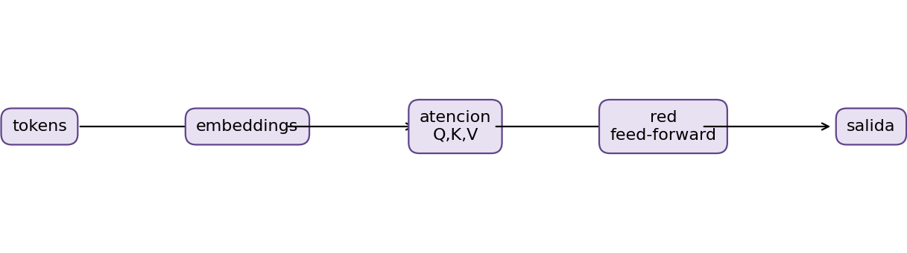

# Capítulo 16. Procesamiento del lenguaje natural y grandes modelos de lenguaje

El lenguaje es simultáneamente un sistema de signos, una práctica social y una fuente de datos. Un texto no es una tabla que simplemente espera ser analizada: su interpretación depende del contexto, de quién habla, del género discursivo, de convenciones culturales y del momento histórico. El procesamiento del lenguaje natural (PLN) estudia métodos para representar, analizar y generar lenguaje mediante sistemas computacionales. Combina lingüística, estadística, aprendizaje automático, recuperación de información e ingeniería de software.

Este capítulo presenta una progresión desde representaciones dispersas y modelos clásicos hasta embeddings contextuales, Transformers y grandes modelos de lenguaje. Esa progresión no implica que lo más reciente sea siempre lo más apropiado. Una representación TF-IDF y un clasificador lineal pueden ser más económicos, auditables y eficaces que un modelo generativo para una taxonomía estable. La elección depende de la tarea, los datos, el costo de error, la latencia y los requisitos de control.

Al terminar el capítulo, el lector podrá distinguir decisiones de preparación que conservan o eliminan información; construir representaciones Bag of Words y TF-IDF sin fuga; formular tareas de similitud, clasificación, sentimiento y extracción; interpretar atención y Transformer; explicar preentrenamiento, ajuste fino, prompting y RAG; y diseñar evaluaciones que contemplen alucinaciones, sesgos, privacidad, propiedad intelectual y supervisión humana.

**Un marco de análisis para todo el capítulo.** Un sistema de PLN puede estudiarse en cinco niveles. El nivel lingüístico pregunta qué fenómeno interesa y qué contexto hace falta para interpretarlo. El nivel estadístico define población, muestra, variable objetivo e incertidumbre. El nivel computacional concreta representación, algoritmo, recursos y latencia. El nivel operativo transforma una salida en una acción con costos y responsables. El nivel sociotécnico examina quién se beneficia, quién queda excluido y qué mecanismos de reparación existen. Confundir niveles produce afirmaciones desmedidas: una correlación léxica no es una explicación lingüística; una probabilidad del modelo no es una decisión; una demostración técnica no prueba beneficio social.

La unidad de evaluación debe coincidir con la unidad de uso. Si el sistema clasifica documentos, dividir oraciones del mismo documento entre entrenamiento y prueba produce dependencia. Si una misma persona aporta varios documentos, una partición por documento puede medir reconocimiento de estilo personal en lugar de generalización a personas nuevas. Si el uso ocurre en el futuro, una partición aleatoria mezcla épocas y oculta cambios de vocabulario, productos o políticas. Tiempo, fuente, autor y duplicados son estructuras de dependencia, no simples columnas descriptivas.

También debe distinguirse entre **constructo**, **etiqueta** y **decisión**. El constructo es el concepto de interés; la etiqueta, su operacionalización observable; la decisión, el uso de la predicción. Una etiqueta administrativa puede ser consistente sin representar el fenómeno que el nombre sugiere. El modelo aprende la etiqueta disponible, incluidos errores y convenciones históricas. Antes de atribuirle comprensión, se debe justificar por qué esa etiqueta es una aproximación válida y por qué la decisión propuesta admite sus limitaciones.

La reproducibilidad exige más que una semilla. Deben conservarse versión del corpus, reglas de exclusión, particiones, normalizador, tokenizador, vocabulario, parámetros, dependencias, artefactos y entorno. En servicios externos también se registran identificador del modelo, fecha, configuración y plantilla. La repetibilidad exacta puede no ser posible en sistemas no deterministas; en ese caso se exige estabilidad estadística y pruebas de regresión con tolerancias explícitas.

**Convenciones matemáticas.** En las fórmulas siguientes, los escalares aparecen en minúscula, los vectores en negrita y las matrices en mayúscula. $N$ denota cantidad de documentos, $T$ longitud de una secuencia, $|V|$ tamaño de vocabulario y $d$ dimensión de una representación. Estas cantidades no son intercambiables: aumentar vocabulario eleva columnas de una matriz dispersa, mientras ampliar contexto aumenta posiciones procesadas y, en atención estándar, costo cuadrático. Las probabilidades condicionadas representan el comportamiento de un modelo bajo sus datos y supuestos; no deben interpretarse automáticamente como frecuencias causales o grados de verdad.

Las fórmulas describen familias de métodos y no sustituyen decisiones de implementación. Dos bibliotecas pueden usar suavizados, normalizaciones, tratamiento de bordes o promedios diferentes bajo el mismo nombre. Por ello, un informe debe registrar definición y configuración, no solo “se aplicó TF-IDF” o “se usó atención”. También debe comprobar dimensiones: si $Q\in\mathbb{R}^{T_q\times d_k}$ y $K\in\mathbb{R}^{T_k\times d_k}$, entonces $QK^\top\in\mathbb{R}^{T_q\times T_k}$ y puede ponderar $V\in\mathbb{R}^{T_k\times d_v}$. El resultado tiene dimensión $T_q\times d_v$.

Finalmente, una igualdad matemática puede convivir con incertidumbre empírica. La fórmula de una métrica es exacta para conteos dados, pero los conteos varían con la muestra. Una arquitectura está definida algebraicamente, pero sus parámetros se estiman. El razonamiento académico debe separar propiedades del método, resultados observados y conjeturas sobre las causas de esos resultados.

## 16.1. Preparación y representación clásica de textos

La preparación convierte objetos lingüísticos en unidades analizables. Cada transformación expresa una hipótesis. Pasar a minúsculas supone que la capitalización no es decisiva; borrar signos supone que no aportan significado; eliminar palabras frecuentes supone que su valor discriminativo es bajo. Ninguna de estas decisiones es universal. Una cadena reproducible debe conservar el texto original, registrar cada transformación y aprender del conjunto de entrenamiento toda estadística dependiente de datos.

### 16.1.1. Corpus, documentos, oraciones y tokens

Un **corpus** es una colección delimitada de producciones lingüísticas reunidas con un propósito. Puede contener artículos, transcripciones, mensajes, contratos o reclamos. No es una muestra neutral del idioma: refleja un mecanismo de selección, una población, un periodo, canales de registro y criterios de exclusión. Antes de modelar deben documentarse procedencia, licencia, fecha de adquisición, idiomas, cobertura, unidad de análisis y posibles ausencias sistemáticas.

Un **documento** es la unidad que recibe una representación o una predicción. Según el problema puede ser un informe completo, un párrafo o una intervención. La **oración** es una unidad sintáctica aproximada, pero su detección computacional resulta ambigua: un punto puede cerrar una oración, abreviar un título o formar un número decimal. Un **token** es una unidad producida por un procedimiento de segmentación. Puede coincidir con una palabra, parte de palabra, signo, carácter o byte. Por ello, token y palabra no son sinónimos.

Sea el corpus $\mathcal{D}=\{d_1,\ldots,d_N\}$. Una función de tokenización $\tau$ transforma cada documento en una secuencia:

$$
\tau(d_i)=(x_{i1},x_{i2},\ldots,x_{iT_i}),
$$

donde $T_i$ es la longitud tokenizada. El vocabulario $V$ reúne los tipos distintos observados. **Tipo** designa una forma única; **ocurrencia** designa cada aparición. En “dato, datos, dato” hay tres ocurrencias y, si no se normaliza, dos tipos.

La granularidad afecta costo y generalización. Tokens de palabra son interpretables, pero sufren vocabularios grandes y formas desconocidas. Caracteres toleran variaciones ortográficas, aunque generan secuencias largas. Subpalabras equilibran ambos extremos: reutilizan fragmentos frecuentes para formar expresiones nuevas. Además, la longitud documental puede ser una señal útil o un artefacto del canal. Conviene reportar su distribución, documentos vacíos después del filtrado, idiomas, duplicados y cobertura del vocabulario.

**Fallo frecuente.** Definir el corpus como “todos los registros disponibles” oculta selección. Si solo algunas personas autorizan publicar su texto, el corpus representa ese subconjunto, no todas las interacciones de la institución. La validez externa comienza por describir esta diferencia.

### 16.1.2. Limpieza y normalización

La **limpieza** corrige o excluye elementos incompatibles con el objetivo; la **normalización** reduce variantes mediante reglas explícitas. Operaciones habituales incluyen unificar codificación Unicode, espacios y saltos de línea; normalizar mayúsculas; tratar URLs, correos y números; reparar secuencias escapadas; y detectar documentos vacíos, corruptos o duplicados. Debe mantenerse una columna inmutable con el texto original y otra derivada para modelado.

Normalizar no equivale a “quitar ruido”. La puntuación transmite límites, énfasis e intención; las mayúsculas distinguen nombres y siglas; los acentos diferencian formas; emoticonos y repetición gráfica pueden expresar afecto. “No autorizado” cambia si se elimina `no`; “US” y “us” no son equivalentes en inglés; una cifra puede ser esencial en un contrato. El tratamiento correcto depende de la tarea y del idioma, incluso cuando la teoría y el algoritmo sean independientes de una lengua particular.

La equivalencia Unicode merece atención. Un mismo grafema visible puede representarse mediante un punto de código precompuesto o una letra seguida de marca combinante. Formas como NFC o NFKC reducen inconsistencias, pero NFKC también fusiona caracteres cuya distinción tipográfica podría importar. La transliteración y la eliminación de diacríticos pueden aumentar coincidencias, a costa de ambigüedad y pérdida de identidad lingüística.

Marcadores abstractos preservan clases sin conservar valores: una URL puede reemplazarse por `<URL>` y un importe por `<MONTO>`. Esa sustitución permite aprender que cierto tipo de elemento aparece, limita el vocabulario y reduce exposición accidental. Sin embargo, no constituye anonimización completa: nombres, relatos singulares y combinaciones de atributos pueden reidentificar personas.

Las reglas deben fijarse con entrenamiento o conocimiento previo. Mirar errores de prueba para decidir qué términos borrar convierte la limpieza en selección supervisada indirecta. Una comparación válida cambia una decisión por vez, conserva las mismas particiones y mide tanto desempeño como consecuencias semánticas.

### 16.1.3. Tokenización

Tokenizar es establecer las unidades sobre las que se contarán frecuencias o se aprenderán representaciones. Una regla basada en espacios es sencilla, pero falla ante puntuación adyacente, escrituras sin espacios, contracciones, palabras compuestas, hashtags y números. Los tokenizadores lingüísticos incorporan reglas; los estadísticos aprenden un inventario de subpalabras a partir del corpus.

Entre los métodos de subpalabras se encuentran BPE, WordPiece y unigram language model. En términos generales, parten de unidades pequeñas y seleccionan fragmentos que permiten codificar el corpus con un vocabulario limitado. Una palabra infrecuente puede dividirse en segmentos conocidos. Así se evita un token desconocido único y se comparten patrones morfológicos, aunque la segmentación no necesariamente coincide con morfemas lingüísticos.

Un tokenizador define un mapeo entre texto e identificadores enteros. En modelos neuronales suele agregar símbolos de control para inicio, fin, separación, relleno o enmascaramiento. Estos símbolos tienen semántica arquitectónica. El relleno debe acompañarse de una máscara para que posiciones artificiales no intervengan en atención o pérdida.

La calidad no se evalúa solo por tamaño de vocabulario. Son relevantes la cantidad media de tokens por documento, la tasa de fragmentación por idioma o grupo, la estabilidad ante errores tipográficos y el límite de contexto. Un grupo cuyos textos requieran sistemáticamente más tokens consume más cómputo y alcanza antes la truncación. Este es un posible mecanismo de desigualdad de desempeño.

**Ejemplo conceptual.** Dos tokenizaciones de “microcrédito” podrían producir un token completo o tres subunidades. La primera es compacta si la forma fue frecuente durante el aprendizaje; la segunda generaliza componentes a vocablos nuevos. Ninguna es intrínsecamente correcta. La decisión se juzga por cobertura, eficiencia y rendimiento fuera de muestra.

### 16.1.4. Palabras vacías

Las **palabras vacías** o *stopwords* son términos muy frecuentes que algunos pipelines excluyen por considerar que aportan poca discriminación. Artículos, preposiciones y auxiliares suelen integrar listas genéricas. Su eliminación reduce dimensionalidad y puede favorecer recuperación temática, pero no es una regla lingüística universal ni un requisito de TF-IDF.

Una lista externa puede eliminar información crítica. Negaciones, modales y pronombres contribuyen a polaridad, compromiso, estilo y referencia. “Acepto” y “no acepto” se aproximarían peligrosamente si se descarta la negación. En atribución o análisis de interacción, los pronombres pueden ser centrales. En modelos contextuales, remover palabras funcionales rompe la sintaxis con la cual fueron preentrenados y normalmente no resulta conveniente.

También pueden definirse términos demasiado frecuentes en un corpus particular mediante frecuencia documental. Si $df(t)$ es el número de documentos que contienen $t$, un filtro podría excluir términos con $df(t)/N>\alpha$. Como $df$ es una estadística aprendida, el umbral se calcula solo en entrenamiento. Los términos excluidos, el criterio y la proporción de tokens removidos deben quedar registrados.

La alternativa prudente es comparar: sin eliminación; con una lista lingüística revisada; o con límites de frecuencia. La evaluación debe observar clases minoritarias, porque un término globalmente frecuente puede ser informativo para ellas. Una lista de palabras vacías es una decisión del modelo, no una etapa de higiene automática.

### 16.1.5. Stemming y lematización

El **stemming** reduce formas mediante reglas de recorte. Puede unir variantes flexivas, pero su salida no tiene que ser una palabra válida. La **lematización** busca el lema de diccionario usando análisis morfológico y, a menudo, categoría gramatical y contexto. La misma forma superficial puede requerir lemas diferentes según su función.

Ambos procedimientos intentan disminuir dispersión: si múltiples formas comparten raíz o lema, sus evidencias se acumulan. Esto puede beneficiar corpus pequeños y lenguas con morfología rica. La contrapartida es la **sobreconflación**, que fusiona términos semánticamente diferentes, y la **subconflación**, que deja separadas variantes relacionadas. Nombres propios, tecnicismos, errores y cambio de código entre idiomas complican el análisis.

Para medir su efecto se comparan tamaño de vocabulario, colisiones entre formas, ejemplos cualitativos y desempeño temporal. El ahorro dimensional no garantiza mejor predicción. N-gramas de caracteres y modelos subléxicos ofrecen otra forma de robustez morfológica. En embeddings contextuales, la tokenización en subpalabras y el contexto suelen volver innecesario un preprocesamiento morfológico explícito.

La lematización depende de recursos y convenciones lingüísticas; por eso un pipeline multilingüe debe declarar cobertura por idioma. Aplicar un lematizador equivocado puede deformar sistemáticamente un subconjunto. La regla metodológica es simple: usar stemming o lematización solo cuando una hipótesis clara y evaluación fuera de muestra justifiquen la pérdida de forma superficial.

### 16.1.6. N-gramas

Un **n-grama** es una secuencia contigua de $n$ unidades. Si las unidades son tokens, unigramas, bigramas y trigramas corresponden a $n=1,2,3$. También existen n-gramas de caracteres. Para una secuencia de longitud $T$ hay $T-n+1$ n-gramas contiguos de orden $n$.

Los unigramas ignoran orden. Los bigramas distinguen parcialmente expresiones como “sin autorización” y capturan colocaciones; órdenes mayores representan más contexto local, pero crecen combinatoriamente y se vuelven escasos. El vocabulario potencial de n-gramas de tokens es $|V|^n$, aunque solo se materializan secuencias observadas. Filtros de frecuencia mínima y máxima controlan dimensionalidad.

Los n-gramas de caracteres son robustos a variantes, prefijos, sufijos y errores de escritura. Pueden ayudar en identificación de idioma o textos breves, pero ofrecen unidades menos interpretables y también pueden memorizar identificadores. Los límites de palabra cambian su significado: incluir espacios o marcadores de frontera permite distinguir prefijos de secuencias internas.

**Fallo frecuente.** Agregar bigramas y seleccionar los que aparecen en todo el corpus filtra información del futuro. La enumeración, frecuencia documental y selección deben aprenderse únicamente en entrenamiento. Otro fallo consiste en interpretar un n-grama correlacionado como causa: un término puede reflejar una plantilla, un canal o una política temporal.

### 16.1.7. Bag of Words

**Bag of Words** (BoW) representa cada documento por conteos de vocabulario e ignora, salvo que se incluyan n-gramas, el orden global. Sea $V=\{v_1,\ldots,v_M\}$ aprendido en entrenamiento. La matriz documento-término $X\in\mathbb{R}^{N\times M}$ tiene entradas

$$
X_{ij}=c(v_j,d_i),
$$

donde $c(v_j,d_i)$ es el número de apariciones. Una variante binaria usa $X_{ij}=\mathbb{1}[c(v_j,d_i)>0]$. La matriz suele ser dispersa: cada documento contiene una fracción pequeña del vocabulario, por lo que debe almacenarse en formatos que solo registren valores no nulos.

BoW es interpretable y constituye un baseline sólido. Permite inspeccionar coeficientes de modelos lineales, funciona con pocos datos etiquetados y tiene inferencia eficiente. Sus limitaciones son polisemia, sinonimia, sensibilidad al vocabulario y pérdida de relaciones a distancia. “La entidad rechazó la operación” y “la operación rechazó la entidad” comparten conteos aunque expresen estructuras diferentes.

Los conteos favorecen documentos largos. Puede aplicarse normalización $L_1$ o $L_2$, frecuencia relativa o transformación logarítmica. Estas opciones alteran la geometría. En clasificación, la longitud puede ser predictiva, de modo que normalizarla puede eliminar una señal, quizá legítima o quizá dependiente del canal. Debe evaluarse por separado.

El vocabulario forma parte del modelo. En producción, tokens no vistos se ignoran o se canalizan mediante una estrategia prevista. Si aparecen muchos términos nuevos, la cobertura cae y puede indicar deriva. Conservar versión del vectorizador, orden de columnas y reglas de normalización es indispensable para reproducir predicciones.

### 16.1.8. TF-IDF

TF-IDF pondera un término por su frecuencia dentro del documento y su rareza en el corpus. Una definición básica es

$$
\operatorname{tfidf}(t,d)=\operatorname{tf}(t,d)\operatorname{idf}(t),
\qquad
\operatorname{idf}(t)=\log\frac{N}{df(t)}.
$$

La frecuencia local puede ser el conteo, la frecuencia relativa o $1+\log c(t,d)$ para conteos positivos. Para evitar divisiones y valores extremos se usa suavizado, por ejemplo

$$
\operatorname{idf}_{s}(t)=\log\left(\frac{1+N}{1+df(t)}\right)+1.
$$

Después suele normalizarse cada vector con norma euclídea:

$$
\hat{\mathbf{x}}_d=\frac{\mathbf{x}_d}{\|\mathbf{x}_d\|_2}.
$$

La intuición es que una repetición local aporta evidencia, mientras que un término presente en casi todos los documentos discrimina poco. TF-IDF no comprende significado: pondera distribución. Un identificador raro puede recibir gran peso sin ser semánticamente útil; por ello se combinan filtros de frecuencia, controles de privacidad y evaluación.

$N$, $df(t)$, vocabulario, límites de frecuencia y selección de atributos son parámetros aprendidos. Se estiman con entrenamiento y se aplican sin reajuste a validación, prueba y producción. Ajustar TF-IDF antes de dividir produce fuga, aun sin usar etiquetas, porque informa qué formas existen y cuán frecuentes son en periodos futuros.

TF-IDF funciona especialmente bien con clasificadores lineales y similitud coseno. No resuelve por sí solo negación, contexto ni sinónimos, aunque bigramas pueden mitigar parte del problema. Su transparencia, eficiencia y facilidad de versionado justifican mantenerlo como referencia incluso al evaluar representaciones densas.

### 16.1.9. Ejemplo práctico guiado: representación de reclamos financieros

El caso sigue el proyecto de reclamos del Apéndice D. La fuente es **CFPB Consumer Complaint Database**. La unidad es un reclamo publicado con `Consumer complaint narrative` no vacía; esas narrativas se publican con consentimiento y después de medidas de supresión de información personal. Esta selección no representa automáticamente todos los reclamos recibidos. La etiqueta es `Product`, y el propósito es sugerir enrutamiento temático, no inferir daño, mérito, fraude o urgencia.

Se congela una versión y se ordena por `Date received`. Los periodos contiguos anterior, posterior y más reciente forman entrenamiento, validación y prueba. Duplicados y plantillas quedan en un solo conjunto. `Complaint ID` sirve solo para trazabilidad. Se excluyen predictores que revelan la etiqueta o el futuro: `Product`, `Sub-product`, `Issue`, `Sub-issue`, `Company public response`, `Date sent to company`, `Company response to consumer` y `Timely response?`. También se excluyen del baseline `Company`, `ZIP code` y `Tags` por atajos, privacidad o proxies.

El objetivo de esta práctica es comparar BoW y TF-IDF con las mismas particiones y un mismo clasificador. El siguiente pseudocódigo describe el orden, no una biblioteca específica:

```text
congelar versión, mapa de Product y fechas de corte
seleccionar narrativas consentidas no vacías; conservar original protegido
agrupar duplicados; asignar cada grupo completo por regla temporal

PARA cada variante en {BoW unigramas, TF-IDF unigramas,
                       TF-IDF unigramas+bigrams}:
    ajustar normalizador, vocabulario, df y selección SOLO en entrenamiento
    transformar entrenamiento y validación sin reajustar
    entrenar el mismo clasificador lineal
    registrar dimensión, densidad, cobertura y macro-F1 de validación

elegir variante con la regla definida en REC-02
congelar pipeline; transformar prueba una vez
```

La inspección de términos debe evitar narrativas completas. Pueden presentarse n-gramas agregados y fragmentos mínimos revisados. Un término de peso alto no es una explicación causal: puede capturar una categoría, una plantilla o una práctica histórica. Si una variante con bigramas mejora validación pero empeora productos de poco soporte, la decisión debe considerar macro-F1, F1 por clase, dimensión y costo, no solo accuracy.

### Actividad EMO [REC-03]: representar textos con TF-IDF

**Capacidad mínima.** Transformar textos en atributos numéricos sin utilizar información de evaluación.

**Consigna.** Sobre el corpus CFPB fijado en REC-01 y el protocolo temporal de REC-02, construir un pipeline TF-IDF cuya única entrada predictiva obligatoria sea `Consumer complaint narrative` y cuya etiqueta sea `Product`. Comparar unigramas con unigramas más bigramas, o dos decisiones justificadas de normalización. No se exige stemming o lematización salvo hipótesis lingüística explícita.

**Implementación permitida.** El notebook práctico puede utilizar bibliotecas de preparación, vectorización y modelos. Debe hacer explícito el orden:

```text
recibir índices temporales ya congelados
ajustar cada candidato con textos de ENTRENAMIENTO
obtener X_entrenamiento = ajustar_y_transformar(textos_entrenamiento)
obtener X_validación = transformar(textos_validación)
verificar que validación no altera vocabulario ni idf
comparar candidatos con el mismo baseline o clasificador
conservar el candidato elegido sin consultar PRUEBA
```

**Controles obligatorios.** El vocabulario, $df$, pesos IDF, filtros y selección se ajustan solo en entrenamiento o dentro de cada fold de entrenamiento. No se incorporan campos posteriores a la respuesta ni texto concatenado desde ellos. Se informa fecha de congelamiento, cantidad excluida por narrativa ausente, dimensión, densidad, términos de alto peso, cobertura y palabras fuera de vocabulario. Los duplicados no cruzan particiones.

**Modalidad de trabajo.** Vocabulario y variantes se discuten en equipo; ajuste, comprobación de fuga y análisis son individuales.

**Evidencia individual.** Notebook reproducible, tabla comparativa, configuración completa y prueba automatizada o comprobación documentada de que el vectorizador nunca recibe validación o prueba durante `fit`.

**Criterios de aprobación.** La normalización se justifica; las variantes usan idénticas particiones; se interpretan ganancias y pérdidas; no se exhiben narrativas completas; y las conclusiones se limitan al subconjunto de narrativas consentidas.

**Aporte al laboratorio.** Produce la representación clásica y el baseline textual que REC-04 utilizará sin modificar el conjunto de prueba.

## 16.2. Modelado y evaluación de textos

Representar no basta: hace falta vincular la representación con una tarea y una decisión. La evaluación debe simular el uso, separar desarrollo de prueba y combinar métricas agregadas con examen responsable de errores. En texto son comunes la deriva temporal, duplicados, plantillas y diferencias por idioma, canal y longitud.

### 16.2.1. Similitud entre documentos

La similitud cuantifica proximidad bajo una representación. Para vectores no nulos $\mathbf{x}$ e $\mathbf{y}$, la similitud coseno es

$$
\cos(\mathbf{x},\mathbf{y})=
\frac{\mathbf{x}^{\top}\mathbf{y}}
{\|\mathbf{x}\|_2\|\mathbf{y}\|_2}.
$$

Mide el ángulo y reduce el efecto de magnitud. Con TF-IDF no negativo toma habitualmente valores entre cero y uno. Con embeddings centrados puede ser negativa. Distancia coseno suele definirse como $1-\cos$, pero no siempre satisface todas las propiedades métricas en cualquier implementación.

La similitud depende por completo del espacio. TF-IDF aproxima coincidencia léxica; embeddings pueden acercar paráfrasis, aunque también recuperar textos tópicamente próximos pero incompatibles. Jaccard compara conjuntos, $|A\cap B|/|A\cup B|$; distancia de edición mide operaciones sobre cadenas; modelos aprendidos pueden estimar relevancia de pares.

Recuperar los $k$ vecinos más cercanos sirve para búsqueda, apoyo a etiquetado, detección de duplicados o evidencia para RAG. Deben evaluarse precisión en $k$, exhaustividad, rango recíproco o nDCG con juicios de relevancia. Un umbral no se elige mirando ejemplos de prueba. En colecciones grandes, índices aproximados intercambian velocidad por exhaustividad y requieren medir latencia y pérdida de vecinos.

**Fallo frecuente.** Interpretar cercanía como equivalencia. Dos documentos pueden compartir vocabulario porque uno niega al otro. Antes de usar vecinos para decisión, debe definirse qué significa “similar”: mismo tema, misma intención, misma resolución o duplicado casi exacto.

La geometría permite comprender otros efectos. En dimensiones altas, muchas distancias pueden concentrarse y algunos vectores convertirse en **hubs**, vecinos de numerosos documentos sin ser relevantes para todos. La normalización, el entrenamiento del embedding y la distribución del corpus afectan ese fenómeno. Un resultado de búsqueda debe compararse con alternativas léxicas y evaluarse por tipo de consulta. Consultas con términos específicos pueden favorecer TF-IDF; paráfrasis pueden favorecer embeddings; consultas con nombres raros pueden requerir recuperación híbrida.

La similitud asimétrica también importa. Una consulta breve puede ser pertinente para un documento largo aunque representen cantidades distintas de información. Modelos bi-encoder codifican consulta y documento por separado y permiten indexación eficiente; cross-encoders procesan el par conjuntamente y suelen capturar mejor interacción, a mayor costo. Una arquitectura habitual recupera muchos candidatos con bi-encoder y reordena pocos con cross-encoder. Esta separación debe evaluarse por etapas para no atribuir al generador un fallo originado en recuperación.

### 16.2.2. Clasificación de textos

La clasificación asigna una o varias etiquetas. En multiclase, cada documento tiene una clase entre $K$; en multietiqueta puede tener varias; en clasificación jerárquica las etiquetas respetan una taxonomía. Un modelo estima puntajes $s_k(\mathbf{x})$ o probabilidades $P(Y=k\mid\mathbf{x})$ y una política transforma esos valores en acción.

Los modelos lineales son referencias fuertes para vectores dispersos. La regresión logística multiclase usa

$$
P(Y=k\mid\mathbf{x})=
\frac{\exp(\mathbf{w}_k^{\top}\mathbf{x}+b_k)}
{\sum_{j=1}^{K}\exp(\mathbf{w}_j^{\top}\mathbf{x}+b_j)}.
$$

La regularización limita coeficientes y ayuda ante alta dimensión. Máquinas de vectores de soporte optimizan márgenes y suelen rendir bien, aunque sus puntajes no son probabilidades calibradas. Naive Bayes impone independencia condicional simplificadora y ofrece un baseline económico.

Los coeficientes indican asociación controlada por el modelo, no causa. Tokens correlacionados con una clase pueden reflejar plantillas o periodos. Para explicaciones locales, contribuciones lineales son transparentes, pero no garantizan que el modelo sea justo ni que el atributo sea conceptualmente válido.

La taxonomía condiciona el máximo alcanzable. Etiquetas inconsistentes, clases superpuestas y cambios históricos generan un techo de desempeño. Conviene estimar acuerdo humano y revisar una muestra. La salida operativa puede incluir clase principal, alternativa, confianza y abstención. Una predicción no debe convertirse automáticamente en decisión cuando el caso está fuera de distribución.

### 16.2.3. Análisis de sentimiento

El análisis de sentimiento intenta identificar polaridad, emoción, postura o valoración. Estas tareas no son equivalentes. Un texto puede narrar una experiencia negativa con tono neutral, citar una opinión ajena o expresar satisfacción irónica. “Positivo/negativo” debe definirse respecto de un objeto y un esquema de anotación.

Hay enfoques léxicos, supervisados y generativos. Los léxicos suman orientaciones asociadas a palabras y reglas para negación o intensificación. Son auditables, pero sensibles al dominio. Los clasificadores aprenden patrones etiquetados; los modelos contextuales capturan composicionalidad mejor, aunque heredan sesgos y pueden fallar ante sarcasmo, citas o cambio de dominio.

La evaluación requiere clases y subgrupos, no solo promedio. Deben revisarse negación, intensificadores, lenguaje figurado, mezcla de idiomas y referencias culturales. Si las etiquetas proceden de estrellas o reacciones, son proxies y pueden no coincidir con el sentimiento textual. Inferir estado psicológico, vulnerabilidad o intención desde lenguaje puede ser inválido y riesgoso.

En el laboratorio CFPB, sentimiento no sustituye `Product` ni valida urgencia. Un relato muy negativo no prueba daño o prioridad sustantiva. Si se explora como análisis secundario, debe quedar fuera de la regla de enrutamiento obligatoria y documentarse su validez limitada.

### 16.2.4. Extracción de información

La extracción transforma texto en estructuras: entidades, atributos, relaciones, eventos o respuestas localizadas. El reconocimiento de entidades suele etiquetar cada token con esquemas como BIO: `B` inicia una entidad, `I` continúa y `O` queda fuera. La extracción de relaciones vincula entidades; la de eventos identifica desencadenante, participantes, tiempo y lugar.

La evaluación puede ser estricta, exigiendo coincidencia exacta de límites y tipo, o parcial. Precisión y sensibilidad responden preguntas diferentes: ¿cuántas extracciones son correctas? y ¿cuántas menciones reales se encontraron? En documentos largos debe distinguirse rendimiento por mención y por entidad consolidada.

Expresiones ambiguas, entidades anidadas, abreviaturas y correferencia dificultan el problema. Una fecha puede referir al evento o a una cita; el mismo nombre puede designar entidades distintas. Normalizar entidades contra un catálogo agrega otra fuente de error. La propagación importa: una entidad omitida impide relaciones posteriores.

La extracción generativa puede producir estructuras flexibles, pero requiere validación de esquema, restricción de tipos y cotejo con el texto fuente. Un campo bien formado no implica que esté respaldado. En aplicaciones sensibles se conserva el tramo de evidencia y se ofrece revisión, en lugar de tratar la salida como hecho confirmado.

### 16.2.5. Clases desbalanceadas en NLP

Existe desbalance cuando las clases tienen prevalencias muy diferentes. Un clasificador que siempre elige la mayoría puede alcanzar accuracy elevada y ser inútil para clases raras. El problema no se resuelve automáticamente ponderando: primero deben verificarse soporte, calidad de etiquetas, cobertura y significado operativo.

Estrategias comunes son pesos inversos a frecuencia, sobremuestreo, submuestreo, pérdidas focales, agrupación taxonómica justificada y ajuste de umbrales por clase. La generación sintética de texto puede introducir artefactos o filtraciones y no reemplaza ejemplos reales. Toda resampling se aplica dentro de entrenamiento, nunca antes de partir.

En multiclase, pesos extremos pueden reducir calibración o perjudicar clases intermedias. Deben compararse macro-F1, F1 por clase, matrices normalizadas y curvas de cobertura-error. Si una clase tiene muy pocos casos, una estimación puntual es inestable; intervalos por bootstrap agrupado o repetición temporal ayudan a expresar incertidumbre, respetando dependencias.

El desbalance operativo también cambia. Una clase rara durante entrenamiento puede crecer en producción. Monitorear prevalencia predicha no basta porque el modelo puede equivocarse; se necesita una muestra etiquetada con demora conocida. La política de revisión debe asignar capacidad a clases de alto costo sin presentar rareza como sinónimo de gravedad.

### 16.2.6. Métricas de clasificación

Para una clase tratada como positiva, precisión, sensibilidad y F1 son

$$
\operatorname{Precision}=\frac{TP}{TP+FP},\qquad
\operatorname{Recall}=\frac{TP}{TP+FN},
$$

$$
F_1=2\frac{\operatorname{Precision}\operatorname{Recall}}
{\operatorname{Precision}+\operatorname{Recall}}.
$$

En multiclase, **macro-F1** promedia el F1 de cada clase y da igual peso a categorías; **micro-F1** agrega conteos y queda dominado por clases frecuentes; el promedio ponderado usa soporte. Accuracy es la proporción total correcta. Todas deben acompañarse de soporte y matriz de confusión.

La matriz $C$ tiene $C_{ij}$ casos de clase real $i$ predichos como $j$. Normalizar por fila revela destinos de error de cada clase; mostrar conteos conserva escala. Top-$k$ accuracy puede ser pertinente si una persona revisa alternativas, pero no reemplaza la exactitud de la ruta principal.

Cuando se usan probabilidades, la pérdida logarítmica evalúa confianza asignada a la clase real:

$$
\mathcal{L}_{\log}=-\frac{1}{N}\sum_{i=1}^{N}\log p_{i,y_i}.
$$

Calibración pregunta si predicciones con probabilidad aproximada $p$ aciertan cerca de esa frecuencia. Diagramas de confiabilidad, Brier score y error esperado de calibración aportan perspectivas distintas. La calibración debe ajustarse en entrenamiento/validación, no en prueba.

Para abstención se reportan **cobertura**, proporción enrutada automáticamente, y **riesgo selectivo**, error entre casos enrutados. Aumentar el umbral suele reducir cobertura y riesgo, pero puede distribuir la revisión de forma desigual. La política se selecciona en validación según costos y capacidad; la prueba se abre una vez.

### 16.2.7. Evaluación cualitativa de errores

Las métricas dicen cuánto falla; el análisis cualitativo ayuda a entender cómo. Una taxonomía útil distingue ambigüedad legítima, etiqueta discutible, vocabulario nuevo, negación, documento multitemático, truncación, plantilla, texto insuficiente, idioma no cubierto y caso fuera de alcance. Cada categoría debe conducir a una acción: revisar datos, reformular taxonomía, mejorar representación o abstenerse.

La muestra de errores no debe elegirse solo por interés. Conviene seleccionar falsos positivos y negativos por clase, nivel de confianza, longitud, periodo y canal; incluir aciertos de baja y alta confianza; y registrar el denominador. Buscar únicamente ejemplos espectaculares produce una narrativa sesgada.

La revisión debe proteger privacidad. Se asignan identificadores internos, se presentan fragmentos mínimos anonimizados y se eliminan nombres, direcciones, números y combinaciones reidentificables. La anonimización automatizada no basta: una persona revisa cada ejemplo antes de divulgarlo. Si el sentido depende de información sensible, puede describirse el patrón sin citar texto.

Los errores revelan límites del rótulo. Si personas expertas discrepan, mejorar el algoritmo quizá no resuelva el problema. Debe separarse error del modelo, error de referencia y ambigüedad. Documentar estas proporciones evita atribuir toda discrepancia a incapacidad predictiva.

**Del desempeño a la decisión.** Un clasificador se evalúa en al menos tres planos. La capacidad discriminativa indica si ordena o separa clases; la calibración indica si sus puntajes permiten interpretar riesgo; la utilidad mide consecuencias bajo una política. Dos modelos con macro-F1 semejante pueden producir cargas de revisión muy distintas. A su vez, un modelo bien calibrado puede ser inaceptable si la taxonomía perjudica a un grupo o si el error más costoso queda oculto por el promedio.

Sea $a\in\{\text{enrutar},\text{revisar}\}$ una acción y $C(a,y,\hat y)$ su costo. La política ideal minimiza costo esperado condicionado por información disponible:

$$
a^*(\mathbf{x})=\arg\min_a\sum_y C(a,y,\hat y)P(y\mid\mathbf{x}).
$$

Esta expresión aclara que el umbral no es propiedad natural del modelo. Depende de costos, capacidad y probabilidades suficientemente calibradas. Los costos pueden ser difíciles de monetizar; aun así pueden ordenarse, establecer restricciones o analizar escenarios. No corresponde inventar una cifra precisa para producir apariencia de objetividad.

La incertidumbre tiene fuentes distintas. La **aleatoria** procede de ambigüedad inherente; la **epistémica**, de datos o conocimiento insuficientes; la **distributiva**, de diferencias entre entrenamiento y uso. Un margen bajo puede revelar ambigüedad, pero un modelo puede estar muy seguro fuera de distribución. Detectores de idioma, distancia a entrenamiento, reglas de alcance y monitoreo complementan el umbral. Ninguno es infalible.

La evaluación de subgrupos requiere denominadores suficientes y categorías justificadas. Buscar muchas diferencias sin control genera hallazgos espurios; agrupar de más oculta heterogeneidad. Deben predefinirse cortes pertinentes, mostrar intervalos y evitar conclusiones sobre grupos con soporte mínimo. Cuando se comparan periodos, es útil descomponer cambios en prevalencia, vocabulario, relación entre texto y etiqueta, y calidad de anotación.

Finalmente, la prueba es un instrumento de confirmación, no una reserva inagotable. Si los resultados de prueba impulsan cambios y se vuelve a medir en la misma prueba, esta pasa de hecho a ser validación. Hace falta una nueva cohorte, un periodo posterior o una evaluación prospectiva. Esta disciplina es especialmente importante en PLN, donde inspeccionar ejemplos permite adaptar reglas con rapidez y producir sobreajuste humano difícil de rastrear.

### 16.2.8. Ejemplo práctico guiado: clasificación automática de reclamos

Se reutiliza sin cambios el pipeline elegido en REC-03. El baseline mínimo predice la clase mayoritaria estimada en entrenamiento; el baseline textual y un clasificador lineal se comparan con macro-F1 principal, accuracy, F1 y soporte por producto, matriz de confusión y calibración o margen.

La decisión simulada solo tiene dos acciones: `enrutar`, cuando la confianza validada permite sugerir una cola temática, y `revisar`, cuando hay baja confianza, margen pequeño, clase fuera de alcance o alto costo de confusión. “Priorizar” significa priorizar revisión humana, no afirmar urgencia. `Timely response?` es posterior a la respuesta y no es una etiqueta válida de urgencia inicial.

```text
ajustar baseline y clasificador SOLO con entrenamiento
obtener puntajes en validación
PARA cada umbral candidato:
    calcular cobertura, error entre enrutados y revisión requerida
    calcular métricas por Product, longitud, canal y periodo
seleccionar umbral con costo y capacidad predefinidos
congelar vectorizador, clasificador, calibración y política
evaluar una vez en prueba
muestrear errores estratificados; anonimizar y revisar fragmentos
```

Un margen puede definirse como diferencia entre los dos mayores puntajes. Un margen bajo indica competencia entre rutas, no necesariamente probabilidad baja. Si se requieren probabilidades, se calibra sin tocar prueba. La salida incluye producto sugerido, segunda opción, confianza documentada, acción y advertencia de cobertura.

Un fallo posible es que el modelo aprenda menciones explícitas de productos y parezca excelente, pero degrade ante nuevas formas de redacción. Otro es que `Company` actúe como atajo. El análisis temporal y por canal ayuda a detectarlo. Ninguna explicación por término debe presentarse como motivo real del reclamo.

### Actividad EMO [REC-04]: clasificar, priorizar y analizar errores

**Capacidad mínima.** Entrenar un clasificador de texto, evaluarlo con REC-02 y convertir su incertidumbre en una regla limitada de uso.

**Consigna.** Comparar mayoría y baseline textual con al menos un clasificador lineal apropiado para TF-IDF. La entrada es solo la narrativa inicial consentida y la etiqueta es `Product`. Examinar errores por producto, longitud, canal y periodo. Seleccionar en validación un umbral o margen para `enrutar/revisar`; no ajustar nada con prueba.

**Implementación permitida.** El notebook puede entrenar, calibrar y graficar métricas:

```text
recibir representación REC-03 congelada
entrenar candidatos en ENTRENAMIENTO
seleccionar modelo y calibración con VALIDACIÓN
definir revisar si confianza < umbral O margen < mínimo
congelar política
predecir PRUEBA una única vez
exportar solo métricas agregadas e identificadores protegidos para auditoría
```

**Resultados mínimos.** Macro-F1, accuracy, precisión, sensibilidad y F1 por clase, soporte, matriz de confusión en conteos y normalizada, cobertura, tasa de error entre enrutados y carga de revisión. Si las probabilidades no están calibradas se las denomina puntajes o se usa margen.

**Análisis de errores.** Construir una muestra estratificada de falsos enrutamientos, abstenciones y aciertos. Los ejemplos deben ser fragmentos estrictamente necesarios, anonimizados y revisados; nunca narrativas completas. Distinguir ambigüedad, etiqueta posiblemente inconsistente, vocabulario nuevo, texto insuficiente y fallo del modelo.

**Restricciones.** No usar `Company public response`, `Date sent to company`, `Company response to consumer`, `Timely response?` ni otros campos posteriores. No inferir urgencia, daño, legitimidad o vulnerabilidad. El sistema sugiere ruta o revisión; no toma decisiones financieras ni genera respuesta al consumidor.

**Evidencia individual.** Notebook reproducible, comparación contra baseline, política de umbral defendida con validación, galería anonimizada de errores y recomendación de supervisión.

**Criterios de aprobación.** Se respeta REC-02, prueba tiene uso único, las métricas incluyen clases minoritarias, la regla refleja costos de enrutamiento y los límites de cobertura y consentimiento quedan explícitos.

## 16.3. Embeddings, atención y Transformers

Las representaciones densas aprenden coordenadas continuas en las que la proximidad refleja regularidades de los datos. Los embeddings contextuales permiten que una misma forma tenga vectores diferentes según su entorno. Atención y Transformer hacen posible combinar información a larga distancia y preentrenar modelos reutilizables.

### 16.3.1. Limitaciones de las representaciones dispersas

BoW y TF-IDF asignan una dimensión a cada término. Cuando $|V|$ es grande, los vectores son dispersos y dos paráfrasis sin términos comunes pueden tener similitud cero. La representación tampoco distingue sentidos de una forma ni modela fácilmente dependencias distantes. Agregar n-gramas incorpora orden local, pero multiplica dimensionalidad y escasez.

Estas limitaciones no anulan sus ventajas: escalan bien, son inspeccionables y requieren pocos datos. “Disperso” no significa inferior. En dominios donde palabras específicas definen categorías, TF-IDF puede superar modelos densos. Además, una dimensión identificable facilita depuración y cumplimiento.

Los embeddings densos comprimen información en $m\ll |V|$ dimensiones. Esta compresión comparte evidencia entre términos, pero las coordenadas individuales suelen carecer de interpretación. La cercanía aprendida depende del corpus y puede codificar asociaciones sociales indeseables. También puede borrar distinciones raras relevantes. La comparación debe usar la misma partición y tarea, e incluir costo, latencia y estabilidad.

### 16.3.2. Embeddings distribucionales

La hipótesis distribucional sostiene que unidades usadas en contextos semejantes tienden a tener significados relacionados. Un embedding asigna a cada token $w$ un vector $\mathbf{e}_w\in\mathbb{R}^{m}$. Métodos predictivos aprenden a anticipar una palabra desde contexto o contexto desde palabra; métodos basados en conteos factorizan matrices de coocurrencia transformadas.

En skip-gram, de forma simplificada, se maximiza la probabilidad de contextos $c$ cercanos a una palabra central $w$:

$$
\sum_{(w,c)}\log P(c\mid w),\qquad
P(c\mid w)=\frac{\exp(\mathbf{u}_c^\top\mathbf{v}_w)}
{\sum_{c'}\exp(\mathbf{u}_{c'}^\top\mathbf{v}_w)}.
$$

El denominador es costoso y suele aproximarse con muestreo negativo. Vectores cercanos reflejan sustituibilidad o asociación, que no siempre equivale a sinonimia: antónimos pueden compartir contextos.

Para representar documentos se pueden promediar embeddings, ponderarlos o aprender un codificador. El promedio pierde orden y diluye palabras raras. Palabras fuera del vocabulario requieren subpalabras o un símbolo desconocido. La evaluación intrínseca mediante analogías o similitud humana no garantiza utilidad en la tarea final; la evidencia principal debe ser extrínseca y por subgrupo.

### 16.3.3. Representaciones contextuales

Un embedding estático asigna un único vector a una forma. Una representación contextual calcula $\mathbf{h}_t=f(x_1,\ldots,x_T,t)$: el vector de la posición $t$ depende de toda o parte de la secuencia. Así, una forma ambigua puede ocupar regiones distintas según contexto.

El contexto disponible depende del objetivo. Un codificador bidireccional utiliza tokens a ambos lados; un modelo causal solo observa el prefijo durante predicción autoregresiva. En ambos casos se combinan embeddings de token y posición, y pueden añadirse segmentos u otros marcadores.

Para clasificación de documentos se usa un token especial, pooling medio o atención sobre posiciones. La elección influye en truncación y sensibilidad a longitud. Para similitud, no todo embedding contextual es directamente comparable con coseno: algunos modelos se entrenan específicamente para producir vectores de oración.

Las representaciones contextuales siguen limitadas por ventana, datos y tokenización. Información al final de un documento truncado desaparece; lenguaje nuevo o minoritario puede fragmentarse más; prompts pequeños pueden alterar el vector. La contextualidad reduce polisemia, no garantiza comprensión factual ni razonamiento correcto.

### 16.3.4. Modelos secuenciales

Los modelos recurrentes procesan una secuencia actualizando un estado:

$$
\mathbf{h}_t=\phi(W_x\mathbf{x}_t+W_h\mathbf{h}_{t-1}+\mathbf{b}).
$$

El estado resume el prefijo y puede alimentar clasificación o predicción del siguiente token. RNN simples sufren gradientes que se desvanecen o explotan. LSTM y GRU incorporan compuertas que regulan conservación, escritura y olvido, mejorando dependencias largas.

Los modelos bidireccionales combinan lectura hacia adelante y atrás cuando toda la secuencia está disponible. Para generación causal no pueden consultar el futuro. Arquitecturas encoder-decoder convierten una entrada en estado y generan una salida; un único estado fijo crea un cuello de botella para secuencias largas.

La recurrencia impone dependencia computacional entre pasos y limita paralelización. También comprime progresivamente información distante. Atención surgió para permitir acceso directo a estados de entrada. No obstante, modelos recurrentes siguen siendo útiles en flujos, dispositivos limitados y problemas donde el procesamiento incremental es natural.

### 16.3.5. Mecanismos de atención

La atención recupera una combinación de valores según compatibilidad entre una consulta y claves. Sean $X\in\mathbb{R}^{T\times d}$ las representaciones. Proyecciones aprendidas producen

$$
Q=XW_Q,\qquad K=XW_K,\qquad V=XW_V,
$$

con consultas y claves de dimensión $d_k$. Para la posición $i$, el puntaje con $j$ es $s_{ij}=\mathbf{q}_i^\top\mathbf{k}_j$. Si componentes tienen varianza unitaria, el producto escalar suma $d_k$ términos y su varianza crece aproximadamente con $d_k$. Dividir por $\sqrt{d_k}$ mantiene puntajes en una escala que evita saturar softmax:

$$
\alpha_{ij}=
\frac{\exp(s_{ij}/\sqrt{d_k})}
{\sum_{\ell=1}^{T}\exp(s_{i\ell}/\sqrt{d_k})}.
$$

La salida es una esperanza ponderada de valores:

$$
\mathbf{z}_i=\sum_{j=1}^{T}\alpha_{ij}\mathbf{v}_j,
$$

y en forma matricial

$$
\operatorname{Attention}(Q,K,V)=
\operatorname{softmax}\left(\frac{QK^\top}{\sqrt{d_k}}+M\right)V.
$$

$M$ vale cero en conexiones permitidas y un valor muy negativo en las prohibidas. Una máscara causal impide atender posiciones futuras; una máscara de relleno excluye tokens artificiales.

La atención multi-cabeza calcula este proceso con proyecciones distintas, concatena resultados y los proyecta. Diferentes cabezas pueden especializarse, pero los pesos no constituyen por sí solos explicaciones fieles: indican distribución interna de acceso, no causalidad ni razonamiento humano.

El costo de autoatención estándar es cuadrático en $T$ por la matriz $T\times T$. Variantes dispersas, por bloques o aproximadas buscan ampliar contexto. Más contexto tampoco garantiza usar bien evidencia lejana; deben realizarse pruebas de recuperación y posición.

### 16.3.6. Arquitectura Transformer

Un Transformer apila bloques de atención y redes feed-forward por posición. Cada bloque incluye conexiones residuales y normalización. Una forma pre-normalizada es

$$
H'=H+\operatorname{MHA}(\operatorname{LN}(H)),
$$

$$
H''=H'+\operatorname{FFN}(\operatorname{LN}(H')),
$$

donde

$$
\operatorname{FFN}(\mathbf{h})=W_2\sigma(W_1\mathbf{h}+b_1)+b_2.
$$

La atención mezcla información entre posiciones; la FFN transforma cada posición con pesos compartidos; residuales facilitan flujo de información y gradientes. Como autoatención no conoce orden por sí misma, se agregan codificaciones posicionales absolutas, relativas o rotatorias.

Hay tres familias principales. Un **encoder** usa atención bidireccional y es apropiado para comprensión y clasificación. Un **decoder** usa máscara causal y genera secuencias. Un **encoder-decoder** codifica entrada y el decoder incorpora atención cruzada hacia ella, útil en traducción o resumen condicionado.



La figura sintetiza el flujo, pero una implementación completa también gestiona tokenización, máscaras, caché de claves y valores, precisión numérica y estrategia de decodificación. Durante inferencia autoregresiva, la caché evita recalcular todo el prefijo, aunque memoria crece con contexto.

**Fallo frecuente.** Atribuir toda capacidad a atención. Datos, objetivo, escala, optimización y alineación posterior son igualmente decisivos. La arquitectura ofrece un mecanismo; no garantiza actualidad, veracidad o conducta segura.

### 16.3.7. Preentrenamiento y ajuste fino

El preentrenamiento aprende representaciones a partir de grandes colecciones mediante objetivos autosupervisados. En modelado causal se predice el siguiente token; en modelado enmascarado se reconstruyen tokens ocultos; encoder-decoders pueden reconstruir fragmentos corruptos. Los datos aportan simultáneamente entradas y objetivos, pero su origen, licencia y calidad siguen siendo relevantes.

El **ajuste fino** adapta parámetros con ejemplos de una tarea. Puede actualizar todo el modelo o emplear métodos eficientes en parámetros, como adaptadores o matrices de bajo rango. Otra opción congela el codificador y entrena una cabeza. Menos parámetros reduce costo, no elimina necesidad de validación ni riesgo de olvido catastrófico.

La adaptación por instrucciones usa pares de instrucciones y respuestas; la alineación con preferencias optimiza salidas valoradas por personas o modelos de recompensa. Estas etapas alteran comportamiento, pero no crean una base de conocimiento verificable. Una respuesta fluida puede seguir siendo falsa.

Debe separarse conjunto de preentrenamiento, adaptación y evaluación. La contaminación ocurre cuando preguntas o equivalentes aparecen en entrenamiento. En dominios temporales, una prueba posterior al corte reduce, sin eliminar, memorización. La comparación con TF-IDF debe controlar particiones y costo total.

**Qué aprende una representación.** Un objetivo autosupervisado define qué regularidades reciben recompensa. Predecir tokens favorece sintaxis, asociaciones y conocimiento repetido; contrastar pares favorece invariancia entre ejemplos considerados equivalentes. Ningún objetivo captura “semántica” de manera neutral. Las similitudes del espacio expresan datos, arquitectura, muestreo y pérdida. Cambiar positivos y negativos puede cambiar qué diferencias se conservan.

En aprendizaje contrastivo, una formulación típica acerca una pareja positiva $(i,j)$ y la distingue de candidatos $k$ mediante

$$
\mathcal{L}_i=-\log
\frac{\exp(\operatorname{sim}(\mathbf{h}_i,\mathbf{h}_j)/\tau)}
{\sum_k\exp(\operatorname{sim}(\mathbf{h}_i,\mathbf{h}_k)/\tau)}.
$$

La temperatura $\tau$ controla concentración. Los negativos falsos, textos que en realidad son semánticamente compatibles, empujan representaciones en una dirección errónea. Los positivos fáciles pueden enseñar atajos de formato. El diseño de pares es tan importante como la arquitectura.

La transferencia puede ser positiva o negativa. Es positiva cuando regularidades del preentrenamiento reducen datos necesarios; negativa cuando sesgos o dominio desajustado perjudican. La adaptación continuada a un corpus de dominio puede mejorar vocabulario, pero requiere derechos sobre datos, cómputo y pruebas de olvido. El ajuste con pocos ejemplos también puede memorizar. Curvas de aprendizaje ayudan a decidir si recolectar etiquetas, cambiar representación o corregir la tarea.

Hay varias formas de utilizar un modelo preentrenado: extracción fija de embeddings, ajuste de una cabeza, ajuste total, adaptación eficiente o prompting. No son intercambiables. Aumentan progresivamente flexibilidad y, por lo general, costo y riesgo de sobreajuste. La comparación debe incluir número de ejemplos, parámetros actualizados, energía o tiempo, memoria, latencia y variabilidad entre ejecuciones.

Las leyes empíricas de escala describen mejoras promedio al aumentar parámetros, datos o cómputo bajo ciertas condiciones. No prometen mejora monotónica en cada tarea ni resuelven calidad de datos. Duplicación excesiva puede favorecer memorización; contenido sintético puede amplificar errores; filtros pueden remover variedades lingüísticas. La gobernanza del conjunto de preentrenamiento sigue siendo central aunque el usuario final no tenga acceso a él.

### 16.3.8. Ejemplo práctico guiado: comparación de representaciones de texto

La comparación enfrenta TF-IDF con un embedding contextual para la misma tarea `Product`, sin cambiar fechas, duplicados ni métricas. El embedding se obtiene de un modelo documentado; si se ajusta, solo recibe entrenamiento. La selección de pooling, truncación, modelo y clasificador se hace con validación.

```text
congelar particiones CFPB y etiquetas usadas en REC-03
RUTA A: transformar con TF-IDF ya ajustado; entrenar clasificador lineal
RUTA B: obtener embeddings sin usar etiquetas de validación/prueba;
        entrenar la misma familia de cabeza o clasificador documentado
comparar macro-F1, clases, latencia, memoria y cobertura por longitud
revisar pares donde contexto cambia sentido y donde coincidencia léxica ayuda
```

TF-IDF puede ganar cuando nombres temáticos son explícitos. El embedding puede ayudar con paráfrasis o vocabulario variable, pero sufrir truncación o desajuste de dominio. Se analizan documentos largos y periodos recientes. No se publican narrativas: se usan fragmentos anonimizados o ejemplos sintéticos claramente rotulados.

La conclusión no debe reducirse a una cifra. Una mejora pequeña puede no justificar mayor latencia, opacidad o mantenimiento. A la inversa, mejor cobertura semántica puede ser valiosa si reduce confusiones costosas. El experimento debe declarar versión del modelo, tokenizador, longitud máxima y si los datos pudieron formar parte de su preentrenamiento.

## 16.4. Grandes modelos de lenguaje y aplicaciones generativas

Los grandes modelos de lenguaje (LLM) producen o transforman texto mediante distribuciones aprendidas a gran escala. Pueden resumir, extraer, programar, dialogar y usar herramientas, pero no son bases de datos ni autoridades epistémicas. Una aplicación responsable separa generación, evidencia, permisos, evaluación y decisión.

### 16.4.1. Grandes modelos de lenguaje

“Grande” describe escala relativa de parámetros, datos y cómputo, no una frontera científica fija. Muchos LLM son Transformers decoder-only entrenados para predecir tokens. Sus capacidades surgen de arquitectura, diversidad de datos, escala y adaptación. El modelo opera sobre tokens y produce distribuciones; la interfaz conversacional es una capa de producto.

Los parámetros almacenan regularidades distribuidas, no registros confiables con procedencia. El conocimiento puede estar desactualizado, ser contradictorio o reflejar repeticiones del corpus. El contexto de entrada permite condicionar la respuesta, pero tiene límite y puede contener instrucciones hostiles.

La selección de un LLM considera calidad por tarea, idiomas, ventana, latencia, costo, residencia de datos, licencia, soporte, posibilidad de despliegue local y controles. El número de parámetros no reemplaza evaluación. Modelos pequeños especializados pueden resultar preferibles.

Una aplicación incluye más que el modelo: plantillas, recuperación, herramientas, filtros, caché, registros, interfaz y revisión. Cada componente tiene versión y superficie de ataque. Por ello se evalúa el sistema completo y también sus partes.

### 16.4.2. Generación autoregresiva

Un modelo causal factoriza la probabilidad de una secuencia:

$$
P(x_1,\ldots,x_T)=\prod_{t=1}^{T}P(x_t\mid x_{<t}).
$$

Durante entrenamiento minimiza entropía cruzada del token real. Durante generación, transforma logits $z_i$ en probabilidades con temperatura $\tau$:

$$
P(x_t=i\mid x_{<t})=
\frac{\exp(z_i/\tau)}{\sum_j\exp(z_j/\tau)}.
$$

Temperatura baja concentra la distribución; alta aumenta diversidad. Decodificación voraz elige el máximo; beam search conserva hipótesis; top-$k$ restringe a $k$ tokens; nucleus o top-$p$ conserva el menor conjunto cuya masa supera $p$. Ninguna estrategia garantiza hechos correctos.

La generación es secuencial: una elección temprana condiciona las siguientes y puede producir cascadas de error. La probabilidad de token no es confianza factual de una afirmación. Un texto falso frecuente puede recibir alta probabilidad; uno verdadero pero raro, baja.

Longitud máxima, criterio de parada y penalizaciones cambian resultados. La reproducibilidad requiere guardar modelo, parámetros de muestreo, prompt, herramientas y, cuando exista, semilla, aunque servicios remotos pueden seguir siendo no deterministas.

### 16.4.3. Diseño de instrucciones o prompting

Un prompt eficaz explicita tarea, contexto autorizado, audiencia, formato, criterios y límites. Debe distinguir instrucciones de datos no confiables mediante delimitadores. Pedir “sé preciso” es menos verificable que exigir un esquema, citas y una salida de abstención cuando falte evidencia.

Una plantilla robusta contiene: rol funcional limitado; objetivo; fuentes permitidas; pasos de validación; formato; prohibiciones; y política ante incertidumbre. No debe incluir secretos. El texto recuperado o aportado por usuarios se trata como datos, no como instrucciones, porque puede contener *prompt injection*.

La ingeniería de prompts es desarrollo de software: se versiona y prueba con casos normales, límites y adversariales. Cambiar una palabra puede alterar comportamiento, por lo que optimizar con ejemplos de prueba sobreajusta. Se usa un conjunto de desarrollo y se reserva prueba.

Pedir razonamientos extensos no garantiza fidelidad y puede exponer información. Es preferible solicitar resultados verificables, evidencia y campos estructurados. La aplicación valida sintaxis, tipos, rangos y citas; nunca confía únicamente en que el modelo “siga” una prohibición.

### 16.4.4. Aprendizaje en contexto

El aprendizaje en contexto condiciona al modelo mediante ejemplos incluidos en la entrada, sin actualizar parámetros. **Zero-shot** presenta solo la tarea; **one-shot**, un ejemplo; **few-shot**, varios. Los ejemplos enseñan formato, categorías y fronteras, pero consumen ventana y pueden sesgar por orden.

La selección debe representar casos y contraejemplos. Etiquetas inconsistentes inducen errores. Recuperar ejemplos similares puede ayudar, aunque crea riesgo de copiar datos sensibles o resultados incorrectos. Los ejemplos se separan de la consulta y se etiquetan como demostraciones, no evidencia factual.

El desempeño puede variar con orden, redacción y nombres arbitrarios de etiquetas. Deben ensayarse permutaciones y plantillas. El modelo puede inferir patrones superficiales en vez de la regla pretendida. El aprendizaje en contexto tampoco “aprende” permanentemente: fuera del contexto no conserva la adaptación, salvo que el proveedor use datos bajo otra política.

Para tareas estables y masivas, ajuste fino o clasificador específico puede ser más económico. Para tareas cambiantes con pocos ejemplos, in-context ofrece flexibilidad. La decisión requiere comparar calidad, latencia, privacidad y mantenibilidad.

### 16.4.5. Generación aumentada con recuperación

RAG combina recuperación de documentos con generación condicionada. Su objetivo es aportar evidencia actualizable y trazable sin confiar solo en parámetros. Una cadena típica ingiere fuentes, segmenta, representa, indexa, recupera candidatos, reordena y construye un contexto para responder con citas.

Formalmente, para consulta $q$, un recuperador aproxima $P(d\mid q)$ y el generador produce $P(y\mid q,d)$. Una idealización marginaliza documentos:

$$
P(y\mid q)=\sum_{d\in\mathcal{D}}P(y\mid q,d)P(d\mid q).
$$

En práctica se usan pocos fragmentos. El fracaso puede venir de cobertura documental, segmentación, consulta, recuperación, ranking, contexto o generación. Por ello se evalúan por separado recall@k de evidencia, ranking, fidelidad de citas, completitud y corrección de respuesta.

La segmentación equilibra contexto y precisión. Fragmentos pequeños pierden dependencias; grandes introducen ruido. Se conservan metadatos, versión, fecha, permisos y enlace. Recuperación híbrida combina coincidencia léxica y embeddings. Un re-ranker mejora orden con mayor costo.

RAG no elimina alucinaciones. El modelo puede ignorar evidencia, mezclar fuentes o citar un fragmento que no respalda la afirmación. Debe abstenerse si no hay evidencia suficiente y expresar conflictos. Los documentos son entrada no confiable: una instrucción incrustada no adquiere autoridad por ser recuperada.

### 16.4.6. Integración mediante APIs y aplicaciones

Una API expone el modelo mediante solicitudes y respuestas. La integración define autenticación, cuotas, reintentos, tiempos de espera, streaming, versiones, formatos y manejo de errores. Una respuesta HTTP exitosa solo indica comunicación técnica, no calidad semántica.

Las entradas se minimizan antes de salir del perímetro. Deben conocerse retención, uso para entrenamiento, ubicación, subprocesadores y mecanismos de borrado del proveedor. Claves se almacenan en gestores de secretos, nunca en prompts, código cliente o registros. Los logs separan metadatos necesarios de contenido sensible y aplican acceso y caducidad.

Las salidas estructuradas se validan contra un esquema. Herramientas se exponen mediante listas permitidas y privilegio mínimo. El modelo propone una llamada; software determinista verifica identidad, argumentos, autorización e impacto antes de ejecutarla. Acciones irreversibles requieren confirmación humana o controles transaccionales.

La aplicación debe tolerar límites, cambios de modelo y fallos parciales. Caché puede reducir costo, pero crea problemas de datos obsoletos y separación entre usuarios. Se versionan prompt, modelo, índice y política. Pruebas de integración incluyen inyección, desbordamiento de contexto, indisponibilidad y respuesta malformada.

### 16.4.7. Alucinaciones y evaluación de respuestas

Una alucinación es contenido presentado sin respaldo suficiente en evidencia o realidad pertinente. Puede ser intrínseca, cuando contradice la fuente, o extrínseca, cuando agrega algo no verificable allí. También existen omisiones, citas incorrectas, instrucciones incumplidas y respuestas inseguras.

Evaluar texto generativo requiere una rúbrica por tarea. Dimensiones habituales son corrección, fidelidad, cobertura, relevancia, formato, seguridad, utilidad y abstención. Métricas de solapamiento sirven cuando existe referencia estable, pero penalizan paráfrasis y pueden premiar textos incorrectos. Evaluadores automáticos basados en LLM escalan, aunque tienen sesgo, variabilidad y conflictos de interés; se calibran contra evaluación humana.

Un conjunto de prueba incluye casos frecuentes, raros, ambiguos, sin respuesta, contradictorios y adversariales. Para RAG se marca evidencia necesaria. Cada afirmación verificable se vincula con una fuente y se comprueba si la cita implica realmente la afirmación. Se reportan intervalos y desacuerdo entre evaluadores.

Mitigaciones incluyen recuperación, restricciones, herramientas, verificación posterior y abstención. Ninguna reduce riesgo a cero. La interfaz debe evitar presentar generación como autoridad y permitir denunciar errores. En dominios de alto impacto, un humano competente revisa antes de actuar.

### 16.4.8. Sesgos, privacidad y propiedad intelectual

Los LLM reproducen y amplifican asociaciones de datos y decisiones de diseño. El sesgo puede manifestarse como calidad desigual, estereotipos, trato dispar o invisibilización. Se evalúa por idioma, variedad, grupo pertinente y situación, sin inferir atributos sensibles cuando no existe base legal y metodológica. Igualar una métrica no garantiza justicia contextual.

La privacidad abarca datos enviados, memorizados, inferidos y registrados. La desidentificación reduce riesgo, pero texto libre puede revelar identidad mediante narrativa. Se aplican minimización, control de acceso, cifrado, retención limitada, evaluación de impacto y procedimientos para incidentes. No se solicita al modelo que “anonimice” como única salvaguarda.

La propiedad intelectual afecta datos de entrenamiento, entradas, salidas y fuentes recuperadas. Deben respetarse licencias, atribución, límites de reproducción, secretos comerciales y políticas institucionales. Una salida nueva puede parecerse a material protegido; no debe asumirse titularidad o libertad de uso sin análisis correspondiente. RAG facilita procedencia, pero también puede reproducir fragmentos extensos.

Estos riesgos interactúan: auditar sesgo puede requerir atributos sensibles, lo cual exige controles de privacidad. La documentación debe justificar necesidad, acceso y eliminación. Las decisiones legales dependen de jurisdicción y no se sustituyen con una regla técnica general.

### 16.4.9. Documentación de limitaciones y supervisión humana

La documentación convierte supuestos en información operable. Una ficha de modelo registra propósito, población, datos, métricas, usos previstos y prohibidos, subgrupos, límites, versiones y contacto. Una ficha de sistema agrega prompts, fuentes RAG, herramientas, políticas, monitoreo e incidentes.

Supervisión humana no significa colocar una persona al final sin tiempo ni autoridad. Debe definirse qué revisa, qué evidencia recibe, cuándo puede rechazar, cómo escala y cómo se mide su carga. La automatización puede generar sesgo de confirmación; por ello la interfaz presenta incertidumbre y alternativas, no solo una respuesta destacada.

El monitoreo observa calidad, deriva, cobertura, abstención, latencia, costo, seguridad y distribución de errores. Las señales automáticas se complementan con muestras auditadas y retroalimentación. Una actualización de modelo, tokenizador, prompt o índice requiere evaluación de regresión y posibilidad de reversión.

Se mantienen trazas proporcionales: versiones y decisiones, evitando guardar contenido sensible innecesario. Un registro de incidentes describe impacto, causa, corrección y prevención. Criterios de suspensión deben existir antes del despliegue. La responsabilidad permanece en la organización, no se delega al modelo ni al proveedor.

**Ciclo de vida y defensa en profundidad.** El análisis comienza antes de adquirir un modelo. Durante diseño se determina si la tarea necesita generación o puede resolverse con búsqueda, reglas o clasificación. Se realiza una evaluación de impacto proporcional al daño posible, se consulta a personas afectadas y se definen usos prohibidos. Durante desarrollo se separan datos, se construyen baselines y se ensayan fallos. Antes del despliegue se efectúan pruebas de seguridad, privacidad, carga y recuperación. En operación se monitorea, audita y mantiene una vía de apelación. Al retirar el sistema se eliminan datos y credenciales conforme a política y se preserva solo la evidencia exigida.

La defensa en profundidad asume que cada control puede fallar. Una instrucción del sistema puede ser ignorada; un filtro puede omitir una variante; un recuperador puede traer contenido hostil; una persona puede aprobar por rutina. Por eso se combinan minimización de datos, aislamiento, permisos deterministas, validación, límites de acciones, revisión y monitoreo. Los controles críticos viven fuera del modelo. Por ejemplo, el acceso a un documento se decide con identidad y lista de permisos, no preguntando al LLM si el usuario parece autorizado.

El modelado de amenazas identifica activos, adversarios, superficies y consecuencias. Entre las amenazas están extracción de instrucciones, exfiltración de contexto, envenenamiento del índice, abuso de herramientas, denegación por entradas largas y filtración entre sesiones. También existen fallos no adversariales: configuración errónea, fuente vencida, dependencia caída o traducción defectuosa. Cada amenaza necesita prevención, detección, respuesta y propietario.

La observabilidad debe evitar convertirse en vigilancia. Métricas agregadas suelen bastar para disponibilidad y costo; muestras de contenido requieren finalidad, acceso restringido y retención corta. Los mecanismos de retroalimentación informan a usuarios qué se guarda. Si las conversaciones se usan para mejora, el consentimiento y la base jurídica deben estar claros; ocultarlo tras condiciones genéricas erosiona confianza.

La revisión humana debe evaluarse como componente. Se miden acuerdo, tiempo, tasa de corrección, fatiga y escalamiento. Si el volumen supera capacidad, el control es ficticio. La interfaz puede ocultar la sugerencia inicialmente en una muestra para estimar automatización sesgada, o mostrar evidencia antes que conclusión. Capacitación, guías y rotación reducen errores, pero no sustituyen dotación adecuada.

La documentación de cambios es esencial en APIs que evolucionan. Una versión nueva puede modificar seguridad, estilo o tokenización sin alterar el nombre visible. Se mantienen pruebas centinela, umbrales de regresión y despliegue gradual. Si un indicador crítico empeora, se revierte o suspende. El proceso de excepción debe registrar quién autorizó, por cuánto tiempo y con qué compensaciones.

Por último, la evaluación previa no agota legitimidad. Un sistema puede ser preciso y aun así resultar innecesario, desproporcionado o incompatible con derechos. Preguntar “¿podemos construirlo?” debe acompañarse de “¿debemos hacerlo?”, “¿quién puede objetar?” y “¿qué alternativa menos intrusiva existe?”. La calidad de un sistema de lenguaje se mide tanto por las respuestas que produce como por las decisiones que se niega justificadamente a automatizar.

### 16.4.10. Ejemplo práctico guiado: asistente para consulta de reclamos

Este ejemplo es una extensión conceptual separada del clasificador REC-04. No genera respuestas financieras ni decide sobre consumidores. Su función es ayudar a personal autorizado a consultar documentación institucional y antecedentes anonimizados, con citas y derivación a revisión. Los reclamos CFPB no se usan como autoridad normativa.

La base documental contiene políticas aprobadas, glosario y procedimientos versionados con permisos. El índice conserva fuente, fecha y alcance. La consulta se minimiza y se bloquean datos identificables. El recuperador combina búsqueda léxica y semántica; un re-ranker selecciona fragmentos. El generador solo puede responder desde ellos y debe declarar insuficiencia o conflicto.

```text
recibir consulta de usuario autenticado
detectar y minimizar datos personales; comprobar autorización
recuperar fragmentos dentro de fuentes y permisos vigentes
SI no hay evidencia suficiente:
    devolver "sin evidencia suficiente" y ruta de revisión
SI hay conflicto entre fuentes:
    mostrar conflicto, fechas y derivar a revisión
generar borrador estructurado con cita por afirmación
validar esquema, enlaces, citas y prohibiciones
requerir aprobación humana antes de cualquier uso externo
registrar versiones y decisión sin conservar texto sensible innecesario
```

La evaluación crea consultas con evidencia conocida, casos sin respuesta, fuentes contradictorias, instrucciones maliciosas dentro de documentos y solicitudes fuera de permiso. Se mide recall@k de evidencia, precisión de citas, fidelidad por afirmación, cobertura, abstención correcta, filtración, latencia y carga de revisión. Evaluadores humanos califican utilidad sin ver datos personales.

Fallos esperables incluyen recuperar una política obsoleta, citar un fragmento irrelevante, obedecer una instrucción incrustada, mezclar dos casos o completar un dato ausente. Cada fallo tiene control: vigencia, evaluación de implicación, delimitación de fuentes, aislamiento por permisos y abstención. Una API no convierte el borrador en verdad; la evidencia y el procedimiento de revisión sostienen su uso.

## Síntesis

El PLN convierte lenguaje en representaciones, predicciones y textos, pero cada etapa conserva unas señales y elimina otras. Corpus, tokenización y normalización definen la población observable. BoW y TF-IDF ofrecen baselines dispersos, eficaces y auditables; su vocabulario y estadísticas deben ajustarse solo con entrenamiento. Similitud, clasificación, sentimiento y extracción requieren objetivos distintos, métricas acordes y análisis cualitativo protegido.

Embeddings distribucionales comparten información entre formas; representaciones contextuales dependen de posición y entorno. Atención calcula combinaciones de valores según consultas y claves, y Transformer la integra con redes por posición, residuales y codificación de orden. Preentrenamiento ofrece capacidad reutilizable; ajuste fino adapta conducta sin garantizar veracidad.

Los LLM modelan secuencias autoregresivamente. Prompting, aprendizaje en contexto, RAG y APIs permiten construir aplicaciones, pero introducen riesgos propios. La evaluación debe separar recuperación de generación y contemplar alucinación, seguridad, sesgos, privacidad, propiedad intelectual y costo. Documentación, trazabilidad, abstención y supervisión con autoridad son componentes del sistema, no anexos.

En el proyecto CFPB, el objetivo es limitado y verificable: clasificar `Product` desde narrativas consentidas para sugerir enrutamiento o revisión. La partición es temporal, TF-IDF se ajusta solo con entrenamiento, se excluyen campos posteriores a la respuesta y los errores se presentan anonimizados. No existe base para inferir urgencia, daño o mérito.

## Glosario esencial

- **Alucinación:** afirmación generada sin respaldo suficiente en la evidencia pertinente.
- **Atención:** operación que combina valores según compatibilidad normalizada entre consultas y claves.
- **Bag of Words:** representación por presencia o conteo de términos, sin orden global.
- **Calibración:** correspondencia entre confianza pronosticada y frecuencia observada.
- **Corpus:** colección delimitada y documentada de producciones lingüísticas.
- **Documento:** unidad de análisis, representación o predicción.
- **Embedding:** vector denso aprendido para una unidad lingüística.
- **Extracción de información:** transformación de texto en entidades, relaciones, eventos o campos.
- **Fuga de información:** uso durante desarrollo de información no disponible en el momento simulado de predicción.
- **Generación autoregresiva:** producción secuencial que condiciona cada token en el prefijo.
- **In-context learning:** adaptación temporal mediante ejemplos dentro de la entrada, sin actualizar parámetros.
- **Lema:** forma canónica asociada a variantes flexivas.
- **LLM:** modelo de lenguaje de gran escala entrenado sobre grandes colecciones y cómputo.
- **Macro-F1:** promedio no ponderado del F1 de cada clase.
- **N-grama:** secuencia contigua de $n$ unidades.
- **Palabra vacía:** término frecuente candidato a exclusión según tarea y corpus.
- **Prompt:** entrada estructurada que contiene instrucciones, contexto y restricciones.
- **RAG:** generación condicionada por evidencia recuperada desde una colección externa.
- **Representación contextual:** vector de una posición condicionado por su contexto.
- **Stemming:** reducción heurística de formas mediante recorte o reglas.
- **Subpalabra:** unidad menor que una palabra aprendida o definida para tokenización.
- **TF-IDF:** ponderación que combina frecuencia local y rareza documental.
- **Token:** unidad producida por un procedimiento de segmentación.
- **Transformer:** arquitectura basada en atención, transformaciones por posición, residuales y posición.
- **Vocabulario:** conjunto ordenado de tipos que una representación puede codificar.

## Preguntas de revisión

1. ¿Por qué un corpus no puede describirse como una muestra neutral del lenguaje?
2. ¿Qué diferencia hay entre palabra, token, tipo y ocurrencia?
3. Proponga una tarea donde eliminar puntuación ayude y otra donde perjudique.
4. ¿Por qué el vocabulario y $df(t)$ deben aprenderse solo con entrenamiento?
5. ¿Qué información preservan bigramas que no preservan unigramas?
6. Compare BoW binario, conteos y TF-IDF en documentos de distinta longitud.
7. ¿En qué sentido la similitud coseno depende de la representación?
8. ¿Por qué accuracy puede ocultar fallos en clases minoritarias?
9. Distinga probabilidad calibrada, margen y confianza factual.
10. ¿Cómo organizaría una revisión de errores que proteja privacidad y evite selección anecdótica?
11. ¿Qué diferencia un embedding estático de uno contextual?
12. Derive la forma matricial de atención a partir de $\alpha_{ij}$ y $\mathbf{z}_i$.
13. ¿Por qué se divide el producto consulta-clave por $\sqrt{d_k}$?
14. Compare encoder, decoder y encoder-decoder según visibilidad del contexto.
15. ¿Qué información debe acompañar una comparación entre TF-IDF y embeddings?
16. ¿Por qué la probabilidad del siguiente token no es una medida de verdad?
17. ¿Qué riesgos introduce el texto recuperado en un sistema RAG?
18. Diseñe una rúbrica que separe fidelidad, corrección, cobertura y seguridad.
19. ¿Qué significa supervisión humana efectiva y qué condiciones la vuelven meramente nominal?
20. En el caso CFPB, ¿por qué `Timely response?` no puede definir urgencia al ingreso?

## Actividad integradora de cierre

**Objetivo.** Diseñar, sin desplegar, dos soluciones para una colección documental autorizada: un clasificador TF-IDF y un asistente RAG. La actividad debe mostrar que una tecnología se elige por la decisión y la evidencia, no por novedad.

**Parte A: formulación.** Definir población, unidad, instante de uso, entradas permitidas, salida, costo de error y prohibiciones. Identificar selección del corpus, datos sensibles y derechos sobre fuentes.

**Parte B: clasificador.** Proponer partición que reproduzca uso futuro, baseline, representación, métricas, análisis de errores y política de abstención. Señalar qué estadísticas se ajustan en entrenamiento.

**Parte C: RAG.** Dibujar ingestión, segmentación, permisos, recuperación, ranking, generación, validación y revisión. Definir pruebas de evidencia ausente, conflicto, inyección y acceso no autorizado.

**Parte D: comparación.** Elaborar una tabla con calidad esperada, trazabilidad, costo, latencia, privacidad, mantenimiento y posibilidad de revisión. Recomendar una solución, ambas o ninguna.

**Producto.** Informe técnico con fórmulas pertinentes, pseudocódigo de alto nivel, registro de riesgos, conjunto de casos de prueba y ficha de supervisión. No se requiere código de implementación fuera de las actividades prácticas autorizadas.

**Criterios.** Coherencia entre objetivo y métrica; ausencia de fuga; evaluación por clase y periodo; fuentes y permisos trazables; abstención verificable; tratamiento explícito de alucinación, sesgo, privacidad y propiedad intelectual; y responsabilidades humanas definidas.
