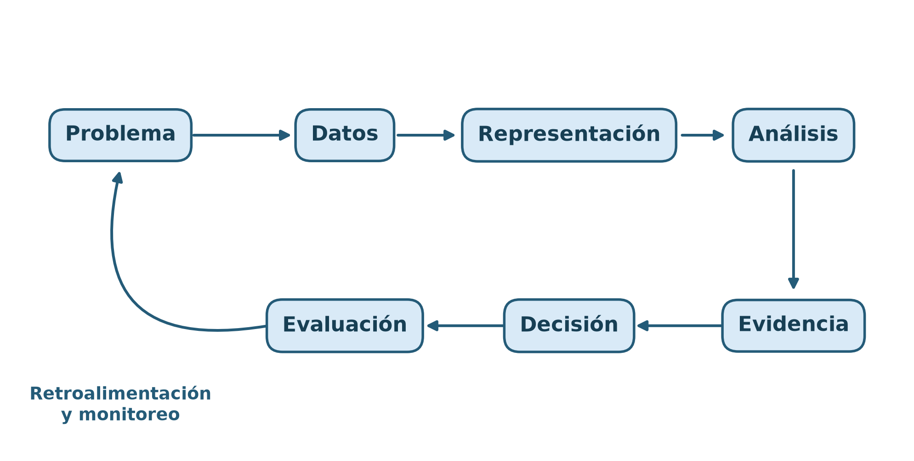

# Capítulo 2. Ciclo de vida de un proyecto basado en datos

## Propósito y objetivos de aprendizaje

Un proyecto basado en datos no comienza cuando se abre un archivo ni cuando se elige un algoritmo. Comienza cuando una organización, una comunidad o un equipo identifica una situación que necesita comprender o modificar. Entre esa necesidad inicial y una solución operativa existe una cadena de decisiones: definir qué se quiere lograr, determinar qué puede observarse, obtener y preparar los datos, construir evidencia, evaluar alternativas e integrar el resultado en un proceso real.

Este capítulo estudia esa cadena como un **ciclo de vida**. La palabra *ciclo* es importante: aunque las etapas se presentan en un orden pedagógico, el trabajo real rara vez avanza en línea recta. La exploración de los datos puede mostrar que la pregunta no era medible; el modelado puede revelar que la variable objetivo está mal definida; una prueba de uso puede demostrar que una predicción técnicamente correcta llega demasiado tarde para modificar la decisión. En esos casos, regresar a una etapa anterior no es un fracaso, sino el mecanismo normal mediante el cual el proyecto aprende.

Al finalizar el capítulo, el lector podrá:

- distinguir una necesidad real, una pregunta analítica y una tarea computacional;
- formular objetivos técnicos vinculados con objetivos operativos;
- definir unidad de análisis, población, alcance, variables y restricciones;
- establecer criterios de éxito y líneas de base antes de modelar;
- comparar KDD, CRISP-DM y formas iterativas de organizar el trabajo;
- reconocer tipos de datos, fuentes y arquitecturas básicas;
- diseñar una estructura de proyecto reproducible y trazable.



La figura resume una secuencia general. Sin embargo, las flechas deben imaginarse en ambas direcciones. Cada resultado intermedio puede aportar información que obligue a revisar una decisión previa.

## 2.1. Formulación del problema

La formulación es la etapa en la que una necesidad amplia se convierte en un problema que puede observarse, analizarse y evaluarse. Es también la etapa en la que suelen producirse los errores más costosos. Un algoritmo deficiente puede reemplazarse; un proyecto construido durante meses para responder la pregunta equivocada habrá consumido datos, tiempo y confianza sin producir valor.

Una formulación completa debe responder, al menos, las siguientes preguntas:

1. ¿Qué situación se desea comprender o modificar?
2. ¿Quién utilizará el resultado y qué acción podrá realizar?
3. ¿Cuál es la unidad sobre la que se observará y decidirá?
4. ¿Qué información estará disponible en ese momento?
5. ¿Qué resultado se considera deseable?
6. ¿Qué restricciones técnicas, legales, económicas o éticas existen?
7. ¿Cómo se sabrá si la solución aporta valor?

### 2.1.1. Problema real, pregunta analítica y tarea computacional

Un **problema real** describe una situación del dominio. Por ejemplo: una empresa distribuidora pierde agua en algunos sectores de su red; una ciudad experimenta demoras en el transporte; una entidad financiera acumula reclamos sin priorizar; un servicio agronómico necesita reconocer síntomas en hojas. Estas formulaciones expresan necesidades legítimas, pero todavía no indican qué datos deben utilizarse ni qué cálculo debe realizarse.

La **pregunta analítica** delimita un aspecto observable del problema. Para la pérdida de agua podrían formularse preguntas diferentes:

- ¿En qué zonas y horarios se registran caídas inusuales de presión?
- ¿Qué variables se asocian con las fugas confirmadas?
- ¿Cuál es la probabilidad de que una zona presente una fuga durante las próximas 24 horas?
- ¿Qué sectores conviene inspeccionar primero con una cuadrilla limitada?

Cada pregunta produce un tipo distinto de evidencia. La primera es descriptiva; la segunda es asociativa o diagnóstica; la tercera es predictiva; la cuarta es prescriptiva. Aunque puedan formar parte del mismo proyecto, no son intercambiables.

La **tarea computacional** especifica la operación formal que se ejecutará sobre los datos. Puede ser agregación, estimación, clasificación, regresión, agrupamiento, detección de anomalías, búsqueda, optimización o simulación. La pregunta “¿qué zonas conviene inspeccionar?” no se resuelve solamente con un clasificador. El clasificador podría estimar riesgo, pero la selección final debe considerar distancia, costo, disponibilidad de cuadrillas y gravedad esperada.

La relación entre los tres niveles puede representarse así:

$$
\text{necesidad} \longrightarrow \text{pregunta anal\'itica}
\longrightarrow \text{tarea computacional}
\longrightarrow \text{evidencia}
\longrightarrow \text{decisi\'on}.
$$

La correspondencia debe verificarse en ambos sentidos. Si la tarea produce una probabilidad, debe existir una decisión capaz de utilizarla. Si la decisión exige actuar sobre una zona, los datos y la evaluación deben conservar esa unidad geográfica. Si el problema requiere una explicación causal, una tarea puramente predictiva no basta, aunque obtenga buen desempeño.

#### Preguntas descriptivas, predictivas y prescriptivas

Una pregunta descriptiva resume lo observado: “¿cuántos incidentes hubo por mes?”. Una pregunta predictiva estima algo desconocido: “¿cuántos incidentes habrá el próximo mes?”. Una pregunta prescriptiva compara acciones: “¿cómo distribuir recursos para reducir su impacto?”. La transición entre ellas incorpora supuestos adicionales.

En términos formales, una descripción estima propiedades de una distribución observada, como una media $E[X]$ o una proporción $P(Y=1)$. Una predicción busca una cantidad condicional, por ejemplo $P(Y=1\mid X=x)$. Una prescripción introduce acciones $a\in\mathcal{A}$ y una utilidad $U(a,s)$ para cada posible estado $s$:

$$
a^* = \arg\max_{a\in\mathcal{A}}
\sum_s P(s\mid x)\,U(a,s).
$$

El paso desde probabilidad a decisión requiere costos y preferencias. Dos organizaciones pueden utilizar la misma predicción y elegir acciones distintas porque tienen capacidades, responsabilidades o tolerancias al riesgo diferentes.

#### Errores frecuentes de formulación

Un error habitual es comenzar por una técnica: “queremos aplicar redes neuronales”. La técnica no define el problema y puede no ser pertinente. Otro error consiste en formular una pregunta con una variable que solo se conoce después de decidir. También es frecuente confundir un indicador disponible con el fenómeno de interés: utilizar cantidad de reclamos como medida directa de calidad ignora que reclamar depende del acceso al canal, del conocimiento del usuario y de la confianza en la institución.

Una prueba útil consiste en explicar el proyecto sin nombrar ningún algoritmo. Si no puede describirse quién decide, sobre qué unidad, con qué información y para lograr qué resultado, la formulación todavía no está completa.

#### Un método de revisión de la pregunta

En la práctica conviene someter la pregunta a cuatro pruebas. La **prueba de observabilidad** pregunta si sus conceptos pueden vincularse con mediciones. La **prueba de accionabilidad** verifica si el resultado permite elegir entre acciones. La **prueba temporal** reconstruye qué información existe antes de decidir. La **prueba contrafactual** pregunta qué se haría si la respuesta analítica fuera distinta.

La última prueba es especialmente reveladora. Si una organización afirma que desea predecir demanda, pero asignará la misma cantidad de vehículos cualquiera sea el pronóstico, el proyecto no tiene todavía una decisión asociada. Puede ser valioso como descripción, pero no debe prometer impacto operativo.

También es útil construir una tabla de trazabilidad:

| Elemento | Formulación | Evidencia requerida |
|---|---|---|
| Necesidad | Reducir interrupciones | Duración y alcance de incidentes |
| Pregunta | Riesgo en 24 horas | Historial con cortes temporales |
| Tarea | Estimar probabilidad | Etiquetas y variables previas |
| Acción | Inspeccionar o esperar | Capacidad y costo de error |
| Impacto | Daño evitado | Seguimiento posterior |

Si una fila no puede completarse, existe un salto lógico. Detectarlo al comienzo es mucho más barato que descubrirlo después del despliegue.

### 2.1.2. Objetivos técnicos y objetivos de negocio

El término **objetivo de negocio** se utiliza de manera amplia para referirse al resultado organizacional, público, social o científico que se desea alcanzar. Puede ser reducir pérdidas, mejorar cobertura, disminuir tiempos, asignar recursos con equidad o aumentar la capacidad de vigilancia. No necesariamente implica una empresa ni un beneficio económico.

El **objetivo técnico** describe el comportamiento esperado del sistema analítico: estimar probabilidades calibradas, reducir error de pronóstico, detectar cierta proporción de eventos, procesar datos con una latencia máxima o producir explicaciones auditables.

Ambos objetivos deben conectarse mediante una teoría de cambio:

$$
\text{salida t\'ecnica}
\rightarrow \text{interpretaci\'on}
\rightarrow \text{acci\'on}
\rightarrow \text{consecuencia operativa}
\rightarrow \text{impacto}.
$$

Supóngase que un modelo identifica fugas con alta sensibilidad. Esa propiedad solo reduce pérdidas si las alertas llegan a tiempo, las cuadrillas pueden inspeccionarlas, las falsas alarmas no saturan el proceso y la reparación efectivamente evita desperdicio. El desempeño del modelo es una condición de la cadena, no su resultado final.

#### Indicadores de modelo e indicadores de impacto

Un indicador de modelo compara salidas con referencias: error absoluto, sensibilidad, precisión, calibración o tiempo de respuesta. Un indicador de impacto mide consecuencias: litros ahorrados, horas de interrupción evitadas, tiempo de resolución o cobertura territorial.

La relación no siempre es monotónica. Aumentar sensibilidad puede elevar las inspecciones innecesarias; disminuir el error promedio puede no mejorar los casos extremos; responder más rápido puede reducir la calidad de la revisión. Por ello, los objetivos suelen ser múltiples y parcialmente conflictivos.

Una formulación multicriterio puede representar el valor de una solución $m$ como:

$$
J(m)=w_1 Q(m)-w_2 C(m)-w_3 R(m),
$$

donde $Q$ mide calidad, $C$ costo y $R$ riesgo. Los pesos $w_j$ no son propiedades matemáticas naturales: expresan prioridades que deben acordarse y documentarse.

#### Criterios SMART y límites de su aplicación

Los objetivos suelen formularse como específicos, medibles, alcanzables, relevantes y acotados en el tiempo. “Reducir en seis meses el tiempo mediano de atención de reclamos prioritarios” es más evaluable que “mejorar la atención”. Sin embargo, medir no garantiza que el indicador represente bien el objetivo. Si solo se mide rapidez, el sistema puede cerrar casos sin resolverlos. Toda métrica puede convertirse en un objetivo imperfecto y alterar el comportamiento de quienes la optimizan.

Por eso conviene acompañar cada objetivo con métricas de control. Si se busca velocidad, se controla calidad; si se busca cobertura, se controla tasa de errores; si se busca ahorro, se controla seguridad y equidad.

#### Objetivos de actores diferentes

Un proyecto rara vez tiene un único interesado. La dirección puede buscar reducir costos; los operadores, recibir pocas alertas y bien justificadas; los usuarios, continuidad del servicio; el área legal, cumplimiento; el equipo técnico, estabilidad. Estos objetivos pueden entrar en conflicto.

El trabajo de formulación no consiste en ocultar el conflicto dentro de una media ponderada. Primero se identifican condiciones no negociables y luego se comparan compromisos. Una reducción de costo que aumenta riesgo de seguridad por encima del límite no es una alternativa válida, aunque maximice un índice global.

Una matriz de objetivos ayuda a explicitar la gobernanza:

| Actor | Objetivo | Indicador | Restricción o temor |
|---|---|---|---|
| Operaciones | Priorizar trabajo útil | Intervenciones confirmadas | Saturación de alertas |
| Dirección | Reducir pérdidas | Volumen evitado | Costo total |
| Comunidad | Mantener servicio | Horas sin interrupción | Distribución desigual |
| Auditoría | Justificar decisiones | Casos trazables | Opacidad |

El criterio final debe ser aprobado por quienes poseen autoridad y responsabilidad, no inferido por el equipo a partir de la disponibilidad de métricas.

### 2.1.3. Unidad de análisis, población y alcance

La **unidad de análisis** es la entidad elemental sobre la cual se realizan descripciones, predicciones o decisiones. En una tabla suele corresponder al significado de una fila, aunque una unidad puede necesitar varias tablas. En movilidad puede ser un viaje, una parada, una zona por hora o un vehículo por día. En agua puede ser una lectura de sensor, un tramo de tubería o una zona por intervalo.

Elegir la unidad determina:

- qué constituye una observación;
- cuáles son las claves válidas;
- cómo se agregan los datos;
- qué dependencias existen entre filas;
- cómo deben realizarse las particiones de evaluación;
- a qué nivel se ejecutará la decisión.

Si la decisión asigna recursos a zonas, pero el modelo produce predicciones por sensor, debe definirse cómo se combinan sensores en una prioridad zonal. Si varias mediciones pertenecen a la misma tubería, tratarlas como independientes puede producir intervalos demasiado estrechos y particiones contaminadas.

#### Población, muestra y población de despliegue

La **población objetivo** contiene las unidades sobre las que se desea generalizar. La **muestra observada** contiene las unidades disponibles para el análisis. La **población de despliegue** contiene las unidades que encontrará el sistema cuando se utilice. Idealmente coinciden en sus propiedades relevantes, pero en la práctica pueden diferir.

Sea $P_T(X,Y)$ la distribución de la población de entrenamiento y $P_D(X,Y)$ la de despliegue. Si $P_T\neq P_D$, el desempeño estimado puede no transferirse. La diferencia puede surgir por cobertura geográfica, selección de usuarios, cambios estacionales, nuevas políticas o modificaciones en sensores.

La representatividad no depende solo del tamaño. Un millón de registros de un único tipo de zona puede representar peor a la ciudad que una muestra más pequeña diseñada para cubrir su diversidad. Deben documentarse mecanismos de inclusión y exclusión.

#### Alcance y fronteras del sistema

El alcance define periodos, lugares, tipos de casos, usuarios y acciones incluidas. También establece exclusiones. Un sistema puede diseñarse para alertas operativas y no para sanciones; para condiciones normales y no para emergencias; para zonas instrumentadas y no para toda la red.

Declarar el alcance evita que una herramienta sea reutilizada en decisiones para las que no fue evaluada. La ampliación posterior requiere nueva evidencia, no solo una modificación de interfaz.

#### Muestreo, cobertura y dependencia

Cuando no se observa toda la población, debe entenderse cómo se produjo la muestra. Un muestreo probabilístico permite estimar probabilidades de inclusión; una muestra por conveniencia refleja accesibilidad. Los registros administrativos suelen ser censos del sistema, pero no de la realidad: contienen todos los eventos registrados, no todos los eventos ocurridos.

Si cada unidad $i$ tiene probabilidad de inclusión $\pi_i$, una muestra con probabilidades desiguales puede requerir ponderaciones $w_i=1/\pi_i$. Sin embargo, ponderar no corrige variables ausentes ni poblaciones sin posibilidad de inclusión. La documentación del mecanismo sigue siendo indispensable.

La dependencia entre unidades también define la evaluación. Varias filas de una persona, planta, vehículo o zona comparten factores. Separarlas aleatoriamente puede colocar información casi idéntica en entrenamiento y prueba. El protocolo debe agrupar por la entidad cuya generalización interesa. Si el sistema se usará en zonas nuevas, la prueba debe contener zonas no vistas; si se usará en días futuros de las mismas zonas, la separación debe ser temporal.

Una práctica recomendable es redactar una **declaración de generalización**: “el resultado pretende aplicarse a ___, bajo las condiciones ___, durante ___; no se ha evaluado en ___”. Esta frase obliga a convertir la palabra “generaliza” en una afirmación verificable.

### 2.1.4. Variables de entrada, resultados y restricciones

Una variable es una representación de una propiedad. Para utilizarla deben conocerse significado, unidad, procedencia, instante de disponibilidad y relación con la unidad de análisis.

Las **variables de entrada** $X$ contienen información disponible antes de producir la salida. La **variable resultado** $Y$ representa lo que se intenta estimar. Una **acción** $A$ es una intervención posible. Las **restricciones** $C$ delimitan el conjunto de soluciones factibles.

Una especificación compacta es:

$$
\mathcal{P}=(U,\mathcal{R},X,Y,A,H,C),
$$

donde $U$ es la unidad, $\mathcal{R}$ la población, $H$ el horizonte y los demás símbolos conservan el significado anterior.

#### Disponibilidad y legitimidad de las entradas

Que una variable exista en la base no significa que pueda usarse. Puede conocerse después de la decisión, contener información sensible, derivarse de la etiqueta o no estar disponible en producción. Para cada entrada conviene preguntar:

1. ¿cuándo se genera?;
2. ¿quién la registra?;
3. ¿estará disponible con la misma calidad?;
4. ¿es legítimo utilizarla para este propósito?;
5. ¿puede cambiar como consecuencia del propio sistema?

La última pregunta es importante. Si un modelo prioriza zonas y las inspecciones generan más registros allí, los datos futuros reflejarán la política del modelo. La observación deja de ser pasiva y aparece un ciclo de retroalimentación.

#### Resultado observado y constructo

El **constructo** es el concepto que interesa; la **etiqueta** es su representación observada. “Riesgo”, “calidad”, “urgencia” o “satisfacción” no se observan directamente. Se aproximan mediante reglas, mediciones o decisiones humanas.

Una etiqueta de fuga confirmada puede depender de que una zona haya sido inspeccionada. Las zonas nunca visitadas no tienen necesariamente ausencia de fuga; tienen ausencia de confirmación. Confundir ambos estados introduce sesgo de selección.

#### Restricciones duras y blandas

Una restricción dura no puede violarse: capacidad física, presupuesto máximo, normativa o seguridad. Una restricción blanda representa una preferencia cuyo incumplimiento tiene costo. En optimización puede formularse:

$$
\min_a \operatorname{Costo}(a)+\lambda\,\operatorname{Penalizaci\'on}(a)
$$

sujeto a restricciones obligatorias. La separación ayuda a evitar recomendaciones matemáticamente atractivas pero imposibles de ejecutar.

#### Protocolo de construcción de la etiqueta

La variable objetivo merece un documento propio. Debe establecer quién asigna la etiqueta, con qué evidencia, en qué momento, qué opciones existen, cómo se resuelven desacuerdos y qué significa un caso sin etiqueta. Si participan expertos, conviene medir acuerdo y revisar ejemplos ambiguos.

Una etiqueta puede cambiar después de una apelación o una prueba adicional. En ese caso se necesita versión y fecha de vigencia. Entrenar con la versión final puede ser correcto para aprender el estado real, pero una característica construida durante la revisión podría no estar disponible al inicio.

La calidad de la etiqueta impone un techo práctico. Si expertos coinciden solo en 80 % de los casos porque el concepto es ambiguo, exigir al modelo una exactitud casi perfecta puede indicar fuga o una evaluación que no representa la dificultad real. El desacuerdo no siempre debe eliminarse: puede definir una clase incierta o una regla de derivación humana.

En problemas prescriptivos, las acciones también necesitan representación. No basta con predecir $Y$; debe conocerse qué acciones son factibles para cada unidad y cómo modifican costos o resultados. Esta información suele estar en sistemas operativos distintos del dataset analítico.

### 2.1.5. Criterios de éxito y línea de base

Los criterios de éxito deben fijarse antes de observar los resultados finales. De lo contrario, existe el riesgo de seleccionar retrospectivamente la métrica que favorece al modelo. Un criterio completo combina cuatro dimensiones:

- desempeño técnico;
- utilidad operativa;
- viabilidad de implementación;
- seguridad y uso responsable.

Para un sistema de alertas puede exigirse sensibilidad mínima, límite de falsas alarmas por día, latencia inferior a una hora y ausencia de degradación grave entre zonas. Ninguna métrica aislada resume esas condiciones.

#### Línea de base

La **línea de base** o *baseline* es el procedimiento de referencia contra el que se evalúa una propuesta. Puede ser:

- una regla institucional vigente;
- la clase mayoritaria;
- el promedio histórico;
- el último valor observado;
- un pronóstico estacional ingenuo;
- una asignación aleatoria o proporcional;
- un modelo sencillo e interpretable.

El baseline cumple funciones científicas y organizacionales. Permite saber si la complejidad aporta valor, detectar errores de implementación y comunicar la magnitud real de la mejora. Superar una línea de base débil no es suficiente si existe una regla simple más pertinente.

#### Costos de error y umbrales

En clasificación, los falsos positivos y falsos negativos rara vez tienen el mismo costo. Si $C_{FP}$ y $C_{FN}$ son esos costos, el costo esperado puede expresarse como:

$$
EC=C_{FP}\,P(FP)+C_{FN}\,P(FN).
$$

El umbral debe elegirse considerando esta función y la capacidad operativa. Un sistema que produce mil alertas correctas por día puede ser inútil si solo pueden revisarse veinte.

#### Criterios de detención

No todo proyecto debe llegar al despliegue. Se debe detener o reformular cuando los datos no representan el objetivo, el desempeño no supera el baseline, el impacto esperado no compensa costos, no existe proceso de uso o los riesgos no pueden controlarse. Detener temprano es una conclusión válida y valiosa.

#### Diseño de una tabla de aceptación

Los criterios se vuelven operativos cuando se expresan como condiciones verificables. Por ejemplo:

| Dimensión | Condición de aceptación | Evidencia |
|---|---|---|
| Predicción | Mejora al baseline en validación temporal | Intervalo de métricas |
| Capacidad | No más de 20 alertas diarias | Simulación histórica |
| Equidad | Diferencias justificadas y controladas | Evaluación por zona |
| Latencia | Resultado antes de las 7:00 | Prueba de extremo a extremo |
| Trazabilidad | Toda alerta conserva entradas y versión | Auditoría de casos |

Las condiciones deben incluir tolerancias. Una diferencia de una centésima puede ser ruido, no mejora. Cuando es posible, se reporta incertidumbre mediante repeticiones, intervalos o análisis de sensibilidad.

También conviene distinguir **criterio de selección** y **criterio de aceptación**. El primero elige el mejor candidato entre los estudiados; el segundo determina si ese candidato es suficientemente bueno para avanzar. Siempre existe un “mejor” modelo dentro de una lista, aunque todos sean inadecuados.

### 2.1.6. Ejemplo práctico guiado: formulación de un problema de mantenimiento ferroviario

#### Situación inicial

Una operadora ferroviaria desea reducir fallas que obligan a limitar la velocidad o interrumpir el servicio. Dispone de mediciones de vibración tomadas por vehículos instrumentados, temperatura de componentes próximos a la vía, inspecciones visuales, historial de intervenciones y características de cada tramo. Solo cuenta con tres cuadrillas y cada una puede revisar como máximo cuatro tramos durante el turno nocturno.

La necesidad inicial, “mejorar el mantenimiento”, es demasiado amplia. Después de entrevistar a responsables de infraestructura y planificación, el equipo fija una decisión concreta: al cierre de cada jornada, ordenar los tramos candidatos y asignar hasta doce inspecciones para la noche siguiente.

#### Formulación paso a paso

**Unidad de análisis:** tramo de vía de 500 metros por día. Esta unidad conserva una referencia espacial estable y coincide con el nivel al que se emite la orden de trabajo. Las mediciones obtenidas dentro del tramo se agregan sin perder su instante de captura ni el vehículo de origen.

**Población y alcance:** tramos activos de las líneas instrumentadas durante los últimos tres años. Se excluyen playas de maniobras y sectores en renovación, cuyos regímenes de operación y registro no son comparables. La evaluación debe informar por separado líneas urbanas, interurbanas y tramos con cobertura sensórica incompleta.

**Horizonte de decisión y predicción:** se emplea información disponible hasta las 18:00 para decidir inspecciones del turno nocturno y estimar si se confirmará un defecto que requiera intervención en los siete días siguientes. El horizonte permite coordinar recursos, pero obliga a distinguir una alerta preventiva de una incidencia que exige actuación inmediata por protocolo.

**Pregunta descriptiva:** ¿cómo varían la vibración, la temperatura, la frecuencia de inspecciones y los defectos registrados según tramo, carga acumulada, tipo de infraestructura y época del año?

**Pregunta predictiva:** ¿cuál es la probabilidad de confirmar en cada tramo un defecto relevante durante los próximos siete días, utilizando solo datos conocidos a las 18:00?

**Pregunta prescriptiva:** ¿qué conjunto de hasta doce tramos conviene inspeccionar para maximizar el riesgo esperado cubierto, respetando tiempos de traslado, ventanas de acceso y competencias de las cuadrillas?

**Resultado y etiqueta:** el resultado positivo es un defecto confirmado por inspección que exige reparación, restricción temporal o seguimiento reforzado. La etiqueta está sesgada: los tramos con señales llamativas, acceso sencillo o antecedentes reciben más inspecciones y, por tanto, más oportunidades de confirmación. Los tramos no inspeccionados no deben codificarse automáticamente como negativos; constituyen resultados no observados.

**Entradas disponibles:** estadísticas de vibración por bandas de frecuencia, cambios respecto del patrón histórico del tramo, máximos y persistencia de temperatura, tonelaje acumulado, velocidad de paso, geometría, antigüedad de componentes, inspecciones e intervenciones previas y tiempo desde la última revisión. Se excluyen el informe de la inspección futura, la orden de reparación y cualquier variable actualizada después de la fecha de corte.

**Baselines:** el primero reproduce la regla vigente, que prioriza los tramos con más días desde la última inspección. El segundo ordena por el mayor incremento normalizado de vibración durante las últimas 72 horas. Un tercero combina reglas de seguridad definidas por especialistas, sin aprendizaje estadístico. Estos referentes representan alternativas realmente disponibles, no modelos deliberadamente débiles.

**Métricas:** se evaluarán calibración y sensibilidad, además de precisión entre los primeros doce tramos del ranking ($\operatorname{Precision@12}$) y proporción de defectos confirmados cubierta ($\operatorname{Recall@12}$). En el plano operativo se medirán horas de cuadrilla, kilómetros de traslado, inspecciones sin hallazgo, estabilidad diaria del ranking y tiempo entre alerta e intervención. En seguridad se informarán por separado los defectos críticos omitidos y el desempeño por línea y nivel de cobertura sensórica.

**Restricciones y aceptación:** ninguna recomendación puede reemplazar una regla obligatoria de seguridad. El plan debe limitarse a tres cuadrillas, doce inspecciones, las ventanas nocturnas autorizadas y las competencias disponibles; también debe entregar resultados antes de las 19:00 y conservar las mediciones y la versión que originaron cada prioridad. Se aceptará avanzar solo si la validación temporal supera la regla vigente en defectos relevantes cubiertos sin aumentar horas de trabajo ni concentrar sistemáticamente la atención en los tramos mejor instrumentados.

#### Pseudocódigo de la formulación

```text
identificar usuario, decisión y protocolos que prevalecen
definir tramo, fecha de corte y horizonte de siete días
inventariar señales disponibles antes de las 18:00
documentar cómo la inspección produce etiquetas sesgadas
separar negativos confirmados de resultados no observados
enumerar cuadrillas, accesos y planes factibles
comparar reglas vigentes con candidatos bajo cortes temporales
medir desempeño predictivo, carga operativa y riesgo de seguridad
registrar exclusiones, supuestos y criterios de detención
```

El ejemplo muestra que formular no equivale a solicitar “un modelo de fallas”. La unidad determina la tabla analítica; la fecha de corte evita conocimiento futuro; el horizonte define qué resultado es útil; y la capacidad de las cuadrillas convierte un puntaje de riesgo en una decisión de asignación.

#### Análisis de sensibilidad de la formulación

Antes de modelar, el equipo estudia otras unidades y horizontes. Una unidad vehículo-tramo produciría varias observaciones para el mismo lugar y podría sobrerrepresentar los recorridos más frecuentes. Un tramo de cinco kilómetros facilitaría la planificación, pero ocultaría señales localizadas. Un horizonte de 24 horas favorecería incidencias inminentes; uno de treinta días admitiría programación preventiva, aunque con mayor incertidumbre. Cada alternativa cambia el significado de la predicción y debe evaluarse contra la acción prevista.

También se analiza el mecanismo de confirmación. Entrenar solo con tramos inspeccionados estima riesgo dentro de una población seleccionada, no necesariamente en toda la red ferroviaria. Para reducir esa limitación se puede reservar una pequeña cuota de inspecciones aleatorias entre tramos elegibles, registrar por qué se inspeccionó cada caso y comparar la cobertura entre observados y no observados. La exploración debe ser compatible con las normas de seguridad y nunca desplazar revisiones obligatorias.

Por último, se simulan rutas y capacidad con datos históricos. Si una clasificación de alta calidad exige más visitas de las que pueden realizarse, el objetivo no será “detectar todos los defectos”, sino cubrir la mayor cantidad de riesgo bajo restricciones explícitas. Si ningún candidato mejora los baselines de manera estable o si la evaluación revela brechas no controlables entre líneas, el proyecto debe regresar a la obtención de datos o detener el despliegue.

### Actividad EMO [AGUA-01]: formular el problema y la decisión operativa

**Capacidad mínima:** convertir una necesidad de gestión del agua en una tarea analítica verificable y conectarla con una decisión concreta.

**Consigna:** seleccionar una necesidad del caso de agua y elaborar una ficha que contenga usuario, decisión, unidad, población, alcance, preguntas descriptiva, predictiva y prescriptiva, variable objetivo, entradas disponibles, restricciones, baseline y criterios de éxito.

**Modalidad de trabajo:** preparación individual y contraste breve entre pares. El intercambio debe buscar inconsistencias, no uniformar respuestas.

**Evidencia individual:** documento de una página más un anexo con diccionario preliminar de variables y diagrama `necesidad -> evidencia -> acción -> impacto`.

**Criterios de aprobación:**

- la tarea computacional responde a la pregunta y la decisión;
- la unidad de análisis coincide con el nivel de acción;
- la etiqueta y su proceso de producción están definidos;
- las entradas estarán disponibles al decidir;
- el baseline representa una alternativa realista;
- los supuestos, exclusiones, afectados y límites están explícitos.

**Preguntas para la defensa:** ¿qué ocurriría si faltaran sensores en las zonas de mayor riesgo?, ¿qué variable produciría fuga de información?, ¿qué resultado haría abandonar el proyecto?, ¿quién es responsable de la decisión final?

## 2.2. Metodologías para proyectos de datos

Las metodologías ofrecen un vocabulario para organizar actividades, entregables y revisiones. No sustituyen el razonamiento ni garantizan calidad por sí mismas. Su valor reside en hacer visibles tareas que podrían omitirse si el equipo se concentrara exclusivamente en modelar.

### 2.2.1. Proceso KDD

KDD significa *Knowledge Discovery in Databases*, descubrimiento de conocimiento en bases de datos. Surgió para describir el proceso más amplio dentro del cual la minería de datos es solo una etapa. Sus componentes habituales son selección, preprocesamiento, transformación, minería e interpretación/evaluación.

#### Selección

Se identifican fuentes, variables, periodos y unidades relevantes. Seleccionar no es copiar todo lo disponible: implica justificar qué datos pueden aportar evidencia y qué restricciones de acceso o uso existen.

#### Preprocesamiento

Se estudian calidad, faltantes, errores, duplicados y consistencia. Las decisiones deben conservar trazabilidad. La limpieza no persigue una tabla estéticamente perfecta, sino una representación válida para el objetivo.

#### Transformación

Se cambia la representación mediante agregación, codificación, escalado, extracción de características o reducción de dimensionalidad. Cada transformación introduce supuestos sobre qué información conservar.

#### Minería de datos

Se aplican métodos para encontrar patrones: reglas, grupos, asociaciones, predicciones o anomalías. El patrón es un resultado computacional, no todavía conocimiento.

#### Interpretación y evaluación

Se determina si el patrón es válido, novedoso, comprensible y útil. Una asociación frecuente puede ser trivial; un cluster bien separado puede no tener significado operativo; una predicción precisa puede no modificar ninguna acción.

KDD destaca que el conocimiento emerge de la interacción entre datos, método y contexto. También enfatiza la iteración: una regla inesperada puede revelar un error de codificación y obligar a volver al preprocesamiento.

#### Del patrón al conocimiento

En proyectos reales conviene clasificar el estado epistemológico de cada hallazgo. Un **resultado** es una salida calculada; un **patrón** es una regularidad observada; una **hipótesis** propone una explicación o expectativa; un **hallazgo validado** ha resistido controles definidos; una **regla operativa** ha sido aprobada para orientar acciones. Saltar directamente de patrón a regla es una fuente frecuente de daño.

Supóngase que los reclamos aumentan antes de las fugas confirmadas. El patrón puede reflejar una señal temprana, pero también mayor propensión a inspeccionar zonas con reclamos. Para utilizarlo se necesita comprobar temporalidad, cobertura y estabilidad. KDD obliga a interpretar la regularidad dentro de su proceso de generación.

La novedad también es contextual. Un algoritmo puede descubrir que la demanda aumenta en hora pico, un patrón estadísticamente fuerte pero conocido por cualquier operador. El proyecto debe valorar si confirma conocimiento, lo cuantifica mejor o revela una estructura capaz de modificar decisiones.

Una revisión KDD debería preguntar: ¿el patrón aparece en particiones independientes?, ¿puede explicarse por calidad o selección?, ¿es comprensible para el dominio?, ¿permite una acción?, ¿qué evidencia podría refutarlo? Estas preguntas transforman minería en aprendizaje institucional.

### 2.2.2. Metodología CRISP-DM

CRISP-DM, *Cross-Industry Standard Process for Data Mining*, organiza el proyecto en seis fases: comprensión del negocio, comprensión de los datos, preparación, modelado, evaluación y despliegue.

#### Comprensión del negocio

Define necesidad, usuarios, decisiones, riesgos, criterios de éxito, recursos y plan. Su entregable principal no es un modelo, sino una especificación compartida del problema.

#### Comprensión de los datos

Construye inventario, descripción, perfil de calidad y primeras hipótesis. El equipo verifica si la información necesaria existe y si representa la población objetivo.

#### Preparación de los datos

Selecciona, integra, limpia y transforma. Suele consumir gran parte del esfuerzo porque debe reconciliar fuentes creadas para fines distintos. El producto es un dataset analítico versionado junto con su procedimiento de construcción.

#### Modelado

Define protocolo de evaluación, baseline, familias de modelos e hiperparámetros. El protocolo debe preceder a la comparación para evitar que la prueba se convierta en herramienta de selección.

#### Evaluación

Verifica desempeño técnico y correspondencia con el objetivo. Incluye análisis de errores, sensibilidad, subgrupos, costos y condiciones de uso. La pregunta no es solo “¿funciona el modelo?”, sino “¿resuelve el problema formulado con riesgo aceptable?”.

#### Despliegue

Integra el resultado en un proceso, establece responsables, monitoreo, actualización y retirada. El despliegue puede ser un informe periódico, un tablero, una API o una regla incorporada a una operación; no implica necesariamente automatización en tiempo real.

CRISP-DM es cíclico. La evaluación puede mostrar que se necesita otra variable; el despliegue puede cambiar la distribución de datos; una nueva normativa puede modificar el objetivo. Cada retorno debe registrar qué evidencia motivó la revisión.

#### Puertas de decisión entre fases

CRISP-DM funciona mejor cuando cada transición posee una puerta de decisión. No se avanza a preparación porque “ya se exploró bastante”, sino porque existe evidencia mínima: unidad definida, cobertura conocida, fuentes autorizadas y problemas críticos identificados. No se avanza a despliegue porque un modelo obtuvo la mejor métrica, sino porque cumple criterios operativos y de riesgo.

Las puertas evitan dos extremos. El primero es avanzar con incertidumbres que invalidarán el trabajo posterior. El segundo es buscar certeza imposible y no experimentar nunca. La evidencia requerida debe ser proporcional al costo de la siguiente fase y al riesgo de equivocarse.

#### Documentos vivos

Los entregables no son informes congelados. La ficha del problema, el diccionario, la tarjeta del modelo y el plan de monitoreo evolucionan con versiones. Cuando cambia una definición, se registra qué artefactos quedan afectados. Esta disciplina permite distinguir una iteración legítima de una inconsistencia.

#### Relación con operación y MLOps

CRISP-DM suele describirse hasta “despliegue”, pero un sistema operativo necesita monitoreo, gestión de incidentes, reentrenamiento y retirada. Estas prácticas se asocian con MLOps, aunque sus principios son más generales: automatizar lo repetible, verificar contratos, versionar artefactos y observar comportamiento. No deben agregarse al final; los requisitos de operación influyen desde la formulación.

### 2.2.3. Ciclos iterativos y enfoques ágiles

Un enfoque iterativo divide una iniciativa incierta en ciclos pequeños. Cada ciclo formula una hipótesis, produce un artefacto verificable y obtiene retroalimentación. En proyectos de datos, los artefactos tempranos pueden ser un mapa de fuentes, una auditoría, un baseline o una simulación de la decisión.

La iteración reduce el riesgo de invertir meses en una solución técnicamente sofisticada que nadie puede usar. Sin embargo, “ágil” no significa improvisado. Para aprender entre iteraciones deben mantenerse versiones, criterios y registros.

Una iteración puede expresarse como:

```text
seleccionar la incertidumbre más importante
formular una hipótesis verificable
definir evidencia y criterio de decisión
construir el artefacto mínimo necesario
evaluar y registrar resultados
decidir: continuar, modificar, escalar o detener
```

#### Producto mínimo viable y producto mínimo evaluable

En software se habla de producto mínimo viable. En datos conviene distinguir un **producto mínimo evaluable**: la implementación más pequeña que permite probar un supuesto crítico. Si se desconoce si los sensores cubren suficientes eventos, el primer producto no debe ser un clasificador, sino un análisis de cobertura.

La prioridad se asigna por riesgo de conocimiento. Las preguntas que podrían invalidar el proyecto deben estudiarse antes que las mejoras de interfaz o rendimiento.

#### Deuda técnica y deuda analítica

La velocidad puede generar deuda técnica: código duplicado, dependencias no registradas o procesos manuales frágiles. También existe deuda analítica: definiciones ambiguas, métricas elegidas después de observar resultados, datasets sin versión o supuestos no documentados. Ambas deudas encarecen cada iteración posterior.

#### Organizar un backlog de incertidumbres

En software, un backlog suele contener funcionalidades. En datos debe contener también incertidumbres. Cada elemento puede formularse como: “No sabemos si ___; lo comprobaremos mediante ___; decidiremos ___ si observamos ___”. Esta estructura evita tareas genéricas como “mejorar el modelo”.

Las incertidumbres pueden priorizarse por:

$$
Prioridad \approx Probabilidad\ de\ fallo \times Impacto \times Costo\ de\ descubrirlo\ tarde.
$$

Por ejemplo, desconocer la licencia de una fuente tiene alta prioridad porque puede impedir su uso completo. Ajustar el color de un tablero tiene menor prioridad antes de demostrar que los datos llegan a tiempo.

#### Criterio de terminado

Cada incremento necesita una definición de terminado. Para un perfil puede ser: fuente versionada, reglas ejecutadas, hallazgos revisados por dominio y limitaciones registradas. Para un baseline: pipeline reproducible, partición correcta, métricas y análisis de errores. “El notebook corre en mi equipo” no es suficiente.

La revisión de iteración debe separar lo construido, lo aprendido y lo decidido. Un ciclo puede producir poco código y mucho aprendizaje útil. Medir avance solo por cantidad de funcionalidades incentiva construir antes de entender.

### 2.2.4. Hipótesis, experimentación y retroalimentación

Una hipótesis es una afirmación que puede contrastarse con evidencia. Debe especificar población, variables, comparación y resultado esperado. “La presión influye en las fugas” es ambigua. “En zonas instrumentadas, una caída de presión superior al patrón horario se asocia con mayor proporción de fugas confirmadas durante las siguientes 24 horas” es más precisa.

No todas las hipótesis son causales. Una hipótesis predictiva puede afirmar que una variable mejora generalización sin sostener que causa el resultado. Separar asociación, predicción y causalidad evita interpretaciones excesivas.

#### Diseño de un experimento analítico

Un registro de experimento debe contener:

- pregunta e hipótesis;
- versión de datos y población;
- partición y unidad de separación;
- procedimiento y parámetros;
- métricas principales y auxiliares;
- resultado con incertidumbre;
- errores observados;
- conclusión y decisión siguiente.

La comparación justa mantiene constantes los factores no estudiados. Si se comparan dos modelos, deben usar las mismas particiones y reglas de preprocesamiento pertinentes. Si se comparan dos representaciones, debe controlarse el modelo o declarar que se compara el pipeline completo.

#### Retroalimentación

La retroalimentación puede provenir de métricas, usuarios, errores, monitoreo o cambios del entorno. Debe traducirse en una decisión verificable. “A los usuarios no les gusta” necesita descomponerse: ¿la salida llega tarde?, ¿no se entiende?, ¿genera trabajo adicional?, ¿contradice conocimiento local?

Los resultados negativos son información. Si un modelo no supera el baseline, puede indicar falta de señal, etiqueta inadecuada o pregunta mal formulada. Ocultarlos conduce a repetir experimentos y sobreestimar evidencia.

#### Hipótesis operativas y analíticas

Una hipótesis analítica afirma algo sobre datos o desempeño. Una hipótesis operativa afirma algo sobre uso: “si la alerta se presenta con evidencia y antes de las 7:00, el operador modificará la ruta”. Ambas deben probarse. Un sistema puede superar validación y fracasar porque la salida no encaja en el flujo de trabajo.

Las pruebas operativas incluyen prototipos, modo sombra, simulaciones y estudios con usuarios. No necesitan esperar al modelo final. Una maqueta con prioridades históricas puede revelar que el operador necesita ver tendencia y procedencia antes de confiar.

#### Incertidumbre experimental

Una única métrica es una realización. Deben considerarse variación por muestra, semilla, periodo y subgrupo. Si dos alternativas difieren menos que esa variación, declarar un ganador definitivo es excesivo. Se pueden reportar distribuciones, intervalos y estabilidad de ranking.

También se debe controlar la multiplicidad informal. Probar decenas de configuraciones y comunicar solo la mejor sobreestima el desempeño esperado. El registro completo y una prueba reservada limitan este sesgo de selección.

#### Aprender de los errores

El análisis de errores agrupa fallos por mecanismo: información insuficiente, etiqueta dudosa, población nueva, transformación incorrecta o decisión de umbral. Esta taxonomía orienta acciones. No todos los errores se corrigen con un modelo más complejo; algunos requieren mejores datos o abstención.

### 2.2.5. Roles dentro de un equipo de datos

Un proyecto interdisciplinario necesita competencias distintas. Los nombres varían entre organizaciones, pero las responsabilidades principales permanecen.

| Rol o responsabilidad | Pregunta principal | Entregables habituales |
|---|---|---|
| Responsable del dominio | ¿Qué significa el problema y qué restricciones existen? | Definiciones, reglas y validación contextual |
| Responsable del producto o decisión | ¿Quién usará el resultado y qué valor debe producir? | Prioridades, criterios y proceso de uso |
| Analista de datos | ¿Qué muestran los datos y cómo comunicarlo? | Perfiles, análisis y visualizaciones |
| Ingeniería de datos | ¿Cómo obtener datos confiables y repetibles? | Pipelines, esquemas y controles |
| Ciencia de datos | ¿Qué representación y modelo responden la pregunta? | Experimentos, modelos y evaluación |
| Ingeniería de ML/software | ¿Cómo operar el sistema de forma confiable? | Servicios, pruebas, despliegue y monitoreo |
| Seguridad, privacidad y legal | ¿Qué usos y controles son aceptables? | Evaluaciones, permisos y salvaguardas |
| Usuarios y afectados | ¿Cómo funciona la solución en la práctica? | Retroalimentación y criterios de aceptación |

En equipos pequeños una persona puede cubrir varios roles, pero las preguntas no deben omitirse. Debe existir una asignación explícita de quién aprueba datos, métricas, despliegue y cambios.

#### Responsabilidad y decisión final

El modelo no es responsable. La organización debe definir quién interpreta, quién autoriza acciones, quién atiende incidentes y quién puede detener el sistema. La participación humana no garantiza supervisión efectiva si la persona no tiene tiempo, información o autoridad para contradecir la recomendación.

#### Lenguaje compartido

Los equipos suelen utilizar la misma palabra con significados distintos. “Cliente activo”, “fuga”, “resuelto” o “zona crítica” deben registrarse en un glosario. Una definición operacional debe indicar cómo se observa y no solo su interpretación intuitiva.

#### Matriz de responsabilidades

Una práctica útil es asignar para cada decisión quién es responsable de ejecutar, quién aprueba, quién debe ser consultado y quién informado. La matriz evita que una decisión crítica quede implícitamente en manos de quien escribió el último código.

Por ejemplo, ingeniería de datos puede ejecutar un cambio de esquema; ciencia de datos evalúa su efecto; dominio valida significado; producto aprueba el uso; seguridad revisa acceso. Una persona puede ocupar varias posiciones, pero la secuencia de revisión queda visible.

#### Tensiones saludables

Los desacuerdos entre roles no son un obstáculo a eliminar. El experto de dominio puede detectar una simplificación inválida; el ingeniero puede advertir que una variable no estará disponible; el usuario puede mostrar que una explicación no sirve bajo presión. Un proceso maduro convierte estas tensiones en criterios verificables.

La colaboración requiere artefactos compartidos: ficha del problema, diccionario, ejemplos de casos, tablero de experimentos y registro de decisiones. Las reuniones sin artefactos producen acuerdos difíciles de auditar.

#### Competencia y revisión

Los resultados sensibles deben contar con revisión independiente. Quien diseña una regla tiende a conocer sus casos favorables. Una revisión por pares intenta reproducir, desafiar supuestos y buscar escenarios de fallo. La revisión no transfiere responsabilidad; mejora la evidencia con la que se decide.

### 2.2.6. Ejemplo práctico guiado: diseño de un ciclo CRISP-DM

Una empresa de servicios técnicos quiere priorizar el mantenimiento de ascensores en cientos de edificios. Dispone de sensores instalados en parte de los equipos, avisos de servicio enviados por administradores y usuarios, e historiales de mantenimiento. CRISP-DM permite organizar el proyecto sin tratar el modelado como una actividad aislada.

#### Comprensión del problema

El equipo define una decisión diaria: seleccionar los ascensores que recibirán mantenimiento preventivo durante los próximos siete días, además de las atenciones urgentes exigidas por contrato o seguridad. La unidad de decisión es ascensor-semana y la salida será una lista priorizada con motivo, nivel de riesgo y fecha sugerida. Los usuarios directos son planificadores y técnicos; residentes, visitantes y personal de los edificios son actores afectados.

Se documentan capacidad, competencias, repuestos, horarios de acceso, tiempos de traslado y acuerdos de nivel de servicio. El éxito no se formula como “predecir averías”, sino como reducir inmovilizaciones y rescates sin aumentar horas extraordinarias ni demorar avisos urgentes. La regla vigente, basada en periodicidad y antigüedad, queda registrada como baseline operativo.

#### Comprensión de los datos

Se inventarían tres fuentes principales. Los sensores registran ciclos de puerta, vibración del motor, temperatura, consumo eléctrico y códigos de error; los avisos de servicio contienen fecha, canal, texto libre, equipo asociado y urgencia declarada; los historiales describen visitas, diagnósticos, piezas sustituidas, duración y resultado. Se verifican propietarios, cobertura temporal, identificadores y disponibilidad de cada campo antes de planificar.

El perfil revela que no todos los ascensores tienen los mismos sensores, algunos identificadores cambiaron después de modernizaciones y un mismo aviso puede duplicarse por varios canales. También muestra que las averías se confirman con mayor frecuencia en equipos que recibieron una visita. Por ello, ausencia de diagnóstico no se interpreta automáticamente como ausencia de problema, y se conserva el motivo que originó cada intervención.

#### Preparación

Se construye una tabla ascensor-semana con fecha de corte reproducible. Las señales se resumen mediante niveles, tendencias, variabilidad y frecuencia de códigos; los avisos se deduplican y se representan con categorías verificables; los historiales producen variables como días desde la última visita, reincidencias y vida útil estimada de componentes. Las modernizaciones se tratan como cambios de configuración, no como continuidad silenciosa de la serie.

La integración valida cardinalidades para evitar que varios avisos multipliquen artificialmente los ciclos sensóricos. Los parámetros de imputación, vocabularios y escalas se ajustan solo con el periodo de entrenamiento. El pipeline conserva indicadores de dato ausente y de cobertura, porque la falta de señal puede significar ausencia de dispositivo, desconexión o error de transmisión.

#### Modelado

Se comparan la regla vigente, una puntuación experta transparente y modelos que estiman la probabilidad de una avería con inmovilización durante los siguientes siete días. La división es temporal y mantiene cada ascensor en un único lado de cada corte cuando se ajustan transformaciones. Los candidatos producen probabilidades calibrables, no una asignación automática de técnicos.

Una segunda etapa convierte el riesgo estimado en un plan factible. Selecciona visitas considerando duración esperada, ubicación, especialidad, disponibilidad de repuestos y compromisos contractuales. Separar predicción y asignación permite comprobar si un fallo proviene de la estimación de riesgo o de las restricciones del planificador.

#### Evaluación

La evaluación técnica incluye calibración, sensibilidad para averías graves, precisión en las primeras prioridades y desempeño por modelo, antigüedad, fabricante, edificio y cobertura de sensores. La evaluación operativa simula semanas históricas y compara inmovilizaciones cubiertas, rescates, horas de técnicos, traslados, cumplimiento de visitas reglamentarias y estabilidad del plan frente a cambios pequeños.

Especialistas revisan falsos negativos graves, falsos positivos costosos y desacuerdos entre la recomendación y la regla experta. El candidato solo avanza si mejora el baseline en periodos no usados para ajuste, respeta la capacidad y no degrada de forma injustificada los equipos con menor instrumentación. Una métrica global alta no compensa fallos sistemáticos en un grupo relevante.

#### Despliegue

El primer despliegue funciona en modo sombra: genera un plan, pero los coordinadores continúan usando el procedimiento vigente y registran por qué aceptarían o rechazarían cada sugerencia. Después se prueba de forma asistida en una región y con aprobación humana. Toda prioridad muestra fecha de corte, señales principales, restricciones aplicadas y versión del pipeline.

Se monitorean disponibilidad y retraso de sensores, volumen y duplicación de avisos, distribución de puntuaciones, tasa de aceptación, averías posteriores, carga por técnico y cambios de cobertura. Los avisos urgentes y las obligaciones reglamentarias mantienen rutas independientes. Existe un procedimiento para retirar el sistema y volver a la regla vigente si faltan datos críticos, se excede la capacidad o empeoran los indicadores de seguridad y servicio.

#### Matriz de entregables

| Fase | Entregable | Pregunta de aprobación |
|---|---|---|
| Comprensión del problema | Ficha de decisión y capacidad | ¿La prioridad puede convertirse en una visita factible? |
| Comprensión de datos | Inventario, perfil y mapa de cobertura | ¿Sensores, avisos e historiales representan los equipos objetivo? |
| Preparación | Dataset y pipeline versionados | ¿Puede reconstruirse cada fila con datos previos al corte? |
| Modelado | Baselines, candidatos y asignador | ¿Se distinguen estimación de riesgo y planificación? |
| Evaluación | Informe técnico-operativo | ¿Mejora el servicio con riesgo y carga aceptables? |
| Despliegue | Procedimiento, monitoreo y reversión | ¿Hay responsables y una alternativa segura? |

La matriz convierte las fases en puntos de control. La existencia de un archivo no basta para aprobar una fase: el entregable debe resolver su pregunta y conservar evidencia para una revisión posterior.

#### Qué ocurre cuando una fase falla

Durante la comprensión de datos, el equipo descubre que un fabricante registra códigos de error solo cuando el técnico conecta una herramienta durante la visita. Como esa variable no existe al decidir, regresa a preparación y la excluye; además, revisa otras marcas temporales para evitar información futura.

En la evaluación, el candidato parece mejorar globalmente, pero asigna casi todas las visitas a edificios con sensores completos. El equipo vuelve a comprensión de datos para caracterizar la cobertura, a modelado para comparar estrategias compatibles con datos heterogéneos y a comprensión del problema para acordar una cuota de revisión de equipos poco observados. El ciclo evita convertir una limitación de medición en abandono operativo.

#### Despliegue gradual

El modo sombra permite comparar sin intervenir. La fase asistida presenta prioridades y explicaciones al coordinador; la fase limitada modifica una parte de la agenda en una región; una ampliación solo ocurre después de comprobar desempeño, carga y respuesta ante incidentes. Cada paso tiene duración, población, responsable y criterio de salida definidos de antemano.

La reversión también se ensaya. Si una actualización cambia identificadores, si la latencia impide producir el plan a tiempo o si aumentan las omisiones graves, se suspende la recomendación y se recupera la regla de periodicidad. Operar con seguridad incluye saber cuándo no utilizar el resultado analítico.

#### Cierre de aprendizaje

Al terminar cada iteración se registran supuestos confirmados, hipótesis rechazadas, cambios de datos, discrepancias con técnicos y decisiones pendientes. También se actualizan el diccionario, los umbrales y los criterios de monitoreo. Así, CRISP-DM funciona como un ciclo de aprendizaje institucional y no como una secuencia que termina al publicar un modelo.

## 2.3. Fuentes, tipos y arquitectura básica de datos

Los datos no existen de manera independiente al proceso que los produce. Una temperatura proviene de un sensor con rango y calibración; un reclamo existe porque una persona eligió un canal y completó un formulario; una etiqueta de enfermedad puede reflejar el juicio de un experto o una prueba de laboratorio. Conocer la fuente es indispensable para interpretar el contenido.

El inventario de datos debe preceder a su integración. Para cada fuente se documentan propietario, propósito original, unidad, cobertura, método de captura, formato, frecuencia, licencia, sensibilidad, controles de calidad y cambios históricos. Esta información constituye la **procedencia** o *provenance*.

### 2.3.1. Datos estructurados

Los datos estructurados siguen un esquema explícito. En el modelo relacional, una tabla contiene filas y columnas; una clave primaria identifica registros y una clave foránea relaciona tablas. El esquema define tipos y puede imponer restricciones: valores no nulos, unicidad, dominios e integridad referencial.

Por ejemplo, una tabla `viajes` puede contener un identificador, origen, destino y horario, mientras una tabla `zonas` describe geometría y población. La relación se realiza mediante un identificador de zona, no mediante similitud textual del nombre.

La estructura facilita consultas y validación, pero no garantiza calidad semántica. Una columna numérica puede mezclar unidades; una fecha válida puede corresponder al huso horario equivocado; una clave formalmente única puede identificar cargas y no eventos. El esquema físico responde “cómo está almacenado”; el diccionario responde “qué significa”.

#### Normalización y tablas analíticas

Las bases operativas suelen normalizar entidades para reducir redundancia y conservar integridad. Un análisis puede necesitar desnormalizar temporalmente y construir una tabla analítica. Esa tabla no debe reemplazar la fuente ni perder procedencia. Su construcción debe especificar claves, cardinalidades, filtros y fecha de corte.

Los datos estructurados son apropiados para transacciones y mediciones regulares, pero no todos los fenómenos pueden representarse sin pérdida en una tabla plana. Las relaciones, secuencias e imágenes requieren estructuras adicionales.

#### Del sistema operativo al dataset analítico

Una base operativa está diseñada para registrar transacciones con consistencia y velocidad. Un dataset analítico está diseñado para responder una pregunta en una fecha de corte. Copiar tablas operativas sin reconstruir el estado histórico puede introducir conocimiento futuro. Por ejemplo, una tabla de clientes que conserva solo la dirección actual no permite saber qué dirección se conocía cuando ocurrió una transacción pasada.

Por eso, las dimensiones que cambian necesitan vigencia o historial. El analista debe decidir si utiliza el valor actual, el valor al momento del evento o ambos. La respuesta depende de la pregunta y debe quedar en la procedencia.

#### Contratos y evolución de esquema

Un contrato de datos especifica nombres, tipos, unidades, claves, nulabilidad y semántica. Cuando el esquema cambia, se determina si el cambio es compatible. Agregar una columna opcional puede serlo; cambiar la unidad sin cambiar el nombre no lo es.

Las migraciones deben probarse sobre consumidores. Un pipeline que tolera cualquier columna faltante puede continuar ejecutándose y producir resultados incompletos. Fallar temprano ante una ruptura crítica suele ser más seguro que completar silenciosamente con nulos.

### 2.3.2. Datos semiestructurados

Los datos semiestructurados poseen marcas o claves, pero no siempre un esquema uniforme. JSON, XML, mensajes de eventos y registros de aplicaciones pueden contener objetos anidados, listas y campos opcionales.

Un evento JSON puede incluir fecha, usuario, acción y un objeto `detalles` cuyo contenido depende del tipo de acción. Dos registros válidos pueden tener campos diferentes. Antes del análisis se debe decidir:

- qué constituye una observación;
- cómo expandir objetos y listas;
- qué diferencia existe entre campo ausente y valor nulo;
- cómo versionar cambios de esquema;
- qué identificadores permiten reconstruir secuencias.

La flexibilidad favorece la captura, pero traslada complejidad a la validación. Un proveedor puede agregar o renombrar una clave sin que el archivo deje de ser JSON. Si el pipeline ignora campos desconocidos, el cambio puede pasar inadvertido y alterar resultados.

Una práctica robusta conserva el documento original, valida contra un esquema esperado y produce una tabla derivada. Los errores se registran, no se descartan silenciosamente.

#### Aplanar sin perder significado

Convertir objetos anidados en columnas requiere definir qué hacer con listas. Si un reclamo contiene varias categorías, expandirlo puede producir varias filas y cambiar la unidad. Concatenar categorías conserva una fila, pero crea un campo complejo. Crear una tabla relacional separada suele preservar mejor la relación muchos-a-muchos.

El valor `null`, una clave ausente y una lista vacía no son necesariamente equivalentes. `null` puede indicar que se conocía el campo pero no el valor; ausencia puede corresponder a una versión anterior; lista vacía puede significar que se evaluó y no hubo elementos. Homogeneizarlos sin consultar el contrato destruye información.

#### Eventos y reconstrucción de estado

Los logs suelen registrar cambios, no estados completos. Para conocer el estado en $t$ se debe ordenar eventos, resolver duplicados y aplicar transiciones. El orden de llegada puede diferir del orden de ocurrencia. Se conservan ambos tiempos y un identificador idempotente para que un reintento no duplique el evento.

Esta reconstrucción es una transformación analítica importante. Debe probarse con secuencias incompletas, tardías y fuera de orden.

### 2.3.3. Datos no estructurados

Texto, imagen, audio y video se denominan no estructurados porque su contenido no se organiza directamente en variables tabulares. No carecen de estructura interna: una imagen posee posiciones y canales; un texto posee secuencia y sintaxis; un audio es una señal temporal. Lo que falta es una representación analítica inmediata.

Para utilizar estos datos se construyen características o representaciones:

- texto: tokens, n-gramas, frecuencias o embeddings;
- imagen: píxeles, descriptores, mapas de características;
- audio: forma de onda, espectrograma, coeficientes;
- video: secuencias de cuadros, movimiento y audio.

Cada representación establece invariancias. Reducir una imagen puede eliminar detalle; normalizar texto puede borrar información de estilo; recortar audio puede excluir contexto. La preparación debe alinearse con la señal relevante para el problema.

Los metadatos también son datos. Fecha, dispositivo, ubicación y condiciones de captura pueden explicar variación, detectar duplicados o producir fuga. Una fotografía tomada siempre sobre un fondo distinto por clase puede permitir que un modelo reconozca el fondo en lugar de la enfermedad.

#### Muestreo y etiquetado de contenido

En datos no estructurados, la selección de ejemplos suele ser tan importante como la arquitectura. Un corpus puede contener muchos documentos repetidos; una colección visual puede representar una enfermedad solo bajo iluminación controlada. El inventario debe describir diversidad de contenido y condiciones de captura.

El etiquetado requiere una guía con definiciones, ejemplos positivos, negativos y ambiguos. Se realiza una prueba piloto para medir desacuerdo y refinar criterios. Forzar consenso sin registrar incertidumbre produce etiquetas aparentemente limpias que ocultan límites del concepto.

#### Separación por procedencia

Fragmentos de un mismo documento, cuadros de un video o imágenes de una misma sesión deben mantenerse juntos al dividir datos. De lo contrario, el modelo ve variaciones casi idénticas durante entrenamiento y evaluación. La clave de partición debe representar la fuente independiente, no el archivo individual.

También conviene construir pruebas “fuera de condición”: otro dispositivo, región, temporada o estilo de redacción. Esas pruebas no reemplazan la evaluación principal, pero muestran qué invariancias aprendió realmente el sistema.

### 2.3.4. Datos observacionales, experimentales y simulados

Esta clasificación no describe formato, sino mecanismo de generación.

#### Datos observacionales

Se registran fenómenos sin asignar deliberadamente las condiciones. Transacciones, sensores, historias clínicas y reclamos suelen ser observacionales. Son esenciales para describir y predecir, pero las asociaciones pueden resultar de confusión, selección o causalidad inversa.

Si las zonas con más fugas reciben más sensores, la cantidad de alertas estará asociada con fugas y con intensidad de observación. Un modelo predictivo puede aprovechar la asociación; una interpretación causal necesitará considerar el mecanismo de asignación de sensores.

#### Datos experimentales

En un experimento se manipula una condición y se asignan unidades a alternativas mediante un diseño. La aleatorización busca equilibrar factores no observados. Un experimento controlado permite estimar efectos bajo sus supuestos, pero puede tener restricciones éticas, económicas o de generalización.

No todo cambio histórico es un experimento. Comparar antes y después de una política sin grupo de referencia confunde su efecto con tendencias, estacionalidad y otros eventos.

#### Datos simulados

Una simulación genera observaciones desde un modelo conocido. Permite estudiar escenarios raros, evaluar algoritmos y analizar sensibilidad. Su ventaja es el control; su límite es que reproduce los supuestos del simulador. Un sistema que funciona con datos sintéticos puede fallar frente a ruido, comportamiento humano y condiciones no representadas.

Las tres fuentes pueden combinarse: observaciones para estimar parámetros, experimentos para validar intervenciones y simulaciones para explorar escenarios. Deben mantenerse distinguidas para no presentar evidencia simulada como observación real.

#### Dibujar el proceso generador

Antes de interpretar una asociación, resulta útil dibujar un diagrama causal cualitativo. En el caso de fugas, daño físico puede afectar presión y reclamos; cobertura de sensores afecta mediciones; reclamos afectan inspección; inspección afecta confirmación. La etiqueta observada depende tanto de la fuga como de la política de inspección.

El diagrama no demuestra causalidad, pero obliga a identificar variables de confusión, mediación y selección. También señala qué preguntas sí pueden responderse. Un modelo puede predecir confirmación bajo la política histórica sin estimar probabilidad real de fuga en zonas nunca inspeccionadas.

#### Triangulación

Cuando ninguna fuente es completa, se combinan evidencias con mecanismos distintos. Sensores, reclamos e inspecciones pueden coincidir o discrepar. La discrepancia no debe resolverse siempre eligiendo una fuente “verdadera”; puede revelar fallos de cobertura.

Los datos simulados son útiles para comprobar que un método recupera relaciones conocidas. Los experimentos o pilotos ayudan a validar que una intervención produce el efecto esperado. Los observacionales muestran escala y diversidad reales. La triangulación fortalece una conclusión cuando fuentes con sesgos diferentes apuntan en la misma dirección.

### 2.3.5. Datasets abiertos y fuentes privadas

Los datasets abiertos favorecen aprendizaje, transparencia y replicación. Sin embargo, “descargable” no significa que pueda utilizarse para cualquier propósito. Deben revisarse licencia, términos, atribución, restricciones comerciales, privacidad y condiciones de redistribución.

Una ficha de dataset abierto debe incluir:

- institución y enlace estable;
- versión o fecha de descarga;
- licencia;
- método de recolección;
- población y cobertura;
- unidad y esquema;
- cambios conocidos;
- limitaciones declaradas;
- suma de comprobación del archivo cuando sea posible.

Las fuentes privadas pueden representar mejor el proceso local y contener atributos más detallados. También plantean riesgos de acceso, dependencia y uso secundario. Los permisos deben aplicar el principio de mínimo privilegio: cada persona o servicio accede solo a lo necesario.

#### Datos personales y sensibles

Eliminar nombre o documento no siempre anonimiza. Combinaciones de ubicación, fecha y atributos pueden reidentificar individuos. Se debe evaluar minimización, seudonimización, agregación, retención y control de acceso. La pregunta no es solo “¿podemos obtener el dato?”, sino “¿es necesario y legítimo utilizarlo?”.

#### Sesgo de disponibilidad

Los datos disponibles no son necesariamente los adecuados. La facilidad de acceso puede orientar la pregunta hacia lo medible y excluir fenómenos importantes. Utilizar reclamos porque están digitalizados puede invisibilizar a quienes no reclaman. El inventario debe registrar ausencias sistemáticas, no solo fuentes existentes.

#### Evaluar una fuente antes de adoptarla

Una fuente puede puntuarse cualitativamente en pertinencia, cobertura, estabilidad, oportunidad, calidad, legalidad y costo. La puntuación no sustituye revisión, pero permite comparar alternativas y mostrar por qué una fuente atractiva fue descartada.

La estabilidad contractual importa tanto como la técnica. Un proveedor puede retirar acceso, cambiar términos o imponer costos. Si la operación depende de esa fuente, se necesita una estrategia de continuidad y una degradación segura.

#### Gobernanza del acceso

El acceso debe registrarse y revisarse. Se separan permisos de lectura, escritura y administración; se limitan copias locales; se establece retención y eliminación. Los entornos de desarrollo pueden utilizar datos minimizados o seudonimizados.

Cuando un proyecto termina, la conservación “por si acaso” contradice minimización. Debe existir un responsable que determine qué artefactos pueden retenerse y cuáles deben eliminarse, incluyendo copias, modelos y resultados que puedan contener información sensible.

### 2.3.6. Bases de datos, archivos, APIs y flujos de sensores

Cada mecanismo de acceso requiere controles diferentes.

#### Bases de datos

Las bases relacionales permiten consultas, transacciones e integridad. Los almacenes columnares favorecen análisis de grandes volúmenes; los sistemas documentales almacenan estructuras flexibles; las bases de grafos representan relaciones. La elección depende de patrón de acceso, consistencia, escala y mantenimiento.

Una consulta debe registrar fecha de corte, filtros y versión del esquema. Ejecutar la misma consulta meses después puede producir resultados distintos porque la base cambió. Para reproducir un experimento se necesita una instantánea o una estrategia de versionado.

#### Archivos

CSV es simple, pero no conserva tipos ni esquema; Parquet almacena columnas, tipos y compresión; formatos geoespaciales agregan sistemas de coordenadas; archivos de imagen y audio contienen metadatos. Extensión y formato no garantizan contenido correcto.

Los archivos deben acompañarse con tamaño, suma de comprobación, codificación, separador, zona horaria y reglas para valores faltantes. Sobrescribir el archivo original impide reconstruir el proceso.

#### APIs

Una API expone datos mediante solicitudes. Puede aplicar autenticación, paginación, límites, filtros y versiones. La extracción debe manejar respuestas incompletas, reintentos, errores, duplicados y cambios de contrato.

El hecho de recibir una respuesta correcta no garantiza que se obtuvo todo el universo. Se debe verificar paginación, cobertura y hora de actualización. También se debe respetar la licencia y los límites del servicio.

#### Flujos de sensores

Los sensores producen eventos continuos con latencia, pérdida de paquetes, desorden, calibración y deriva. Una medición necesita identificador de dispositivo, instante de evento e instante de recepción. La diferencia entre ambos permite detectar retrasos.

Los flujos suelen procesarse mediante ventanas. Una ventana de diez minutos puede resumir media, máximo y cantidad de lecturas. La elección de ventana modifica qué patrones son visibles. Además, el sistema debe definir cómo manejar eventos tardíos y periodos sin señal.

#### Diseñar según el modo de fallo

Cada medio falla de manera distinta. Una base puede devolver una vista cambiante; un archivo puede quedar truncado; una API puede responder parcialmente con estado exitoso; un sensor puede quedar congelado en un valor plausible. Los controles deben diseñarse para esos fallos, no limitarse a verificar que “hay datos”.

Una extracción robusta registra cantidad esperada, páginas, rango temporal, esquema y checksum. Los reintentos son idempotentes: repetir no duplica. Los errores transitorios se distinguen de rupturas de contrato. El sistema conserva un punto de control para continuar sin perder ni repetir periodos.

#### Tiempo de evento, procesamiento y decisión

En sistemas en flujo existen al menos tres relojes: cuándo ocurrió el fenómeno, cuándo se recibió y cuándo se utilizó. Una alerta debe construirse con eventos conocidos antes del tiempo de decisión, aunque luego lleguen datos tardíos que corrijan el histórico.

Esto obliga a mantener dos perspectivas: la verdad retrospectiva y la información disponible en línea. Evaluar con la primera un sistema que operó con la segunda puede introducir fuga temporal. Los datos deben permitir reconstruir qué sabía el sistema en cada instante.

### 2.3.7. Introducción a las características de Big Data

Big Data describe problemas en los que escala, velocidad o diversidad exceden las capacidades de un procedimiento convencional. Las “V” ayudan a caracterizar el desafío:

- **volumen:** cantidad de observaciones y atributos;
- **velocidad:** ritmo de generación y necesidad de respuesta;
- **variedad:** diversidad de formatos, fuentes y estructuras;
- **veracidad:** confiabilidad, incertidumbre y calidad;
- **valor:** utilidad potencial para una decisión;
- **variabilidad:** cambios de significado y distribución.

Estas dimensiones interactúan. Un flujo rápido exige validaciones en línea; múltiples fuentes necesitan reconciliar identidades; alto volumen puede impedir algoritmos exactos. Sin embargo, la arquitectura distribuida no corrige problemas semánticos. Procesar mil millones de observaciones mal definidas produce una estimación precisa del dato equivocado.

#### Procesamiento por lotes y en flujo

En lotes se procesan conjuntos delimitados periódicamente. En flujo se procesan eventos conforme llegan. La elección depende de latencia necesaria, costo, tolerancia a errores y posibilidad de reprocesar.

Una arquitectura moderna puede distinguir:

1. fuentes;
2. zona de datos originales;
3. validación y estandarización;
4. datos curados;
5. productos analíticos;
6. servicios y monitoreo.

La separación conserva el original y permite reconstruir derivados. Los nombres tecnológicos cambian; el principio de capas y procedencia permanece.

#### Escala como propiedad de la arquitectura

No se adopta una plataforma distribuida solo porque el dataset “parece grande”. Se mide volumen, tiempo de proceso, memoria, frecuencia y crecimiento. Una solución simple que cabe en una máquina suele ser más fácil de probar y reproducir. La distribución agrega coordinación, particiones, consistencia y costos operativos.

Cuando la escala exige distribuir, se decide la clave de partición. Una mala clave concentra carga o separa eventos que deben procesarse juntos. También se diseñan operaciones asociativas o incrementales para evitar mover todos los datos.

#### Calidad a escala

La validación completa puede ser costosa. Se combinan contratos deterministas, métricas agregadas, muestreo y controles por partición. Los resultados de calidad son productos de primera clase: deben consultarse por fecha y fuente.

El linaje permite responder qué salidas dependen de una fuente defectuosa. Sin linaje, corregir un archivo obliga a adivinar qué tablas, modelos e informes deben regenerarse. A gran escala, la trazabilidad deja de ser documentación opcional y se convierte en requisito operativo.

### 2.3.8. Ejemplo práctico guiado: inventario de fuentes para movilidad urbana

#### Pregunta

Una autoridad desea describir demanda y anticipar viajes por zona y franja horaria. Antes de modelar, el equipo inventaría fuentes.

| Fuente | Unidad original | Frecuencia | Clave posible | Riesgo principal |
|---|---|---|---|---|
| Viajes | Un viaje | Evento | viaje, zona, fecha | Cobertura parcial de operadores |
| Clima | Estación-hora | Horaria | estación y hora | Distancia a la zona |
| Calendario | Día | Diaria | fecha | Definiciones locales |
| Obras | Tramo-periodo | Irregular | geometría y fechas | Cambios no actualizados |
| Zonas | Polígono | Versionada | identificador espacial | Límites modificados |

#### Comprobaciones

Los viajes usan hora local, mientras el clima puede llegar en UTC. Las zonas pueden cambiar entre versiones. Una estación meteorológica puede representar varias zonas, pero esa asignación requiere una regla espacial. Las obras tienen inicio y fin, por lo que unir solo por fecha de inicio sería incorrecto.

El equipo define una unidad analítica zona-hora y documenta cómo se agrega cada fuente. Los conteos de viajes se suman; el clima se asigna por estación más cercana o interpolación; las obras se marcan cuando su intervalo y geometría intersectan la unidad. También registra qué operadores no están incluidos.

#### Producto

El inventario no es una lista de enlaces. Es una especificación de integración con claves, granularidades, cobertura, licencia y riesgos. Su aprobación precede a la descarga masiva porque puede demostrar que una variable importante no es integrable o no está disponible a tiempo.

#### Decisión sobre cada fuente

El equipo clasifica las fuentes como obligatorias, opcionales o descartadas. Viajes y zonas son obligatorias para construir la unidad. Calendario es opcional pero estable. Clima se incorpora si la asignación espacial supera un umbral de cobertura. Obras se pospone porque su actualización es irregular y podría producir una falsa sensación de precisión.

Esta decisión evita que “más variables” sea el objetivo. Cada fuente agrega costo de integración, mantenimiento y riesgo de fuga. Debe justificar su valor esperado.

#### Prueba de integración mínima

Antes de procesar todo el histórico se toma un periodo pequeño y se ejecutan uniones. Se comprueba cardinalidad, zonas sin correspondencia, eventos en límites y desfases horarios. La prueba no estima todavía desempeño; intenta refutar la hipótesis de que las fuentes pueden formar una tabla coherente.

El inventario concluye con preguntas abiertas y responsables. Por ejemplo, cartografía debe confirmar la versión de zonas; movilidad, la cobertura de operadores; infraestructura, la frecuencia de obras. Una celda vacía no se interpreta como aprobación tácita.

## 2.4. Entornos, herramientas y reproducibilidad

Un resultado es reproducible cuando otra persona, o el mismo equipo en otro momento, puede reconstruirlo a partir de entradas identificadas y un procedimiento documentado. La reproducibilidad no exige que todo resultado aleatorio sea idéntico bit a bit, pero sí que las condiciones, variaciones y tolerancias estén controladas.

La reproducibilidad tiene niveles:

- **computacional:** volver a ejecutar el mismo código con los mismos datos;
- **analítica:** obtener conclusiones compatibles siguiendo el mismo método;
- **operativa:** ejecutar el proceso de manera confiable en el entorno de uso;
- **científica:** contrastar el hallazgo con nuevos datos o estudios.

### 2.4.1. Python y R como entornos de análisis

Python y R son lenguajes y ecosistemas, no metodologías. Python integra análisis, aprendizaje automático, automatización y servicios. R posee una tradición fuerte en estadística, visualización y publicación reproducible. Ambos pueden resolver gran parte de las tareas del libro.

La elección debe considerar:

- experiencia del equipo;
- bibliotecas pertinentes;
- integración con sistemas existentes;
- rendimiento y escala;
- facilidad de despliegue;
- soporte y mantenimiento;
- requisitos de auditoría.

Una organización puede utilizar ambos mediante formatos interoperables y contratos claros. El riesgo no es la diversidad por sí misma, sino la falta de definición de entradas, salidas y versiones.

Los conceptos deben permanecer agnósticos del lenguaje. Una partición temporal, una imputación ajustada en entrenamiento o una matriz de confusión tienen la misma lógica en cualquier implementación.

#### Elegir por ciclo de vida, no por preferencia personal

La productividad inicial es solo un criterio. Debe considerarse quién mantendrá el proyecto, cómo se probará, dónde se desplegará y qué competencias existen. Un prototipo excelente en un lenguaje que nadie puede operar genera dependencia de su autor.

Conviene realizar una prueba vertical: leer una muestra, aplicar una transformación, generar un resultado y ejecutarlo en el entorno previsto. Esta prueba revela temprano problemas de controladores, memoria, serialización y permisos.

La interoperabilidad se construye mediante formatos y contratos, no traduciendo manualmente notebooks. Parquet, CSV controlado, bases o APIs pueden ser fronteras; cada una debe especificar esquema, unidades y valores faltantes.

#### Rendimiento y claridad

La optimización prematura suele oscurecer el método. Primero se construye una referencia correcta y medible; luego se perfila tiempo y memoria. La vectorización, procesamiento por lotes o distribución se aplican donde existe evidencia de cuello de botella. El código más rápido no compensa una transformación imposible de auditar.

### 2.4.2. Cuadernos Jupyter y documentos reproducibles

Un cuaderno combina narrativa, código, fórmulas y resultados. Es adecuado para exploración y enseñanza porque permite mostrar el razonamiento junto con evidencia. También puede presentar problemas:

- celdas ejecutadas fuera de orden;
- variables ocultas en memoria;
- salidas que no corresponden al código visible;
- rutas absolutas;
- descarga manual no documentada;
- mezcla de exploración y funciones productivas.

Un cuaderno reproducible debe ejecutarse de principio a fin en un entorno limpio. Las celdas iniciales describen propósito, entradas, versión y configuración. Las transformaciones reutilizables se trasladan a módulos probados; el cuaderno conserva análisis y comunicación.

Los documentos reproducibles en R Markdown, Quarto u otros sistemas aplican el mismo principio: texto y resultados se generan desde fuentes y código versionados. Una tabla pegada manualmente rompe la cadena de procedencia.

#### El cuaderno como registro narrativo

Un buen cuaderno explica pregunta, datos, método, resultado e interpretación. No debe convertirse en una secuencia de intentos sin jerarquía. Durante exploración pueden existir celdas provisionales; antes de entregar se elimina estado accidental, se ordena la narrativa y se comprueba ejecución completa.

Las salidas pesadas no deberían ocultar advertencias ni inflar el repositorio. Se guardan artefactos relevantes en directorios versionados o identificados y el cuaderno los referencia. Las decisiones importantes se escriben en texto, no se dejan implícitas en una gráfica.

#### De exploración a proceso

Cuando una transformación se reutiliza, se mueve a una función o módulo con prueba. Esto reduce diferencias entre cuaderno y producción. El cuaderno llama al mismo código que el pipeline, en lugar de mantener una copia simplificada.

Una revisión útil consiste en reiniciar el kernel, ejecutar todo y comparar artefactos. Si el resultado depende de una celda ejecutada manualmente o un archivo local no declarado, la reproducción falla aunque la salida visible parezca correcta.

### 2.4.3. Bibliotecas esenciales de Python

La selección de bibliotecas depende del proyecto. Algunas categorías comunes son:

| Propósito | Bibliotecas habituales |
|---|---|
| Arreglos y cálculo numérico | NumPy |
| Datos tabulares | pandas |
| Métodos científicos | SciPy |
| Aprendizaje automático | scikit-learn |
| Visualización | matplotlib |
| Imágenes | Pillow |
| Cuadernos | Jupyter |

Una biblioteca reduce trabajo de implementación, pero introduce una dependencia. Deben fijarse versiones compatibles, revisar licencias y registrar cambios que puedan alterar resultados. Las funciones por defecto no son decisiones neutrales: una métrica, un tratamiento de faltantes o un método de optimización puede cambiar entre versiones.

El entorno virtual `.venv` del proyecto aísla dependencias. La instalación reproducible se describe en `requirements.txt`. Para una publicación o despliegue crítico puede requerirse un archivo con versiones exactas y hashes.

#### Dependencias directas y transitivas

El proyecto utiliza bibliotecas directas, pero estas dependen de otras. Un cambio transitivo puede modificar comportamiento o romper instalación. Los entornos importantes se prueban desde cero y se conserva una resolución concreta de versiones.

Actualizar dependencias es una actividad controlada. Se ejecutan pruebas, se regeneran resultados de referencia y se revisan cambios numéricos. Mantener versiones antiguas indefinidamente también tiene costo y riesgo de seguridad; la reproducibilidad no significa congelar sin mantenimiento.

#### Criterio de adopción

Antes de agregar una biblioteca se considera necesidad, madurez, licencia, documentación, comunidad y posibilidad de sustituirla. Una dependencia grande para una operación trivial puede complicar instalación. Implementar manualmente un algoritmo complejo y crítico puede ser peor. La decisión equilibra confiabilidad y carga de mantenimiento.

### 2.4.4. Ecosistema tidyverse en R

El ecosistema `tidyverse` propone una gramática coherente para manipulación y visualización. `readr` importa datos, `dplyr` selecciona y transforma, `tidyr` reorganiza, `ggplot2` visualiza y `purrr` ayuda a aplicar funciones.

El principio de datos ordenados establece que cada variable ocupa una columna, cada observación una fila y cada tipo de unidad una tabla. Este principio facilita muchas operaciones, aunque no obliga a convertir todo fenómeno en una tabla plana. Series, grafos, imágenes y modelos conservan estructuras especializadas.

R también permite documentos reproducibles y gestión de entornos. La sección se incluye para reconocer que el método no depende de Python y que la colaboración puede requerir equivalencias conceptuales entre ecosistemas.

#### Gramáticas consistentes y revisión

El valor pedagógico de `tidyverse` no reside solo en funciones, sino en una gramática que hace visibles verbos de transformación. Seleccionar, filtrar, agrupar y resumir pueden leerse como pasos. Esa claridad facilita revisar si cambió la unidad.

Sin embargo, una cadena larga puede ocultar resultados intermedios y cardinalidades. En un proceso crítico se agregan comprobaciones después de uniones y agregaciones. La elegancia sintáctica no reemplaza contratos ni pruebas.

En equipos mixtos, una especificación agnóstica describe la operación antes de implementarla: “conservar todos los viajes y unir clima por estación y hora” es más estable que una función particular. Python y R deben producir tablas compatibles bajo el mismo contrato.

### 2.4.5. Organización de código, datos y resultados

Una estructura clara reduce errores y facilita automatización. Una organización posible es:

```text
proyecto/
  datos/
    originales/
    intermedios/
    procesados/
  src/
  notebooks/
  configuracion/
  modelos/
  resultados/
  pruebas/
  documentacion/
```

Los datos originales son inmutables. Los intermedios permiten inspeccionar etapas costosas; los procesados representan productos analíticos versionados. `src` contiene funciones reutilizables; los notebooks comunican análisis; configuración separa parámetros del código; resultados y modelos se vinculan con experimentos.

#### Convenciones

Los nombres deben ser descriptivos y estables. Las rutas relativas parten de la raíz del proyecto. Los secretos no se almacenan en el repositorio; se suministran mediante mecanismos seguros. Los archivos generados deben distinguirse de las fuentes para saber qué puede eliminarse y reconstruirse.

Una regla útil es que cada resultado responda tres preguntas: ¿qué proceso lo produjo?, ¿con qué entradas y configuración?, ¿puede regenerarse sin pasos manuales ocultos?

#### Datos como entradas o productos

Cada archivo debe clasificarse como fuente, intermedio, producto o artefacto temporal. Las fuentes son inmutables; los productos tienen propietario y contrato; los intermedios se regeneran; los temporales pueden eliminarse. Sin esta clasificación, el equipo no sabe qué respaldo necesita ni qué archivo es autoridad.

Los directorios no sustituyen una interfaz. El código no debería depender de que una persona coloque manualmente “el archivo más nuevo”. La configuración identifica versión y ubicación; la validación confirma checksum y esquema.

#### Configuración y secretos

Los parámetros que cambian entre entornos —rutas, fechas, umbrales operativos— se separan del código. Los secretos se suministran mediante almacenes o variables seguras y nunca se imprimen en logs o notebooks.

Debe distinguirse parámetro científico de configuración operativa. Cambiar una semilla o umbral de clasificación modifica el experimento y requiere registro; cambiar una ruta sin alterar contenido no debería cambiar resultados.

### 2.4.6. Versionado de código, datos y modelos

El control de versiones registra cambios en archivos de texto y permite asociar una ejecución con un estado del proyecto. Cada cambio debe ser pequeño y explicable. Las ramas y revisiones facilitan colaboración, pero no sustituyen pruebas.

Los datos grandes no siempre deben almacenarse en Git. Pueden versionarse mediante identificadores, catálogos, almacenamiento de objetos, herramientas especializadas o sumas de comprobación. Una versión debe ser inmutable: “los datos de julio” no es suficiente si el archivo puede actualizarse.

Un modelo guardado necesita más que sus parámetros. Debe asociarse con:

- versión de código;
- versión y esquema de datos;
- pipeline de preprocesamiento;
- hiperparámetros;
- biblioteca y entorno;
- métricas y población de evaluación;
- fecha, responsable y condiciones de uso.

Esta asociación permite reproducir, comparar y retirar modelos. Sin ella, un archivo de modelo es un artefacto opaco.

#### Versionado semántico de productos de datos

Un producto puede cambiar filas sin cambiar contrato, agregar una columna compatible o modificar significado. Conviene diferenciar versiones de datos, esquema y lógica. Un cambio de definición necesita una versión mayor y una migración para consumidores.

Las sumas de comprobación identifican contenido exacto, pero no explican semántica. Se combinan con catálogo y notas de cambio. Un consumidor debe poder saber si necesita recalcular, adaptar o rechazar una versión.

#### Reproducir frente a reconstruir

Reproducir usa los mismos datos y procedimiento. Reconstruir puede requerir consultar sistemas mutables. Si no existe instantánea, la misma consulta no garantiza el mismo conjunto. Por eso los experimentos importantes conservan una versión inmutable o una consulta con corte transaccional verificable.

La política de retención debe equilibrar reproducibilidad, costo y privacidad. No todo dato puede conservarse indefinidamente; en ese caso se guardan metadatos, agregados o evidencia suficiente para auditar sin retener información prohibida.

### 2.4.7. Semillas aleatorias y registro de experimentos

La aleatoriedad aparece en muestreo, particiones, inicialización y optimización. Una semilla inicializa un generador seudoaleatorio y permite repetir una secuencia bajo condiciones compatibles.

Fijar una semilla no garantiza reproducibilidad total. Diferencias de hardware, paralelismo, versiones y operaciones no deterministas pueden producir resultados distintos. Por eso se deben reportar variabilidad y tolerancias, no confiar únicamente en una ejecución.

Un registro de experimento incluye:

| Elemento | Ejemplo de contenido |
|---|---|
| Identificador | fecha y nombre estable |
| Pregunta | hipótesis evaluada |
| Código | commit o versión |
| Datos | versión y checksum |
| Partición | método, grupos y semilla |
| Pipeline | transformaciones y parámetros |
| Modelo | familia e hiperparámetros |
| Métricas | valores y variabilidad |
| Artefactos | gráficos, tablas y modelo |
| Conclusión | decisión y próximo paso |

El registro evita comparar resultados obtenidos bajo condiciones incompatibles. También impide que solo se conserven las ejecuciones favorables.

#### Repetibilidad y robustez

Una ejecución repetible responde “¿puedo obtener el mismo resultado?”. La robustez responde “¿la conclusión se mantiene ante variaciones razonables?”. Se evalúan varias semillas, particiones, periodos o parámetros. Un modelo cuya ventaja desaparece con otra semilla no ofrece evidencia sólida.

Las fuentes de aleatoriedad deben enumerarse. Algunas bibliotecas usan generadores separados; procesos paralelos pueden cambiar el orden; GPU puede ejecutar operaciones no deterministas. Cuando no se puede garantizar identidad, se fijan tolerancias y se reportan distribuciones.

#### Registro de decisiones, no solo métricas

Un sistema de seguimiento puede almacenar cientos de números y aun así no explicar por qué se eligió un modelo. Cada experimento necesita conclusión escrita: qué se aprendió, qué limitación se observó y qué decisión se tomó.

También deben registrarse ejecuciones fallidas relevantes. Un error de memoria, una configuración inestable o una fuente sin cobertura es conocimiento sobre viabilidad. Borrarlo sesga la historia hacia los éxitos.

### 2.4.8. Ejemplo práctico guiado: creación de la estructura reproducible de un proyecto

#### Objetivo

Preparar la estructura inicial del proyecto de agua antes de analizar datos. La evidencia esperada no es un modelo, sino la posibilidad de reconstruir un perfil inicial desde una fuente identificada.

#### Procedimiento

1. Crear directorios para originales, procesados, código, notebooks, resultados, pruebas y documentación.
2. Registrar fuente, licencia, fecha, versión y suma de comprobación.
3. Definir el entorno y las dependencias.
4. Crear un archivo de configuración con rutas relativas y parámetros no sensibles.
5. Implementar una validación de existencia y esquema.
6. Generar un perfil de calidad en `resultados`.
7. Ejecutar desde cero y comprobar que el resultado se reproduce.

Un esquema de ejecución es:

```text
cargar configuración
verificar entorno y entradas
validar esquema y versión de datos
construir dataset intermedio
generar perfil y controles
guardar resultados con identificador de ejecución
registrar estado, métricas y errores
```

#### Criterios de revisión

El proyecto debe fallar de manera explícita si falta una entrada o cambia el esquema. No debe descargar silenciosamente una versión nueva. El original permanece intacto; el procesado se regenera. Otra persona debe poder seguir la documentación sin conocer las decisiones informales del autor.

#### Prueba de entrega

La revisión se realiza desde un entorno nuevo, no desde la máquina del autor. Se instala a partir del archivo de dependencias, se obtienen entradas según la documentación y se ejecuta el comando o cuaderno principal. Se comparan esquema, conteos y artefactos con referencias.

La prueba incluye fallos deliberados: retirar una columna, cambiar el tipo, omitir un archivo y usar una versión no reconocida. El proyecto debe emitir mensajes que permitan diagnosticar la causa sin exponer secretos.

#### Manifiesto de ejecución

Cada corrida produce un manifiesto con hora, entorno, código, datos, configuración y artefactos. Este pequeño documento conecta todos los elementos de procedencia. Si un gráfico llega a un informe, su manifiesto permite reconstruirlo.

Al finalizar, una persona ajena al desarrollo intenta responder: “¿de dónde salió este número?”. Si debe preguntar al autor o buscar en mensajes privados, la estructura todavía no es reproducible en sentido organizacional.

## Síntesis del capítulo

Un proyecto basado en datos es un sistema de producción de evidencia para una decisión. La formulación conecta necesidad, pregunta, unidad, variables, acción y criterios. Las metodologías organizan iteraciones y responsabilidades. Las fuentes determinan qué puede afirmarse y con qué sesgos. La arquitectura y la reproducibilidad conservan la cadena que une datos con resultados.

El modelo ocupa una parte del ciclo. Antes de él se encuentran la definición, la procedencia y la preparación; después se encuentran evaluación, integración, monitoreo y responsabilidad. Una mejora técnica solo tiene sentido si puede traducirse en una acción viable y si sus riesgos son aceptables.

El Capítulo 3 profundiza la comprensión, validación, limpieza e integración de datos. Las decisiones tomadas aquí —unidad, población, horizonte, fuentes y particiones— determinarán cómo debe realizarse esa preparación.

## Glosario esencial

- **Alcance:** fronteras de población, tiempo, lugar, usos y casos cubiertos.
- **Baseline:** procedimiento de referencia contra el cual se compara una propuesta.
- **CRISP-DM:** metodología cíclica para organizar proyectos de datos.
- **Dato semiestructurado:** dato con marcas o claves, pero esquema variable o parcial.
- **Despliegue:** integración de un resultado analítico en un proceso de uso.
- **KDD:** proceso de descubrimiento de conocimiento que incluye preparación, minería e interpretación.
- **Población objetivo:** conjunto sobre el que se desea generalizar o actuar.
- **Procedencia:** registro del origen y transformaciones de un dato.
- **Reproducibilidad:** capacidad de reconstruir un resultado bajo condiciones documentadas.
- **Tarea computacional:** operación formal mediante la cual se produce evidencia.
- **Unidad de análisis:** entidad elemental representada por una observación.

## Preguntas de autoevaluación

1. ¿Por qué una necesidad real no constituye todavía una tarea computacional?
2. ¿Qué supuestos adicionales se incorporan al pasar de descripción a prescripción?
3. ¿Cómo se conecta un objetivo técnico con un objetivo operativo?
4. ¿Por qué la unidad de análisis condiciona la partición de datos?
5. ¿Qué diferencia existe entre etiqueta observada y constructo?
6. ¿Qué criterios pueden justificar detener un proyecto antes del despliegue?
7. ¿Por qué la minería de datos es solo una etapa de KDD?
8. ¿Qué pregunta de aprobación corresponde a cada fase de CRISP-DM?
9. ¿Qué diferencia existe entre producto mínimo viable y producto mínimo evaluable?
10. ¿Por qué los resultados negativos deben registrarse?
11. ¿Qué diferencia existe entre datos observacionales, experimentales y simulados?
12. ¿Qué controles requiere una API que no requiere un archivo estático?
13. ¿Por qué Big Data no resuelve problemas de validez semántica?
14. ¿Qué niveles de reproducibilidad pueden distinguirse?
15. ¿Por qué una semilla no garantiza por sí sola resultados idénticos?

## Actividad integradora de cierre

Seleccione uno de los cuatro casos transversales del libro. Elabore un documento de inicio de proyecto que incluya:

1. necesidad y usuario;
2. decisión y teoría de cambio;
3. unidad, población, alcance y horizonte;
4. preguntas descriptiva, predictiva y prescriptiva;
5. entradas, etiqueta, acciones y restricciones;
6. baseline y criterios técnicos, operativos y de riesgo;
7. inventario de al menos tres fuentes;
8. ciclo CRISP-DM con entregables y responsables;
9. estructura reproducible y registro de experimento;
10. tres motivos que justificarían reformular o detener el proyecto.

La entrega se evalúa por coherencia entre componentes, no por complejidad algorítmica. Una formulación simple y verificable es preferible a una propuesta sofisticada cuyos datos, decisión o criterios no estén definidos.
